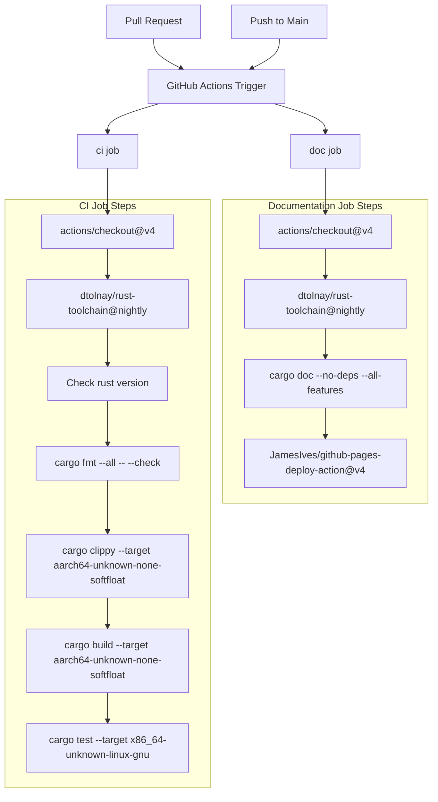
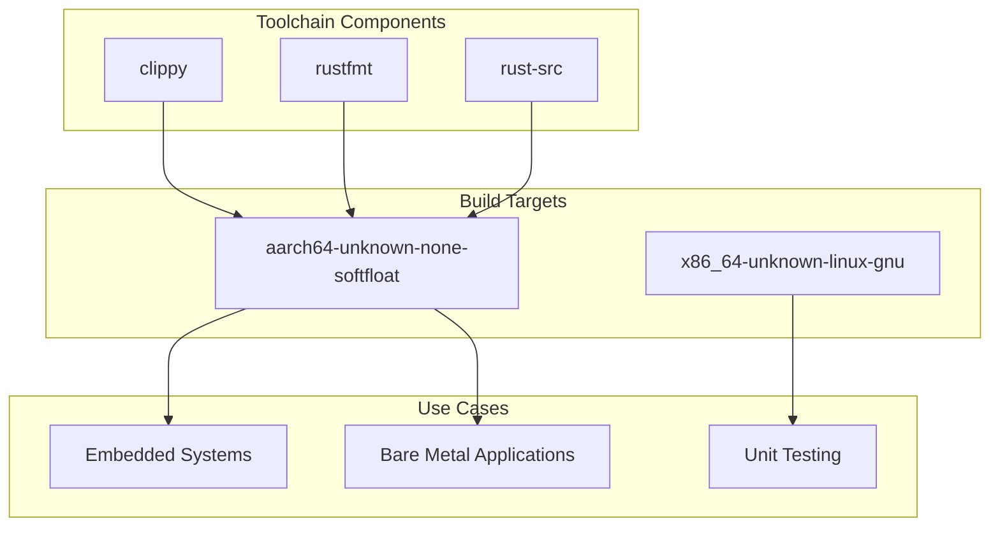
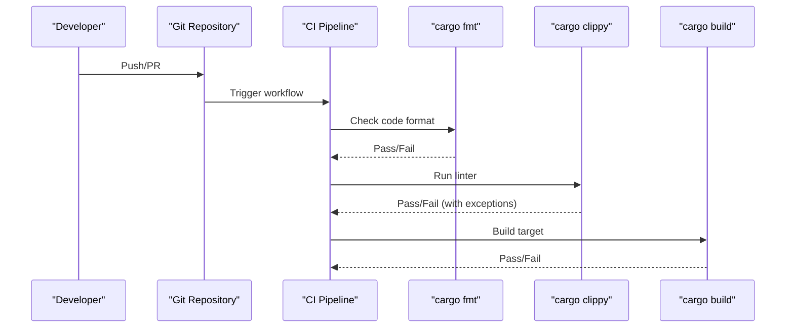
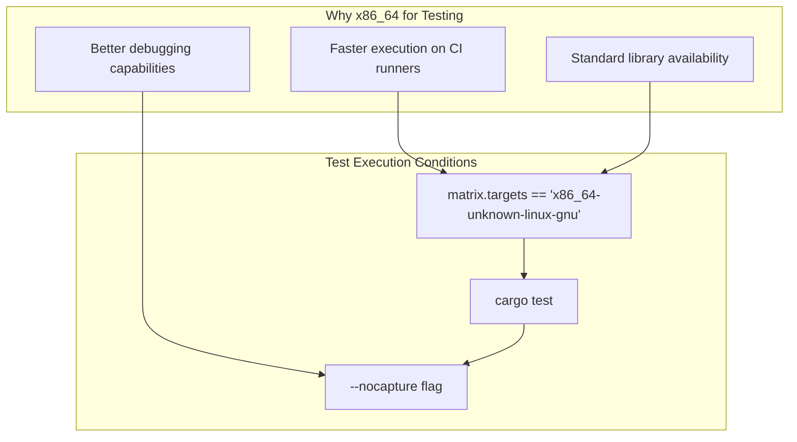
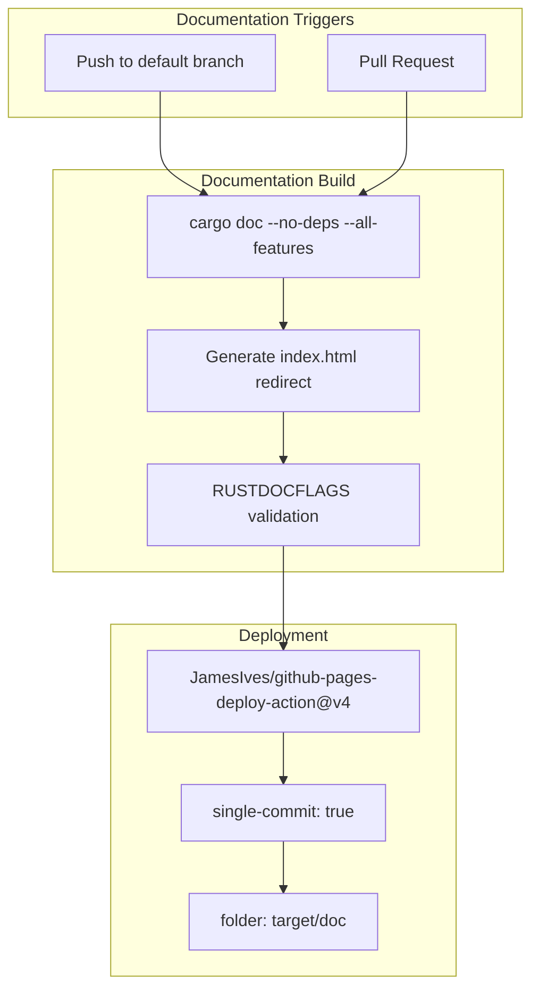

# Build System and Development Workflow

> **Relevant source files**
> * [.github/workflows/ci.yml](https://github.com/arceos-hypervisor/arm_gicv2/blob/eee14941/.github/workflows/ci.yml)
> * [.gitignore](https://github.com/arceos-hypervisor/arm_gicv2/blob/eee14941/.gitignore)

This document covers the automated build system, continuous integration pipeline, code quality assurance processes, and development workflow for the `arm_gicv2` crate. It details the GitHub Actions configuration, build targets, testing strategies, and documentation generation processes that ensure code quality and maintainability.

For information about crate dependencies and feature configuration, see [Crate Configuration and Dependencies](/arceos-hypervisor/arm_gicv2/5.1-crate-configuration-and-dependencies).

## CI/CD Pipeline Overview

The project uses GitHub Actions for continuous integration and deployment, with a comprehensive pipeline that ensures code quality, compatibility, and automated documentation deployment.

### CI/CD Pipeline Architecture



Sources: [.github/workflows/ci.yml(L1 - L56)&emsp;](https://github.com/arceos-hypervisor/arm_gicv2/blob/eee14941/.github/workflows/ci.yml#L1-L56)

### Job Configuration Matrix

The CI pipeline uses a strategy matrix to test against multiple configurations:

|Parameter|Values|
| --- | --- |
|rust-toolchain|nightly|
|targets|aarch64-unknown-none-softfloat|

The pipeline is configured for fail-fast: false, allowing all matrix combinations to complete even if one fails.

Sources: [.github/workflows/ci.yml(L7 - L12)&emsp;](https://github.com/arceos-hypervisor/arm_gicv2/blob/eee14941/.github/workflows/ci.yml#L7-L12)

## Build Configuration

### Target Platforms

The build system supports multiple target platforms for different use cases:



Sources: [.github/workflows/ci.yml(L12 - L19)&emsp;](https://github.com/arceos-hypervisor/arm_gicv2/blob/eee14941/.github/workflows/ci.yml#L12-L19)

### Primary Build Target

* **`aarch64-unknown-none-softfloat`**: The primary target for ARM64 bare-metal applications
* Used for clippy linting: `cargo clippy --target aarch64-unknown-none-softfloat`
* Used for building: `cargo build --target aarch64-unknown-none-softfloat`
* Supports all features: `--all-features` flag

### Testing Target

* **`x86_64-unknown-linux-gnu`**: Used exclusively for unit testing
* Conditional execution: Only runs when `matrix.targets == 'x86_64-unknown-linux-gnu'`
* Command: `cargo test --target x86_64-unknown-linux-gnu -- --nocapture`

Sources: [.github/workflows/ci.yml(L25 - L30)&emsp;](https://github.com/arceos-hypervisor/arm_gicv2/blob/eee14941/.github/workflows/ci.yml#L25-L30)

## Code Quality Assurance

The project implements multiple layers of code quality checks to maintain consistency and catch issues early.

### Code Quality Pipeline



Sources: [.github/workflows/ci.yml(L22 - L27)&emsp;](https://github.com/arceos-hypervisor/arm_gicv2/blob/eee14941/.github/workflows/ci.yml#L22-L27)

### Formatting Standards

* **Tool**: `cargo fmt` with `--all` flag
* **Enforcement**: `--check` flag ensures code is properly formatted
* **Command**: `cargo fmt --all -- --check`
* **Failure Behavior**: Pipeline fails if formatting is inconsistent

### Linting Configuration

* **Tool**: `cargo clippy` with comprehensive checks
* **Target-specific**: Runs against `aarch64-unknown-none-softfloat`
* **Features**: Uses `--all-features` to lint all code paths
* **Exceptions**: Allows `clippy::new_without_default` lint
* **Command**: `cargo clippy --target aarch64-unknown-none-softfloat --all-features -- -A clippy::new_without_default`

Sources: [.github/workflows/ci.yml(L23 - L25)&emsp;](https://github.com/arceos-hypervisor/arm_gicv2/blob/eee14941/.github/workflows/ci.yml#L23-L25)

## Testing Strategy

### Test Execution Model



Sources: [.github/workflows/ci.yml(L28 - L30)&emsp;](https://github.com/arceos-hypervisor/arm_gicv2/blob/eee14941/.github/workflows/ci.yml#L28-L30)

### Test Configuration

* **Conditional Execution**: Tests only run for x86_64 target
* **Output Visibility**: `--nocapture` flag ensures test output is visible
* **Target Specification**: Explicit target to avoid cross-compilation issues during testing

## Documentation System

### Documentation Generation Pipeline

The documentation system automatically builds and deploys API documentation to GitHub Pages.



Sources: [.github/workflows/ci.yml(L32 - L55)&emsp;](https://github.com/arceos-hypervisor/arm_gicv2/blob/eee14941/.github/workflows/ci.yml#L32-L55)

### Documentation Configuration

#### Build Settings

* **Command**: `cargo doc --no-deps --all-features`
* **Scope**: Excludes dependencies, includes all features
* **Output**: Generated to `target/doc` directory

#### Quality Enforcement

* **Environment Variable**: `RUSTDOCFLAGS="-D rustdoc::broken_intra_doc_links -D missing-docs"`
* **Broken Links**: Treats broken documentation links as errors
* **Missing Documentation**: Enforces documentation completeness

#### Index Generation

```
printf '<meta http-equiv="refresh" content="0;url=%s/index.html">' $(cargo tree | head -1 | cut -d' ' -f1) > target/doc/index.html
```

Sources: [.github/workflows/ci.yml(L40 - L48)&emsp;](https://github.com/arceos-hypervisor/arm_gicv2/blob/eee14941/.github/workflows/ci.yml#L40-L48)

### Deployment Strategy

* **Trigger**: Only deploys from the default branch (typically `main`)
* **Method**: GitHub Pages deployment action
* **Configuration**:
* `single-commit: true` - Keeps deployment history clean
* `branch: gh-pages` - Deploys to dedicated documentation branch
* `folder: target/doc` - Source folder for deployment

Sources: [.github/workflows/ci.yml(L49 - L55)&emsp;](https://github.com/arceos-hypervisor/arm_gicv2/blob/eee14941/.github/workflows/ci.yml#L49-L55)

## Development Environment Setup

### Required Toolchain Components

|Component|Purpose|
| --- | --- |
|rust-src|Source code for cross-compilation|
|clippy|Linting and code analysis|
|rustfmt|Code formatting|

### Toolchain Installation

The project uses the `dtolnay/rust-toolchain` action for consistent toolchain management:

```markdown
# Equivalent local setup
rustup toolchain install nightly
rustup component add rust-src clippy rustfmt
rustup target add aarch64-unknown-none-softfloat
```

Sources: [.github/workflows/ci.yml(L15 - L19)&emsp;](https://github.com/arceos-hypervisor/arm_gicv2/blob/eee14941/.github/workflows/ci.yml#L15-L19)

### Version Verification

The CI pipeline includes a version check step to ensure toolchain consistency:

* **Command**: `rustc --version --verbose`
* **Purpose**: Provides detailed version information for debugging and reproducibility

Sources: [.github/workflows/ci.yml(L20 - L21)&emsp;](https://github.com/arceos-hypervisor/arm_gicv2/blob/eee14941/.github/workflows/ci.yml#L20-L21)

### Local Development Workflow

Developers should run these commands locally before pushing:

```markdown
# Format check
cargo fmt --all -- --check

# Linting
cargo clippy --target aarch64-unknown-none-softfloat --all-features -- -A clippy::new_without_default

# Build verification
cargo build --target aarch64-unknown-none-softfloat --all-features

# Documentation build (optional)
cargo doc --no-deps --all-features
```

### Git Configuration

The project uses standard Git ignore patterns for Rust projects:

|Pattern|Purpose|
| --- | --- |
|/target|Build artifacts|
|/.vscode|Editor configuration|
|.DS_Store|macOS system files|
|Cargo.lock|Dependency lock file (library crate)|

Sources: [.gitignore(L1 - L4)&emsp;](https://github.com/arceos-hypervisor/arm_gicv2/blob/eee14941/.gitignore#L1-L4)