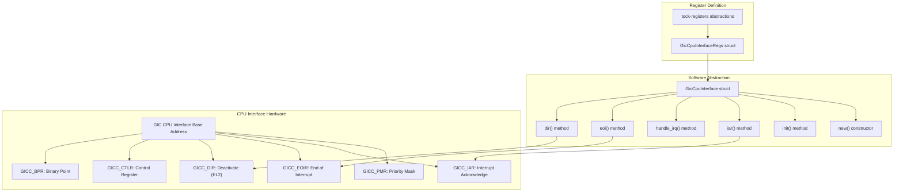
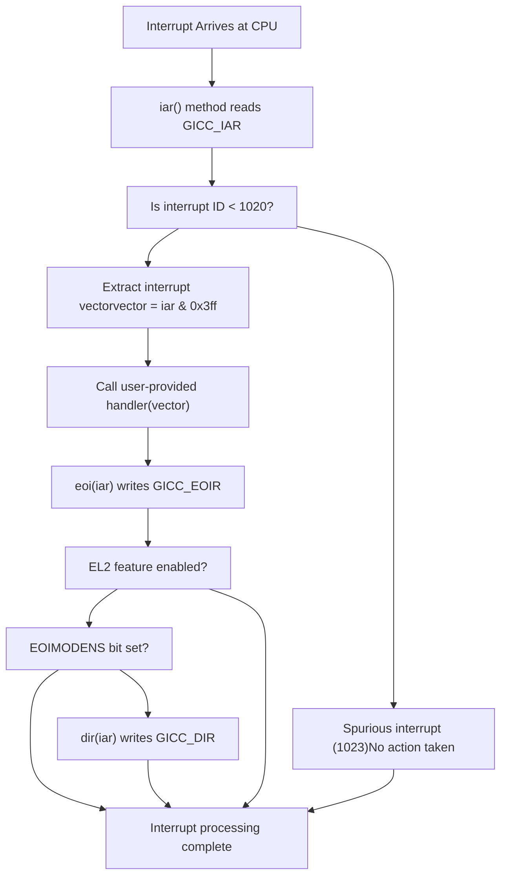
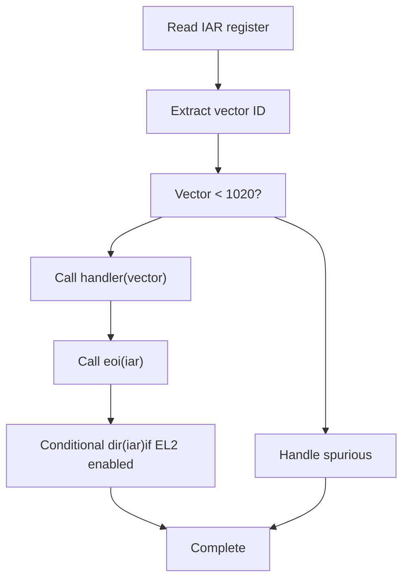

# CPU Interface Component

> **Relevant source files**
> * [src/gic_v2.rs](https://github.com/arceos-hypervisor/arm_gicv2/blob/eee14941/src/gic_v2.rs)

This document covers the `GicCpuInterface` component, which provides per-CPU interrupt handling functionality in the ARM GICv2 implementation. The CPU Interface handles interrupt acknowledgment, priority masking, and end-of-interrupt processing for individual processor cores. For system-wide interrupt distribution and configuration, see [GIC Distributor Component](/arceos-hypervisor/arm_gicv2/2.1-gic-distributor-component). For the complete interrupt processing flow between components, see [Interrupt Processing Pipeline](/arceos-hypervisor/arm_gicv2/2.3-interrupt-processing-pipeline).

## Architecture Overview

The `GicCpuInterface` struct provides a Rust abstraction over the GIC CPU Interface hardware registers, enabling safe per-CPU interrupt management. Each CPU core in the system has its own CPU Interface instance that communicates with the shared GIC Distributor.



Sources: [src/gic_v2.rs(L128 - L130)&emsp;](https://github.com/arceos-hypervisor/arm_gicv2/blob/eee14941/src/gic_v2.rs#L128-L130) [src/gic_v2.rs(L64 - L90)&emsp;](https://github.com/arceos-hypervisor/arm_gicv2/blob/eee14941/src/gic_v2.rs#L64-L90) [src/gic_v2.rs(L376 - L479)&emsp;](https://github.com/arceos-hypervisor/arm_gicv2/blob/eee14941/src/gic_v2.rs#L376-L479)

## Register Interface Structure

The CPU Interface exposes its functionality through memory-mapped registers defined in the `GicCpuInterfaceRegs` struct. Each register serves a specific purpose in the interrupt handling workflow.

|Register|Offset|Type|Purpose|
| --- | --- | --- | --- |
|CTLR|0x0000|ReadWrite|Control register for enabling interface and configuring behavior|
|PMR|0x0004|ReadWrite|Priority mask register for filtering interrupts by priority|
|BPR|0x0008|ReadWrite|Binary point register for priority grouping|
|IAR|0x000c|ReadOnly|Interrupt acknowledge register returning pending interrupt ID|
|EOIR|0x0010|WriteOnly|End of interrupt register for completing interrupt processing|
|RPR|0x0014|ReadOnly|Running priority register showing current interrupt priority|
|HPPIR|0x0018|ReadOnly|Highest priority pending interrupt register|
|IIDR|0x00fc|ReadOnly|CPU interface identification register|
|DIR|0x1000|WriteOnly|Deactivate interrupt register (EL2 feature)|

Sources: [src/gic_v2.rs(L64 - L90)&emsp;](https://github.com/arceos-hypervisor/arm_gicv2/blob/eee14941/src/gic_v2.rs#L64-L90)

## Core Interrupt Processing Methods

The `GicCpuInterface` provides several key methods for interrupt processing, each corresponding to specific hardware register operations.



Sources: [src/gic_v2.rs(L443 - L459)&emsp;](https://github.com/arceos-hypervisor/arm_gicv2/blob/eee14941/src/gic_v2.rs#L443-L459) [src/gic_v2.rs(L394 - L396)&emsp;](https://github.com/arceos-hypervisor/arm_gicv2/blob/eee14941/src/gic_v2.rs#L394-L396) [src/gic_v2.rs(L406 - L408)&emsp;](https://github.com/arceos-hypervisor/arm_gicv2/blob/eee14941/src/gic_v2.rs#L406-L408) [src/gic_v2.rs(L416 - L418)&emsp;](https://github.com/arceos-hypervisor/arm_gicv2/blob/eee14941/src/gic_v2.rs#L416-L418)

### Interrupt Acknowledge Process

The `iar()` method reads the `GICC_IAR` register to obtain the interrupt ID of the highest priority pending interrupt. The method returns the full IAR value, which includes both the interrupt ID and the CPU ID for SGIs.

```javascript
// Example usage pattern
let iar_value = cpu_interface.iar();
let interrupt_id = iar_value & 0x3ff;  // Extract interrupt ID from bits [9:0]
```

A return value of 1023 indicates either a spurious interrupt or that no interrupts are pending.

Sources: [src/gic_v2.rs(L394 - L396)&emsp;](https://github.com/arceos-hypervisor/arm_gicv2/blob/eee14941/src/gic_v2.rs#L394-L396)

### End of Interrupt Processing

The `eoi()` method writes to the `GICC_EOIR` register to signal completion of interrupt processing. The value written must be the exact IAR value returned from the acknowledge operation.

In hypervisor configurations (EL2 feature), the EOIR operation only performs priority drop, and a separate `dir()` call is required to fully deactivate the interrupt when `GICC_CTLR_EOIMODENS_BIT` is set.

Sources: [src/gic_v2.rs(L406 - L408)&emsp;](https://github.com/arceos-hypervisor/arm_gicv2/blob/eee14941/src/gic_v2.rs#L406-L408) [src/gic_v2.rs(L416 - L418)&emsp;](https://github.com/arceos-hypervisor/arm_gicv2/blob/eee14941/src/gic_v2.rs#L416-L418) [src/gic_v2.rs(L452 - L455)&emsp;](https://github.com/arceos-hypervisor/arm_gicv2/blob/eee14941/src/gic_v2.rs#L452-L455)

## High-Level Interrupt Handling

The `handle_irq()` method provides a convenient wrapper that encapsulates the complete interrupt processing sequence. It takes a closure that handles the actual interrupt processing logic.



Sources: [src/gic_v2.rs(L443 - L459)&emsp;](https://github.com/arceos-hypervisor/arm_gicv2/blob/eee14941/src/gic_v2.rs#L443-L459)

## Initialization and Configuration

The CPU Interface requires proper initialization through the `init()` method, which configures the interface for operation.

### Standard Initialization (Non-EL2)

For standard operation, initialization sets:

* `GICC_CTLR` register with `GICC_CTLR_EN_BIT` to enable the interface
* `GICC_PMR` register to maximum value (0xFFFFFFFF) to unmask all priority levels

### EL2 Hypervisor Initialization

When the `el2` feature is enabled, initialization additionally sets:

* `GICC_CTLR_EOIMODENS_BIT` in the control register to separate priority drop from interrupt deactivation

This separation allows hypervisors to maintain better control over interrupt lifecycle and support virtual interrupt injection.

|Configuration|GICC_CTLR Value|PMR Value|Purpose|
| --- | --- | --- | --- |
|Standard|GICC_CTLR_EN_BIT|0xFFFFFFFF|Basic interrupt enabling|
|EL2 Hypervisor|GICC_CTLR_EN_BIT \| GICC_CTLR_EOIMODENS_BIT|0xFFFFFFFF|Hypervisor with split EOI/deactivation|

Sources: [src/gic_v2.rs(L466 - L478)&emsp;](https://github.com/arceos-hypervisor/arm_gicv2/blob/eee14941/src/gic_v2.rs#L466-L478)

## Control Register Management

The CPU Interface provides direct access to the `GICC_CTLR` register through getter and setter methods, allowing fine-grained control over interface behavior.

### Control Register Fields

The control register manages several aspects of CPU interface operation:

* Interrupt group enabling
* Signal bypass configuration
* Binary point register selection
* Priority drop and deactivation separation (EL2)

```javascript
// Example control register manipulation
let current_ctlr = cpu_interface.get_ctlr();
let modified_ctlr = current_ctlr | CUSTOM_CONTROL_BITS;
cpu_interface.set_ctlr(modified_ctlr);
```

Sources: [src/gic_v2.rs(L424 - L433)&emsp;](https://github.com/arceos-hypervisor/arm_gicv2/blob/eee14941/src/gic_v2.rs#L424-L433)

## Thread Safety and Memory Management

The `GicCpuInterface` struct implements both `Send` and `Sync` traits, making it safe to share across threads. This is critical for multi-core systems where each CPU core needs access to its own CPU Interface instance.

The struct uses `NonNull<GicCpuInterfaceRegs>` for memory safety while maintaining the ability to perform direct hardware register access through memory-mapped I/O.

Sources: [src/gic_v2.rs(L135 - L136)&emsp;](https://github.com/arceos-hypervisor/arm_gicv2/blob/eee14941/src/gic_v2.rs#L135-L136) [src/gic_v2.rs(L128 - L130)&emsp;](https://github.com/arceos-hypervisor/arm_gicv2/blob/eee14941/src/gic_v2.rs#L128-L130)