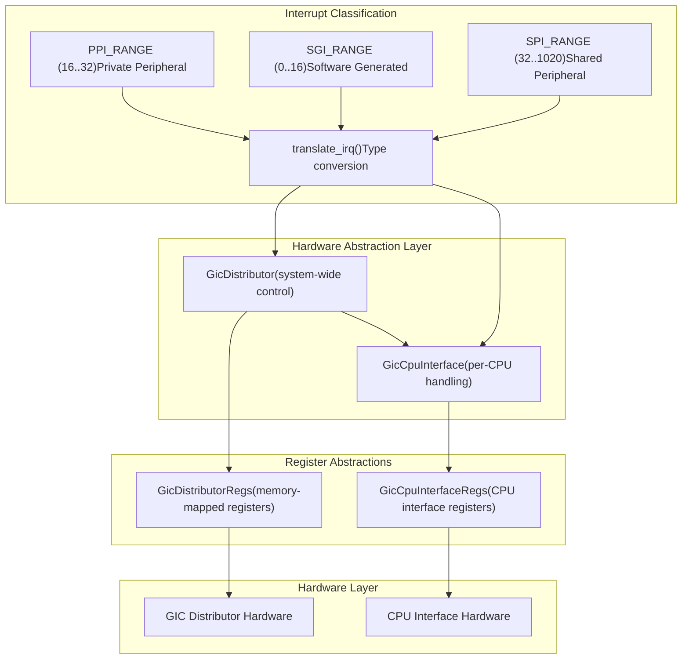
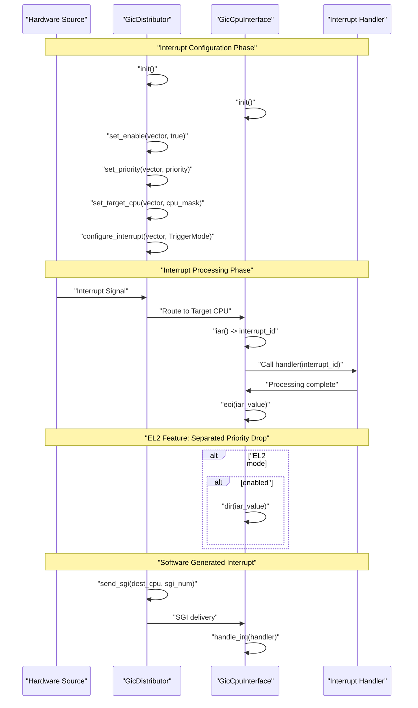

# Core Architecture

> **Relevant source files**
> * [src/gic_v2.rs](https://github.com/arceos-hypervisor/arm_gicv2/blob/eee14941/src/gic_v2.rs)
> * [src/lib.rs](https://github.com/arceos-hypervisor/arm_gicv2/blob/eee14941/src/lib.rs)

## Purpose and Scope

This document covers the fundamental architectural design of the `arm_gicv2` crate, focusing on the two primary hardware abstraction components and their interaction patterns. The architecture centers around providing safe, type-safe access to ARM GICv2 hardware through two main abstractions: system-wide interrupt distribution and per-CPU interrupt handling.

For detailed information about specific interrupt types and classification, see [Interrupt Types and Management](/arceos-hypervisor/arm_gicv2/3-interrupt-types-and-management). For register-level implementation details, see [Register Interface](/arceos-hypervisor/arm_gicv2/4-register-interface).

## Architectural Overview

The `arm_gicv2` crate implements a two-tier architecture that mirrors the ARM GICv2 hardware design. The core architecture consists of two primary components that work in coordination to manage interrupt processing across the system.

### Component Architecture Diagram

**Sources:** [src/gic_v2.rs(L92 - L131)&emsp;](https://github.com/arceos-hypervisor/arm_gicv2/blob/eee14941/src/gic_v2.rs#L92-L131) [src/lib.rs(L12 - L29)&emsp;](https://github.com/arceos-hypervisor/arm_gicv2/blob/eee14941/src/lib.rs#L12-L29) [src/lib.rs(L91 - L116)&emsp;](https://github.com/arceos-hypervisor/arm_gicv2/blob/eee14941/src/lib.rs#L91-L116)

## Core Components

### GicDistributor Component

The `GicDistributor` struct serves as the system-wide interrupt controller, responsible for global interrupt management and routing decisions. It encapsulates a pointer to memory-mapped distributor registers and maintains the maximum interrupt count.

**Key Responsibilities:**

* Global interrupt enable/disable control via `set_enable()`
* Priority management through `set_priority()` and `get_priority()`
* CPU targeting via `set_target_cpu()` and `get_target_cpu()`
* Interrupt configuration using `configure_interrupt()`
* Software-generated interrupt (SGI) distribution via `send_sgi()` family of methods
* System initialization through `init()`

### GicCpuInterface Component

The `GicCpuInterface` struct handles per-CPU interrupt processing, managing the interface between the distributor and individual processor cores. Each CPU in the system has its own CPU interface instance.

**Key Responsibilities:**

* Interrupt acknowledgment via `iar()` (Interrupt Acknowledge Register)
* End-of-interrupt signaling through `eoi()` (End of Interrupt Register)
* Interrupt deactivation using `dir()` (Deactivate Interrupt Register, EL2 feature)
* Priority masking and control register management
* Complete interrupt handling workflow via `handle_irq()`

**Sources:** [src/gic_v2.rs(L92 - L136)&emsp;](https://github.com/arceos-hypervisor/arm_gicv2/blob/eee14941/src/gic_v2.rs#L92-L136) [src/gic_v2.rs(L376 - L479)&emsp;](https://github.com/arceos-hypervisor/arm_gicv2/blob/eee14941/src/gic_v2.rs#L376-L479)

## Component Interaction Flow

The two core components work together to process interrupts from generation to completion. The following diagram illustrates the interaction patterns and method calls involved in typical interrupt processing scenarios.

### Interrupt Processing Coordination

**Sources:** [src/gic_v2.rs(L201 - L223)&emsp;](https://github.com/arceos-hypervisor/arm_gicv2/blob/eee14941/src/gic_v2.rs#L201-L223) [src/gic_v2.rs(L443 - L459)&emsp;](https://github.com/arceos-hypervisor/arm_gicv2/blob/eee14941/src/gic_v2.rs#L443-L459) [src/gic_v2.rs(L342 - L373)&emsp;](https://github.com/arceos-hypervisor/arm_gicv2/blob/eee14941/src/gic_v2.rs#L342-L373) [src/gic_v2.rs(L461 - L478)&emsp;](https://github.com/arceos-hypervisor/arm_gicv2/blob/eee14941/src/gic_v2.rs#L461-L478)

## Register Architecture Integration

The core components interact with hardware through structured register abstractions. Each component maintains a base pointer to its respective register structure, providing type-safe access to memory-mapped hardware registers.

### Register Structure Mapping

```mermaid
flowchart TD
subgraph subGraph3["GicCpuInterfaceRegs Fields"]
    CPU_CTLR["CTLR(Control)"]
    IAR["IAR(Acknowledge)"]
    EOIR["EOIR(End of Interrupt)"]
    DIR["DIR(Deactivate)"]
    PMR["PMR(Priority Mask)"]
end
subgraph subGraph2["GicCpuInterface Methods"]
    handle_irq["handle_irq()"]
    iar["iar()"]
    eoi["eoi()"]
    dir["dir()"]
    cpu_init["init()"]
end
subgraph subGraph1["GicDistributorRegs Fields"]
    CTLR["CTLR(Control)"]
    ISENABLER["ISENABLER(Set-Enable)"]
    ICENABLER["ICENABLER(Clear-Enable)"]
    SGIR["SGIR(SGI Register)"]
    IPRIORITYR["IPRIORITYR(Priority)"]
    ITARGETSR["ITARGETSR(Target)"]
    ICFGR["ICFGR(Configuration)"]
end
subgraph subGraph0["GicDistributor Methods"]
    init["init()"]
    set_enable["set_enable()"]
    send_sgi["send_sgi()"]
    set_priority["set_priority()"]
    configure_interrupt["configure_interrupt()"]
end

configure_interrupt --> ICFGR
cpu_init --> CPU_CTLR
cpu_init --> PMR
dir --> DIR
eoi --> EOIR
handle_irq --> DIR
handle_irq --> EOIR
handle_irq --> IAR
iar --> IAR
init --> CTLR
send_sgi --> SGIR
set_enable --> ICENABLER
set_enable --> ISENABLER
set_priority --> IPRIORITYR
```

**Sources:** [src/gic_v2.rs(L20 - L62)&emsp;](https://github.com/arceos-hypervisor/arm_gicv2/blob/eee14941/src/gic_v2.rs#L20-L62) [src/gic_v2.rs(L64 - L90)&emsp;](https://github.com/arceos-hypervisor/arm_gicv2/blob/eee14941/src/gic_v2.rs#L64-L90) [src/gic_v2.rs(L147 - L149)&emsp;](https://github.com/arceos-hypervisor/arm_gicv2/blob/eee14941/src/gic_v2.rs#L147-L149) [src/gic_v2.rs(L384 - L386)&emsp;](https://github.com/arceos-hypervisor/arm_gicv2/blob/eee14941/src/gic_v2.rs#L384-L386)

## System State Management

The architecture maintains both global system state through the distributor and per-CPU state through individual CPU interfaces. The distributor manages the `max_irqs` field to track the hardware-supported interrupt count, while CPU interfaces remain stateless, relying on hardware register state.

### Initialization and Configuration

|Component|Initialization Method|Key Configuration|
| --- | --- | --- |
|GicDistributor|init()|Disable all interrupts, set SPI targets to CPU 0, configure edge-triggered mode, enable GICD|
|GicCpuInterface|init()|Set priority mask to maximum, enable CPU interface, configure EL2 mode if feature enabled|

The architecture ensures thread safety through `Send` and `Sync` implementations for both core components, allowing safe concurrent access across multiple threads or CPU cores.

**Sources:** [src/gic_v2.rs(L132 - L136)&emsp;](https://github.com/arceos-hypervisor/arm_gicv2/blob/eee14941/src/gic_v2.rs#L132-L136) [src/gic_v2.rs(L342 - L373)&emsp;](https://github.com/arceos-hypervisor/arm_gicv2/blob/eee14941/src/gic_v2.rs#L342-L373) [src/gic_v2.rs(L461 - L478)&emsp;](https://github.com/arceos-hypervisor/arm_gicv2/blob/eee14941/src/gic_v2.rs#L461-L478)