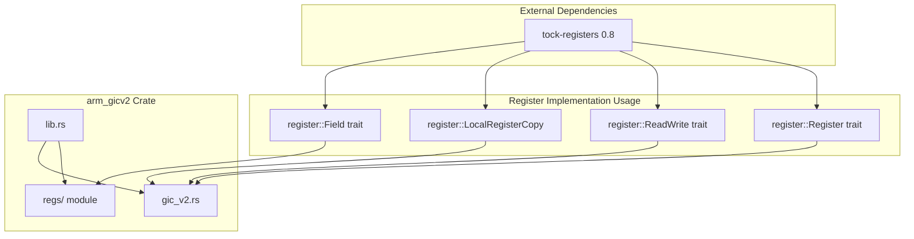
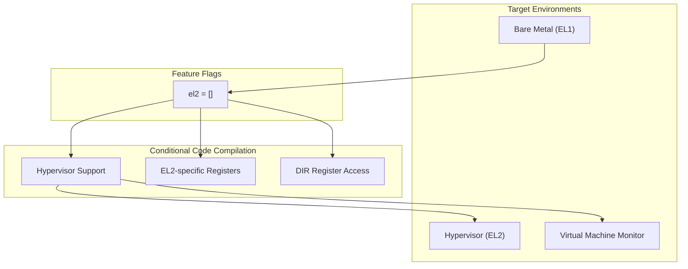
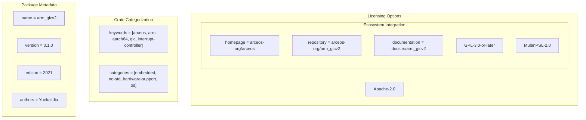
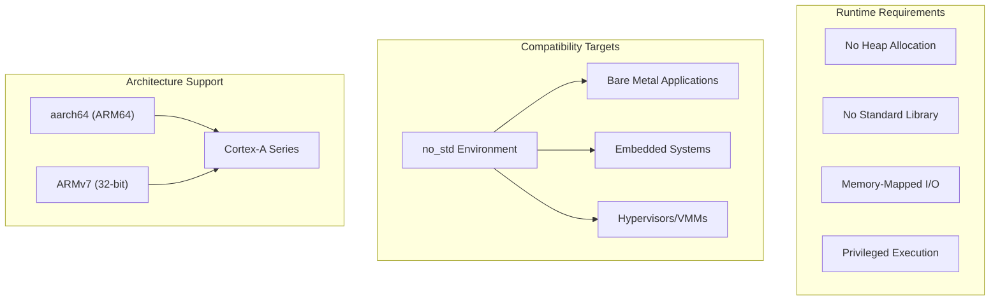

# Crate Configuration and Dependencies

> **Relevant source files**
> * [Cargo.toml](https://github.com/arceos-hypervisor/arm_gicv2/blob/eee14941/Cargo.toml)

This document covers the configuration, dependencies, and build settings of the `arm_gicv2` crate. It explains how the crate's dependencies enable hardware register abstractions, the purpose of feature flags, and the package metadata that defines its target use cases.

For information about the development workflow and build targets, see [Build System and Development Workflow](/arceos-hypervisor/arm_gicv2/5.2-build-system-and-development-workflow).

## Dependencies Overview

The `arm_gicv2` crate has a minimal dependency footprint designed for embedded and systems programming environments. The primary dependency provides safe hardware register abstractions while maintaining `no_std` compatibility.

### Dependency Configuration

**Dependencies and their roles in hardware abstraction**

*Sources: [Cargo.toml(L14 - L15)&emsp;](https://github.com/arceos-hypervisor/arm_gicv2/blob/eee14941/Cargo.toml#L14-L15)*

The `tock-registers` dependency provides the foundation for type-safe hardware register access throughout the codebase. This dependency enables the creation of register field definitions and memory-mapped I/O operations without runtime overhead.

|Dependency|Version|Purpose|Usage Location|
| --- | --- | --- | --- |
|tock-registers|0.8|Hardware register abstractions and type-safe MMIO|gic_v2.rs,regs/module|

## Feature Configuration

The crate defines feature flags to enable optional functionality based on the target execution environment and privilege level requirements.

### Feature Flag Architecture

**Feature flag configuration and target environments**

*Sources: [Cargo.toml(L17 - L18)&emsp;](https://github.com/arceos-hypervisor/arm_gicv2/blob/eee14941/Cargo.toml#L17-L18)*

### EL2 Feature Details

The `el2` feature flag is an empty feature that serves as a compilation flag to enable hypervisor-specific functionality:

* **Purpose**: Enable Exception Level 2 (hypervisor) specific register access
* **Implementation**: Conditional compilation using `#[cfg(feature = "el2")]`
* **Target Use Cases**: Hypervisors, Virtual Machine Monitors, Type-1 virtualization

## Package Metadata and Configuration

The crate's package configuration defines its identity, licensing, and target ecosystem integration.

### Package Identity Configuration

**Package configuration and ecosystem integration**

*Sources: [Cargo.toml(L1 - L12)&emsp;](https://github.com/arceos-hypervisor/arm_gicv2/blob/eee14941/Cargo.toml#L1-L12)*

### Metadata Configuration Table

|Configuration|Value|Purpose|
| --- | --- | --- |
|Name|arm_gicv2|Crate identifier for Cargo registry|
|Version|0.1.0|Semantic version following initial release|
|Edition|2021|Rust language edition for modern features|
|Description|ARM GICv2 register definitions and operations|Concise functionality summary|
|License|Triple-licensed (GPL-3.0/Apache-2.0/MulanPSL-2.0)|Flexible licensing for diverse use cases|

## Target Environment Compatibility

The crate configuration explicitly targets embedded and systems programming environments through its category assignments and dependency choices.

### Environment Compatibility Matrix

**Target environment compatibility and requirements**

*Sources: [Cargo.toml(L12)&emsp;](https://github.com/arceos-hypervisor/arm_gicv2/blob/eee14941/Cargo.toml#L12-L12) [Cargo.toml(L6)&emsp;](https://github.com/arceos-hypervisor/arm_gicv2/blob/eee14941/Cargo.toml#L6-L6)*

### Category Alignment

The crate's categories directly reflect its intended use cases:

* **`embedded`**: Targeting resource-constrained embedded systems
* **`no-std`**: Compatible with `no_std` environments without standard library
* **`hardware-support`**: Provides low-level hardware abstraction
* **`os`**: Suitable for operating system and kernel development

## Build Configuration Implications

The minimal dependency configuration and feature design have specific implications for build environments and integration scenarios.

### Integration Requirements

|Requirement|Configuration Source|Implication|
| --- | --- | --- |
|Memory-mapped I/O access|tock-registersdependency|Requires privileged execution mode|
|ARM architecture|Package keywords and categories|Limited to ARM-based systems|
|no_stdcompatibility|Categories and dependency choice|Suitable for kernel/bootloader integration|
|Optional hypervisor support|el2feature flag|Configurable privilege level support|

*Sources: [Cargo.toml(L11 - L12)&emsp;](https://github.com/arceos-hypervisor/arm_gicv2/blob/eee14941/Cargo.toml#L11-L12) [Cargo.toml(L14 - L15)&emsp;](https://github.com/arceos-hypervisor/arm_gicv2/blob/eee14941/Cargo.toml#L14-L15) [Cargo.toml(L17 - L18)&emsp;](https://github.com/arceos-hypervisor/arm_gicv2/blob/eee14941/Cargo.toml#L17-L18)*