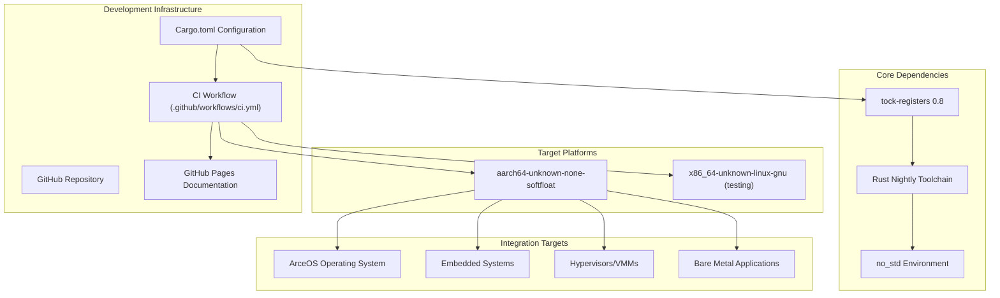
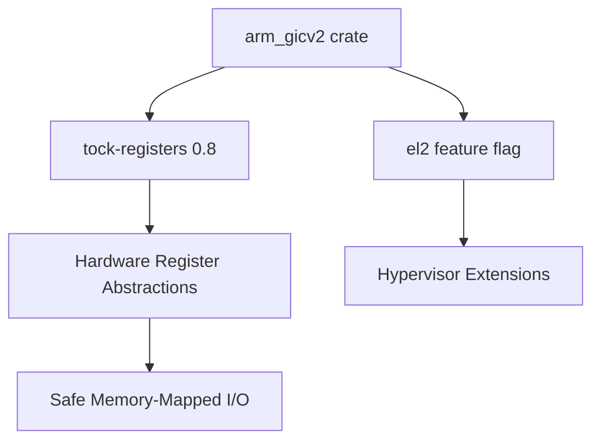
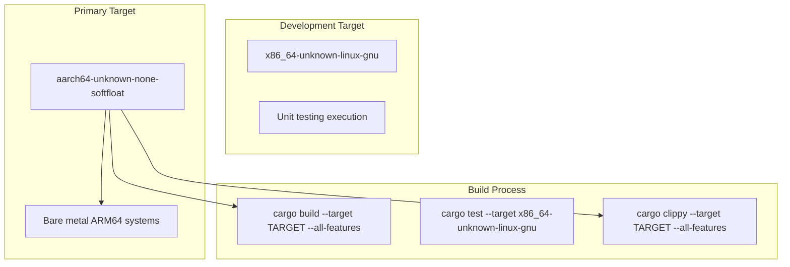
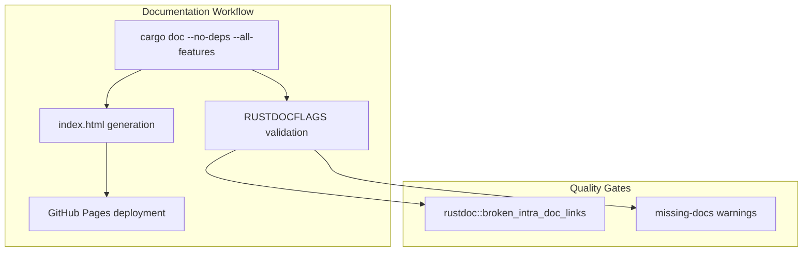

# Development and Integration

> **Relevant source files**
> * [.github/workflows/ci.yml](https://github.com/arceos-hypervisor/arm_gicv2/blob/eee14941/.github/workflows/ci.yml)
> * [Cargo.toml](https://github.com/arceos-hypervisor/arm_gicv2/blob/eee14941/Cargo.toml)

This document provides a comprehensive guide for developers on integrating and working with the `arm_gicv2` crate. It covers the development workflow, dependency management, build configuration, and quality assurance processes that support this hardware abstraction layer.

For specific technical details about crate dependencies and feature configuration, see [Crate Configuration and Dependencies](/arceos-hypervisor/arm_gicv2/5.1-crate-configuration-and-dependencies). For detailed information about the build system and CI/CD pipeline, see [Build System and Development Workflow](/arceos-hypervisor/arm_gicv2/5.2-build-system-and-development-workflow).

## Integration Overview

The `arm_gicv2` crate is designed as a foundational component for ARM-based systems requiring interrupt controller management. The crate follows embedded Rust best practices with `no_std` compatibility and minimal dependencies.

### Development Ecosystem Architecture

**Sources:** [Cargo.toml(L1 - L19)&emsp;](https://github.com/arceos-hypervisor/arm_gicv2/blob/eee14941/Cargo.toml#L1-L19) [.github/workflows/ci.yml(L1 - L56)&emsp;](https://github.com/arceos-hypervisor/arm_gicv2/blob/eee14941/.github/workflows/ci.yml#L1-L56)

### Package Configuration and Metadata

The crate is configured for broad compatibility across the embedded systems ecosystem. Key configuration elements include:

|Configuration|Value|Purpose|
| --- | --- | --- |
|Edition|2021|Modern Rust language features|
|License|Triple-licensed (GPL-3.0-or-later, Apache-2.0, MulanPSL-2.0)|Maximum compatibility|
|Categories|embedded,no-std,hardware-support,os|Clear ecosystem positioning|
|Keywords|arceos,arm,aarch64,gic,interrupt-controller|Discoverability|

**Sources:** [Cargo.toml(L4 - L12)&emsp;](https://github.com/arceos-hypervisor/arm_gicv2/blob/eee14941/Cargo.toml#L4-L12)

## Development Workflow Integration

### Dependency Management Strategy

The crate maintains a minimal dependency footprint with a single external dependency:

The `tock-registers` dependency provides type-safe hardware register access patterns essential for reliable interrupt controller management. The optional `el2` feature enables hypervisor-specific functionality without imposing overhead on standard use cases.

**Sources:** [Cargo.toml(L14 - L18)&emsp;](https://github.com/arceos-hypervisor/arm_gicv2/blob/eee14941/Cargo.toml#L14-L18)

### Build Target Configuration

The development process supports multiple build targets with different purposes:

**Sources:** [.github/workflows/ci.yml(L12 - L30)&emsp;](https://github.com/arceos-hypervisor/arm_gicv2/blob/eee14941/.github/workflows/ci.yml#L12-L30)

## Quality Assurance Process

### Continuous Integration Pipeline

The CI system ensures code quality through multiple validation stages:

|Stage|Tool|Command|Purpose|
| --- | --- | --- | --- |
|Format Check|rustfmt|cargo fmt --all -- --check|Code style consistency|
|Linting|clippy|cargo clippy --target TARGET --all-features|Code quality analysis|
|Build Verification|cargo|cargo build --target TARGET --all-features|Compilation validation|
|Unit Testing|cargo|cargo test --target x86_64-unknown-linux-gnu|Functional verification|

**Sources:** [.github/workflows/ci.yml(L22 - L30)&emsp;](https://github.com/arceos-hypervisor/arm_gicv2/blob/eee14941/.github/workflows/ci.yml#L22-L30)

### Documentation Generation and Deployment

The documentation pipeline enforces strict quality standards, treating broken links and missing documentation as errors to ensure comprehensive API coverage.

**Sources:** [.github/workflows/ci.yml(L32 - L55)&emsp;](https://github.com/arceos-hypervisor/arm_gicv2/blob/eee14941/.github/workflows/ci.yml#L32-L55)

### Platform Compatibility Matrix

The crate supports multiple deployment scenarios with varying feature requirements:

|Use Case|Target Platform|Features Required|Integration Pattern|
| --- | --- | --- | --- |
|Embedded Systems|aarch64-unknown-none-softfloat|None|Direct hardware access|
|Hypervisors|aarch64-unknown-none-softfloat|el2|Extended privilege operations|
|Operating Systems|aarch64-unknown-none-softfloat|Optionalel2|Kernel-level integration|
|Development/Testing|x86_64-unknown-linux-gnu|All|Cross-compilation testing|

This matrix guides developers in selecting appropriate configuration options for their specific integration requirements.

**Sources:** [Cargo.toml(L17 - L18)&emsp;](https://github.com/arceos-hypervisor/arm_gicv2/blob/eee14941/Cargo.toml#L17-L18) [.github/workflows/ci.yml(L12 - L29)&emsp;](https://github.com/arceos-hypervisor/arm_gicv2/blob/eee14941/.github/workflows/ci.yml#L12-L29)