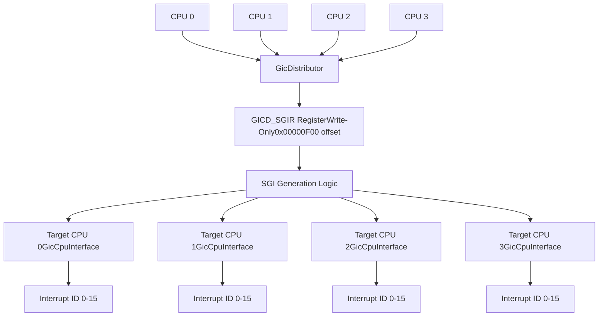
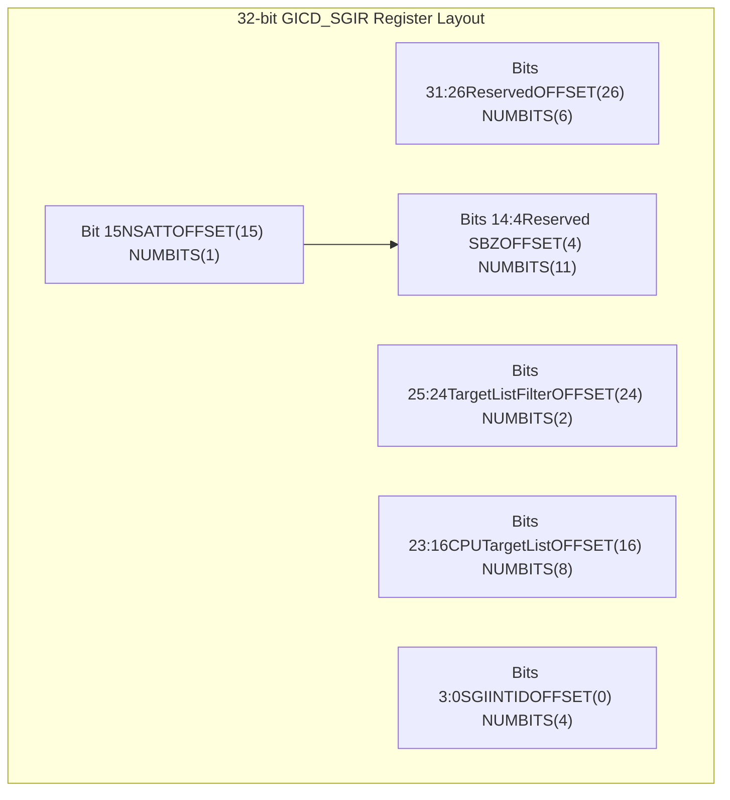
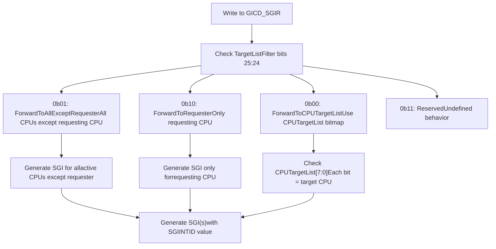
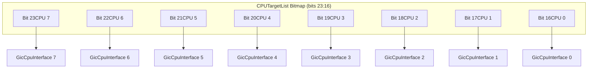
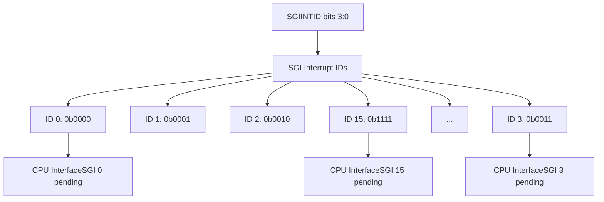

# GICD_SGIR Register Details

> **Relevant source files**
> * [src/regs/gicd_sgir.rs](https://github.com/arceos-hypervisor/arm_gicv2/blob/eee14941/src/regs/gicd_sgir.rs)

This document provides comprehensive technical documentation for the GICD_SGIR (Software Generated Interrupt Register) implementation in the arm_gicv2 crate. The register controls the generation and routing of Software Generated Interrupts (SGIs) within the ARM GICv2 interrupt controller system.

For broader context on SGI interrupt types and their role in the interrupt system, see [Software Generated Interrupts](/arceos-hypervisor/arm_gicv2/3.2-software-generated-interrupts). For general register interface organization, see [Register Module Organization](/arceos-hypervisor/arm_gicv2/4.1-register-module-organization).

## Register Overview and Purpose

The GICD_SGIR register serves as the primary control interface for generating Software Generated Interrupts in the GIC Distributor. SGIs enable inter-processor communication in multi-core ARM systems by allowing one CPU to trigger interrupts on other CPUs or itself.

## GICD_SGIR in GIC Architecture

### GICD_SGIR Location in Interrupt Processing



Sources: [src/regs/gicd_sgir.rs(L1 - L62)&emsp;](https://github.com/arceos-hypervisor/arm_gicv2/blob/eee14941/src/regs/gicd_sgir.rs#L1-L62)

## Register Bit Field Layout

### GICD_SGIR Bit Field Structure



Sources: [src/regs/gicd_sgir.rs(L21 - L58)&emsp;](https://github.com/arceos-hypervisor/arm_gicv2/blob/eee14941/src/regs/gicd_sgir.rs#L21-L58)

## Register Field Definitions

### Core Field Components

|Field|Bits|Type|Purpose|
| --- | --- | --- | --- |
|TargetListFilter|25:24|Enum|Controls SGI routing behavior|
|CPUTargetList|23:16|Bitmap|Specifies target CPU interfaces|
|NSATT|15|Boolean|Security group selection|
|SGIINTID|3:0|Integer|SGI interrupt ID (0-15)|

Sources: [src/regs/gicd_sgir.rs(L25 - L56)&emsp;](https://github.com/arceos-hypervisor/arm_gicv2/blob/eee14941/src/regs/gicd_sgir.rs#L25-L56)

### TargetListFilter Modes

The `TargetListFilter` field defines four distinct targeting modes implemented as register bitfield values:



Sources: [src/regs/gicd_sgir.rs(L31 - L35)&emsp;](https://github.com/arceos-hypervisor/arm_gicv2/blob/eee14941/src/regs/gicd_sgir.rs#L31-L35)

## Register Implementation Details

### Rust Type Definition

The register is implemented as a write-only register using the tock-registers framework:

```
pub type GicdSgirReg = WriteOnly<u32, GICD_SGIR::Register>;
```

### Register Bitfield Structure

The implementation uses the `register_bitfields!` macro to define field layouts and valid values:

|Constant|Value|Description|
| --- | --- | --- |
|ForwardToCPUTargetList|0b00|Use explicit CPU target list|
|ForwardToAllExceptRequester|0b01|Broadcast except requester|
|ForwardToRequester|0b10|Self-targeting only|
|Reserved|0b11|Invalid/reserved value|

Sources: [src/regs/gicd_sgir.rs(L18 - L62)&emsp;](https://github.com/arceos-hypervisor/arm_gicv2/blob/eee14941/src/regs/gicd_sgir.rs#L18-L62)

## CPU Targeting Mechanisms

### CPUTargetList Bitmap Interpretation

When `TargetListFilter` is set to `ForwardToCPUTargetList` (0b00), the `CPUTargetList` field operates as an 8-bit bitmap:



Sources: [src/regs/gicd_sgir.rs(L37 - L41)&emsp;](https://github.com/arceos-hypervisor/arm_gicv2/blob/eee14941/src/regs/gicd_sgir.rs#L37-L41)

## Security Extensions Support

### NSATT Field Behavior

The NSATT (Non-Secure Attribute) field controls security group targeting when Security Extensions are implemented:

|NSATT Value|Group|Access Behavior|
| --- | --- | --- |
|0|Group 0|Forward SGI only if configured as Group 0|
|1|Group 1|Forward SGI only if configured as Group 1|

### Security Access Constraints

* **Secure Access**: Can write any value to NSATT field
* **Non-Secure Access**: Limited to Group 1 SGIs regardless of NSATT value written

Sources: [src/regs/gicd_sgir.rs(L42 - L49)&emsp;](https://github.com/arceos-hypervisor/arm_gicv2/blob/eee14941/src/regs/gicd_sgir.rs#L42-L49)

## SGI Interrupt ID Specification

The `SGIINTID` field specifies which of the 16 available Software Generated Interrupts (0-15) to trigger. This field directly maps to interrupt IDs in the SGI range:



Sources: [src/regs/gicd_sgir.rs(L52 - L56)&emsp;](https://github.com/arceos-hypervisor/arm_gicv2/blob/eee14941/src/regs/gicd_sgir.rs#L52-L56)

## Implementation Considerations

### Write-Only Register Characteristics

The GICD_SGIR register is implemented as `WriteOnly<u32, GICD_SGIR::Register>`, meaning:

* No read operations are supported
* Each write triggers immediate SGI processing
* Register state is not persistent
* Effects are immediate upon write completion

### Reserved Field Handling

The implementation includes two reserved field ranges that must be handled appropriately:

* **Bits 31:26**: Reserved, implementation behavior undefined
* **Bits 14:4**: Reserved, Should Be Zero (SBZ)

Sources: [src/regs/gicd_sgir.rs(L24 - L61)&emsp;](https://github.com/arceos-hypervisor/arm_gicv2/blob/eee14941/src/regs/gicd_sgir.rs#L24-L61)