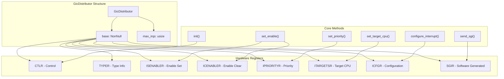
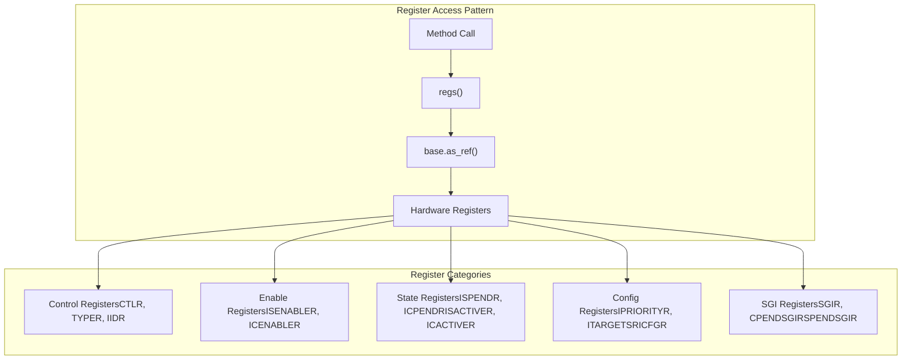
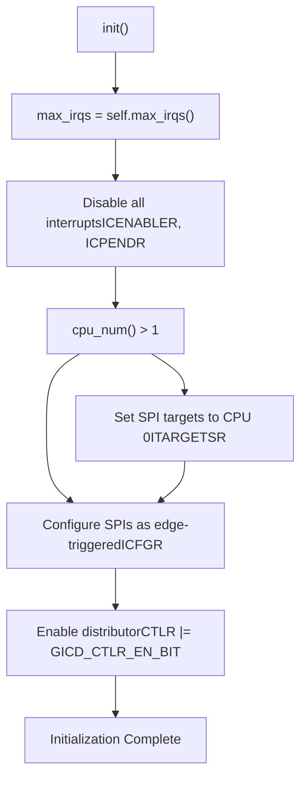
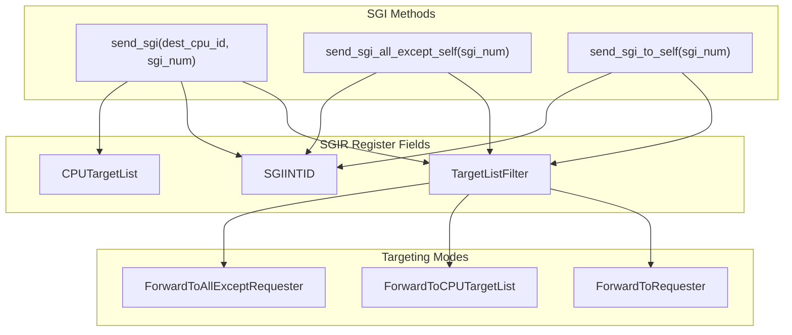

# GIC Distributor Component

> **Relevant source files**
> * [src/gic_v2.rs](https://github.com/arceos-hypervisor/arm_gicv2/blob/eee14941/src/gic_v2.rs)

The GIC Distributor Component provides system-wide interrupt management and routing functionality for ARM GICv2 systems. This component handles global interrupt configuration, priority management, CPU targeting, and distribution of interrupts to CPU interfaces. It serves as the central coordination point for all interrupt activity in the system.

For information about per-CPU interrupt handling and acknowledgment, see [CPU Interface Component](/arceos-hypervisor/arm_gicv2/2.2-cpu-interface-component). For details on the complete interrupt flow, see [Interrupt Processing Pipeline](/arceos-hypervisor/arm_gicv2/2.3-interrupt-processing-pipeline).

## Overview and Architecture

The `GicDistributor` struct represents the hardware GIC Distributor block and provides a safe Rust abstraction over the memory-mapped distributor registers. The distributor performs interrupt prioritization and distribution to CPU interface blocks connected to processors in the system.

Sources: [src/gic_v2.rs(L110 - L113)&emsp;](https://github.com/arceos-hypervisor/arm_gicv2/blob/eee14941/src/gic_v2.rs#L110-L113) [src/gic_v2.rs(L20 - L62)&emsp;](https://github.com/arceos-hypervisor/arm_gicv2/blob/eee14941/src/gic_v2.rs#L20-L62) [src/gic_v2.rs(L138 - L374)&emsp;](https://github.com/arceos-hypervisor/arm_gicv2/blob/eee14941/src/gic_v2.rs#L138-L374)

## Register Structure and Hardware Interface

The distributor manages a comprehensive set of memory-mapped registers defined in `GicDistributorRegs`. Each register serves specific interrupt management functions:

|Register Group|Purpose|Key Registers|
| --- | --- | --- |
|Control|Basic distributor control|CTLR,TYPER,IIDR|
|Enable/Disable|Interrupt enable management|ISENABLER,ICENABLER|
|Pending|Interrupt pending state|ISPENDR,ICPENDR|
|Active|Interrupt active state|ISACTIVER,ICACTIVER|
|Priority|Interrupt priority levels|IPRIORITYR|
|Targeting|CPU routing configuration|ITARGETSR|
|Configuration|Trigger mode settings|ICFGR|
|Software Interrupts|SGI generation|SGIR,CPENDSGIR,SPENDSGIR|

Sources: [src/gic_v2.rs(L20 - L62)&emsp;](https://github.com/arceos-hypervisor/arm_gicv2/blob/eee14941/src/gic_v2.rs#L20-L62) [src/gic_v2.rs(L147 - L149)&emsp;](https://github.com/arceos-hypervisor/arm_gicv2/blob/eee14941/src/gic_v2.rs#L147-L149)

## Core Functionality and Methods

### Initialization and Configuration

The `init()` method performs complete distributor initialization, setting up default configurations for all supported interrupts:

Sources: [src/gic_v2.rs(L348 - L373)&emsp;](https://github.com/arceos-hypervisor/arm_gicv2/blob/eee14941/src/gic_v2.rs#L348-L373)

### Interrupt Management Operations

The distributor provides comprehensive interrupt control through several key method categories:

|Method Category|Methods|Register Access|
| --- | --- | --- |
|Enable Control|set_enable(),get_enable()|ISENABLER,ICENABLER|
|Priority Management|set_priority(),get_priority()|IPRIORITYR|
|CPU Targeting|set_target_cpu(),get_target_cpu()|ITARGETSR|
|State Management|set_pend(),set_active(),get_state()|ISPENDR,ICPENDR,ISACTIVER,ICACTIVER|
|Configuration|configure_interrupt(),set_icfgr()|ICFGR|

### Software Generated Interrupts (SGI)

The distributor provides three SGI targeting modes through dedicated methods:

Sources: [src/gic_v2.rs(L202 - L223)&emsp;](https://github.com/arceos-hypervisor/arm_gicv2/blob/eee14941/src/gic_v2.rs#L202-L223) [src/regs.rs](https://github.com/arceos-hypervisor/arm_gicv2/blob/eee14941/src/regs.rs#LNaN-LNaN)

## System Information and Capabilities

The distributor provides system capability discovery through hardware register queries:

* **`cpu_num()`**: Returns the number of implemented CPU interfaces from `TYPER` register bits [7:5]
* **`max_irqs()`**: Calculates maximum supported interrupts from `TYPER` register bits [4:0]
* **`get_typer()`**: Returns raw `TYPER` register value for detailed configuration analysis
* **`get_iidr()`**: Returns implementation identification from `IIDR` register

Sources: [src/gic_v2.rs(L152 - L159)&emsp;](https://github.com/arceos-hypervisor/arm_gicv2/blob/eee14941/src/gic_v2.rs#L152-L159) [src/gic_v2.rs(L322 - L330)&emsp;](https://github.com/arceos-hypervisor/arm_gicv2/blob/eee14941/src/gic_v2.rs#L322-L330)

## Thread Safety and Ownership

The `GicDistributor` implements `Send` and `Sync` traits through unsafe implementations, enabling shared access across CPU cores in multi-processor systems. The struct uses `NonNull<GicDistributorRegs>` for safe hardware register access while maintaining zero-cost abstractions.

Sources: [src/gic_v2.rs(L132 - L133)&emsp;](https://github.com/arceos-hypervisor/arm_gicv2/blob/eee14941/src/gic_v2.rs#L132-L133) [src/gic_v2.rs(L110 - L113)&emsp;](https://github.com/arceos-hypervisor/arm_gicv2/blob/eee14941/src/gic_v2.rs#L110-L113)

## Integration with System Architecture

The distributor works in coordination with the CPU Interface Component to provide complete interrupt management. It handles global interrupt configuration and routing, while CPU interfaces manage per-processor interrupt delivery and acknowledgment. For detailed information about the interaction between these components, see [Interrupt Processing Pipeline](/arceos-hypervisor/arm_gicv2/2.3-interrupt-processing-pipeline) and [CPU Interface Component](/arceos-hypervisor/arm_gicv2/2.2-cpu-interface-component).