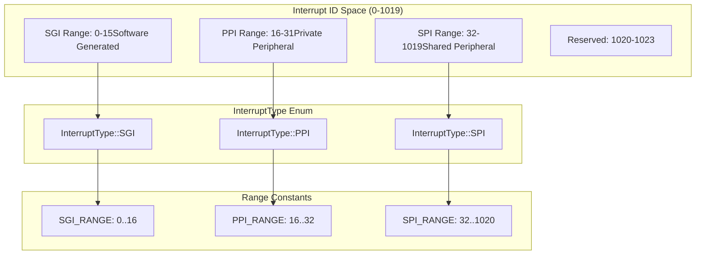
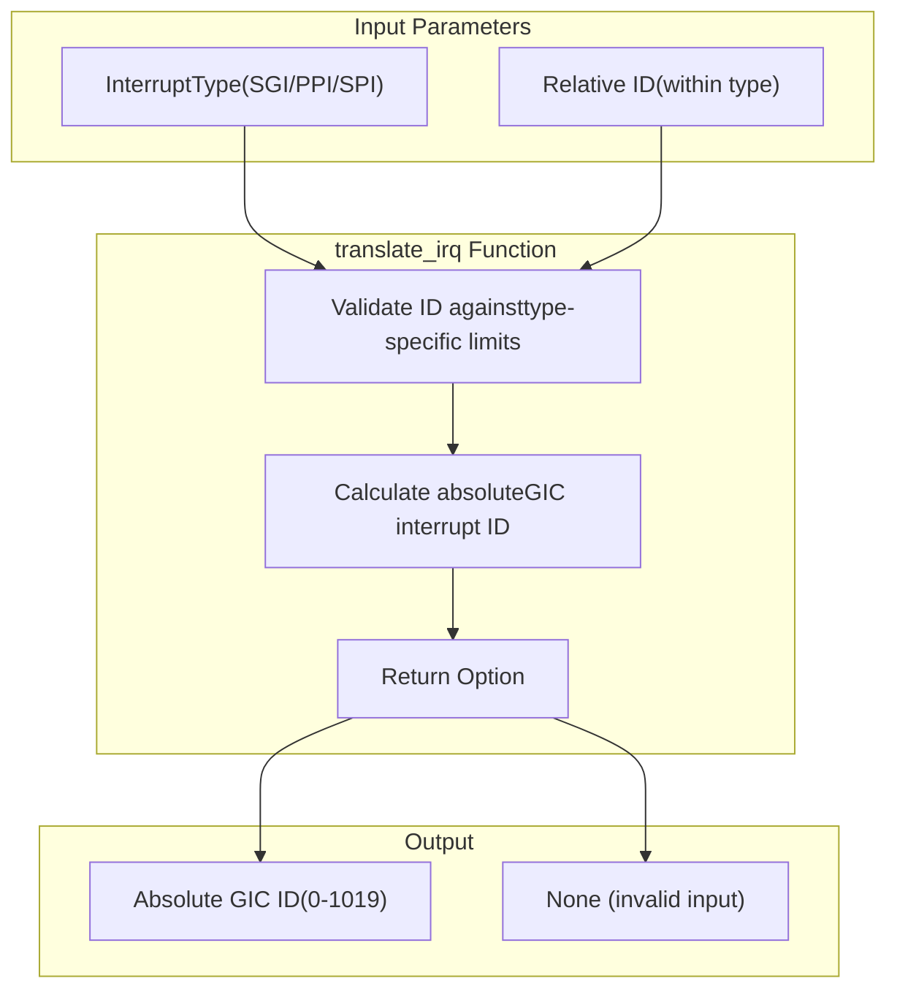
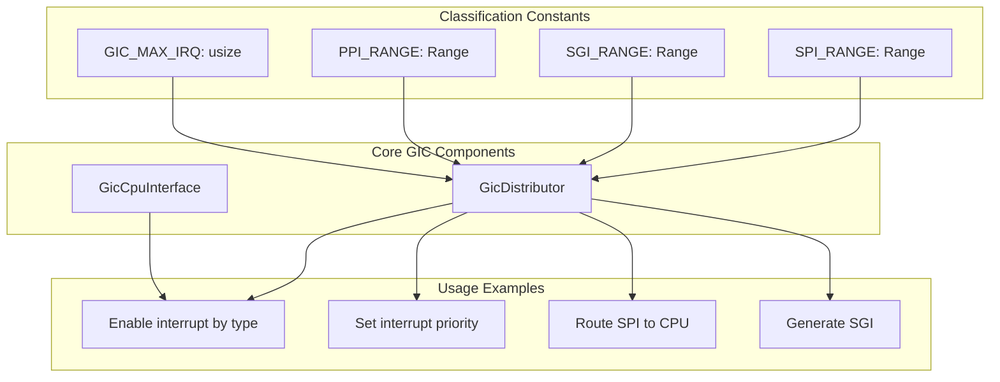

# Interrupt Classification System

> **Relevant source files**
> * [src/lib.rs](https://github.com/arceos-hypervisor/arm_gicv2/blob/eee14941/src/lib.rs)

## Purpose and Scope

This document covers the interrupt classification system implemented in the ARM GICv2 crate, which categorizes interrupts into three distinct types based on their ID ranges and intended usage patterns. The classification system provides the foundation for interrupt routing, priority management, and inter-processor communication within the GIC architecture.

For detailed information about how these classified interrupts are processed through the system, see [Interrupt Processing Pipeline](/arceos-hypervisor/arm_gicv2/2.3-interrupt-processing-pipeline). For specific implementation details of Software Generated Interrupts, see [Software Generated Interrupts](/arceos-hypervisor/arm_gicv2/3.2-software-generated-interrupts).

## Interrupt Type Classification

The ARM GICv2 specification defines three fundamental interrupt types, each with specific characteristics and use cases. The crate implements this classification through predefined ranges and an enumeration system.

### Interrupt Type Definitions

**Sources:** [src/lib.rs(L14 - L29)&emsp;](https://github.com/arceos-hypervisor/arm_gicv2/blob/eee14941/src/lib.rs#L14-L29) [src/lib.rs(L74 - L89)&emsp;](https://github.com/arceos-hypervisor/arm_gicv2/blob/eee14941/src/lib.rs#L74-L89)

|Interrupt Type|ID Range|Count|Primary Use Case|
| --- | --- | --- | --- |
|SGI (Software Generated)|0-15|16|Inter-processor communication|
|PPI (Private Peripheral)|16-31|16|CPU-specific peripheral interrupts|
|SPI (Shared Peripheral)|32-1019|988|System-wide peripheral interrupts|

### Software Generated Interrupts (SGI)

SGIs occupy interrupt IDs 0-15 and are generated through software writes to the `GICD_SGIR` register. These interrupts enable communication between processors in multi-core systems.

**Key Characteristics:**

* Always generated by software, never by hardware peripherals
* Can target specific CPUs or groups of CPUs
* Used for synchronization and coordination between cores
* Highest priority in the interrupt ID space

### Private Peripheral Interrupts (PPI)

PPIs occupy interrupt IDs 16-31 and are specific to individual processors. Each CPU core has its own private set of these interrupt sources.

**Key Characteristics:**

* Processor-specific interrupt sources
* Cannot be routed to other CPUs
* Typically used for CPU timers, PMU events, and other core-local peripherals
* Each CPU core sees the same PPI ID but from different physical sources

### Shared Peripheral Interrupts (SPI)

SPIs occupy interrupt IDs 32-1019 and represent the largest category of interrupts. These can be routed to any available CPU in the system.

**Key Characteristics:**

* System-wide interrupt sources
* Configurable CPU targeting and routing
* Generated by external peripherals and devices
* Support for load balancing and affinity settings

## Interrupt Translation Mechanism

The crate provides a translation function that converts relative interrupt IDs within each type to absolute GIC interrupt IDs.

**Sources:** [src/lib.rs(L91 - L116)&emsp;](https://github.com/arceos-hypervisor/arm_gicv2/blob/eee14941/src/lib.rs#L91-L116)

The `translate_irq` function performs the following transformations:

|Input Type|Calculation|Example|
| --- | --- | --- |
|InterruptType::SGI|id(direct mapping)|translate_irq(5, SGI)→Some(5)|
|InterruptType::PPI|id + PPI_RANGE.start|translate_irq(3, PPI)→Some(19)|
|InterruptType::SPI|id + SPI_RANGE.start|translate_irq(10, SPI)→Some(42)|

### Range Validation Logic

The translation function includes bounds checking to ensure valid interrupt IDs:

* **SGI validation**: `id < SGI_RANGE.end` (must be < 16)
* **PPI validation**: `id < PPI_RANGE.end - PPI_RANGE.start` (must be < 16)
* **SPI validation**: `id < SPI_RANGE.end - SPI_RANGE.start` (must be < 988)

Invalid inputs return `None`, providing safe interrupt ID translation.

## System Integration

The interrupt classification system integrates with the broader GIC architecture through well-defined constants and type-safe interfaces.

**Sources:** [src/lib.rs(L14 - L32)&emsp;](https://github.com/arceos-hypervisor/arm_gicv2/blob/eee14941/src/lib.rs#L14-L32) [src/lib.rs(L12)&emsp;](https://github.com/arceos-hypervisor/arm_gicv2/blob/eee14941/src/lib.rs#L12-L12)

### Configuration Constants

The system defines several key constants that govern interrupt handling:

* `GIC_MAX_IRQ`: Maximum interrupt count (1024)
* `GIC_CONFIG_BITS`: Bits per interrupt configuration (2)
* Range constants: Define valid ID spaces for each interrupt type

These constants ensure consistent behavior across the GIC implementation and provide compile-time guarantees about interrupt ID validity.

**Sources:** [src/lib.rs(L31 - L35)&emsp;](https://github.com/arceos-hypervisor/arm_gicv2/blob/eee14941/src/lib.rs#L31-L35)