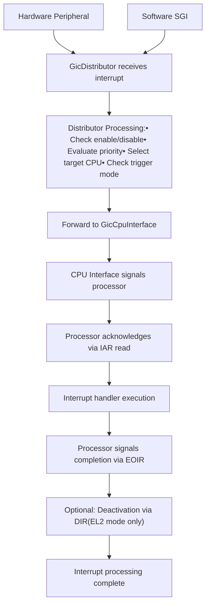
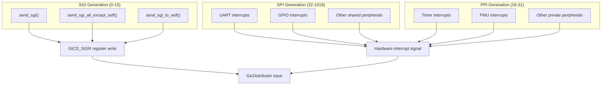
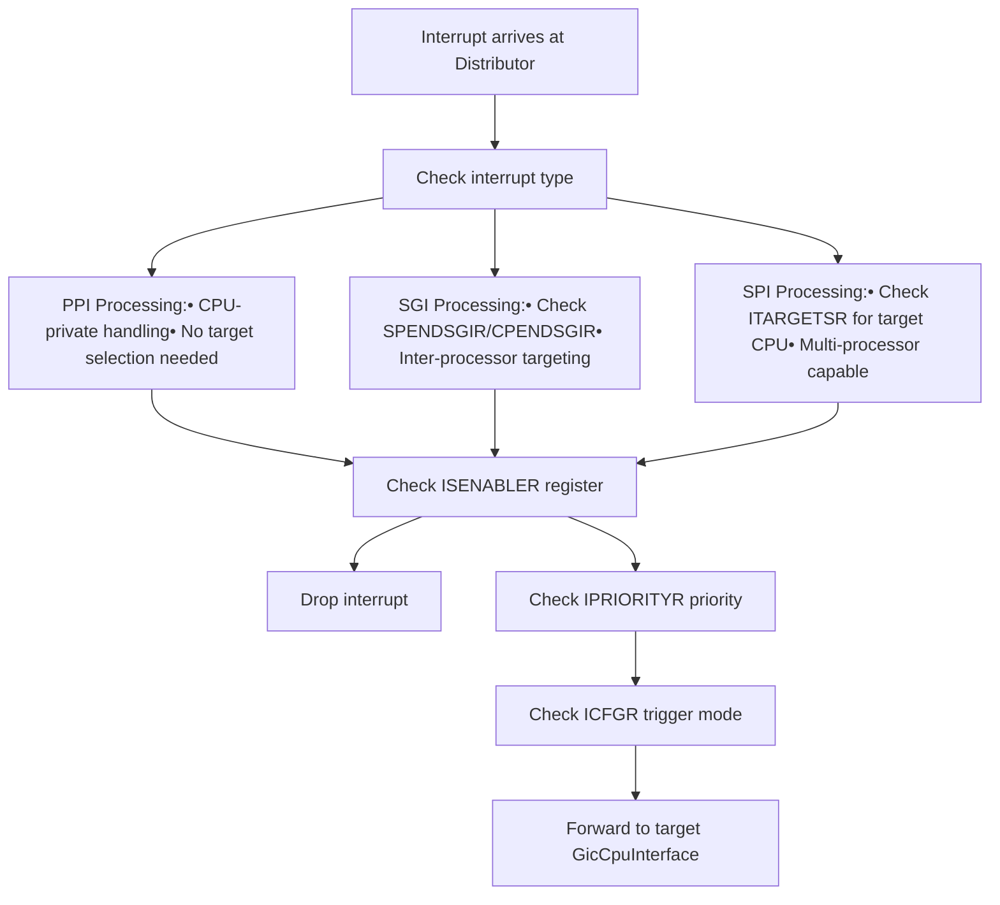
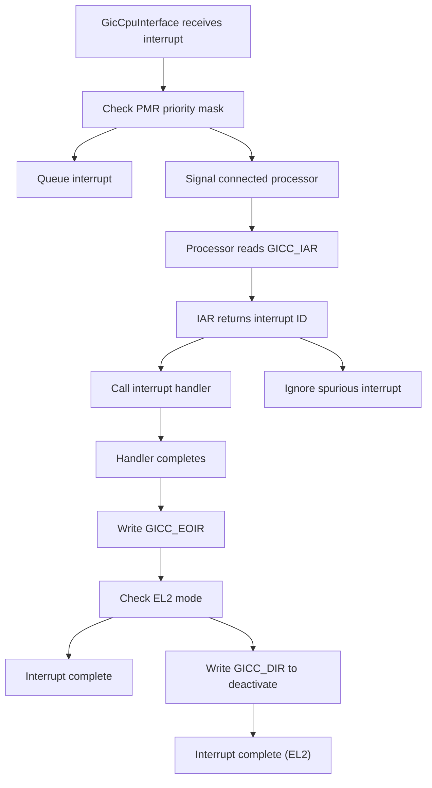
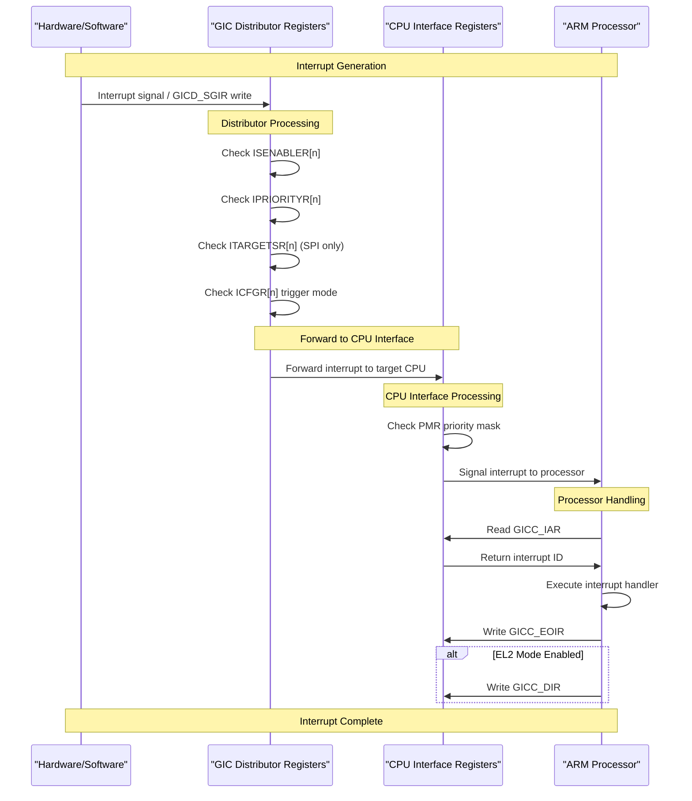
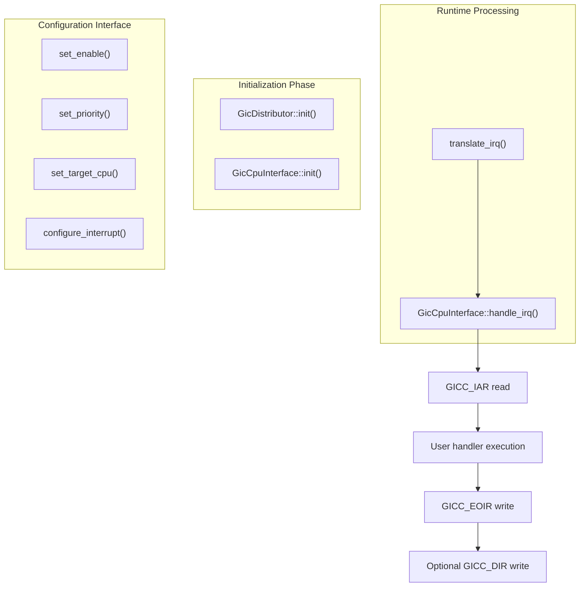

# Interrupt Processing Pipeline

> **Relevant source files**
> * [src/gic_v2.rs](https://github.com/arceos-hypervisor/arm_gicv2/blob/eee14941/src/gic_v2.rs)
> * [src/lib.rs](https://github.com/arceos-hypervisor/arm_gicv2/blob/eee14941/src/lib.rs)

This document describes the complete interrupt processing pipeline in the ARM GICv2 implementation, from interrupt generation through final completion. It covers the coordination between the `GicDistributor` and `GicCpuInterface` components and the flow of control through the hardware abstraction layer.

For details about the individual components, see [GIC Distributor Component](/arceos-hypervisor/arm_gicv2/2.1-gic-distributor-component) and [CPU Interface Component](/arceos-hypervisor/arm_gicv2/2.2-cpu-interface-component). For information about interrupt classification, see [Interrupt Classification System](/arceos-hypervisor/arm_gicv2/3.1-interrupt-classification-system).

## Pipeline Overview

The interrupt processing pipeline consists of five main stages that coordinate between hardware interrupt sources, the GIC Distributor, CPU interfaces, and software interrupt handlers.



Sources: [src/gic_v2.rs(L1 - L480)&emsp;](https://github.com/arceos-hypervisor/arm_gicv2/blob/eee14941/src/gic_v2.rs#L1-L480) [src/lib.rs(L1 - L117)&emsp;](https://github.com/arceos-hypervisor/arm_gicv2/blob/eee14941/src/lib.rs#L1-L117)

## Interrupt Generation Stage

Interrupts enter the pipeline through three different mechanisms based on their type classification.



Sources: [src/gic_v2.rs(L201 - L223)&emsp;](https://github.com/arceos-hypervisor/arm_gicv2/blob/eee14941/src/gic_v2.rs#L201-L223) [src/lib.rs(L14 - L29)&emsp;](https://github.com/arceos-hypervisor/arm_gicv2/blob/eee14941/src/lib.rs#L14-L29)

## Distributor Processing Stage

The `GicDistributor` performs comprehensive interrupt management including configuration validation, priority evaluation, and CPU targeting.

|Function|Register Access|Purpose|
| --- | --- | --- |
|set_enable()/get_enable()|ISENABLER/ICENABLER|Enable/disable interrupt delivery|
|set_priority()/get_priority()|IPRIORITYR|Configure interrupt priority levels|
|set_target_cpu()/get_target_cpu()|ITARGETSR|Select target processor for SPI interrupts|
|configure_interrupt()|ICFGR|Set edge/level trigger mode|
|set_state()/get_state()|ISPENDR/ICPENDR/ISACTIVER/ICACTIVER|Manage pending and active states|



Sources: [src/gic_v2.rs(L180 - L199)&emsp;](https://github.com/arceos-hypervisor/arm_gicv2/blob/eee14941/src/gic_v2.rs#L180-L199) [src/gic_v2.rs(L225 - L261)&emsp;](https://github.com/arceos-hypervisor/arm_gicv2/blob/eee14941/src/gic_v2.rs#L225-L261) [src/gic_v2.rs(L263 - L283)&emsp;](https://github.com/arceos-hypervisor/arm_gicv2/blob/eee14941/src/gic_v2.rs#L263-L283)

## CPU Interface Processing Stage

The `GicCpuInterface` manages per-CPU interrupt delivery, acknowledgment, and completion signaling.



Sources: [src/gic_v2.rs(L394 - L396)&emsp;](https://github.com/arceos-hypervisor/arm_gicv2/blob/eee14941/src/gic_v2.rs#L394-L396) [src/gic_v2.rs(L406 - L408)&emsp;](https://github.com/arceos-hypervisor/arm_gicv2/blob/eee14941/src/gic_v2.rs#L406-L408) [src/gic_v2.rs(L416 - L418)&emsp;](https://github.com/arceos-hypervisor/arm_gicv2/blob/eee14941/src/gic_v2.rs#L416-L418) [src/gic_v2.rs(L443 - L459)&emsp;](https://github.com/arceos-hypervisor/arm_gicv2/blob/eee14941/src/gic_v2.rs#L443-L459)

## Register-Level Pipeline Flow

This diagram shows the specific register interactions during interrupt processing, mapping high-level operations to actual hardware register access.



Sources: [src/gic_v2.rs(L20 - L90)&emsp;](https://github.com/arceos-hypervisor/arm_gicv2/blob/eee14941/src/gic_v2.rs#L20-L90) [src/gic_v2.rs(L443 - L459)&emsp;](https://github.com/arceos-hypervisor/arm_gicv2/blob/eee14941/src/gic_v2.rs#L443-L459)

## Pipeline Integration Points

The pipeline integrates with external components through well-defined interfaces that abstract the hardware complexity.



Sources: [src/gic_v2.rs(L342 - L373)&emsp;](https://github.com/arceos-hypervisor/arm_gicv2/blob/eee14941/src/gic_v2.rs#L342-L373) [src/gic_v2.rs(L461 - L478)&emsp;](https://github.com/arceos-hypervisor/arm_gicv2/blob/eee14941/src/gic_v2.rs#L461-L478) [src/gic_v2.rs(L443 - L459)&emsp;](https://github.com/arceos-hypervisor/arm_gicv2/blob/eee14941/src/gic_v2.rs#L443-L459) [src/lib.rs(L91 - L116)&emsp;](https://github.com/arceos-hypervisor/arm_gicv2/blob/eee14941/src/lib.rs#L91-L116)

## Error Handling and Edge Cases

The pipeline includes robust handling for edge cases and error conditions.

|Condition|Detection Method|Response|
| --- | --- | --- |
|Spurious Interrupt|IAR & 0x3ff >= 1020|No handler called, no EOIR write|
|Disabled Interrupt|ISENABLER[n] == 0|Interrupt dropped at distributor|
|Invalid IRQ Range|vector >= max_irqs|Early return from configuration functions|
|Priority Masking|Priority < PMR|Interrupt queued at CPU interface|

The `handle_irq()` function provides a complete wrapper that handles these edge cases automatically:

```javascript
// Simplified logic from handle_irq() method
let iar = self.iar();
let vector = iar & 0x3ff;
if vector < 1020 {
    handler(vector);
    self.eoi(iar);
    #[cfg(feature = "el2")]
    if self.regs().CTLR.get() & GICC_CTLR_EOIMODENS_BIT != 0 {
        self.dir(iar);
    }
} else {
    // spurious interrupt - no action taken
}
```

Sources: [src/gic_v2.rs(L443 - L459)&emsp;](https://github.com/arceos-hypervisor/arm_gicv2/blob/eee14941/src/gic_v2.rs#L443-L459) [src/gic_v2.rs(L180 - L192)&emsp;](https://github.com/arceos-hypervisor/arm_gicv2/blob/eee14941/src/gic_v2.rs#L180-L192) [src/gic_v2.rs(L162 - L178)&emsp;](https://github.com/arceos-hypervisor/arm_gicv2/blob/eee14941/src/gic_v2.rs#L162-L178)