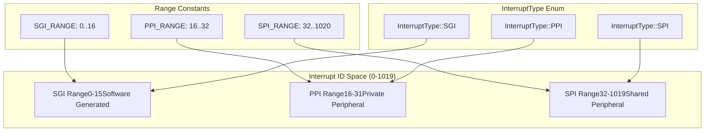
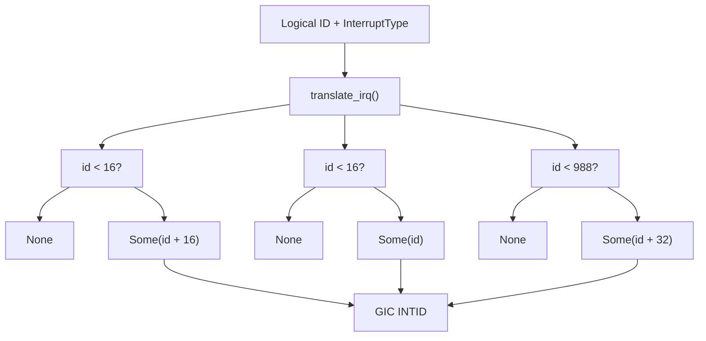
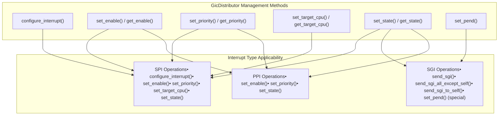
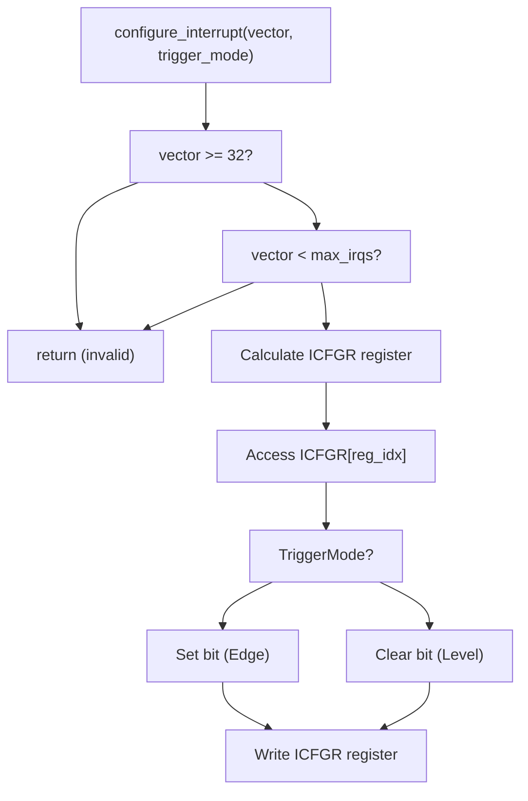
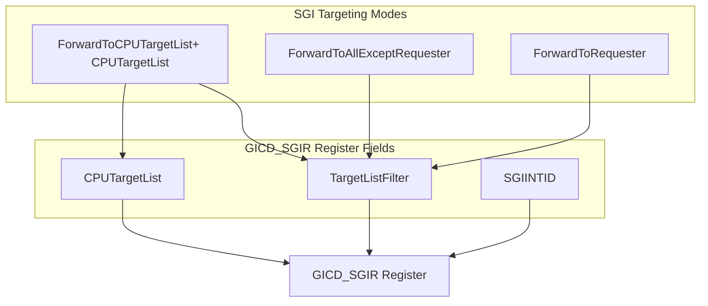
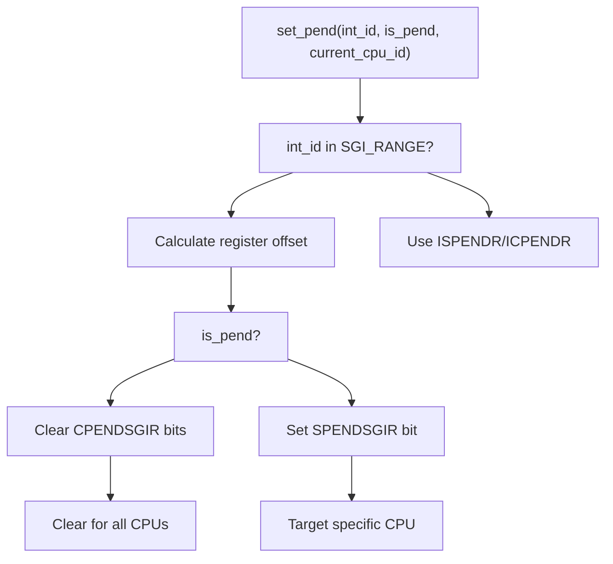
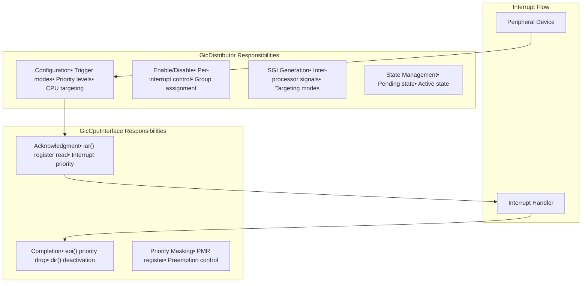

# Interrupt Types and Management

> **Relevant source files**
> * [src/gic_v2.rs](https://github.com/arceos-hypervisor/arm_gicv2/blob/eee14941/src/gic_v2.rs)
> * [src/lib.rs](https://github.com/arceos-hypervisor/arm_gicv2/blob/eee14941/src/lib.rs)

This document covers the interrupt classification system and management operations provided by the `arm_gicv2` crate. It details the three interrupt types supported by ARM GICv2 (SGI, PPI, SPI), their characteristics, and how they are managed through the distributor and CPU interface components.

For information about the core GIC architecture and components, see [Core Architecture](/arceos-hypervisor/arm_gicv2/2-core-architecture). For detailed register-level operations, see [Register Interface](/arceos-hypervisor/arm_gicv2/4-register-interface).

## Interrupt Classification System

The ARM GICv2 specification defines three distinct interrupt types, each serving different purposes and having specific characteristics. The crate implements this classification through constants, enums, and a translation function.

### Interrupt Type Definitions

**Sources**: [src/lib.rs(L14 - L29)&emsp;](https://github.com/arceos-hypervisor/arm_gicv2/blob/eee14941/src/lib.rs#L14-L29) [src/lib.rs(L74 - L89)&emsp;](https://github.com/arceos-hypervisor/arm_gicv2/blob/eee14941/src/lib.rs#L74-L89)

|Interrupt Type|Range|Purpose|CPU Scope|
| --- | --- | --- | --- |
|SGI (Software Generated)|0-15|Inter-processor communication|All CPUs|
|PPI (Private Peripheral)|16-31|CPU-specific peripherals|Single CPU|
|SPI (Shared Peripheral)|32-1019|System-wide peripherals|Multiple CPUs|

### Interrupt Translation System

The `translate_irq` function provides a safe way to convert logical interrupt IDs within each type to absolute GIC interrupt IDs.

**Sources**: [src/lib.rs(L91 - L116)&emsp;](https://github.com/arceos-hypervisor/arm_gicv2/blob/eee14941/src/lib.rs#L91-L116)

## Interrupt Management Operations

The GIC provides different management capabilities depending on the interrupt type. These operations are primarily handled through the `GicDistributor` component.

### Core Management Functions

**Sources**: [src/gic_v2.rs(L161 - L283)&emsp;](https://github.com/arceos-hypervisor/arm_gicv2/blob/eee14941/src/gic_v2.rs#L161-L283) [src/gic_v2.rs(L201 - L223)&emsp;](https://github.com/arceos-hypervisor/arm_gicv2/blob/eee14941/src/gic_v2.rs#L201-L223)

### Trigger Mode Configuration

Only SPI interrupts support configurable trigger modes. The system restricts trigger mode configuration to the SPI range.

**Sources**: [src/gic_v2.rs(L161 - L178)&emsp;](https://github.com/arceos-hypervisor/arm_gicv2/blob/eee14941/src/gic_v2.rs#L161-L178)

## Software Generated Interrupt Management

SGIs have special handling due to their role in inter-processor communication. They use dedicated register interfaces and targeting mechanisms.

### SGI Generation Methods

|Method|Target|Use Case|
| --- | --- | --- |
|send_sgi(dest_cpu_id, sgi_num)|Specific CPU|Direct communication|
|send_sgi_all_except_self(sgi_num)|All other CPUs|Broadcast operations|
|send_sgi_to_self(sgi_num)|Current CPU|Self-signaling|

**Sources**: [src/gic_v2.rs(L201 - L223)&emsp;](https://github.com/arceos-hypervisor/arm_gicv2/blob/eee14941/src/gic_v2.rs#L201-L223) [src/regs/gicd_sgir.rs](https://github.com/arceos-hypervisor/arm_gicv2/blob/eee14941/src/regs/gicd_sgir.rs)

### SGI Pending State Management

SGIs require special handling for pending state management due to their per-CPU nature:

**Sources**: [src/gic_v2.rs(L264 - L283)&emsp;](https://github.com/arceos-hypervisor/arm_gicv2/blob/eee14941/src/gic_v2.rs#L264-L283)

## Integration with GIC Components

Interrupt management operations interface with both the distributor and CPU interface components, with different responsibilities for each type.

### Distributor vs CPU Interface Responsibilities

**Sources**: [src/gic_v2.rs(L92 - L131)&emsp;](https://github.com/arceos-hypervisor/arm_gicv2/blob/eee14941/src/gic_v2.rs#L92-L131) [src/gic_v2.rs(L376 - L479)&emsp;](https://github.com/arceos-hypervisor/arm_gicv2/blob/eee14941/src/gic_v2.rs#L376-L479)

The interrupt management system provides a complete abstraction over ARM GICv2 hardware while maintaining type safety and proper encapsulation of interrupt-type-specific behaviors.