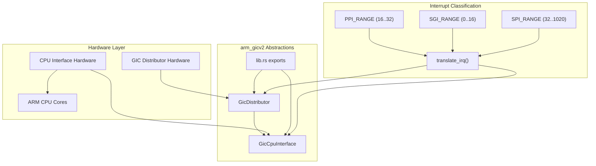
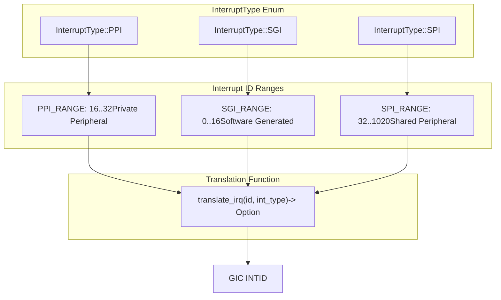
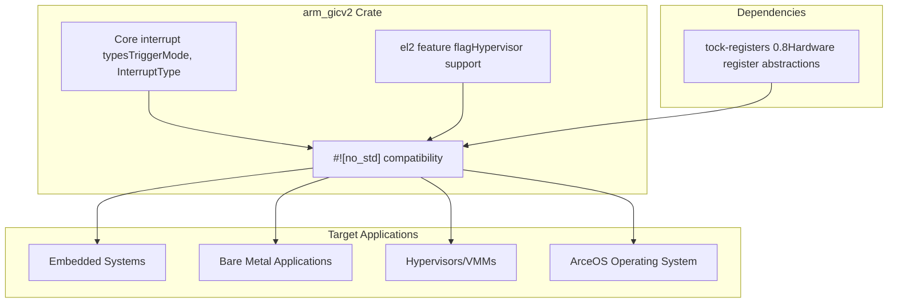

# Overview

> **Relevant source files**
> * [Cargo.toml](https://github.com/arceos-hypervisor/arm_gicv2/blob/eee14941/Cargo.toml)
> * [README.md](https://github.com/arceos-hypervisor/arm_gicv2/blob/eee14941/README.md)
> * [src/lib.rs](https://github.com/arceos-hypervisor/arm_gicv2/blob/eee14941/src/lib.rs)

## Purpose and Scope

The `arm_gicv2` crate provides a hardware abstraction layer for the ARM Generic Interrupt Controller version 2 (GICv2), enabling safe and efficient interrupt management in embedded systems, bare-metal applications, and hypervisors. This library offers a `#![no_std]` compatible interface for configuring, routing, and handling interrupts across ARM-based multi-core systems.

This overview covers the crate's fundamental architecture and interrupt classification system. For detailed information about the core interrupt handling components, see [Core Architecture](/arceos-hypervisor/arm_gicv2/2-core-architecture). For comprehensive interrupt type management, see [Interrupt Types and Management](/arceos-hypervisor/arm_gicv2/3-interrupt-types-and-management). For register-level implementation details, see [Register Interface](/arceos-hypervisor/arm_gicv2/4-register-interface).

Sources: [src/lib.rs(L1 - L117)&emsp;](https://github.com/arceos-hypervisor/arm_gicv2/blob/eee14941/src/lib.rs#L1-L117) [Cargo.toml(L1 - L19)&emsp;](https://github.com/arceos-hypervisor/arm_gicv2/blob/eee14941/Cargo.toml#L1-L19) [README.md(L1 - L10)&emsp;](https://github.com/arceos-hypervisor/arm_gicv2/blob/eee14941/README.md#L1-L10)

## Core Components Architecture

The crate exposes two primary hardware abstraction components that work together to manage the complete interrupt processing pipeline:

The `GicDistributor` manages system-wide interrupt configuration, priority handling, and routing decisions, while the `GicCpuInterface` handles per-CPU interrupt acknowledgment and completion signaling. These components are exported from the main library interface defined in [src/lib.rs(L12)&emsp;](https://github.com/arceos-hypervisor/arm_gicv2/blob/eee14941/src/lib.rs#L12-L12)

Sources: [src/lib.rs(L10 - L12)&emsp;](https://github.com/arceos-hypervisor/arm_gicv2/blob/eee14941/src/lib.rs#L10-L12)

## Interrupt Classification and Translation System

The crate implements a comprehensive interrupt classification system that categorizes all GIC interrupts into three distinct types, each with specific characteristics and use cases:

The `translate_irq` function provides safe conversion from logical interrupt IDs to GIC interrupt identifiers, ensuring type safety and preventing invalid interrupt configurations. This function implements bounds checking for each interrupt type and returns `None` for invalid combinations.

|Interrupt Type|ID Range|Constant|Purpose|
| --- | --- | --- | --- |
|SGI|0-15|SGI_RANGE|Inter-processor communication|
|PPI|16-31|PPI_RANGE|Single CPU peripheral interrupts|
|SPI|32-1019|SPI_RANGE|Multi-CPU peripheral interrupts|

Sources: [src/lib.rs(L14 - L29)&emsp;](https://github.com/arceos-hypervisor/arm_gicv2/blob/eee14941/src/lib.rs#L14-L29) [src/lib.rs(L74 - L89)&emsp;](https://github.com/arceos-hypervisor/arm_gicv2/blob/eee14941/src/lib.rs#L74-L89) [src/lib.rs(L91 - L116)&emsp;](https://github.com/arceos-hypervisor/arm_gicv2/blob/eee14941/src/lib.rs#L91-L116)

## System Integration Context

The crate integrates into the broader embedded systems ecosystem through several key characteristics:

The crate supports both basic interrupt management and advanced hypervisor features through the optional `el2` feature flag. The `TriggerMode` enum supports both edge-triggered and level-sensitive interrupt configurations, providing flexibility for different hardware integration scenarios.

Key system constants include:

* `GIC_MAX_IRQ`: Maximum of 1024 supported interrupts
* `GIC_CONFIG_BITS`: 2 bits per interrupt for trigger mode configuration
* `GICC_CTLR_EN_BIT` and `GICD_CTLR_EN_BIT`: Control register enable bits

Sources: [src/lib.rs(L1 - L3)&emsp;](https://github.com/arceos-hypervisor/arm_gicv2/blob/eee14941/src/lib.rs#L1-L3) [src/lib.rs(L31 - L72)&emsp;](https://github.com/arceos-hypervisor/arm_gicv2/blob/eee14941/src/lib.rs#L31-L72) [Cargo.toml(L14 - L18)&emsp;](https://github.com/arceos-hypervisor/arm_gicv2/blob/eee14941/Cargo.toml#L14-L18)