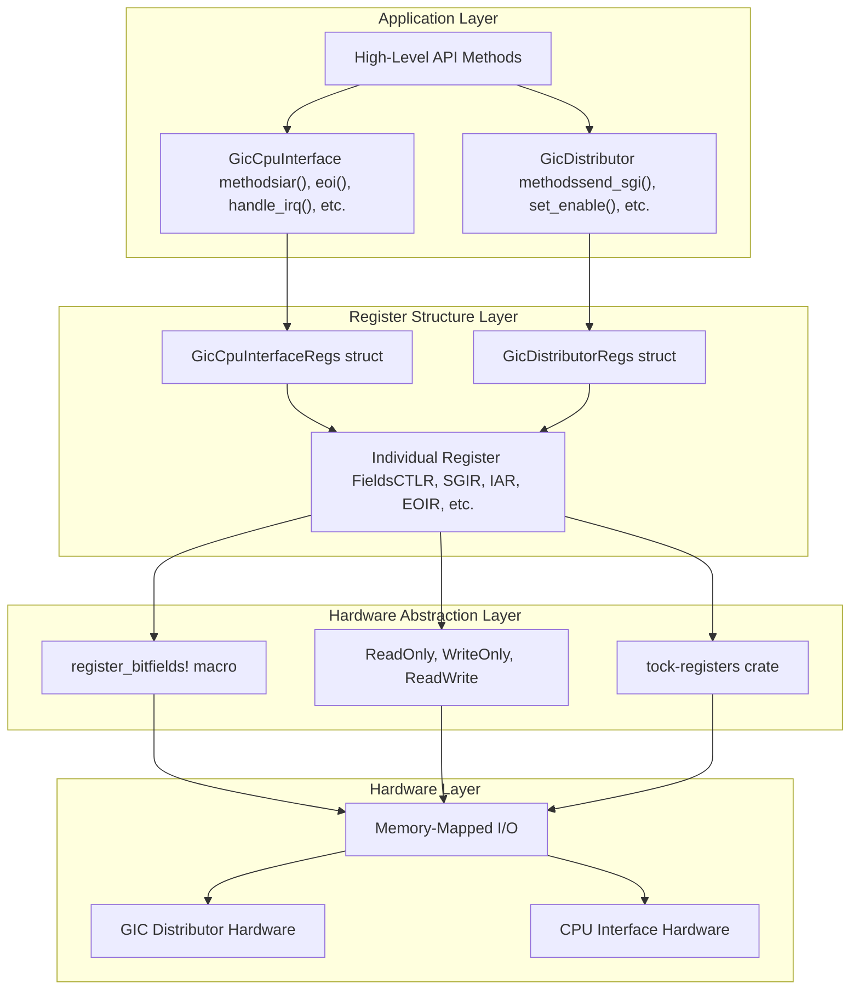
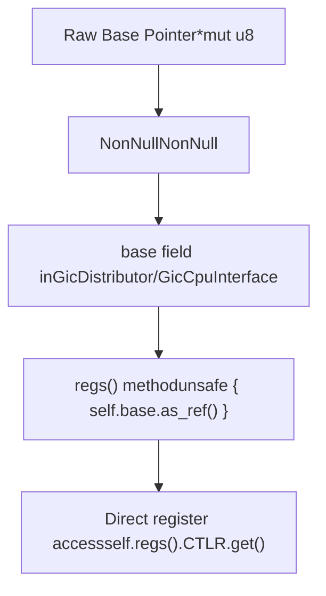
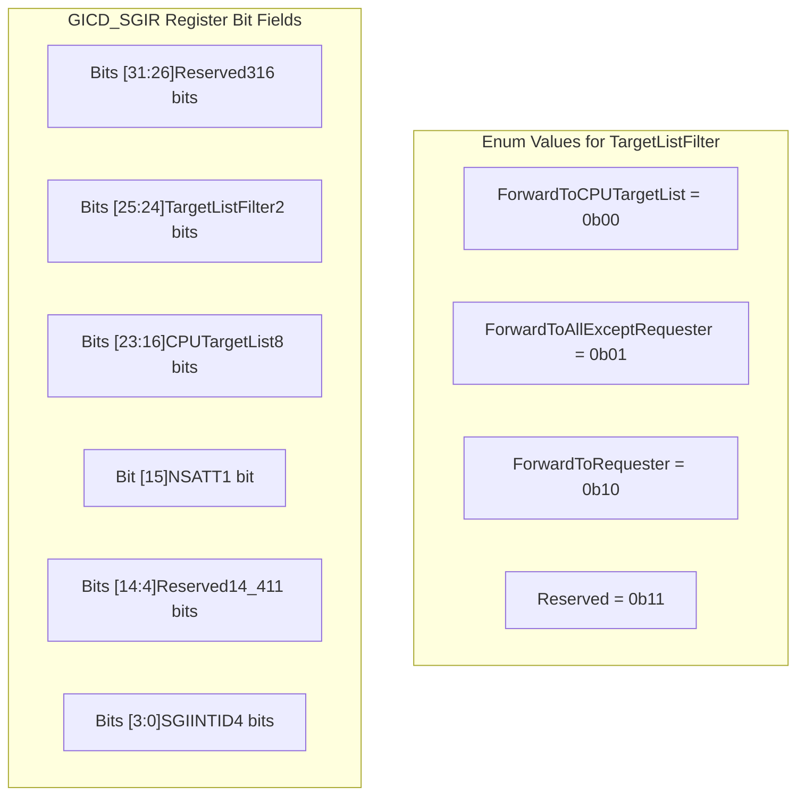

# Register Interface

> **Relevant source files**
> * [src/gic_v2.rs](https://github.com/arceos-hypervisor/arm_gicv2/blob/eee14941/src/gic_v2.rs)
> * [src/regs/gicd_sgir.rs](https://github.com/arceos-hypervisor/arm_gicv2/blob/eee14941/src/regs/gicd_sgir.rs)
> * [src/regs/mod.rs](https://github.com/arceos-hypervisor/arm_gicv2/blob/eee14941/src/regs/mod.rs)

This document describes how the `arm_gicv2` crate abstracts ARM GICv2 hardware registers and provides safe, type-checked access to GIC functionality. The register interface serves as the foundation layer that bridges Rust code with memory-mapped hardware registers.

For information about the higher-level GIC components that use these registers, see [Core Architecture](/arceos-hypervisor/arm_gicv2/2-core-architecture). For specific register details and bit field definitions, see [Register Module Organization](/arceos-hypervisor/arm_gicv2/4.1-register-module-organization) and [GICD_SGIR Register Details](/arceos-hypervisor/arm_gicv2/4.2-gicd_sgir-register-details).

## Register Abstraction Architecture

The crate implements a three-layer abstraction for hardware register access:



Sources: [src/gic_v2.rs(L1 - L480)&emsp;](https://github.com/arceos-hypervisor/arm_gicv2/blob/eee14941/src/gic_v2.rs#L1-L480) [src/regs/gicd_sgir.rs(L1 - L62)&emsp;](https://github.com/arceos-hypervisor/arm_gicv2/blob/eee14941/src/regs/gicd_sgir.rs#L1-L62)

## Memory-Mapped Register Structures

The crate defines two primary register structures that map directly to hardware memory layouts:

### GicDistributorRegs Layout

```mermaid
flowchart TD
subgraph subGraph0["GicDistributorRegs Memory Layout"]
    CTLR["0x0000: CTLRDistributor Control RegisterReadWrite<u32>"]
    TYPER["0x0004: TYPERInterrupt Controller TypeReadOnly<u32>"]
    IIDR["0x0008: IIDRImplementer IdentificationReadOnly<u32>"]
    IGROUPR["0x0080: IGROUPR[0x20]Interrupt Group RegistersReadWrite<u32>"]
    ISENABLER["0x0100: ISENABLER[0x20]Interrupt Set-EnableReadWrite<u32>"]
    ICENABLER["0x0180: ICENABLER[0x20]Interrupt Clear-EnableReadWrite<u32>"]
    IPRIORITYR["0x0400: IPRIORITYR[0x100]Interrupt PriorityReadWrite<u32>"]
    ITARGETSR["0x0800: ITARGETSR[0x100]Interrupt Processor TargetsReadWrite<u32>"]
    ICFGR["0x0c00: ICFGR[0x40]Interrupt ConfigurationReadWrite<u32>"]
    SGIR["0x0f00: SGIRSoftware Generated InterruptGicdSgirReg (WriteOnly)"]
    CPENDSGIR["0x0f10: CPENDSGIR[0x4]SGI Clear-PendingReadWrite<u32>"]
    SPENDSGIR["0x0f20: SPENDSGIR[0x4]SGI Set-PendingReadWrite<u32>"]
end

CPENDSGIR --> SPENDSGIR
CTLR --> TYPER
ICENABLER --> IPRIORITYR
ICFGR --> SGIR
IGROUPR --> ISENABLER
IIDR --> IGROUPR
IPRIORITYR --> ITARGETSR
ISENABLER --> ICENABLER
ITARGETSR --> ICFGR
SGIR --> CPENDSGIR
TYPER --> IIDR
```



### GicCpuInterfaceRegs Layout

```mermaid
flowchart TD
subgraph subGraph0["GicCpuInterfaceRegs Memory Layout"]
    CPU_CTLR["0x0000: CTLRCPU Interface ControlReadWrite<u32>"]
    PMR["0x0004: PMRInterrupt Priority MaskReadWrite<u32>"]
    BPR["0x0008: BPRBinary Point RegisterReadWrite<u32>"]
    IAR["0x000c: IARInterrupt AcknowledgeReadOnly<u32>"]
    EOIR["0x0010: EOIREnd of InterruptWriteOnly<u32>"]
    RPR["0x0014: RPRRunning PriorityReadOnly<u32>"]
    HPPIR["0x0018: HPPIRHighest Priority PendingReadOnly<u32>"]
    CPU_IIDR["0x00fc: IIDRCPU Interface IdentificationReadOnly<u32>"]
    DIR["0x1000: DIRDeactivate InterruptWriteOnly<u32>"]
end

BPR --> IAR
CPU_CTLR --> PMR
CPU_IIDR --> DIR
EOIR --> RPR
HPPIR --> CPU_IIDR
IAR --> EOIR
PMR --> BPR
RPR --> HPPIR
```



Sources: [src/gic_v2.rs(L20 - L90)&emsp;](https://github.com/arceos-hypervisor/arm_gicv2/blob/eee14941/src/gic_v2.rs#L20-L90)

## Register Access Patterns

The register interface implements type-safe access patterns through the `tock-registers` crate:

|Register Type|Access Pattern|Example Usage|
| --- | --- | --- |
|ReadOnly<u32>|.get()|self.regs().IAR.get()|
|WriteOnly<u32>|.set(value)|self.regs().EOIR.set(iar)|
|ReadWrite<u32>|.get(),.set(value)|self.regs().CTLR.set(val)|
|GicdSgirReg|.write(fields)|self.regs().SGIR.write(fields)|

### Register Structure Instantiation



Sources: [src/gic_v2.rs(L140 - L149)&emsp;](https://github.com/arceos-hypervisor/arm_gicv2/blob/eee14941/src/gic_v2.rs#L140-L149) [src/gic_v2.rs(L378 - L386)&emsp;](https://github.com/arceos-hypervisor/arm_gicv2/blob/eee14941/src/gic_v2.rs#L378-L386)

## Type-Safe Bit Field Access

The `GICD_SGIR` register demonstrates advanced bit field abstraction:



### Usage Example

The register is accessed through structured field composition:

```yaml
self.regs().SGIR.write(
    GICD_SGIR::TargetListFilter::ForwardToCPUTargetList
        + GICD_SGIR::CPUTargetList.val(dest_cpu_id as _)
        + GICD_SGIR::SGIINTID.val(sgi_num as _)
);
```

Sources: [src/regs/gicd_sgir.rs(L21 - L58)&emsp;](https://github.com/arceos-hypervisor/arm_gicv2/blob/eee14941/src/regs/gicd_sgir.rs#L21-L58) [src/gic_v2.rs(L203 - L208)&emsp;](https://github.com/arceos-hypervisor/arm_gicv2/blob/eee14941/src/gic_v2.rs#L203-L208)

## Register Module Organization

The register definitions are organized in the `regs/` module:

|Module|Purpose|Key Components|
| --- | --- | --- |
|regs/mod.rs|Module exports|Re-exportsgicd_sgiritems|
|regs/gicd_sgir.rs|SGIR register|GICD_SGIRbitfields,GicdSgirRegtype|

The module structure allows for extensible register definitions while maintaining clean separation between different register types.

Sources: [src/regs/mod.rs(L1 - L4)&emsp;](https://github.com/arceos-hypervisor/arm_gicv2/blob/eee14941/src/regs/mod.rs#L1-L4) [src/regs/gicd_sgir.rs(L1 - L62)&emsp;](https://github.com/arceos-hypervisor/arm_gicv2/blob/eee14941/src/regs/gicd_sgir.rs#L1-L62)