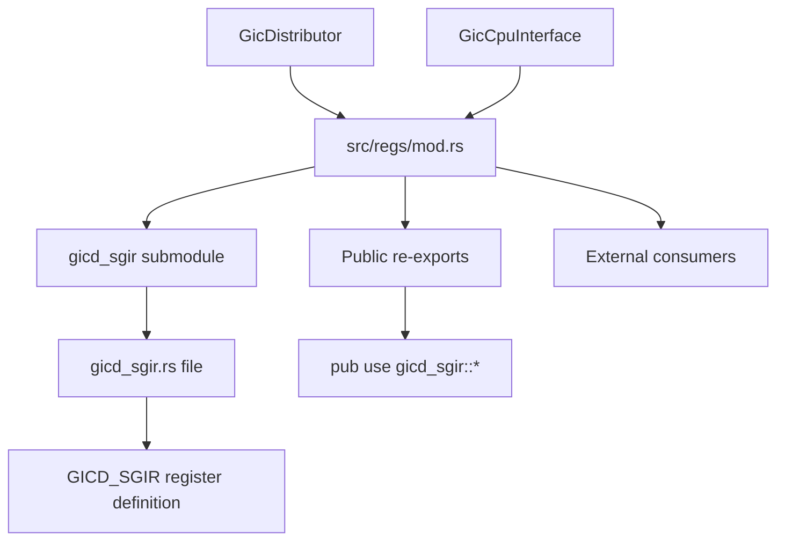
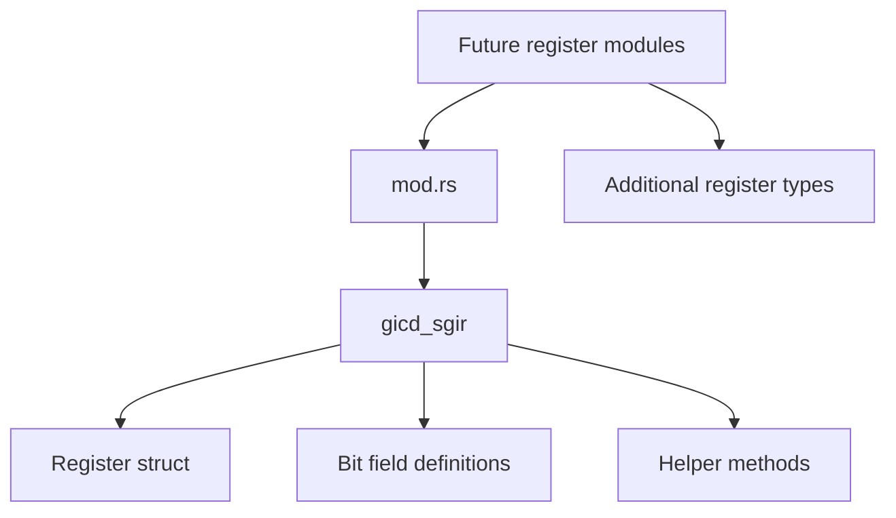
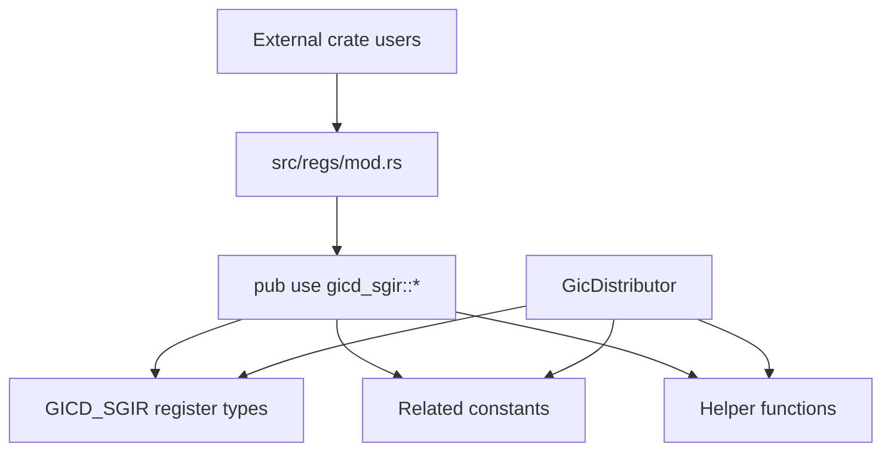
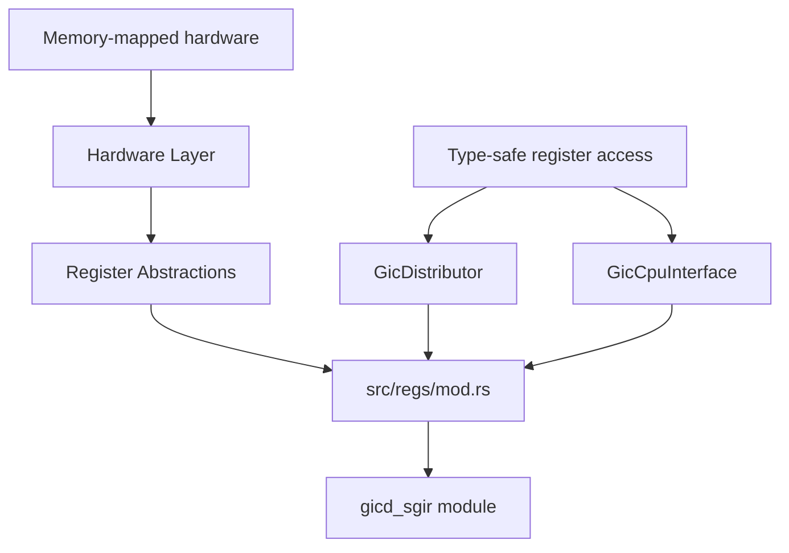

# Register Module Organization

> **Relevant source files**
> * [src/regs/mod.rs](https://github.com/arceos-hypervisor/arm_gicv2/blob/eee14941/src/regs/mod.rs)

## Purpose and Scope

This document covers the structural organization of the register abstraction layer within the arm_gicv2 crate. The register module provides hardware register definitions and abstractions that enable safe, type-safe access to ARM GICv2 hardware registers. This page focuses on how register definitions are organized, modularized, and exposed to the rest of the codebase.

For detailed information about specific register implementations, see [GICD_SGIR Register Details](/arceos-hypervisor/arm_gicv2/4.2-gicd_sgir-register-details). For broader context on how these registers integrate with the main GIC components, see [Core Architecture](/arceos-hypervisor/arm_gicv2/2-core-architecture).

## Module Structure Overview

The register module follows a hierarchical organization pattern where individual register definitions are contained in dedicated submodules and selectively re-exported through the main module interface.

### Register Module Hierarchy

**Sources**: [src/regs/mod.rs(L1 - L4)&emsp;](https://github.com/arceos-hypervisor/arm_gicv2/blob/eee14941/src/regs/mod.rs#L1-L4)

The current module organization demonstrates a focused approach where each hardware register receives its own dedicated submodule. The `mod.rs` file serves as the central coordination point that aggregates and exposes register definitions.

### Module Declaration and Re-export Pattern

The register module employs a straightforward declaration and re-export strategy:

|Module Component|Purpose|Implementation|
| --- | --- | --- |
|Submodule declaration|Declares register-specific modules|mod gicd_sgir;|
|Public re-export|Exposes register APIs to consumers|pub use gicd_sgir::*;|

**Sources**: [src/regs/mod.rs(L1 - L3)&emsp;](https://github.com/arceos-hypervisor/arm_gicv2/blob/eee14941/src/regs/mod.rs#L1-L3)

This pattern provides several architectural benefits:

* **Encapsulation**: Each register definition is isolated in its own module
* **Selective exposure**: Only intended APIs are re-exported through the main module
* **Maintainability**: New registers can be added by following the same pattern
* **Namespace management**: Wildcard re-exports flatten the API surface for consumers

## Register Organization Patterns

### Submodule Structure

**Sources**: [src/regs/mod.rs(L1)&emsp;](https://github.com/arceos-hypervisor/arm_gicv2/blob/eee14941/src/regs/mod.rs#L1-L1)

The modular approach allows for systematic expansion of register support. Each submodule can contain:

* Register structure definitions using `tock-registers` abstractions
* Bit field layouts and access patterns
* Register-specific helper functions and constants
* Documentation specific to that hardware register

### API Surface Management

The re-export strategy in the module creates a unified namespace for register access:

**Sources**: [src/regs/mod.rs(L3)&emsp;](https://github.com/arceos-hypervisor/arm_gicv2/blob/eee14941/src/regs/mod.rs#L3-L3)

This design enables consumers to import register definitions through a single, well-defined module path while maintaining internal organization through submodules.

## Integration with Hardware Abstraction

### Register Module Role in GIC Architecture

**Sources**: [src/regs/mod.rs(L1 - L4)&emsp;](https://github.com/arceos-hypervisor/arm_gicv2/blob/eee14941/src/regs/mod.rs#L1-L4)

The register module serves as the foundational layer that translates raw hardware register layouts into type-safe Rust abstractions. This enables the higher-level `GicDistributor` and `GicCpuInterface` components to interact with hardware through well-defined, compile-time-verified interfaces.

## Extensibility and Future Growth

The current organization pattern supports systematic expansion for additional GIC registers:

|Register Category|Current Support|Extension Pattern|
| --- | --- | --- |
|Software Generated Interrupts|gicd_sgirmodule|Additional SGI-related registers|
|Distributor Control|Not yet implemented|gicd_ctlr,gicd_typermodules|
|CPU Interface|Not yet implemented|gicc_*register modules|
|Priority Management|Not yet implemented|Priority and masking register modules|

**Sources**: [src/regs/mod.rs(L1 - L4)&emsp;](https://github.com/arceos-hypervisor/arm_gicv2/blob/eee14941/src/regs/mod.rs#L1-L4)

Each new register would follow the established pattern of creating a dedicated submodule and adding appropriate re-exports to maintain the unified API surface while preserving internal modularity.