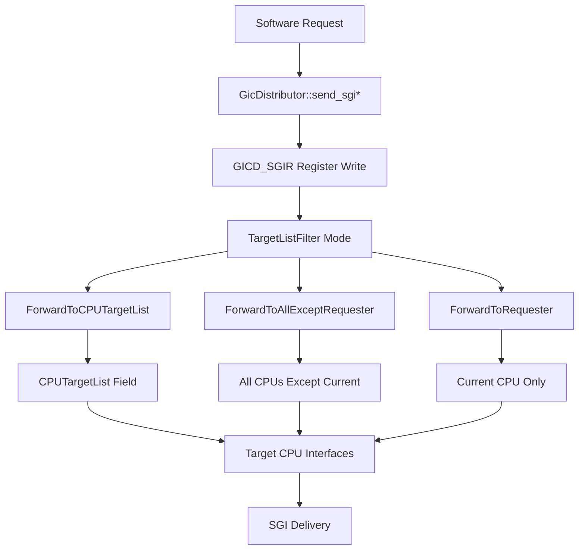
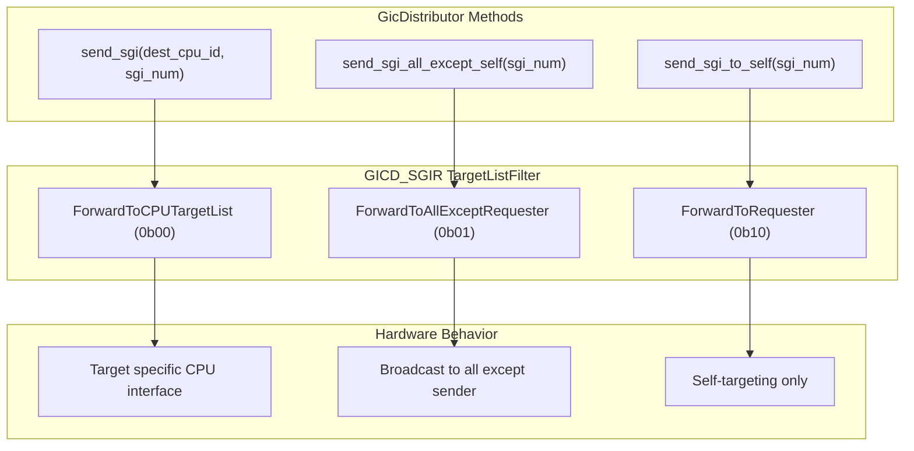
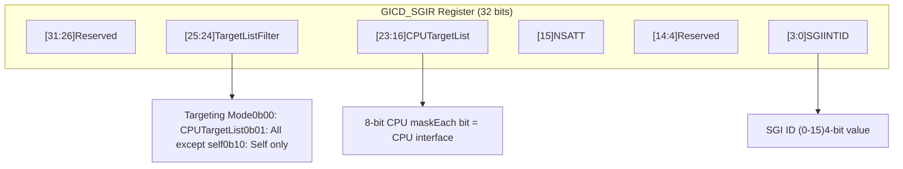
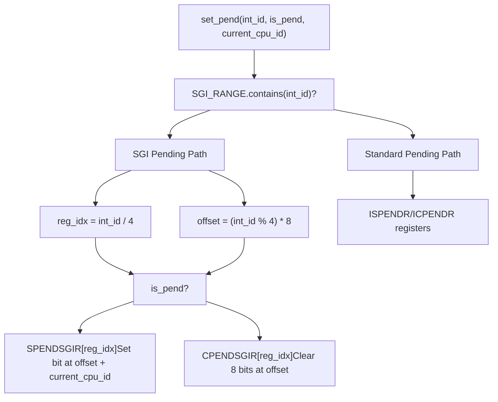

# Software Generated Interrupts

> **Relevant source files**
> * [src/gic_v2.rs](https://github.com/arceos-hypervisor/arm_gicv2/blob/eee14941/src/gic_v2.rs)
> * [src/lib.rs](https://github.com/arceos-hypervisor/arm_gicv2/blob/eee14941/src/lib.rs)
> * [src/regs/gicd_sgir.rs](https://github.com/arceos-hypervisor/arm_gicv2/blob/eee14941/src/regs/gicd_sgir.rs)

This document covers Software Generated Interrupts (SGIs) in the ARM GICv2 implementation, including their generation methods, register interface, and targeting mechanisms. SGIs are a critical component for inter-processor communication in multi-core systems.

For information about the overall interrupt classification system, see [Interrupt Classification System](/arceos-hypervisor/arm_gicv2/3.1-interrupt-classification-system). For details about the underlying register implementations, see [GICD_SGIR Register Details](/arceos-hypervisor/arm_gicv2/4.2-gicd_sgir-register-details).

## SGI Overview and Characteristics

Software Generated Interrupts occupy interrupt IDs 0-15 and serve as the primary mechanism for inter-processor communication in ARM GICv2 systems. Unlike peripheral interrupts, SGIs are generated entirely through software writes to the `GICD_SGIR` register.

|Characteristic|Value|
| --- | --- |
|Interrupt ID Range|0-15|
|Total Count|16 SGIs|
|Primary Use Case|Inter-processor communication|
|Generation Method|Software write to GICD_SGIR|
|Targeting|Flexible CPU targeting modes|

SGIs are defined by the `SGI_RANGE` constant and classified through the `InterruptType::SGI` enum variant. The `translate_irq` function handles SGI ID validation, ensuring only IDs 0-15 are accepted for SGI operations.

**SGI Generation Flow**



Sources: [src/lib.rs(L14 - L18)&emsp;](https://github.com/arceos-hypervisor/arm_gicv2/blob/eee14941/src/lib.rs#L14-L18) [src/lib.rs(L92 - L116)&emsp;](https://github.com/arceos-hypervisor/arm_gicv2/blob/eee14941/src/lib.rs#L92-L116) [src/gic_v2.rs(L202 - L223)&emsp;](https://github.com/arceos-hypervisor/arm_gicv2/blob/eee14941/src/gic_v2.rs#L202-L223)

## SGI Generation Methods

The `GicDistributor` struct provides three primary methods for generating SGIs, each corresponding to different targeting strategies. These methods abstract the complexity of `GICD_SGIR` register programming.

### send_sgi Method

The `send_sgi` method targets a specific CPU interface using the `ForwardToCPUTargetList` mode:

```python
// Method signature from GicDistributor implementation
pub fn send_sgi(&mut self, dest_cpu_id: usize, sgi_num: usize)
```

This method constructs a `GICD_SGIR` register write with:

* `TargetListFilter` = `ForwardToCPUTargetList` (0b00)
* `CPUTargetList` = destination CPU ID bitmask
* `SGIINTID` = SGI number (0-15)

### send_sgi_all_except_self Method

The `send_sgi_all_except_self` method broadcasts to all CPU interfaces except the requesting processor:

```python
// Method signature from GicDistributor implementation  
pub fn send_sgi_all_except_self(&mut self, sgi_num: usize)
```

This method uses `TargetListFilter` = `ForwardToAllExceptRequester` (0b01), eliminating the need to specify individual CPU targets.

### send_sgi_to_self Method

The `send_sgi_to_self` method targets only the requesting CPU interface:

```python
// Method signature from GicDistributor implementation
pub fn send_sgi_to_self(&mut self, sgi_num: usize)
```

This method uses `TargetListFilter` = `ForwardToRequester` (0b10) for local SGI generation.

**SGI Method Mapping**



Sources: [src/gic_v2.rs(L202 - L208)&emsp;](https://github.com/arceos-hypervisor/arm_gicv2/blob/eee14941/src/gic_v2.rs#L202-L208) [src/gic_v2.rs(L211 - L216)&emsp;](https://github.com/arceos-hypervisor/arm_gicv2/blob/eee14941/src/gic_v2.rs#L211-L216) [src/gic_v2.rs(L219 - L223)&emsp;](https://github.com/arceos-hypervisor/arm_gicv2/blob/eee14941/src/gic_v2.rs#L219-L223)

## GICD_SGIR Register Interface

The `GICD_SGIR` register controls SGI generation through a structured bit field layout. The register is implemented as a write-only interface using the `tock-registers` abstraction.

### Register Bit Fields

|Bits|Field|Purpose|
| --- | --- | --- |
|[31:26]|Reserved|Must be zero|
|[25:24]|TargetListFilter|Determines targeting mode|
|[23:16]|CPUTargetList|CPU interface bitmask (when TargetListFilter = 0b00)|
|[15]|NSATT|Security attribute (Security Extensions only)|
|[14:4]|Reserved|Should be zero|
|[3:0]|SGIINTID|SGI interrupt ID (0-15)|

The `TargetListFilter` field provides four targeting modes:

|Value|Mode|Description|
| --- | --- | --- |
|0b00|ForwardToCPUTargetList|Use CPUTargetList bitmask|
|0b01|ForwardToAllExceptRequester|Broadcast except sender|
|0b10|ForwardToRequester|Self-targeting only|
|0b11|Reserved|Invalid mode|

**GICD_SGIR Register Layout**



Sources: [src/regs/gicd_sgir.rs(L21 - L58)&emsp;](https://github.com/arceos-hypervisor/arm_gicv2/blob/eee14941/src/regs/gicd_sgir.rs#L21-L58) [src/gic_v2.rs(L18)&emsp;](https://github.com/arceos-hypervisor/arm_gicv2/blob/eee14941/src/gic_v2.rs#L18-L18)

## SGI State Management

SGIs require special handling in the GIC distributor's state management functions due to their per-CPU nature. The `set_pend` method implements SGI-specific logic using dedicated pending registers.

### SGI Pending State Registers

SGIs use separate pending state registers compared to other interrupt types:

* **SPENDSGIR**: Set SGI pending registers (4 registers, 32 bits each)
* **CPENDSGIR**: Clear SGI pending registers (4 registers, 32 bits each)

Each register covers 4 SGIs with 8 bits per SGI (one bit per CPU interface).

### SGI Pending State Implementation

The `set_pend` method handles SGIs using a different code path:

```javascript
// SGI range check and register access pattern
if SGI_RANGE.contains(&int_id) {
    let reg_idx = int_id / 4;        // SGI register index (0-3)
    let offset = (int_id % 4) * 8;   // Bit offset within register
    // Set/clear pending state per CPU
}
```

**SGI Pending State Flow**



Sources: [src/gic_v2.rs(L264 - L283)&emsp;](https://github.com/arceos-hypervisor/arm_gicv2/blob/eee14941/src/gic_v2.rs#L264-L283) [src/gic_v2.rs(L55 - L58)&emsp;](https://github.com/arceos-hypervisor/arm_gicv2/blob/eee14941/src/gic_v2.rs#L55-L58) [src/lib.rs(L14 - L18)&emsp;](https://github.com/arceos-hypervisor/arm_gicv2/blob/eee14941/src/lib.rs#L14-L18)

## SGI Security and Access Control

When the GIC implements Security Extensions, the `NSATT` bit in `GICD_SGIR` controls SGI security attributes. This field determines whether SGIs are forwarded based on their Group 0 or Group 1 configuration.

### Security Behavior

|NSATT Value|SGI Forwarding Condition|
| --- | --- |
|0|Forward only if SGI configured as Group 0|
|1|Forward only if SGI configured as Group 1|

Non-secure writes to `GICD_SGIR` can only generate Group 1 SGIs, regardless of the `NSATT` field value. This provides hardware-enforced security isolation between secure and non-secure SGI generation.

Sources: [src/regs/gicd_sgir.rs(L42 - L49)&emsp;](https://github.com/arceos-hypervisor/arm_gicv2/blob/eee14941/src/regs/gicd_sgir.rs#L42-L49)