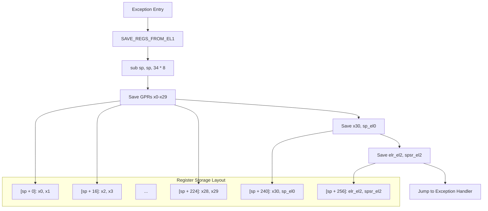
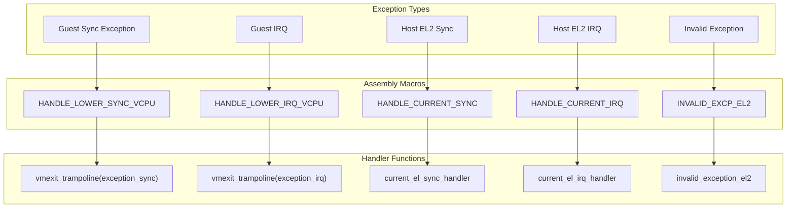
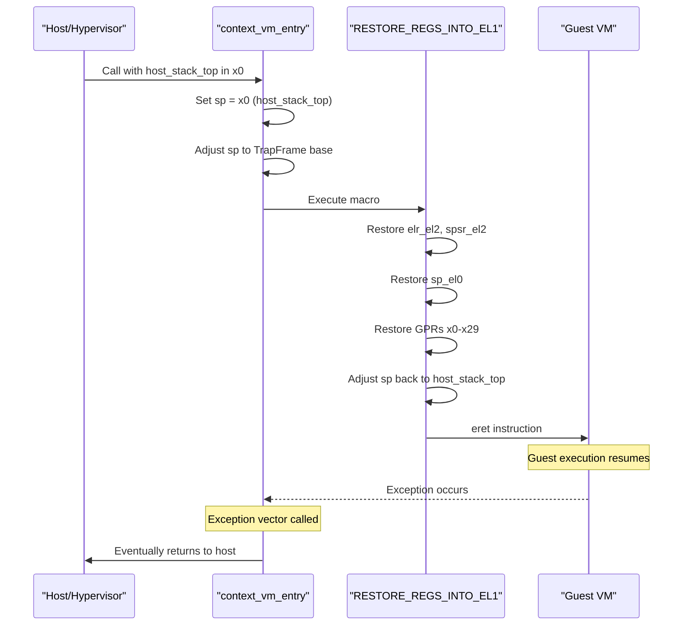

# Assembly Exception Vectors

> **Relevant source files**
> * [src/exception.S](https://github.com/arceos-hypervisor/arm_vcpu/blob/4dd7e5df/src/exception.S)

This document covers the low-level assembly exception vector table and context switching implementation that forms the foundation of the hypervisor's exception handling system. The assembly code provides the first-level exception entry points, register preservation, and routing to higher-level exception handlers.

For information about the high-level exception dispatch logic and handler implementations, see [High-Level Exception Handling](/arceos-hypervisor/arm_vcpu/4.3-high-level-exception-handling). For details about the register parsing and analysis utilities, see [Exception Analysis and Utilities](/arceos-hypervisor/arm_vcpu/4.2-exception-analysis-and-utilities).

## Exception Vector Table Structure

The exception vector table `exception_vector_base_vcpu` implements the AArch64 exception vector layout with 16 entries, each aligned to 128-byte boundaries. The table handles exceptions from different execution states and privilege levels.

```mermaid
flowchart TD
subgraph exception_vector_base_vcpu["exception_vector_base_vcpu"]
    subgraph subGraph3["Lower EL AArch32 (0x600-0x7FF)"]
        LE32_SYNC["0x600: INVALID_EXCP_EL2 0 3"]
        LE32_IRQ["0x680: INVALID_EXCP_EL2 1 3"]
        LE32_FIQ["0x700: INVALID_EXCP_EL2 2 3"]
        LE32_ERR["0x780: INVALID_EXCP_EL2 3 3"]
    end
    subgraph subGraph2["Lower EL AArch64 (0x400-0x5FF)"]
        LE64_SYNC["0x400: HANDLE_LOWER_SYNC_VCPU"]
        LE64_IRQ["0x480: HANDLE_LOWER_IRQ_VCPU"]
        LE64_FIQ["0x500: INVALID_EXCP_EL2 2 2"]
        LE64_ERR["0x580: INVALID_EXCP_EL2 3 2"]
    end
    subgraph subGraph1["Current EL with SP_ELx (0x200-0x3FF)"]
        CEX_SYNC["0x200: HANDLE_CURRENT_SYNC"]
        CEX_IRQ["0x280: HANDLE_CURRENT_IRQ"]
        CEX_FIQ["0x300: INVALID_EXCP_EL2 2 1"]
        CEX_ERR["0x380: INVALID_EXCP_EL2 3 1"]
    end
    subgraph subGraph0["Current EL with SP_EL0 (0x000-0x1FF)"]
        CE0_SYNC["0x000: INVALID_EXCP_EL2 0 0"]
        CE0_IRQ["0x080: INVALID_EXCP_EL2 1 0"]
        CE0_FIQ["0x100: INVALID_EXCP_EL2 2 0"]
        CE0_ERR["0x180: INVALID_EXCP_EL2 3 0"]
    end
end
CURR_SYNC["current_el_sync_handler"]
CURR_IRQ["current_el_irq_handler"]
VMEXIT["vmexit_trampoline(exception_sync)"]
VMEXIT_IRQ["vmexit_trampoline(exception_irq)"]
INVALID["invalid_exception_el2"]

CE0_SYNC --> INVALID
CEX_IRQ --> CURR_IRQ
CEX_SYNC --> CURR_SYNC
LE32_SYNC --> INVALID
LE64_IRQ --> VMEXIT_IRQ
LE64_SYNC --> VMEXIT
```

**Sources:** [src/exception.S(L105 - L131)&emsp;](https://github.com/arceos-hypervisor/arm_vcpu/blob/4dd7e5df/src/exception.S#L105-L131)

The table supports four types of exceptions for each execution state:

* **Synchronous exceptions** (offset 0x000): System calls, data aborts, instruction aborts
* **IRQ interrupts** (offset 0x080): Asynchronous hardware interrupts
* **FIQ interrupts** (offset 0x100): Fast interrupt requests
* **System Error/SError** (offset 0x180): Asynchronous system errors

## Register Context Management

The assembly code implements comprehensive register preservation using two primary macros that save and restore the complete processor state during exception handling.

### Register Save Operation

**Sources:** [src/exception.S(L1 - L30)&emsp;](https://github.com/arceos-hypervisor/arm_vcpu/blob/4dd7e5df/src/exception.S#L1-L30)

### Register Restore Operation

The `RESTORE_REGS_INTO_EL1` macro reverses the save operation, restoring all registers and returning to the guest execution context:

|Restore Order|Registers|Assembly Instructions|
| --- | --- | --- |
|1. Exception State|elr_el2,spsr_el2|msr elr_el2, x10; msr spsr_el2, x11|
|2. Stack Pointer|sp_el0|msr sp_el0, x9|
|3. General Purpose|x0-x29|ldpinstructions in reverse order|
|4. Return|Stack adjustment|add sp, sp, 34 * 8|

**Sources:** [src/exception.S(L32 - L58)&emsp;](https://github.com/arceos-hypervisor/arm_vcpu/blob/4dd7e5df/src/exception.S#L32-L58)

## Exception Routing and Handler Dispatch

The exception vectors route different exception types to specialized handlers based on the source execution level and exception characteristics.

**Sources:** [src/exception.S(L71 - L101)&emsp;](https://github.com/arceos-hypervisor/arm_vcpu/blob/4dd7e5df/src/exception.S#L71-L101)

### Handler Macro Implementations

Each handler macro follows a consistent pattern:

1. **Alignment**: `.p2align 7` ensures 128-byte vector alignment
2. **Context Save**: `SAVE_REGS_FROM_EL1` preserves processor state
3. **Parameter Setup**: Load appropriate parameters into registers
4. **Handler Call**: Branch to the corresponding C handler function
5. **Return**: Jump to common return path or let handler manage return

The `HANDLE_LOWER_SYNC_VCPU` and `HANDLE_LOWER_IRQ_VCPU` macros use parameterized calls to `vmexit_trampoline` with exception type constants `{exception_sync}` and `{exception_irq}`.

**Sources:** [src/exception.S(L87 - L101)&emsp;](https://github.com/arceos-hypervisor/arm_vcpu/blob/4dd7e5df/src/exception.S#L87-L101)

## VM Entry and Exit Points

The `context_vm_entry` function provides the entry point for transitioning from host context back to guest execution, implementing the counterpart to exception-based VM exits.

**Sources:** [src/exception.S(L132 - L141)&emsp;](https://github.com/arceos-hypervisor/arm_vcpu/blob/4dd7e5df/src/exception.S#L132-L141)

The VM entry process:

1. **Stack Setup**: Sets stack pointer to `host_stack_top` address passed in `x0`
2. **Frame Positioning**: Adjusts stack pointer to point to guest `TrapFrame` base
3. **Register Restoration**: Uses `RESTORE_REGS_INTO_EL1` to restore guest state
4. **Guest Entry**: Executes `eret` to return to guest execution at EL1

The `.Lexception_return_el2` label provides a common return path used by all exception handlers, ensuring consistent state restoration regardless of the exception type or handler complexity.

**Sources:** [src/exception.S(L138 - L141)&emsp;](https://github.com/arceos-hypervisor/arm_vcpu/blob/4dd7e5df/src/exception.S#L138-L141)