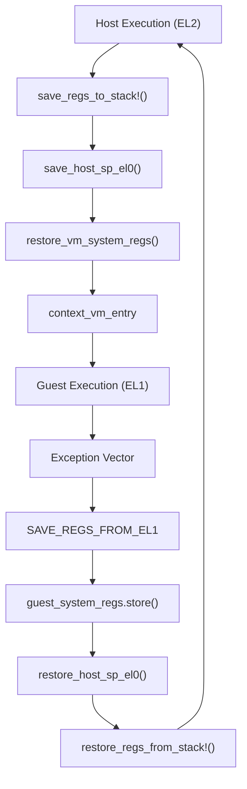
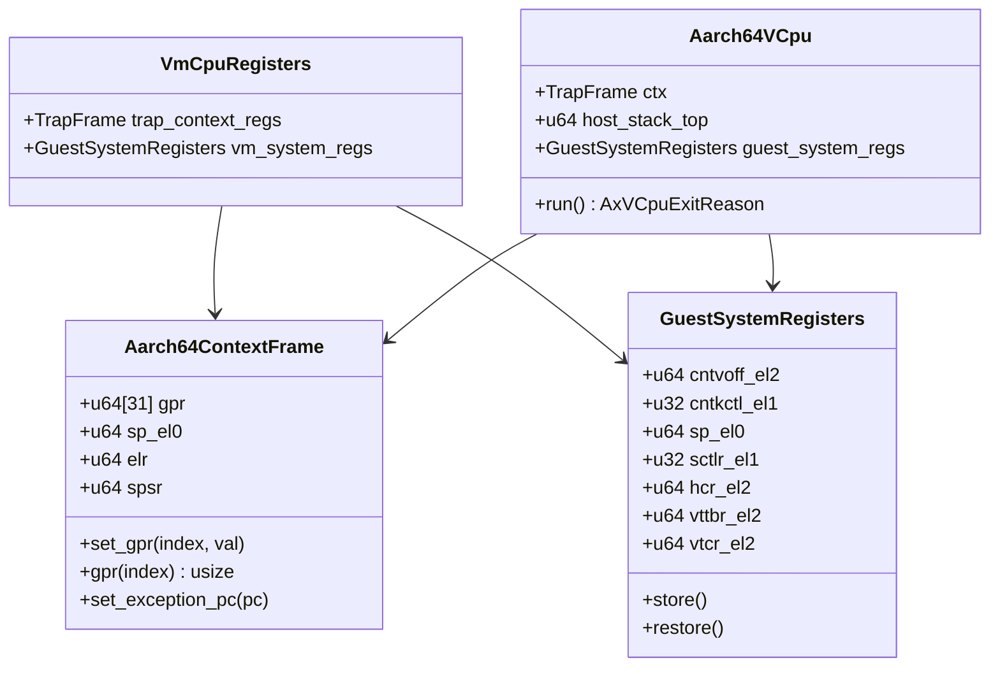
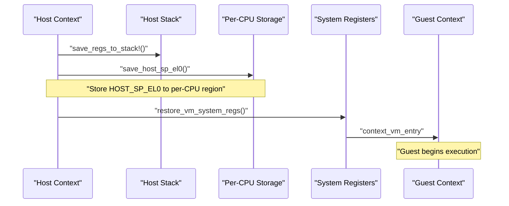
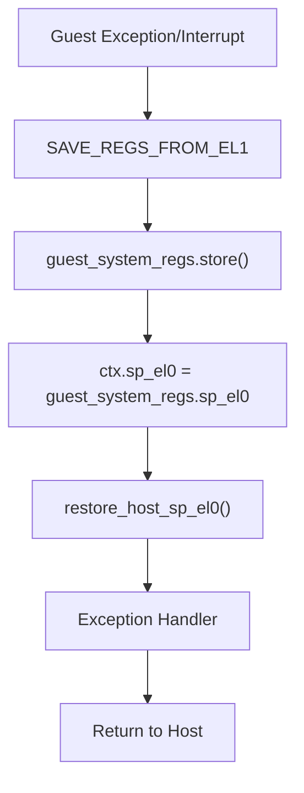
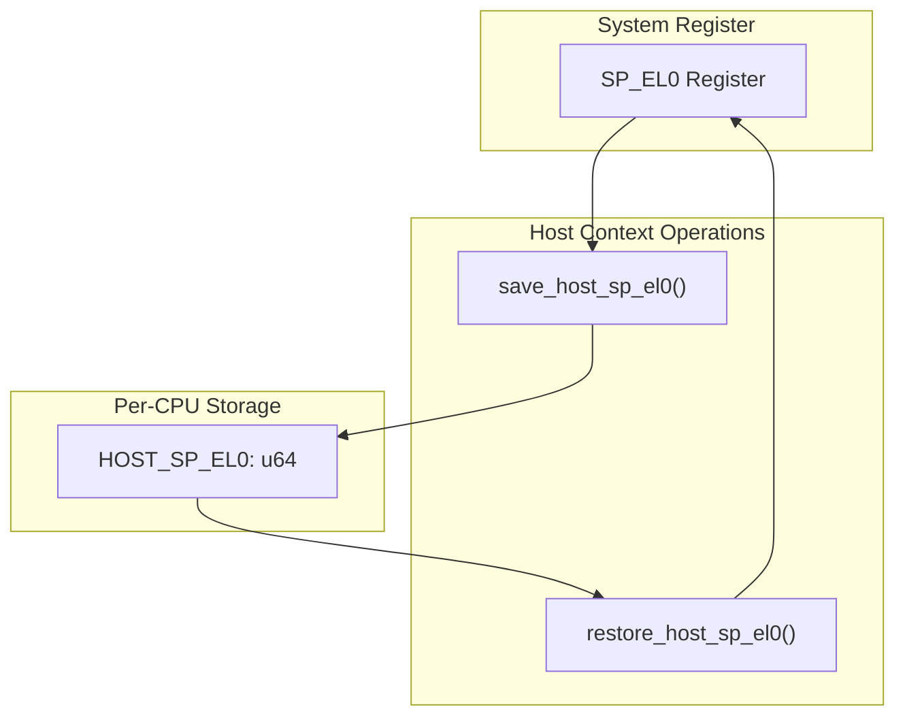
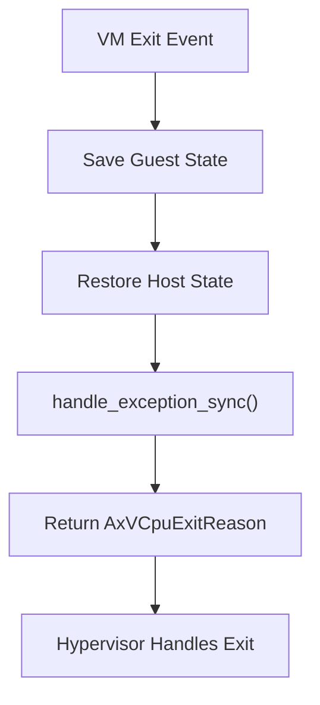

# Context Switching and State Management

> **Relevant source files**
> * [src/context_frame.rs](https://github.com/arceos-hypervisor/arm_vcpu/blob/4dd7e5df/src/context_frame.rs)
> * [src/vcpu.rs](https://github.com/arceos-hypervisor/arm_vcpu/blob/4dd7e5df/src/vcpu.rs)

This document covers the data structures and mechanisms used for saving and restoring CPU state during context switches between the hypervisor (host) and guest virtual machines. The context switching system is responsible for preserving and restoring both general-purpose registers and system control registers to enable seamless transitions between execution contexts.

For information about the detailed register layouts and data structure implementations, see [TrapFrame and System Registers](/arceos-hypervisor/arm_vcpu/3.1-trapframe-and-system-registers). For the broader exception handling pipeline that triggers context switches, see [Exception Handling System](/arceos-hypervisor/arm_vcpu/4-exception-handling-system).

## Context Switching Overview

The hypervisor implements a two-level context switching mechanism that manages transitions between host (EL2) and guest (EL1) execution contexts. Context switches occur during VM entry when launching guest execution and during VM exits when handling exceptions or interrupts from the guest.

### Context Switch Data Flow

Sources: [src/vcpu.rs(L182 - L283)&emsp;](https://github.com/arceos-hypervisor/arm_vcpu/blob/4dd7e5df/src/vcpu.rs#L182-L283) [src/context_frame.rs(L199 - L300)&emsp;](https://github.com/arceos-hypervisor/arm_vcpu/blob/4dd7e5df/src/context_frame.rs#L199-L300)

## State Management Data Structures

The system uses two primary data structures to manage CPU state during context switches:

### Core Context Structures

Sources: [src/vcpu.rs(L28 - L51)&emsp;](https://github.com/arceos-hypervisor/arm_vcpu/blob/4dd7e5df/src/vcpu.rs#L28-L51) [src/context_frame.rs(L17 - L28)&emsp;](https://github.com/arceos-hypervisor/arm_vcpu/blob/4dd7e5df/src/context_frame.rs#L17-L28) [src/context_frame.rs(L145 - L197)&emsp;](https://github.com/arceos-hypervisor/arm_vcpu/blob/4dd7e5df/src/context_frame.rs#L145-L197)

|Structure|Purpose|Key Fields|
| --- | --- | --- |
|Aarch64ContextFrame|General-purpose register context|gpr[31],sp_el0,elr,spsr|
|GuestSystemRegisters|System control registers|Timer, MMU, hypervisor control registers|
|VmCpuRegisters|Combined guest state|Combines both context types|

## Context Switch Mechanisms

### Host-to-Guest Transition

The transition from host to guest execution follows a carefully orchestrated sequence implemented in the `run_guest()` function:

Sources: [src/vcpu.rs(L182 - L214)&emsp;](https://github.com/arceos-hypervisor/arm_vcpu/blob/4dd7e5df/src/vcpu.rs#L182-L214) [src/vcpu.rs(L15 - L26)&emsp;](https://github.com/arceos-hypervisor/arm_vcpu/blob/4dd7e5df/src/vcpu.rs#L15-L26) [src/vcpu.rs(L225 - L244)&emsp;](https://github.com/arceos-hypervisor/arm_vcpu/blob/4dd7e5df/src/vcpu.rs#L225-L244)

The `run_guest()` function is implemented as a naked function to ensure precise control over the stack and register state:

* **Host Register Preservation**: Uses `save_regs_to_stack!()` macro to save callee-saved registers (x19-x30)
* **Stack Pointer Management**: Stores current stack pointer in `host_stack_top` field of the VCPU structure
* **SP_EL0 Handling**: Saves host's `SP_EL0` to per-CPU storage using `save_host_sp_el0()`
* **System Register Restoration**: Calls `restore_vm_system_regs()` to load guest system state

### Guest-to-Host Transition

Guest-to-host transitions occur during VM exits and are handled by the exception vector table and the `vmexit_handler()`:

Sources: [src/vcpu.rs(L255 - L282)&emsp;](https://github.com/arceos-hypervisor/arm_vcpu/blob/4dd7e5df/src/vcpu.rs#L255-L282) [src/context_frame.rs(L213 - L253)&emsp;](https://github.com/arceos-hypervisor/arm_vcpu/blob/4dd7e5df/src/context_frame.rs#L213-L253)

The guest-to-host transition process:

1. **Exception Context Capture**: Assembly code saves guest GPRs to `TrapFrame`
2. **System Register Storage**: `guest_system_regs.store()` captures current system register state
3. **SP_EL0 Coordination**: Guest's `SP_EL0` is transferred from system registers to the context frame
4. **Host SP_EL0 Restoration**: `restore_host_sp_el0()` restores host's stack pointer
5. **Exception Processing**: Control passes to exception handlers

## State Preservation Mechanisms

### Per-CPU State Management

The system uses per-CPU storage to maintain host state across context switches:

Sources: [src/vcpu.rs(L15 - L26)&emsp;](https://github.com/arceos-hypervisor/arm_vcpu/blob/4dd7e5df/src/vcpu.rs#L15-L26)

### System Register State Management

The `GuestSystemRegisters` structure provides comprehensive system register preservation through assembly-based `store()` and `restore()` methods:

|Register Category|Key Registers|Purpose|
| --- | --- | --- |
|Timer Registers|CNTVOFF_EL2,CNTKCTL_EL1,CNTV_CTL_EL0|Virtual timer state|
|Memory Management|TTBR0_EL1,TTBR1_EL1,TCR_EL1,MAIR_EL1|Address translation setup|
|Hypervisor Control|HCR_EL2,VTTBR_EL2,VTCR_EL2|Virtualization configuration|
|Exception State|VBAR_EL1,ESR_EL1,FAR_EL1|Exception handling state|

Sources: [src/context_frame.rs(L149 - L197)&emsp;](https://github.com/arceos-hypervisor/arm_vcpu/blob/4dd7e5df/src/context_frame.rs#L149-L197) [src/context_frame.rs(L213 - L253)&emsp;](https://github.com/arceos-hypervisor/arm_vcpu/blob/4dd7e5df/src/context_frame.rs#L213-L253) [src/context_frame.rs(L263 - L299)&emsp;](https://github.com/arceos-hypervisor/arm_vcpu/blob/4dd7e5df/src/context_frame.rs#L263-L299)

## Integration with Exception Handling

Context switching is tightly integrated with the exception handling system. The context switch mechanisms are triggered by:

* **VM Entry**: Initiated by calls to `Aarch64VCpu::run()`
* **VM Exit**: Triggered by exceptions caught by the vector table in `exception.S`
* **Exception Return**: Managed by assembly routines that restore guest context

The `vmexit_handler()` function coordinates the transition from low-level exception handling back to the hypervisor control flow:

Sources: [src/vcpu.rs(L255 - L282)&emsp;](https://github.com/arceos-hypervisor/arm_vcpu/blob/4dd7e5df/src/vcpu.rs#L255-L282)

The context switching system ensures that state transitions are atomic and that both host and guest contexts are properly preserved across the hypervisor's execution boundaries.