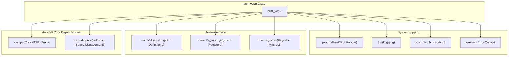
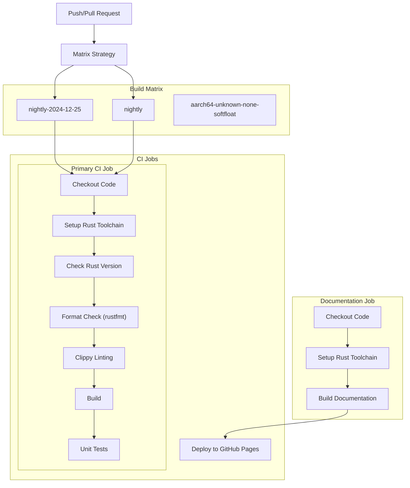

# Dependencies and Build System

> **Relevant source files**
> * [.github/workflows/ci.yml](https://github.com/arceos-hypervisor/arm_vcpu/blob/4dd7e5df/.github/workflows/ci.yml)
> * [.gitignore](https://github.com/arceos-hypervisor/arm_vcpu/blob/4dd7e5df/.gitignore)
> * [Cargo.toml](https://github.com/arceos-hypervisor/arm_vcpu/blob/4dd7e5df/Cargo.toml)

This document covers the external dependencies, build configuration, and continuous integration setup for the `arm_vcpu` crate. It details the Rust crate dependencies required for AArch64 virtualization, the build system configuration, and the automated testing pipeline.

For information about how these dependencies are used within the VCPU implementation, see [Virtual CPU Management](/arceos-hypervisor/arm_vcpu/2-virtual-cpu-management). For details about the hardware abstraction interfaces, see [Hardware Abstraction and Platform Support](/arceos-hypervisor/arm_vcpu/5.2-hardware-abstraction-and-platform-support).

## Purpose and Scope

The `arm_vcpu` crate is a no-std Rust library that implements AArch64 virtualization capabilities for hypervisors. This page documents the dependency management, build requirements, and continuous integration infrastructure that support the development and deployment of this hypervisor component.

## External Dependencies

The crate relies on several categories of dependencies to provide AArch64 virtualization functionality:

### Core Rust Dependencies

|Dependency|Version|Purpose|
| --- | --- | --- |
|log|0.4.21|Logging infrastructure for debug and runtime information|
|spin|0.9|Spinlock primitives for no-std synchronization|

**Sources:** [Cargo.toml(L7 - L8)&emsp;](https://github.com/arceos-hypervisor/arm_vcpu/blob/4dd7e5df/Cargo.toml#L7-L8)

### AArch64 Hardware Interface Dependencies

|Dependency|Version|Purpose|
| --- | --- | --- |
|aarch64-cpu|9.3|AArch64 CPU register definitions and operations|
|tock-registers|0.8|Register field manipulation macros and utilities|
|aarch64_sysreg|0.1.1|AArch64 system register definitions and access|
|numeric-enum-macro|0.2|Macro support for numeric enum conversions|

**Sources:** [Cargo.toml(L10 - L16)&emsp;](https://github.com/arceos-hypervisor/arm_vcpu/blob/4dd7e5df/Cargo.toml#L10-L16)

### System Infrastructure Dependencies

|Dependency|Version|Purpose|
| --- | --- | --- |
|axerrno|0.1.0|Error code definitions for the ArceOS ecosystem|
|percpu|0.2.0|Per-CPU data storage with ARM EL2 feature support|

The `percpu` crate is configured with the `arm-el2` feature to enable Exception Level 2 support required for hypervisor operation.

**Sources:** [Cargo.toml(L14 - L15)&emsp;](https://github.com/arceos-hypervisor/arm_vcpu/blob/4dd7e5df/Cargo.toml#L14-L15)

## ArceOS Ecosystem Dependencies

The crate integrates with the broader ArceOS hypervisor ecosystem through Git-based dependencies:

### Dependency Architecture



### Git Dependencies

|Repository|Purpose|
| --- | --- |
|axvcpu|Defines core VCPU traits (AxVCpu,AxVCpuHal) implemented byAarch64VCpu|
|axaddrspace|Provides address space management interfaces for guest memory virtualization|

Both dependencies are sourced from the `arceos-hypervisor` GitHub organization, indicating a modular hypervisor architecture where `arm_vcpu` provides the AArch64-specific implementation.

**Sources:** [Cargo.toml(L18 - L19)&emsp;](https://github.com/arceos-hypervisor/arm_vcpu/blob/4dd7e5df/Cargo.toml#L18-L19)

## Build Configuration

### Package Metadata

The crate is configured as a library with the following specifications:

```
[package]
name = "arm_vcpu"
version = "0.1.0"
edition = "2024"
```

The use of Rust edition 2024 indicates adoption of the latest Rust language features and optimizations.

**Sources:** [Cargo.toml(L1 - L4)&emsp;](https://github.com/arceos-hypervisor/arm_vcpu/blob/4dd7e5df/Cargo.toml#L1-L4)

### Target Architecture

The primary build target is `aarch64-unknown-none-softfloat`, which specifies:

* **aarch64**: 64-bit ARM architecture
* **unknown**: No specific vendor
* **none**: Bare metal (no operating system)
* **softfloat**: Software floating-point implementation

This target configuration is appropriate for hypervisor code running at Exception Level 2 (EL2) without OS dependencies.

**Sources:** [.github/workflows/ci.yml(L12)&emsp;](https://github.com/arceos-hypervisor/arm_vcpu/blob/4dd7e5df/.github/workflows/ci.yml#L12-L12)

## Continuous Integration System

### CI Pipeline Architecture



### CI Job Configuration

The continuous integration system uses GitHub Actions with two primary jobs:

#### Primary CI Job

* **Rust Toolchains**: Tests against both `nightly-2024-12-25` (pinned) and `nightly` (latest)
* **Components**: Includes `rust-src`, `clippy`, and `rustfmt`
* **Quality Checks**: Format verification, linting, and build verification
* **Testing**: Unit tests (currently limited to x86_64 targets)

#### Documentation Job

* **Environment**: Uses `RUSTDOCFLAGS` to enforce documentation standards
* **Deployment**: Automatically publishes documentation to GitHub Pages on main branch
* **Documentation Quality**: Requires all public APIs to be documented

**Sources:** [.github/workflows/ci.yml(L6 - L59)&emsp;](https://github.com/arceos-hypervisor/arm_vcpu/blob/4dd7e5df/.github/workflows/ci.yml#L6-L59)

### Build Quality Gates

The CI system enforces several quality standards:

|Check|Tool|Purpose|
| --- | --- | --- |
|Code Formatting|rustfmt|Enforces consistent code style|
|Linting|clippy|Catches common mistakes and suggests improvements|
|Documentation|rustdoc|Ensures all public APIs are documented|
|Build Verification|cargo build|Confirms code compiles for target architecture|

The configuration includes `continue-on-error` flags for the latest nightly toolchain to accommodate potential breaking changes in unstable Rust features.

**Sources:** [.github/workflows/ci.yml(L22 - L49)&emsp;](https://github.com/arceos-hypervisor/arm_vcpu/blob/4dd7e5df/.github/workflows/ci.yml#L22-L49)

## Development Environment

### Git Configuration

The repository excludes common build artifacts and development files:

* Build outputs: `target/`, `*.asm`, `*.img`, `*.bin`, `*.elf`
* Development artifacts: `qemu.log`, `actual.out`, `rusty-tags.vi`
* IDE settings: `.vscode/`
* System files: `.DS_Store`

Notably, `Cargo.lock` is ignored since `arm_vcpu` is distributed as a library crate.

**Sources:** [.gitignore(L1 - L18)&emsp;](https://github.com/arceos-hypervisor/arm_vcpu/blob/4dd7e5df/.gitignore#L1-L18)