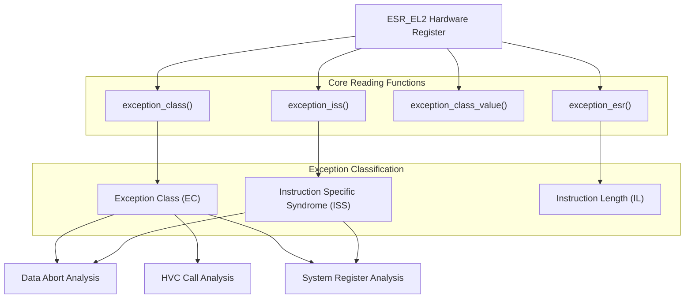
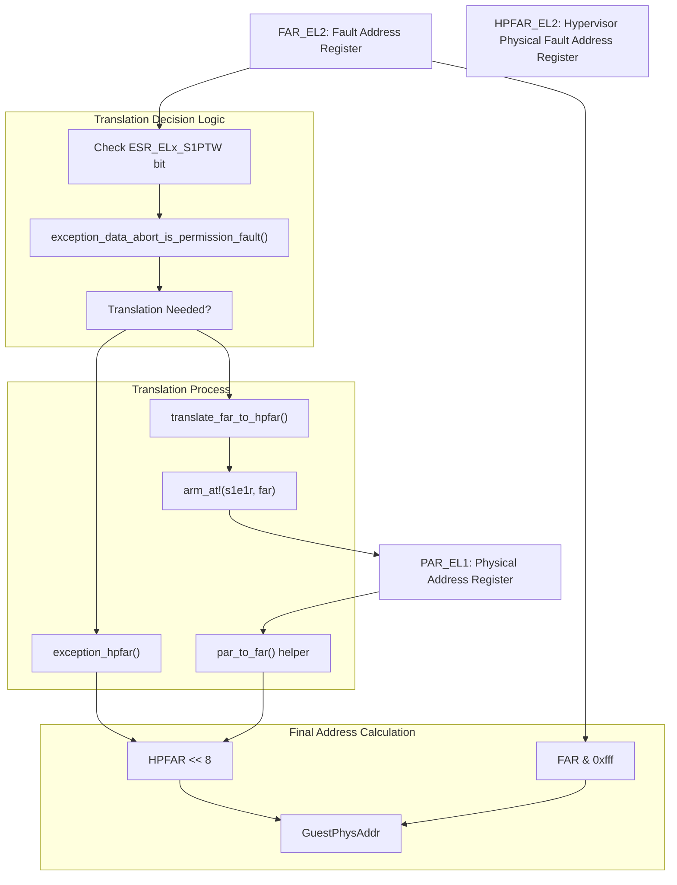
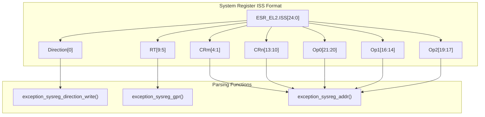
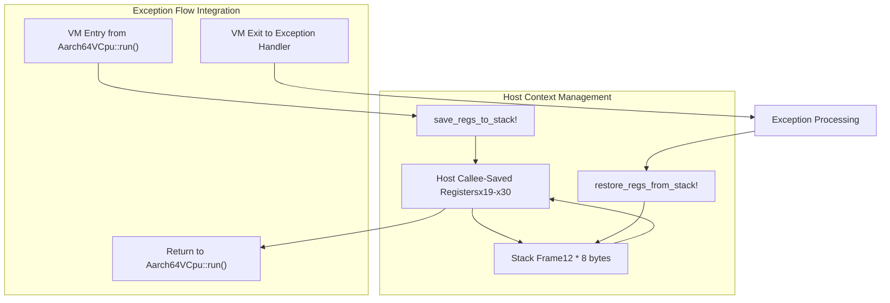
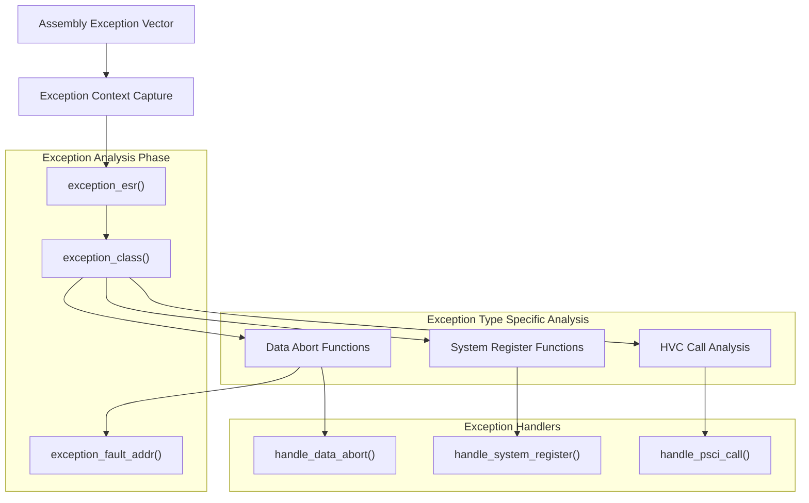

# Exception Analysis and Utilities

> **Relevant source files**
> * [src/exception_utils.rs](https://github.com/arceos-hypervisor/arm_vcpu/blob/4dd7e5df/src/exception_utils.rs)

This document covers the exception analysis and parsing utilities provided by the `exception_utils.rs` module. These utilities form a critical layer between the low-level assembly exception vectors and high-level exception handlers, providing functions to extract and interpret information from AArch64 exception syndrome registers, perform address translations, and manage register context during exception handling.

For information about the assembly exception vectors that capture exceptions, see [Assembly Exception Vectors](/arceos-hypervisor/arm_vcpu/4.1-assembly-exception-vectors). For details about high-level exception dispatch and handling logic, see [High-Level Exception Handling](/arceos-hypervisor/arm_vcpu/4.3-high-level-exception-handling).

## Exception Syndrome Register Analysis

The exception analysis system provides a comprehensive interface for reading and interpreting the Exception Syndrome Register (ESR_EL2), which contains detailed information about the cause and nature of exceptions that occur during guest execution.

### Exception Syndrome Register Reading Functions

The system provides several core functions for accessing different fields of the ESR_EL2 register:

* `exception_esr()` [src/exception_utils.rs(L12 - L14)&emsp;](https://github.com/arceos-hypervisor/arm_vcpu/blob/4dd7e5df/src/exception_utils.rs#L12-L14) returns the complete ESR_EL2 register value
* `exception_class()` [src/exception_utils.rs(L21 - L23)&emsp;](https://github.com/arceos-hypervisor/arm_vcpu/blob/4dd7e5df/src/exception_utils.rs#L21-L23) extracts the Exception Class field as an enum value
* `exception_class_value()` [src/exception_utils.rs(L30 - L32)&emsp;](https://github.com/arceos-hypervisor/arm_vcpu/blob/4dd7e5df/src/exception_utils.rs#L30-L32) extracts the Exception Class as a raw numeric value
* `exception_iss()` [src/exception_utils.rs(L170 - L172)&emsp;](https://github.com/arceos-hypervisor/arm_vcpu/blob/4dd7e5df/src/exception_utils.rs#L170-L172) extracts the Instruction Specific Syndrome field

Sources: [src/exception_utils.rs(L7 - L32)&emsp;](https://github.com/arceos-hypervisor/arm_vcpu/blob/4dd7e5df/src/exception_utils.rs#L7-L32) [src/exception_utils.rs(L165 - L172)&emsp;](https://github.com/arceos-hypervisor/arm_vcpu/blob/4dd7e5df/src/exception_utils.rs#L165-L172)

### Instruction Analysis

The system provides utilities for analyzing instruction-related information from exceptions:

|Function|Purpose|Return Value|
| --- | --- | --- |
|exception_instruction_length()|Determines if instruction is 16-bit or 32-bit|0 for 16-bit, 1 for 32-bit|
|exception_next_instruction_step()|Calculates step size for instruction pointer advancement|2 for 16-bit, 4 for 32-bit|

Sources: [src/exception_utils.rs(L144 - L163)&emsp;](https://github.com/arceos-hypervisor/arm_vcpu/blob/4dd7e5df/src/exception_utils.rs#L144-L163)

## Fault Address Translation System

The fault address translation system handles the complex process of converting virtual fault addresses to physical addresses using the ARM Address Translation (AT) instructions and register coordination.

### Address Translation Flow

The `exception_fault_addr()` function [src/exception_utils.rs(L133 - L142)&emsp;](https://github.com/arceos-hypervisor/arm_vcpu/blob/4dd7e5df/src/exception_utils.rs#L133-L142) implements a sophisticated address translation algorithm that:

1. Reads the FAR_EL2 register to get the virtual fault address
2. Determines whether address translation is needed based on the S1PTW bit and fault type
3. Either performs address translation using `translate_far_to_hpfar()` or directly reads HPFAR_EL2
4. Combines the page offset from FAR_EL2 with the page number from HPFAR_EL2

The `translate_far_to_hpfar()` function [src/exception_utils.rs(L92 - L113)&emsp;](https://github.com/arceos-hypervisor/arm_vcpu/blob/4dd7e5df/src/exception_utils.rs#L92-L113) uses the ARM Address Translation instruction to convert a virtual address to physical, handling the PAR_EL1 register state and error conditions.

Sources: [src/exception_utils.rs(L34 - L142)&emsp;](https://github.com/arceos-hypervisor/arm_vcpu/blob/4dd7e5df/src/exception_utils.rs#L34-L142)

## Data Abort Exception Analysis

The system provides comprehensive analysis capabilities for data abort exceptions, which are among the most common exceptions in virtualization scenarios involving MMIO operations.

### Data Abort Analysis Functions

```mermaid
flowchart TD
subgraph subGraph1["Access Pattern Analysis"]
    exception_data_abort_access_is_write["exception_data_abort_access_is_write()"]
    exception_data_abort_access_width["exception_data_abort_access_width()"]
    exception_data_abort_access_reg["exception_data_abort_access_reg()"]
    exception_data_abort_access_reg_width["exception_data_abort_access_reg_width()"]
    exception_data_abort_access_is_sign_ext["exception_data_abort_access_is_sign_ext()"]
end
subgraph subGraph0["Data Abort Classification"]
    exception_data_abort_is_permission_fault["exception_data_abort_is_permission_fault()"]
    exception_data_abort_is_translate_fault["exception_data_abort_is_translate_fault()"]
    exception_data_abort_handleable["exception_data_abort_handleable()"]
end
ESR_ISS["ESR_EL2.ISS Field"]

ESR_ISS --> exception_data_abort_access_is_sign_ext
ESR_ISS --> exception_data_abort_access_is_write
ESR_ISS --> exception_data_abort_access_reg
ESR_ISS --> exception_data_abort_access_reg_width
ESR_ISS --> exception_data_abort_access_width
ESR_ISS --> exception_data_abort_handleable
ESR_ISS --> exception_data_abort_is_permission_fault
ESR_ISS --> exception_data_abort_is_translate_fault
```

The data abort analysis functions extract specific information from the ISS field of ESR_EL2:

|Function|Bit Fields|Purpose|
| --- | --- | --- |
|exception_data_abort_is_permission_fault()|ISS[5:0] & 0xF0 == 12|Identifies permission faults vs translation faults|
|exception_data_abort_is_translate_fault()|ISS[5:0] & 0xF0 == 4|Identifies translation faults|
|exception_data_abort_access_is_write()|ISS[6]|Determines read vs write access|
|exception_data_abort_access_width()|ISS[23:22]|Access width (1, 2, 4, or 8 bytes)|
|exception_data_abort_access_reg()|ISS[20:16]|Register index (0-31)|
|exception_data_abort_handleable()|ISS[24] \| !ISS[10]|Determines if abort can be handled|

Sources: [src/exception_utils.rs(L197 - L255)&emsp;](https://github.com/arceos-hypervisor/arm_vcpu/blob/4dd7e5df/src/exception_utils.rs#L197-L255)

## System Register Access Analysis

The system provides specialized parsing for system register access exceptions, which occur when guests attempt to access system registers that require hypervisor intervention.

### System Register Parsing Functions

The system register analysis functions provide:

* `exception_sysreg_direction_write()` [src/exception_utils.rs(L175 - L178)&emsp;](https://github.com/arceos-hypervisor/arm_vcpu/blob/4dd7e5df/src/exception_utils.rs#L175-L178) determines if the access is a write (true) or read (false)
* `exception_sysreg_gpr()` [src/exception_utils.rs(L181 - L186)&emsp;](https://github.com/arceos-hypervisor/arm_vcpu/blob/4dd7e5df/src/exception_utils.rs#L181-L186) extracts the general-purpose register index (RT field)
* `exception_sysreg_addr()` [src/exception_utils.rs(L192 - L195)&emsp;](https://github.com/arceos-hypervisor/arm_vcpu/blob/4dd7e5df/src/exception_utils.rs#L192-L195) constructs the system register address from encoding fields

The `exception_sysreg_addr()` function implements the ARMv8 system register encoding format, combining Op0, Op1, Op2, CRn, and CRm fields into a unique register identifier.

Sources: [src/exception_utils.rs(L174 - L195)&emsp;](https://github.com/arceos-hypervisor/arm_vcpu/blob/4dd7e5df/src/exception_utils.rs#L174-L195)

## Register Context Management Macros

The system provides assembly macros for managing host register context during exception handling, ensuring proper preservation and restoration of callee-saved registers.

### Context Switching Macros

The register context management system consists of two complementary macros:

**`save_regs_to_stack!`** [src/exception_utils.rs(L278 - L289)&emsp;](https://github.com/arceos-hypervisor/arm_vcpu/blob/4dd7e5df/src/exception_utils.rs#L278-L289):

* Allocates 96 bytes (12 * 8) on the stack
* Saves registers x19-x30 using `stp` (store pair) instructions
* Used during VM entry to preserve host state

**`restore_regs_from_stack!`** [src/exception_utils.rs(L300 - L311)&emsp;](https://github.com/arceos-hypervisor/arm_vcpu/blob/4dd7e5df/src/exception_utils.rs#L300-L311):

* Restores registers x19-x30 using `ldp` (load pair) instructions
* Deallocates the 96-byte stack frame
* Used during VM exit to restore host state

These macros ensure that the host's callee-saved registers are properly preserved across guest execution, maintaining the calling convention for the `Aarch64VCpu::run()` function.

Sources: [src/exception_utils.rs(L267 - L311)&emsp;](https://github.com/arceos-hypervisor/arm_vcpu/blob/4dd7e5df/src/exception_utils.rs#L267-L311)

## Integration with Exception Handling Pipeline

The exception utilities integrate seamlessly with the broader exception handling system, providing the analytical foundation for exception dispatch and handling decisions.

### Utility Function Usage Pattern

The utilities serve as the foundational layer that enables higher-level exception handlers to make informed decisions about how to process different types of exceptions, providing both classification and detailed analysis capabilities.

Sources: [src/exception_utils.rs(L1 - L311)&emsp;](https://github.com/arceos-hypervisor/arm_vcpu/blob/4dd7e5df/src/exception_utils.rs#L1-L311)