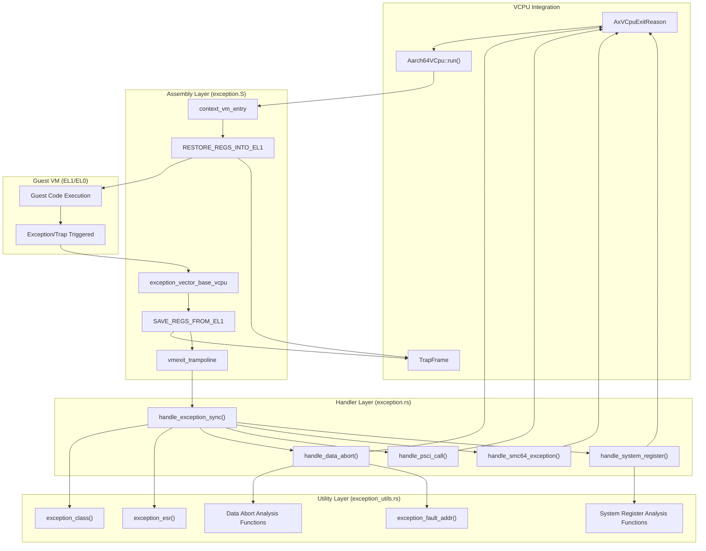
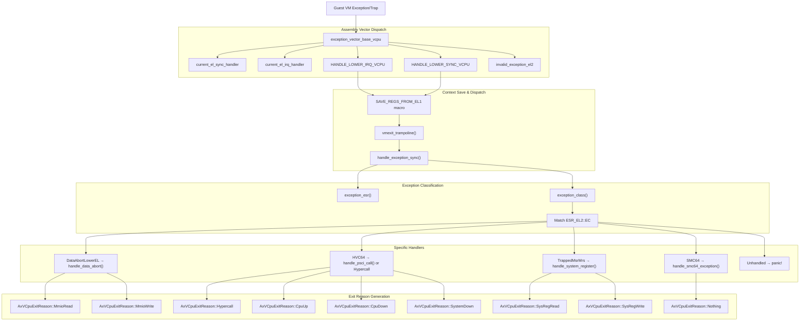
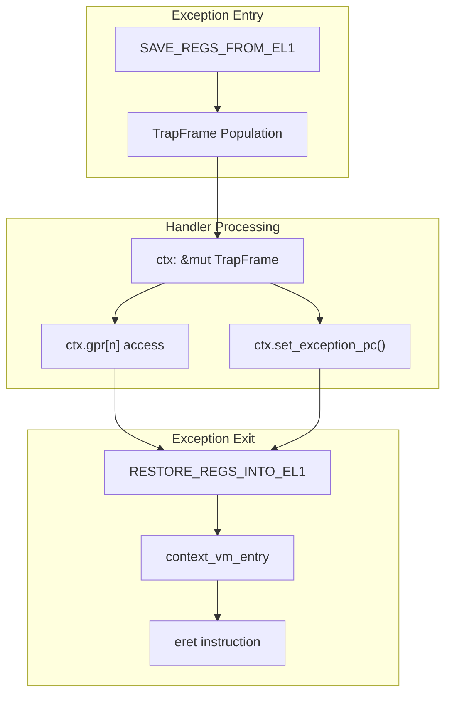

# Exception Handling System

> **Relevant source files**
> * [src/exception.S](https://github.com/arceos-hypervisor/arm_vcpu/blob/4dd7e5df/src/exception.S)
> * [src/exception.rs](https://github.com/arceos-hypervisor/arm_vcpu/blob/4dd7e5df/src/exception.rs)
> * [src/exception_utils.rs](https://github.com/arceos-hypervisor/arm_vcpu/blob/4dd7e5df/src/exception_utils.rs)

This document covers the multi-layered exception handling architecture that manages VM exits, traps, and interrupts when a guest VM encounters exceptional conditions. The system provides a complete pipeline from low-level assembly exception vectors through register analysis utilities to high-level exception dispatch and handling.

For information about the VCPU lifecycle and context switching mechanisms, see [Virtual CPU Management](/arceos-hypervisor/arm_vcpu/2-virtual-cpu-management). For details about the assembly exception vectors specifically, see [Assembly Exception Vectors](/arceos-hypervisor/arm_vcpu/4.1-assembly-exception-vectors).

## Architecture Overview

The exception handling system operates across three distinct layers, each responsible for different aspects of exception processing:

**Exception Handling System Architecture**

Sources: [src/exception.S(L106 - L141)&emsp;](https://github.com/arceos-hypervisor/arm_vcpu/blob/4dd7e5df/src/exception.S#L106-L141) [src/exception.rs(L72 - L126)&emsp;](https://github.com/arceos-hypervisor/arm_vcpu/blob/4dd7e5df/src/exception.rs#L72-L126) [src/exception_utils.rs(L1 - L312)&emsp;](https://github.com/arceos-hypervisor/arm_vcpu/blob/4dd7e5df/src/exception_utils.rs#L1-L312)

## Exception Processing Pipeline

The system processes exceptions through a structured pipeline that preserves guest state while analyzing and dispatching exceptions to appropriate handlers:

**Exception Processing Flow**

Sources: [src/exception.S(L108 - L141)&emsp;](https://github.com/arceos-hypervisor/arm_vcpu/blob/4dd7e5df/src/exception.S#L108-L141) [src/exception.rs(L72 - L126)&emsp;](https://github.com/arceos-hypervisor/arm_vcpu/blob/4dd7e5df/src/exception.rs#L72-L126) [src/exception.rs(L276 - L290)&emsp;](https://github.com/arceos-hypervisor/arm_vcpu/blob/4dd7e5df/src/exception.rs#L276-L290)

## Exception Types and Dispatch Logic

The `handle_exception_sync` function serves as the primary dispatcher, using the Exception Class (EC) field from `ESR_EL2` to route exceptions to specialized handlers:

|Exception Class|ESR_EL2::EC Value|Handler Function|Exit Reason Generated|
| --- | --- | --- | --- |
|Data Abort Lower EL|DataAbortLowerEL|handle_data_abort()|MmioRead,MmioWrite|
|Hypervisor Call|HVC64|handle_psci_call()or Hypercall|CpuUp,CpuDown,SystemDown,Hypercall|
|System Register Access|TrappedMsrMrs|handle_system_register()|SysRegRead,SysRegWrite|
|Secure Monitor Call|SMC64|handle_smc64_exception()|Nothing(forwarded to ATF)|

Sources: [src/exception.rs(L72 - L126)&emsp;](https://github.com/arceos-hypervisor/arm_vcpu/blob/4dd7e5df/src/exception.rs#L72-L126)

### Data Abort Handling

Data aborts occur when the guest VM accesses memory that triggers a fault. The `handle_data_abort` function processes these by:

1. **Fault Analysis**: Using `exception_fault_addr()` to determine the guest physical address
2. **Access Classification**: Determining read/write direction and access width using utility functions
3. **Register Identification**: Finding which guest register was involved in the access
4. **MMIO Translation**: Converting the fault into an appropriate `AxVCpuExitReason`

The function performs several safety checks using `exception_data_abort_handleable()` and `exception_data_abort_is_translate_fault()` before proceeding with MMIO emulation.

Sources: [src/exception.rs(L128 - L182)&emsp;](https://github.com/arceos-hypervisor/arm_vcpu/blob/4dd7e5df/src/exception.rs#L128-L182) [src/exception_utils.rs(L132 - L142)&emsp;](https://github.com/arceos-hypervisor/arm_vcpu/blob/4dd7e5df/src/exception_utils.rs#L132-L142) [src/exception_utils.rs(L202 - L254)&emsp;](https://github.com/arceos-hypervisor/arm_vcpu/blob/4dd7e5df/src/exception_utils.rs#L202-L254)

### System Register Access Handling

System register accesses are trapped when the guest VM attempts to read or write control registers. The `handle_system_register` function:

1. **ISS Parsing**: Extracts the Instruction Specific Syndrome from `ESR_EL2`
2. **Register Identification**: Uses `exception_sysreg_addr()` to identify the target register
3. **Direction Detection**: Determines read vs write using `exception_sysreg_direction_write()`
4. **GPR Mapping**: Identifies the guest register involved using `exception_sysreg_gpr()`

Sources: [src/exception.rs(L184 - L211)&emsp;](https://github.com/arceos-hypervisor/arm_vcpu/blob/4dd7e5df/src/exception.rs#L184-L211) [src/exception_utils.rs(L174 - L195)&emsp;](https://github.com/arceos-hypervisor/arm_vcpu/blob/4dd7e5df/src/exception_utils.rs#L174-L195)

### PSCI and Hypervisor Call Handling

The system supports both PSCI (Power State Coordination Interface) calls and general hypervisor calls through the HVC instruction. The `handle_psci_call` function recognizes PSCI function IDs in specific ranges:

* **32-bit PSCI**: Function IDs `0x8400_0000..=0x8400_001F`
* **64-bit PSCI**: Function IDs `0xC400_0000..=0xC400_001F`

Supported PSCI operations include:

* `PSCI_FN_CPU_OFF` → `AxVCpuExitReason::CpuDown`
* `PSCI_FN_CPU_ON` → `AxVCpuExitReason::CpuUp`
* `PSCI_FN_SYSTEM_OFF` → `AxVCpuExitReason::SystemDown`

Non-PSCI HVC calls are treated as general hypervisor calls with the call number in `x0` and arguments in `x1-x6`.

Sources: [src/exception.rs(L220 - L254)&emsp;](https://github.com/arceos-hypervisor/arm_vcpu/blob/4dd7e5df/src/exception.rs#L220-L254) [src/exception.rs(L80 - L102)&emsp;](https://github.com/arceos-hypervisor/arm_vcpu/blob/4dd7e5df/src/exception.rs#L80-L102)

### SMC Call Handling

Secure Monitor Calls (SMC) are either handled as PSCI calls or forwarded directly to the ARM Trusted Firmware (ATF). The `handle_smc64_exception` function first checks for PSCI compatibility, then uses the `smc_call` function to forward non-PSCI SMCs to the secure world.

Sources: [src/exception.rs(L256 - L271)&emsp;](https://github.com/arceos-hypervisor/arm_vcpu/blob/4dd7e5df/src/exception.rs#L256-L271) [src/exception.rs(L104 - L109)&emsp;](https://github.com/arceos-hypervisor/arm_vcpu/blob/4dd7e5df/src/exception.rs#L104-L109)

## Integration with Context Management

The exception handling system integrates tightly with the VCPU context management through several mechanisms:

**Context Integration Points**

The system maintains guest CPU state through the `TrapFrame` structure, allowing handlers to:

* Read guest register values for processing hypervisor calls and data aborts
* Update the program counter when advancing past trapped instructions
* Modify register contents for return values (e.g., MMIO read results)

Sources: [src/exception.S(L1 - L30)&emsp;](https://github.com/arceos-hypervisor/arm_vcpu/blob/4dd7e5df/src/exception.S#L1-L30) [src/exception.S(L32 - L58)&emsp;](https://github.com/arceos-hypervisor/arm_vcpu/blob/4dd7e5df/src/exception.S#L32-L58) [src/exception.rs(L75 - L77)&emsp;](https://github.com/arceos-hypervisor/arm_vcpu/blob/4dd7e5df/src/exception.rs#L75-L77) [src/exception.rs(L105 - L107)&emsp;](https://github.com/arceos-hypervisor/arm_vcpu/blob/4dd7e5df/src/exception.rs#L105-L107)