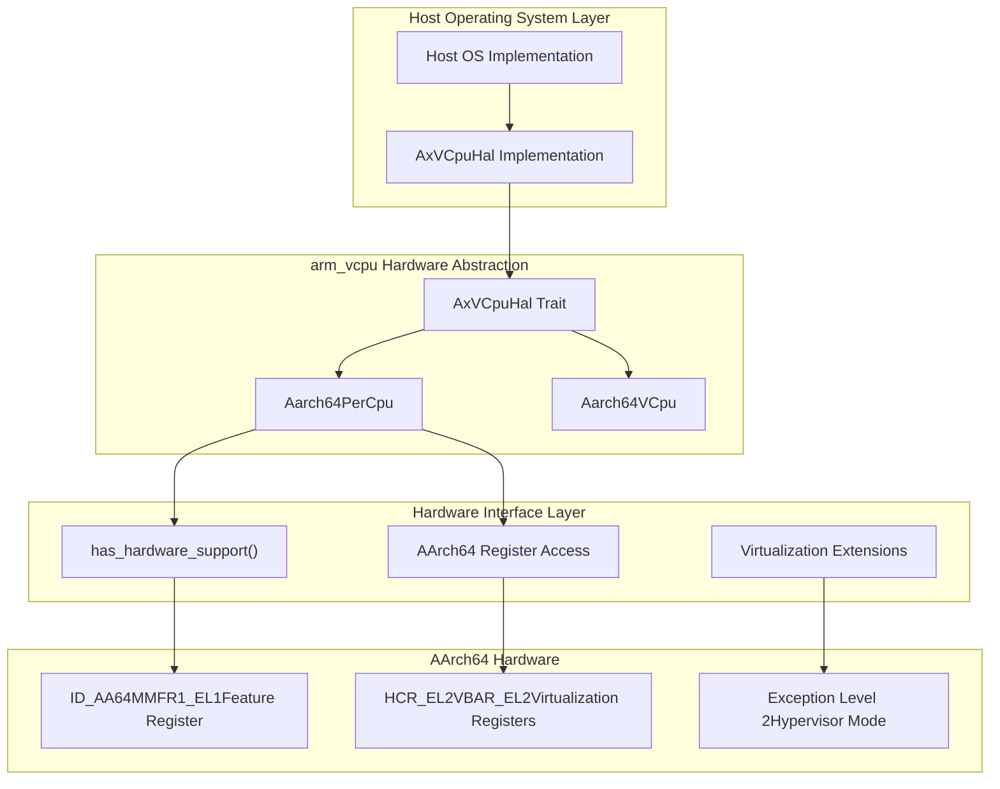
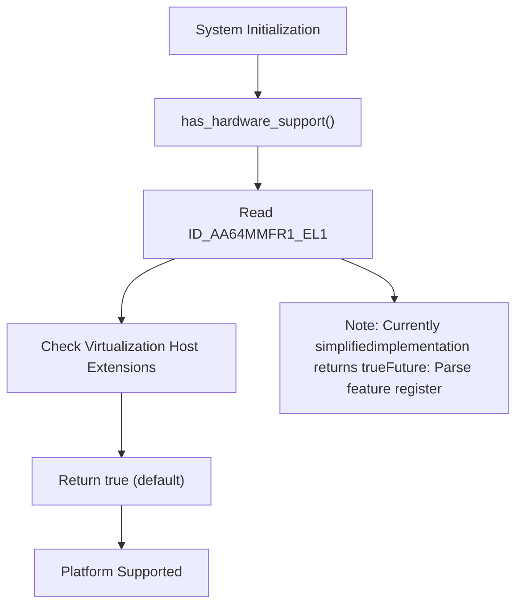
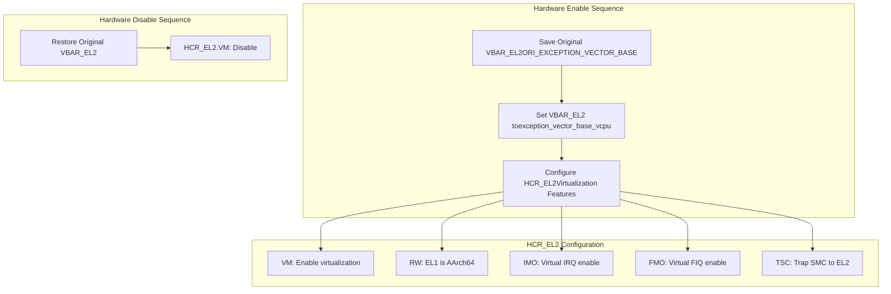
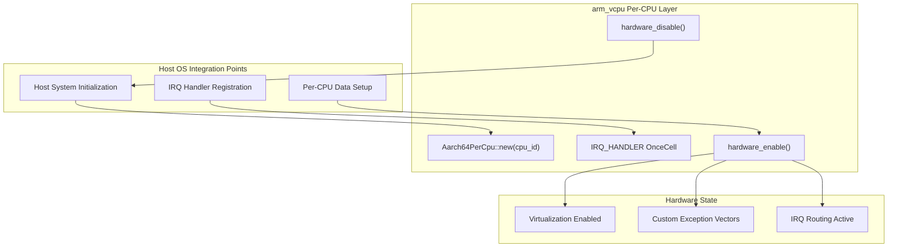

# Hardware Abstraction and Platform Support

> **Relevant source files**
> * [src/lib.rs](https://github.com/arceos-hypervisor/arm_vcpu/blob/4dd7e5df/src/lib.rs)
> * [src/pcpu.rs](https://github.com/arceos-hypervisor/arm_vcpu/blob/4dd7e5df/src/pcpu.rs)

This document covers the hardware abstraction mechanisms and platform support capabilities in the arm_vcpu hypervisor implementation. It explains how the system abstracts AArch64 virtualization hardware features, detects platform capabilities, and integrates with host operating systems through well-defined interfaces.

For information about the specific per-CPU state management implementation, see [Per-CPU State Management](/arceos-hypervisor/arm_vcpu/2.2-per-cpu-state-management). For details about secure monitor integration, see [Secure Monitor Interface](/arceos-hypervisor/arm_vcpu/5.1-secure-monitor-interface).

## Purpose and Scope

The hardware abstraction layer serves as the bridge between the generic virtualization logic and platform-specific implementations. It provides a clean interface for host operating systems to integrate the arm_vcpu hypervisor while isolating hardware-specific details from the core virtualization algorithms.

## Hardware Abstraction Layer Design

The system uses the `AxVCpuHal` trait as the primary abstraction mechanism. This trait defines the interface that host systems must implement to provide platform-specific services to the hypervisor.

### HAL Integration Architecture

**Sources:** [src/pcpu.rs(L1 - L80)&emsp;](https://github.com/arceos-hypervisor/arm_vcpu/blob/4dd7e5df/src/pcpu.rs#L1-L80) [src/lib.rs(L1 - L33)&emsp;](https://github.com/arceos-hypervisor/arm_vcpu/blob/4dd7e5df/src/lib.rs#L1-L33)

### HAL Trait Interface

The `AxVCpuHal` trait provides the following key abstractions:

|Method|Purpose|Implementation Responsibility|
| --- | --- | --- |
|irq_hanlder()|Host IRQ dispatch|Host OS provides IRQ routing logic|
|Platform services|Memory management, device access|Host OS provides platform-specific implementations|

The generic design allows the same hypervisor core to work across different host environments by parameterizing the per-CPU and VCPU structures with the HAL implementation.

**Sources:** [src/pcpu.rs(L7 - L8)&emsp;](https://github.com/arceos-hypervisor/arm_vcpu/blob/4dd7e5df/src/pcpu.rs#L7-L8) [src/pcpu.rs(L32 - L43)&emsp;](https://github.com/arceos-hypervisor/arm_vcpu/blob/4dd7e5df/src/pcpu.rs#L32-L43)

## Platform Detection and Capabilities

### Hardware Support Detection

The system provides platform capability detection through the `has_hardware_support()` function:

**Sources:** [src/lib.rs(L24 - L32)&emsp;](https://github.com/arceos-hypervisor/arm_vcpu/blob/4dd7e5df/src/lib.rs#L24-L32)

### Feature Register Analysis

The implementation includes provisions for proper hardware feature detection using AArch64 feature registers:

* **ID_AA64MMFR1_EL1**: Memory Model Feature Register for Virtualization Host Extensions detection
* **Cortex-A78 Support**: Specific mention of Cortex-A78 feature detection capabilities
* **Future Extensibility**: Framework for expanding platform detection logic

The current implementation uses a conservative approach by defaulting to supported status, but includes documentation for proper feature register parsing implementation.

**Sources:** [src/lib.rs(L25 - L29)&emsp;](https://github.com/arceos-hypervisor/arm_vcpu/blob/4dd7e5df/src/lib.rs#L25-L29)

## Hardware Feature Management

### Virtualization Hardware Control

The per-CPU implementation manages AArch64 virtualization hardware features through register manipulation:

**Sources:** [src/pcpu.rs(L49 - L78)&emsp;](https://github.com/arceos-hypervisor/arm_vcpu/blob/4dd7e5df/src/pcpu.rs#L49-L78)

### Register Management Implementation

The hardware abstraction manages critical AArch64 system registers:

|Register|Purpose|Management|
| --- | --- | --- |
|VBAR_EL2|Exception vector base|Saved/restored during enable/disable|
|HCR_EL2|Hypervisor configuration|Configured with virtualization features|
|Per-CPU storage|IRQ handlers, original state|Managed through percpu crate|

The implementation ensures proper state management by saving original register values before modification and restoring them during hardware disable operations.

**Sources:** [src/pcpu.rs(L53 - L57)&emsp;](https://github.com/arceos-hypervisor/arm_vcpu/blob/4dd7e5df/src/pcpu.rs#L53-L57) [src/pcpu.rs(L59 - L65)&emsp;](https://github.com/arceos-hypervisor/arm_vcpu/blob/4dd7e5df/src/pcpu.rs#L59-L65) [src/pcpu.rs(L74 - L76)&emsp;](https://github.com/arceos-hypervisor/arm_vcpu/blob/4dd7e5df/src/pcpu.rs#L74-L76)

## Integration with Host Systems

### Per-CPU Integration Model

The system integrates with host operating systems through a per-CPU abstraction model:

**Sources:** [src/pcpu.rs(L18 - L26)&emsp;](https://github.com/arceos-hypervisor/arm_vcpu/blob/4dd7e5df/src/pcpu.rs#L18-L26) [src/pcpu.rs(L33 - L43)&emsp;](https://github.com/arceos-hypervisor/arm_vcpu/blob/4dd7e5df/src/pcpu.rs#L33-L43)

### IRQ Handler Abstraction

The system provides IRQ handling abstraction through per-CPU handler registration:

* **OnceCell Storage**: Thread-safe per-CPU IRQ handler storage using `OnceCell<&(dyn Fn() + Send + Sync)>`
* **Host Integration**: Host OS registers IRQ handlers during per-CPU initialization
* **HAL Dispatch**: IRQ handlers are called through the `AxVCpuHal::irq_hanlder()` interface

This design allows the hypervisor to route interrupts back to the host OS while maintaining isolation and type safety.

**Sources:** [src/pcpu.rs(L21 - L26)&emsp;](https://github.com/arceos-hypervisor/arm_vcpu/blob/4dd7e5df/src/pcpu.rs#L21-L26) [src/pcpu.rs(L35 - L37)&emsp;](https://github.com/arceos-hypervisor/arm_vcpu/blob/4dd7e5df/src/pcpu.rs#L35-L37)

### Export Interface

The crate provides a clean public interface for host system integration:

|Export|Type|Purpose|
| --- | --- | --- |
|Aarch64PerCpu|Generic struct|Per-CPU management implementation|
|Aarch64VCpu|Generic struct|Virtual CPU implementation|
|Aarch64VCpuCreateConfig|Configuration|VCPU creation parameters|
|TrapFrame|Type alias|Context frame for AArch64|
|has_hardware_support()|Function|Platform capability detection|

These exports provide the complete interface needed for host systems to integrate the arm_vcpu hypervisor functionality.

**Sources:** [src/lib.rs(L17 - L22)&emsp;](https://github.com/arceos-hypervisor/arm_vcpu/blob/4dd7e5df/src/lib.rs#L17-L22) [src/lib.rs(L24 - L32)&emsp;](https://github.com/arceos-hypervisor/arm_vcpu/blob/4dd7e5df/src/lib.rs#L24-L32)