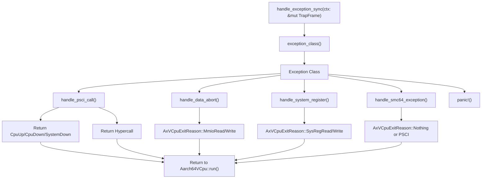
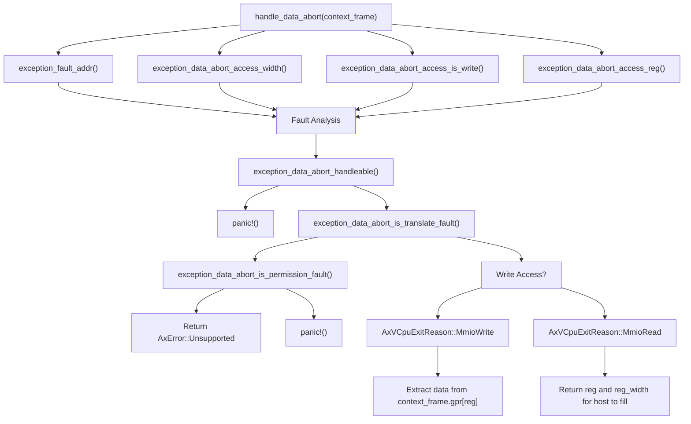
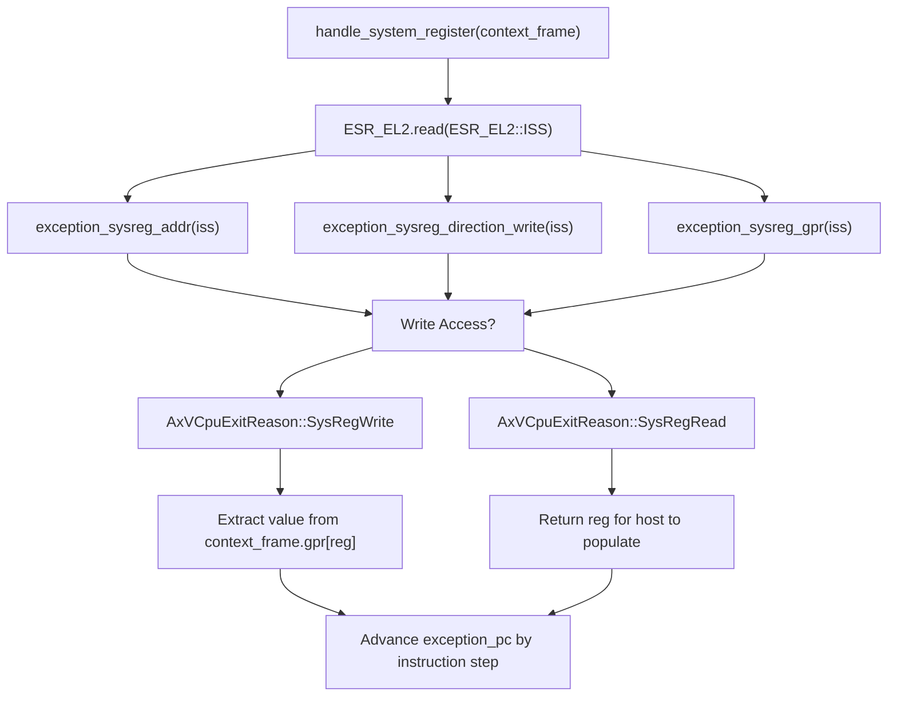
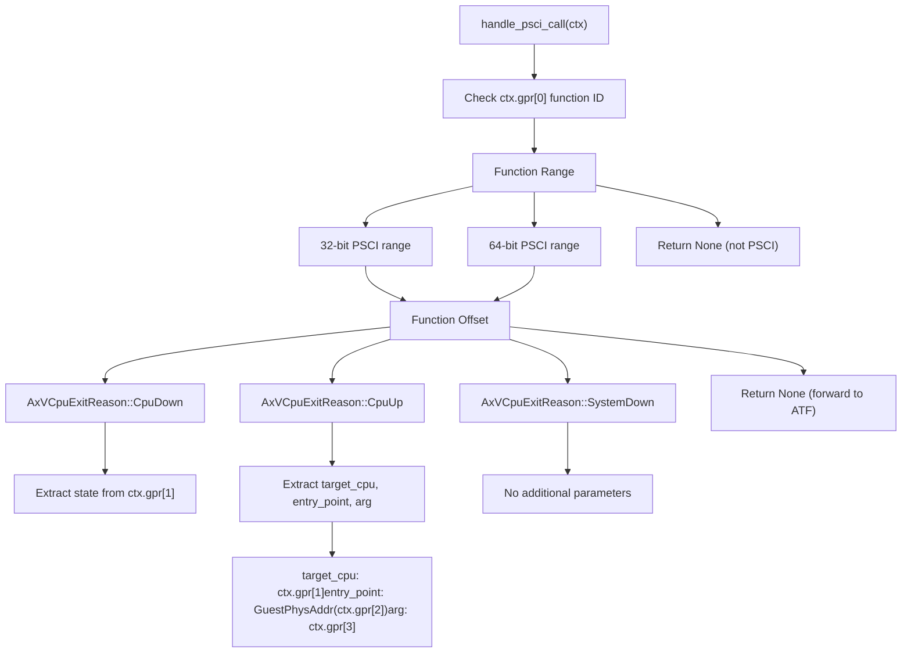
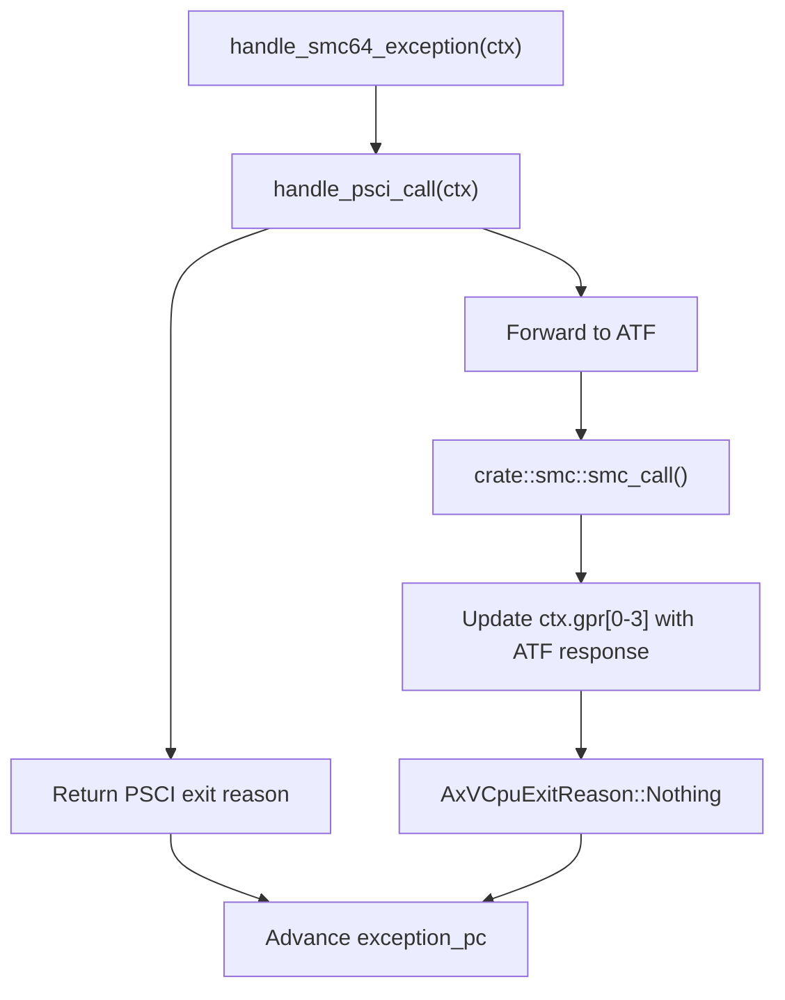
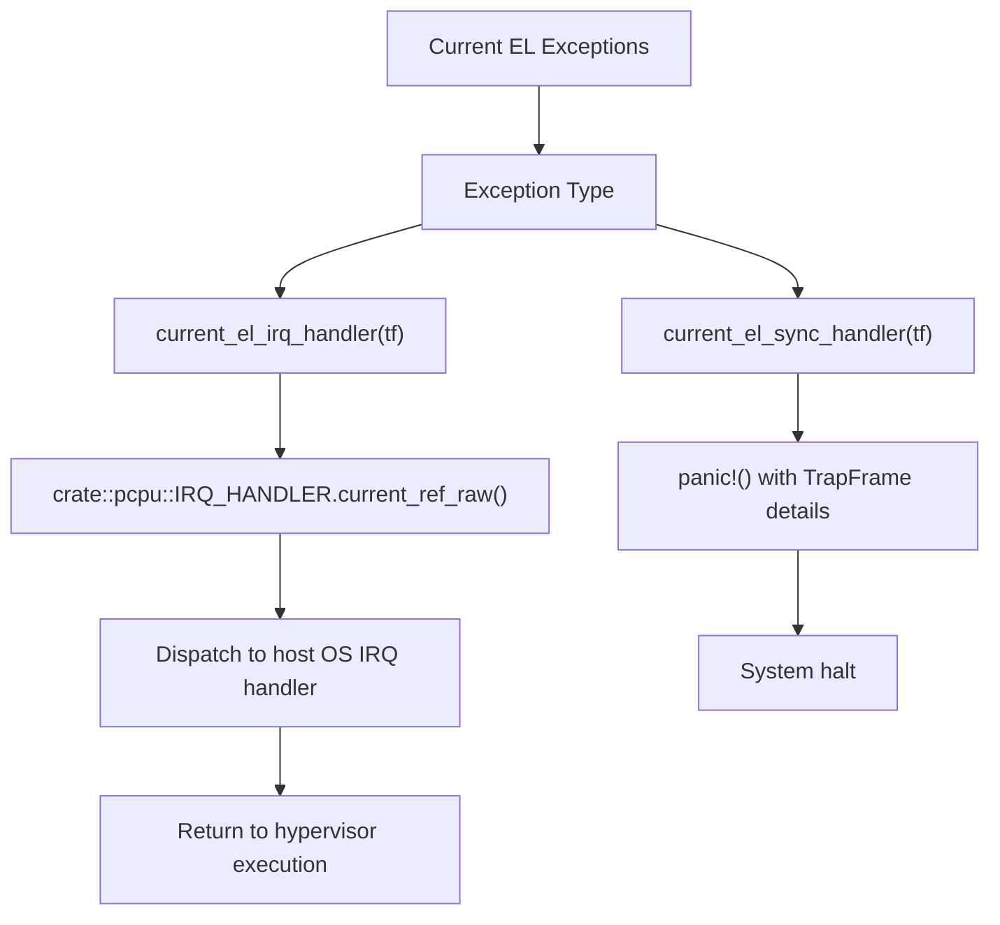
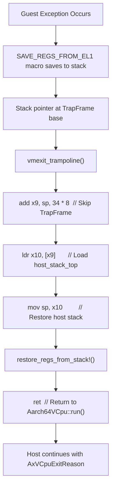

# High-Level Exception Handling

> **Relevant source files**
> * [src/exception.rs](https://github.com/arceos-hypervisor/arm_vcpu/blob/4dd7e5df/src/exception.rs)
> * [src/exception_utils.rs](https://github.com/arceos-hypervisor/arm_vcpu/blob/4dd7e5df/src/exception_utils.rs)

This document covers the high-level exception dispatch logic and handler implementations that process exceptions after they have been captured by the assembly exception vectors and analyzed by the parsing utilities. The high-level handlers determine the appropriate response to each exception type and return structured exit reasons to the VCPU management layer.

For information about the low-level assembly exception vector table and context switching, see [Assembly Exception Vectors](/arceos-hypervisor/arm_vcpu/4.1-assembly-exception-vectors). For details about register parsing and exception analysis utilities, see [Exception Analysis and Utilities](/arceos-hypervisor/arm_vcpu/4.2-exception-analysis-and-utilities).

## Exception Dispatch Architecture

The high-level exception handling system centers around the `handle_exception_sync` function, which serves as the main dispatcher for synchronous exceptions from guest VMs. This function examines the Exception Class (EC) field in `ESR_EL2` to determine the exception type and routes it to the appropriate specialized handler.

### Exception Dispatch Flow



**Exception Class Mapping:**

|Exception Class|Handler Function|Exit Reason|
| --- | --- | --- |
|DataAbortLowerEL|handle_data_abort|MmioRead/MmioWrite|
|HVC64|handle_psci_callor hypercall|CpuUp/CpuDown/SystemDown/Hypercall|
|TrappedMsrMrs|handle_system_register|SysRegRead/SysRegWrite|
|SMC64|handle_smc64_exception|Nothingor PSCI|

Sources: [src/exception.rs(L72 - L126)&emsp;](https://github.com/arceos-hypervisor/arm_vcpu/blob/4dd7e5df/src/exception.rs#L72-L126)

## Data Abort Handler

The `handle_data_abort` function processes memory access exceptions from guest VMs, typically resulting from MMIO operations to unmapped or restricted memory regions.

### Data Abort Processing Logic



The handler extracts key information from the exception:

* **Fault Address**: Guest physical address that caused the exception
* **Access Width**: Size of the memory operation (1, 2, 4, or 8 bytes)
* **Direction**: Read or write operation
* **Register**: Which guest register was involved in the access

Sources: [src/exception.rs(L128 - L182)&emsp;](https://github.com/arceos-hypervisor/arm_vcpu/blob/4dd7e5df/src/exception.rs#L128-L182) [src/exception_utils.rs(L211 - L254)&emsp;](https://github.com/arceos-hypervisor/arm_vcpu/blob/4dd7e5df/src/exception_utils.rs#L211-L254)

## System Register Handler

The `handle_system_register` function processes trapped system register accesses when the guest VM attempts to read or write control registers that are managed by the hypervisor.

### System Register Access Processing



The system register address encoding follows the ARM ISS format: `<op0><op2><op1><CRn>00000<CRm>0`, allowing the hypervisor to identify exactly which system register the guest attempted to access.

Sources: [src/exception.rs(L184 - L211)&emsp;](https://github.com/arceos-hypervisor/arm_vcpu/blob/4dd7e5df/src/exception.rs#L184-L211) [src/exception_utils.rs(L174 - L195)&emsp;](https://github.com/arceos-hypervisor/arm_vcpu/blob/4dd7e5df/src/exception_utils.rs#L174-L195)

## PSCI Support Implementation

The Power State Coordination Interface (PSCI) support enables guest VMs to perform power management operations like CPU power on/off and system shutdown through standardized function calls.

### PSCI Call Handling



**PSCI Function Support:**

|Function ID|Name|Parameters|Exit Reason|
| --- | --- | --- | --- |
|0x2|CPU_OFF|state|CpuDown|
|0x3|CPU_ON|target_cpu,entry_point,arg|CpuUp|
|0x8|SYSTEM_OFF|None|SystemDown|
|0x0, 0x5, 0x9|Version/Migrate/Reset|Various|Forwarded to ATF|

Sources: [src/exception.rs(L213 - L254)&emsp;](https://github.com/arceos-hypervisor/arm_vcpu/blob/4dd7e5df/src/exception.rs#L213-L254)

## SMC Handler and ATF Integration

The `handle_smc64_exception` function processes Secure Monitor Calls (SMC), which are used to communicate with secure firmware like ARM Trusted Firmware (ATF).

### SMC Processing Flow



The SMC handler first checks if the call is a PSCI operation. If not, it forwards the call directly to the ARM Trusted Firmware using the `smc_call` function, which executes the actual SMC instruction and returns the results to the guest VM registers.

Sources: [src/exception.rs(L256 - L271)&emsp;](https://github.com/arceos-hypervisor/arm_vcpu/blob/4dd7e5df/src/exception.rs#L256-L271)

## Current EL Exception Handlers

The system also handles exceptions that occur at the current exception level (EL2) while the hypervisor itself is running.

### Current EL Handler Architecture



The IRQ handler delegates to the host OS interrupt handler registered during `Aarch64PerCpu::new()`, while synchronous exceptions at EL2 are considered fatal errors and cause a system panic.

Sources: [src/exception.rs(L273 - L290)&emsp;](https://github.com/arceos-hypervisor/arm_vcpu/blob/4dd7e5df/src/exception.rs#L273-L290)

## VM Exit Trampoline Mechanism

The `vmexit_trampoline` function provides the critical bridge between guest exception handling and returning control to the host VCPU management code.

### Stack Layout and Transition



**Memory Layout During VM Exit:**

```
Stack Layout:
┌─────────────────┐ ← sp (initially)
│   TrapFrame     │ (34 * 8 bytes)
│   (guest regs)  │
├─────────────────┤ ← sp + 34*8
│ host_stack_top  │ (pointer to host stack)
├─────────────────┤
│ Host saved regs │ (callee-saved x19-x30)
│                 │
└─────────────────┘ ← host_stack_top
```

Sources: [src/exception.rs(L292 - L341)&emsp;](https://github.com/arceos-hypervisor/arm_vcpu/blob/4dd7e5df/src/exception.rs#L292-L341)

## Integration with VCPU Lifecycle

The high-level exception handlers integrate seamlessly with the VCPU execution cycle by returning structured `AxVCpuExitReason` values that inform the host hypervisor about what action triggered the VM exit.

### Exit Reason Types and Usage

|Exit Reason|Triggered By|Host Action Required|
| --- | --- | --- |
|MmioRead/MmioWrite|Guest MMIO access|Emulate device operation|
|SysRegRead/SysRegWrite|Trapped system register|Emulate register access|
|Hypercall|Guest HVC instruction|Process hypercall|
|CpuUp/CpuDown|PSCI power management|Manage CPU state|
|SystemDown|PSCI system shutdown|Shutdown guest system|
|Nothing|Handled internally|Continue guest execution|

This structured approach allows the host hypervisor to implement device emulation, power management, and other virtualization services based on the specific needs indicated by each exit reason.

Sources: [src/exception.rs(L49 - L125)&emsp;](https://github.com/arceos-hypervisor/arm_vcpu/blob/4dd7e5df/src/exception.rs#L49-L125)