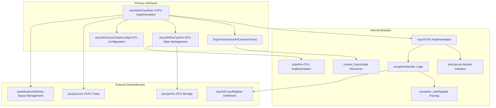
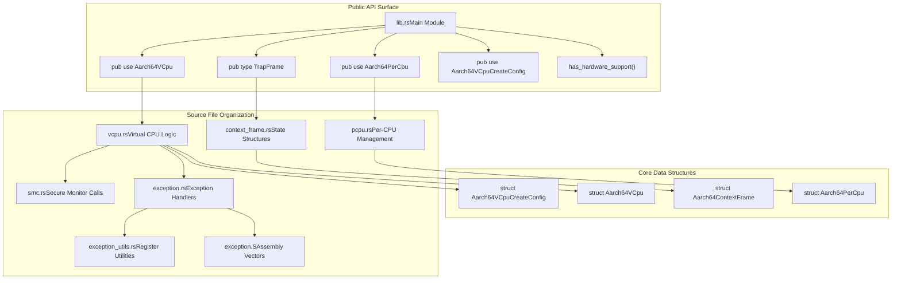
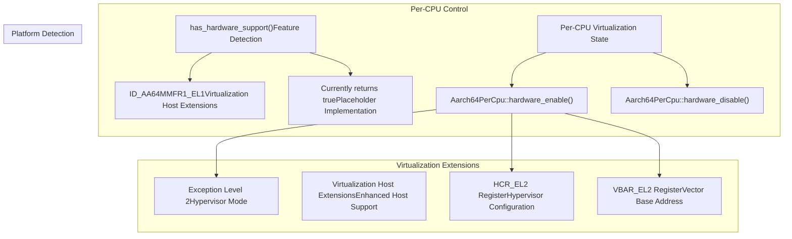

# Overview

> **Relevant source files**
> * [Cargo.toml](https://github.com/arceos-hypervisor/arm_vcpu/blob/4dd7e5df/Cargo.toml)
> * [README.md](https://github.com/arceos-hypervisor/arm_vcpu/blob/4dd7e5df/README.md)
> * [src/lib.rs](https://github.com/arceos-hypervisor/arm_vcpu/blob/4dd7e5df/src/lib.rs)

This document provides a comprehensive overview of the `arm_vcpu` hypervisor system, an AArch64 virtualization implementation that provides virtual CPU management and hardware abstraction for hypervisor environments. The system implements low-level virtualization primitives including CPU context switching, exception handling, and guest state management for AArch64 platforms.

The `arm_vcpu` crate serves as a foundational component for hypervisor implementations, providing the core VCPU abstraction and associated hardware interfaces. For detailed information about specific subsystems, see [Virtual CPU Management](/arceos-hypervisor/arm_vcpu/2-virtual-cpu-management), [Exception Handling System](/arceos-hypervisor/arm_vcpu/4-exception-handling-system), and [System Integration](/arceos-hypervisor/arm_vcpu/5-system-integration).

## System Purpose and Scope

The `arm_vcpu` system implements virtualization support for AArch64 architecture, providing:

* **Virtual CPU Management**: Core VCPU lifecycle, state management, and execution control
* **Hardware Abstraction**: Platform-independent interfaces for virtualization hardware features
* **Exception Handling**: Comprehensive trap and interrupt handling for guest VMs
* **Context Switching**: Efficient state preservation and restoration between host and guest execution
* **Security Integration**: Secure Monitor Call (SMC) interface for trusted firmware interaction

Sources: [README.md(L1 - L5)&emsp;](https://github.com/arceos-hypervisor/arm_vcpu/blob/4dd7e5df/README.md#L1-L5) [src/lib.rs(L1 - L33)&emsp;](https://github.com/arceos-hypervisor/arm_vcpu/blob/4dd7e5df/src/lib.rs#L1-L33)

## Primary System Components

The following diagram illustrates the main architectural components and their relationships within the `arm_vcpu` system:

**Core Component Architecture**

Sources: [src/lib.rs(L9 - L21)&emsp;](https://github.com/arceos-hypervisor/arm_vcpu/blob/4dd7e5df/src/lib.rs#L9-L21) [Cargo.toml(L6 - L19)&emsp;](https://github.com/arceos-hypervisor/arm_vcpu/blob/4dd7e5df/Cargo.toml#L6-L19)

## Code Entity Mapping

This diagram maps the natural language system concepts to specific code entities and file structures:

**Implementation Structure and Code Entities**

Sources: [src/lib.rs(L17 - L21)&emsp;](https://github.com/arceos-hypervisor/arm_vcpu/blob/4dd7e5df/src/lib.rs#L17-L21) [src/lib.rs(L9 - L15)&emsp;](https://github.com/arceos-hypervisor/arm_vcpu/blob/4dd7e5df/src/lib.rs#L9-L15)

## Virtualization Hardware Integration

The system provides hardware abstraction for AArch64 virtualization extensions through a layered approach:

|Layer|Component|Responsibility|
| --- | --- | --- |
|Hardware|AArch64 CPU|Virtualization extensions (EL2, VHE)|
|Low-Level|exception.S|Assembly exception vectors and context switch|
|Abstraction|AxVCpuHaltrait|Hardware abstraction interface|
|Implementation|Aarch64VCpu|Concrete VCPU implementation|
|Integration|axvcpucrate|Generic VCPU traits and interfaces|

**Hardware Feature Detection and Support**

Sources: [src/lib.rs(L23 - L32)&emsp;](https://github.com/arceos-hypervisor/arm_vcpu/blob/4dd7e5df/src/lib.rs#L23-L32) [Cargo.toml(L15)&emsp;](https://github.com/arceos-hypervisor/arm_vcpu/blob/4dd7e5df/Cargo.toml#L15-L15)

## External Ecosystem Integration

The `arm_vcpu` crate integrates with the broader ArceOS hypervisor ecosystem through well-defined dependency relationships:

|Dependency|Purpose|Integration Point|
| --- | --- | --- |
|axvcpu|Core VCPU traits|AxVCpuHaltrait implementation|
|axaddrspace|Address space management|Memory virtualization support|
|percpu|Per-CPU data structures|Hardware state management|
|aarch64-cpu|Register definitions|Low-level hardware access|
|aarch64_sysreg|System register access|Control register manipulation|

The system operates at Exception Level 2 (EL2) and provides virtualization services for guest operating systems running at Exception Level 1 (EL1) and applications at Exception Level 0 (EL0).

Sources: [Cargo.toml(L14 - L19)&emsp;](https://github.com/arceos-hypervisor/arm_vcpu/blob/4dd7e5df/Cargo.toml#L14-L19) [README.md(L5)&emsp;](https://github.com/arceos-hypervisor/arm_vcpu/blob/4dd7e5df/README.md#L5-L5)