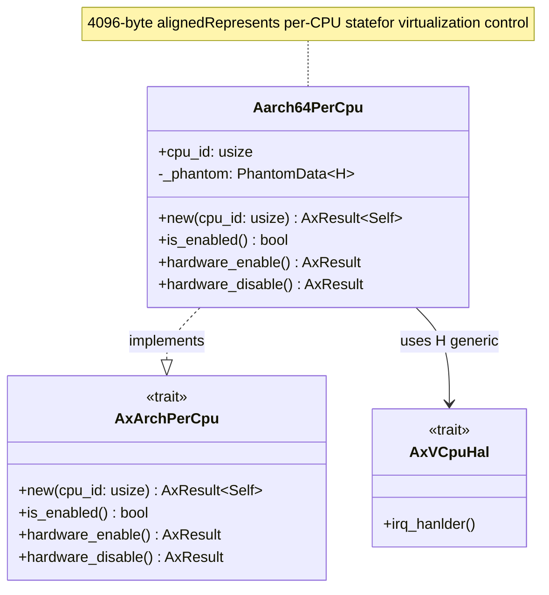
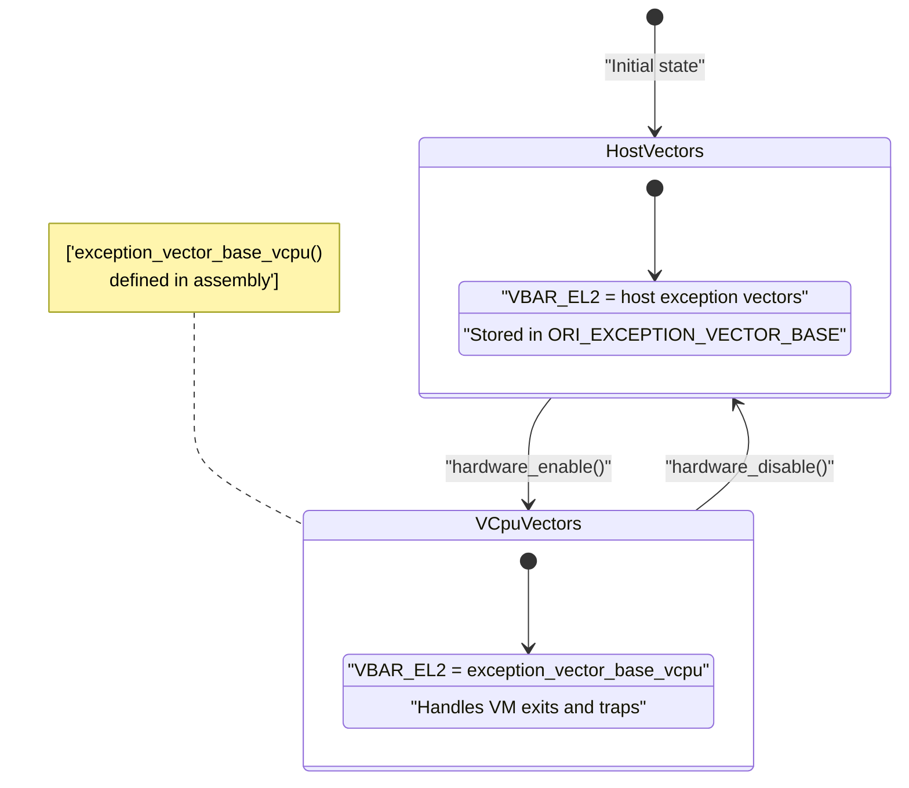
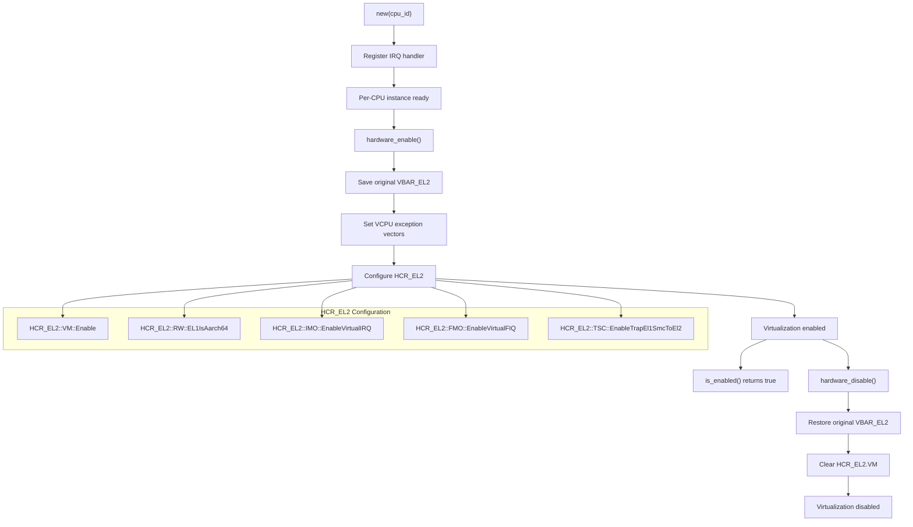
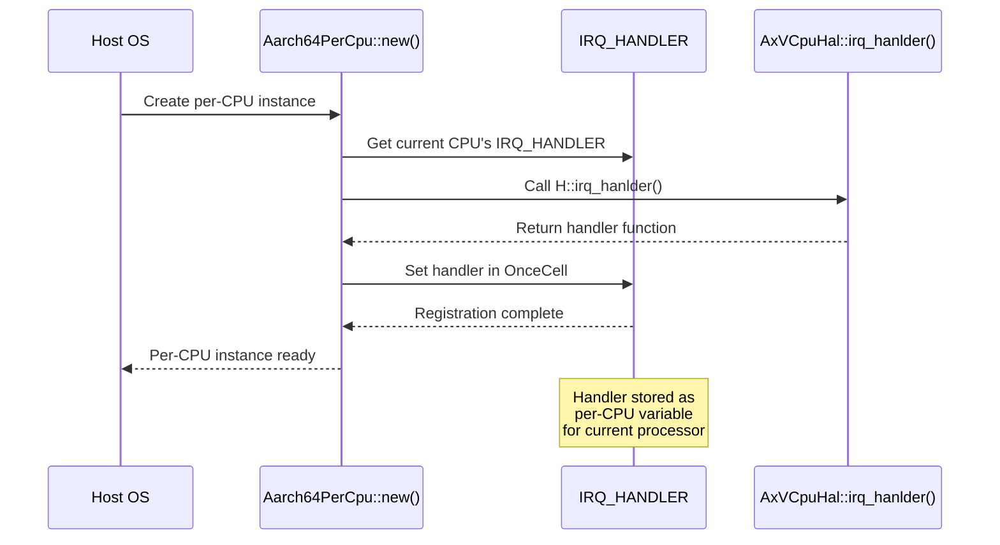
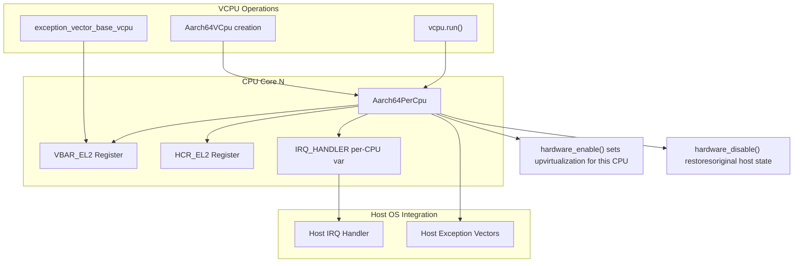

# Per-CPU State Management

> **Relevant source files**
> * [src/pcpu.rs](https://github.com/arceos-hypervisor/arm_vcpu/blob/4dd7e5df/src/pcpu.rs)

This document covers the per-CPU state management system in the arm_vcpu hypervisor, which handles virtualization control and interrupt management on a per-processor basis. The system is responsible for enabling/disabling hardware virtualization features, managing exception vectors, and coordinating interrupt handling between the hypervisor and host OS.

For information about the overall VCPU lifecycle and operations, see [2.1](/arceos-hypervisor/arm_vcpu/2.1-vcpu-lifecycle-and-operations). For details about context switching and register state management, see [3](/arceos-hypervisor/arm_vcpu/3-context-switching-and-state-management).

## Per-CPU Data Structure

The core of per-CPU state management is the `Aarch64PerCpu` structure, which implements the `AxArchPerCpu` trait to provide processor-specific virtualization control.

### Aarch64PerCpu Structure

Sources: [src/pcpu.rs(L10 - L16)&emsp;](https://github.com/arceos-hypervisor/arm_vcpu/blob/4dd7e5df/src/pcpu.rs#L10-L16)

The structure is aligned to 4096 bytes and contains minimal data, serving primarily as a coordination point for per-CPU virtualization operations. The generic parameter `H` provides hardware abstraction through the `AxVCpuHal` trait.

## Per-CPU Variables

The system uses two key per-CPU variables to manage state across processor cores:

|Variable|Type|Purpose|
| --- | --- | --- |
|ORI_EXCEPTION_VECTOR_BASE|usize|Stores originalVBAR_EL2value before virtualization|
|IRQ_HANDLER|OnceCell<&(dyn Fn() + Send + Sync)>|Host OS IRQ handler for this CPU|

### Exception Vector Management

Sources: [src/pcpu.rs(L18 - L19)&emsp;](https://github.com/arceos-hypervisor/arm_vcpu/blob/4dd7e5df/src/pcpu.rs#L18-L19) [src/pcpu.rs(L28 - L30)&emsp;](https://github.com/arceos-hypervisor/arm_vcpu/blob/4dd7e5df/src/pcpu.rs#L28-L30) [src/pcpu.rs(L53 - L57)&emsp;](https://github.com/arceos-hypervisor/arm_vcpu/blob/4dd7e5df/src/pcpu.rs#L53-L57) [src/pcpu.rs(L74 - L77)&emsp;](https://github.com/arceos-hypervisor/arm_vcpu/blob/4dd7e5df/src/pcpu.rs#L74-L77)

## Hardware Virtualization Control

The per-CPU system manages the AArch64 virtualization extensions through the Hypervisor Configuration Register (HCR_EL2).

### Virtualization State Management

Sources: [src/pcpu.rs(L32 - L78)&emsp;](https://github.com/arceos-hypervisor/arm_vcpu/blob/4dd7e5df/src/pcpu.rs#L32-L78)

### HCR_EL2 Register Configuration

When enabling virtualization, the system configures several key control bits:

|Bit Field|Setting|Purpose|
| --- | --- | --- |
|VM|Enable|Enables virtualization extensions|
|RW|EL1IsAarch64|Sets EL1 execution state to AArch64|
|IMO|EnableVirtualIRQ|Routes IRQs to virtual interrupt controller|
|FMO|EnableVirtualFIQ|Routes FIQs to virtual interrupt controller|
|TSC|EnableTrapEl1SmcToEl2|Traps SMC instructions from EL1 to EL2|

Sources: [src/pcpu.rs(L59 - L65)&emsp;](https://github.com/arceos-hypervisor/arm_vcpu/blob/4dd7e5df/src/pcpu.rs#L59-L65)

## IRQ Handler Integration

The per-CPU system coordinates interrupt handling between the hypervisor and host OS through a registered handler mechanism.

### IRQ Handler Registration

Sources: [src/pcpu.rs(L21 - L26)&emsp;](https://github.com/arceos-hypervisor/arm_vcpu/blob/4dd7e5df/src/pcpu.rs#L21-L26) [src/pcpu.rs(L34 - L37)&emsp;](https://github.com/arceos-hypervisor/arm_vcpu/blob/4dd7e5df/src/pcpu.rs#L34-L37)

The IRQ handler is set once per CPU during initialization and provides a mechanism for the hypervisor's exception handling system to dispatch interrupts back to the host OS when appropriate.

## Integration with VCPU System

The per-CPU state management integrates closely with the broader VCPU lifecycle:

### Per-CPU and VCPU Relationship

Sources: [src/pcpu.rs(L45 - L78)&emsp;](https://github.com/arceos-hypervisor/arm_vcpu/blob/4dd7e5df/src/pcpu.rs#L45-L78)

The per-CPU system provides the foundation for VCPU operations by ensuring that hardware virtualization extensions are properly configured and that interrupt handling is coordinated between the hypervisor and host OS on each processor core.