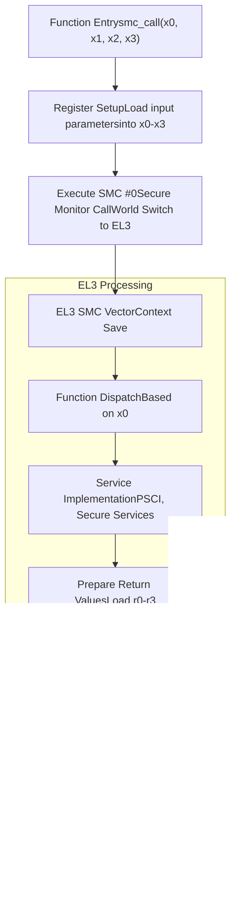

# Secure Monitor Interface

> **Relevant source files**
> * [src/smc.rs](https://github.com/arceos-hypervisor/arm_vcpu/blob/4dd7e5df/src/smc.rs)

This document covers the Secure Monitor Call (SMC) interface implementation in the ARM vCPU hypervisor. The SMC interface provides a mechanism for the hypervisor to communicate with secure firmware, typically ARM Trusted Firmware (ATF), running at the secure monitor level (EL3). This interface is essential for implementing security features, power management operations, and other privileged system functions that require secure world access.

For information about how SMC exceptions from guest VMs are handled, see the exception handling documentation in [High-Level Exception Handling](/arceos-hypervisor/arm_vcpu/4.3-high-level-exception-handling).

## ARM Security Architecture and SMC Role

The SMC interface operates within ARM's TrustZone security architecture, which divides the system into secure and non-secure worlds across different exception levels.

#### ARM Security Model with SMC Interface

**Sources:** [src/smc.rs(L1 - L27)&emsp;](https://github.com/arceos-hypervisor/arm_vcpu/blob/4dd7e5df/src/smc.rs#L1-L27)

## SMC Call Implementation

The core SMC functionality is implemented through the `smc_call` function, which provides a direct interface to invoke secure monitor calls from the hypervisor.

#### SMC Call Function Interface

The `smc_call` function is marked as `unsafe` and `#[inline(never)]` to ensure proper handling of the security-sensitive operation:

|Parameter|Purpose|SMC Calling Convention|
| --- | --- | --- |
|x0|Function identifier|SMC function number per ARM SMC Calling Convention|
|x1-x3|Function arguments|Service-specific parameters|
|Returnr0|Status/result|Success/error code or primary return value|
|Returnr1-r3|Additional data|Service-specific return values|

**Sources:** [src/smc.rs(L3 - L26)&emsp;](https://github.com/arceos-hypervisor/arm_vcpu/blob/4dd7e5df/src/smc.rs#L3-L26)

## SMC Assembly Implementation

The actual secure monitor call is implemented using inline assembly with specific constraints to ensure safe execution.

#### SMC Assembly Execution Flow

The assembly implementation uses specific constraints:

* `inout` constraints for registers `x0-x3` to handle both input and output
* `options(nomem, nostack)` to indicate the SMC instruction doesn't access memory or modify the stack
* `#[inline(never)]` attribute to prevent inlining and ensure the SMC happens at the correct execution context

**Sources:** [src/smc.rs(L15 - L25)&emsp;](https://github.com/arceos-hypervisor/arm_vcpu/blob/4dd7e5df/src/smc.rs#L15-L25)

## Integration with Exception Handling

When guest VMs attempt to execute SMC instructions, they are trapped by the hypervisor and can be handled through the exception system before potentially being forwarded to the secure monitor.

#### Guest SMC Exception Flow

```mermaid
flowchart TD
subgraph subGraph1["SMC Execution Paths"]
    FORWARD_SMC["Forward via smc_callHypervisor → EL3"]
    EMULATE_SMC["Emulate ResponseSynthetic Return Values"]
    DENY_SMC["Deny OperationInject Exception to Guest"]
end
subgraph subGraph0["SMC Decision Logic"]
    POLICY_CHECK["Security Policy CheckFunction ID Validation"]
    FORWARD_DECISION["Forward to EL3?"]
    EMULATE_DECISION["Emulate in EL2?"]
end
GUEST_SMC["Guest VMExecutes SMC"]
TRAP["HCR_EL2.TSC TrapException to EL2"]
EXC_HANDLER["handle_smc64_exceptionException Analysis"]
RETURN_GUEST["Return to GuestWith Results"]

DENY_SMC --> RETURN_GUEST
EMULATE_DECISION --> EMULATE_SMC
EMULATE_SMC --> RETURN_GUEST
EXC_HANDLER --> POLICY_CHECK
FORWARD_DECISION --> DENY_SMC
FORWARD_DECISION --> FORWARD_SMC
FORWARD_SMC --> RETURN_GUEST
GUEST_SMC --> TRAP
POLICY_CHECK --> EMULATE_DECISION
POLICY_CHECK --> FORWARD_DECISION
TRAP --> EXC_HANDLER
```

**Sources:** Based on system architecture patterns referenced in overview diagrams

## Security Considerations and Trust Boundaries

The SMC interface represents a critical trust boundary in the system, requiring careful consideration of security implications.

#### Trust Boundary and Attack Surface

### Security Properties

|Property|Implementation|Rationale|
| --- | --- | --- |
|Function ID validation|Policy checking before forwarding|Prevents unauthorized access to secure services|
|Parameter sanitization|Input validation in exception handlers|Mitigates parameter injection attacks|
|Direct hypervisor access|smc_callfunction for hypervisor use|Enables privileged operations like PSCI|
|Guest call filtering|Exception trapping and analysis|Maintains security boundaries between VMs|

**Sources:** [src/smc.rs(L6 - L9)&emsp;](https://github.com/arceos-hypervisor/arm_vcpu/blob/4dd7e5df/src/smc.rs#L6-L9) for safety documentation