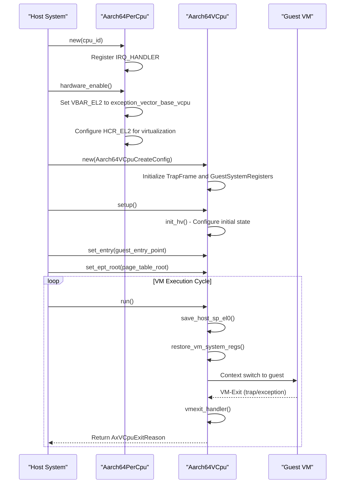
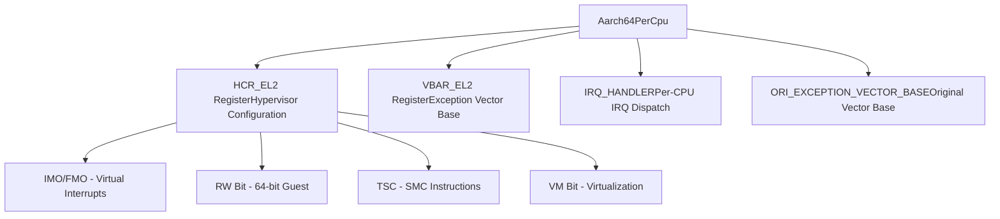
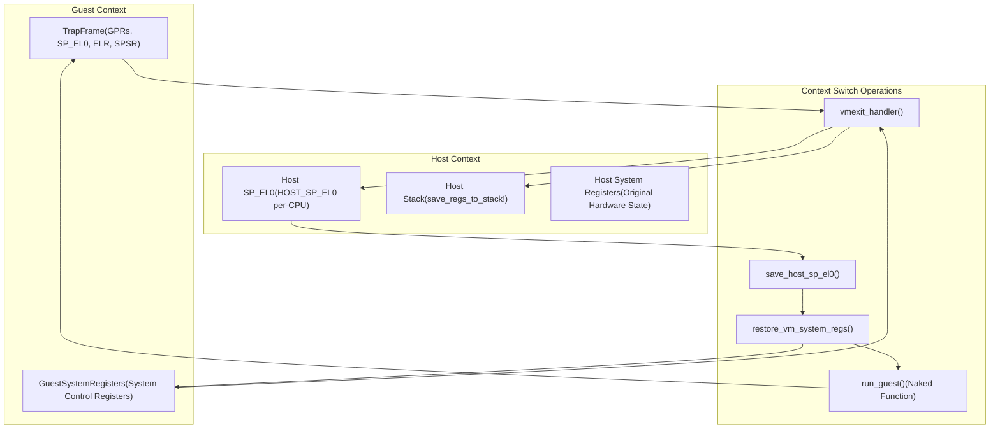
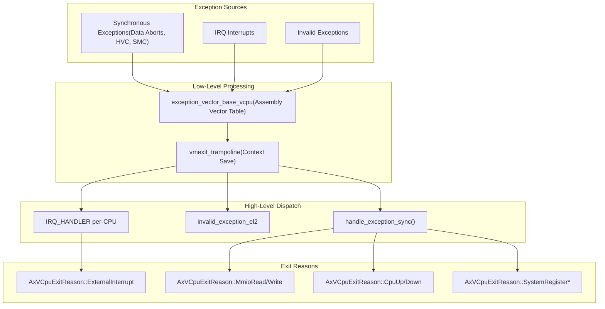

# System Architecture

> **Relevant source files**
> * [src/lib.rs](https://github.com/arceos-hypervisor/arm_vcpu/blob/4dd7e5df/src/lib.rs)
> * [src/pcpu.rs](https://github.com/arceos-hypervisor/arm_vcpu/blob/4dd7e5df/src/pcpu.rs)
> * [src/vcpu.rs](https://github.com/arceos-hypervisor/arm_vcpu/blob/4dd7e5df/src/vcpu.rs)

This document provides a detailed explanation of the overall system architecture for the arm_vcpu hypervisor implementation. It covers the core components, their relationships, and the data flow patterns that enable AArch64 virtualization. For specific implementation details of individual components, see [Virtual CPU Management](/arceos-hypervisor/arm_vcpu/2-virtual-cpu-management), [Exception Handling System](/arceos-hypervisor/arm_vcpu/4-exception-handling-system), and [Context Switching and State Management](/arceos-hypervisor/arm_vcpu/3-context-switching-and-state-management).

## Architecture Overview

The arm_vcpu system implements a Type-1 hypervisor architecture for AArch64 platforms, providing virtualization capabilities through the AArch64 virtualization extensions. The system operates at Exception Level 2 (EL2) and manages guest virtual machines running at EL1/EL0.

### Core Component Relationships

```

```

**Sources:** [src/vcpu.rs(L39 - L51)&emsp;](https://github.com/arceos-hypervisor/arm_vcpu/blob/4dd7e5df/src/vcpu.rs#L39-L51) [src/pcpu.rs(L10 - L16)&emsp;](https://github.com/arceos-hypervisor/arm_vcpu/blob/4dd7e5df/src/pcpu.rs#L10-L16) [src/lib.rs(L17 - L21)&emsp;](https://github.com/arceos-hypervisor/arm_vcpu/blob/4dd7e5df/src/lib.rs#L17-L21)

### System Initialization and Lifecycle



**Sources:** [src/vcpu.rs(L69 - L85)&emsp;](https://github.com/arceos-hypervisor/arm_vcpu/blob/4dd7e5df/src/vcpu.rs#L69-L85) [src/vcpu.rs(L99 - L111)&emsp;](https://github.com/arceos-hypervisor/arm_vcpu/blob/4dd7e5df/src/vcpu.rs#L99-L111) [src/pcpu.rs(L49 - L67)&emsp;](https://github.com/arceos-hypervisor/arm_vcpu/blob/4dd7e5df/src/pcpu.rs#L49-L67)

## Core Components

### Virtual CPU (Aarch64VCpu)

The `Aarch64VCpu<H: AxVCpuHal>` structure serves as the primary abstraction for a virtual CPU. It maintains both guest context and runtime state required for virtualization.

|Field|Type|Purpose|
| --- | --- | --- |
|ctx|TrapFrame|Guest general-purpose registers and execution state|
|host_stack_top|u64|Host stack pointer for context switching|
|guest_system_regs|GuestSystemRegisters|Guest system control and configuration registers|
|mpidr|u64|Multiprocessor Affinity Register value for guest|

The VCPU implements the `AxArchVCpu` trait, providing standardized interfaces for:

* Creation and configuration via `Aarch64VCpuCreateConfig`
* Guest execution through the `run()` method
* Entry point and page table configuration
* Register manipulation interfaces

**Sources:** [src/vcpu.rs(L39 - L51)&emsp;](https://github.com/arceos-hypervisor/arm_vcpu/blob/4dd7e5df/src/vcpu.rs#L39-L51) [src/vcpu.rs(L64 - L124)&emsp;](https://github.com/arceos-hypervisor/arm_vcpu/blob/4dd7e5df/src/vcpu.rs#L64-L124)

### Per-CPU Management (Aarch64PerCpu)

The `Aarch64PerCpu<H: AxVCpuHal>` structure manages hardware virtualization features on a per-CPU basis:



**Sources:** [src/pcpu.rs(L10 - L16)&emsp;](https://github.com/arceos-hypervisor/arm_vcpu/blob/4dd7e5df/src/pcpu.rs#L10-L16) [src/pcpu.rs(L49 - L67)&emsp;](https://github.com/arceos-hypervisor/arm_vcpu/blob/4dd7e5df/src/pcpu.rs#L49-L67) [src/pcpu.rs(L18 - L26)&emsp;](https://github.com/arceos-hypervisor/arm_vcpu/blob/4dd7e5df/src/pcpu.rs#L18-L26)

### Hardware Abstraction Layer

The system uses the `AxVCpuHal` trait to abstract platform-specific functionality:

```

```

**Sources:** [src/vcpu.rs(L278)&emsp;](https://github.com/arceos-hypervisor/arm_vcpu/blob/4dd7e5df/src/vcpu.rs#L278-L278) [src/pcpu.rs(L35 - L37)&emsp;](https://github.com/arceos-hypervisor/arm_vcpu/blob/4dd7e5df/src/pcpu.rs#L35-L37)

## Context Switching Architecture

The system implements a sophisticated context switching mechanism that preserves both general-purpose and system registers across VM entries and exits:



**Sources:** [src/vcpu.rs(L182 - L214)&emsp;](https://github.com/arceos-hypervisor/arm_vcpu/blob/4dd7e5df/src/vcpu.rs#L182-L214) [src/vcpu.rs(L226 - L244)&emsp;](https://github.com/arceos-hypervisor/arm_vcpu/blob/4dd7e5df/src/vcpu.rs#L226-L244) [src/vcpu.rs(L255 - L282)&emsp;](https://github.com/arceos-hypervisor/arm_vcpu/blob/4dd7e5df/src/vcpu.rs#L255-L282)

## Exception and Interrupt Handling

The system provides a multi-layered exception handling architecture that processes VM-exits and routes them appropriately:



**Sources:** [src/vcpu.rs(L275 - L281)&emsp;](https://github.com/arceos-hypervisor/arm_vcpu/blob/4dd7e5df/src/vcpu.rs#L275-L281) [src/pcpu.rs(L18 - L26)&emsp;](https://github.com/arceos-hypervisor/arm_vcpu/blob/4dd7e5df/src/pcpu.rs#L18-L26) [src/pcpu.rs(L55 - L57)&emsp;](https://github.com/arceos-hypervisor/arm_vcpu/blob/4dd7e5df/src/pcpu.rs#L55-L57)

This architecture enables efficient virtualization by maintaining clear separation between host and guest contexts while providing comprehensive exception handling capabilities for all VM-exit scenarios.