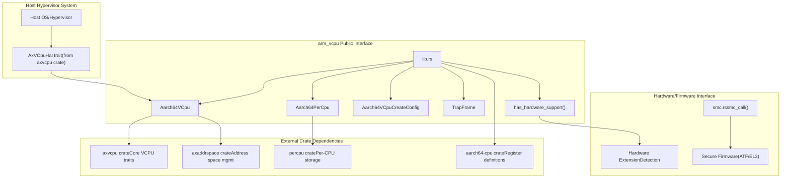
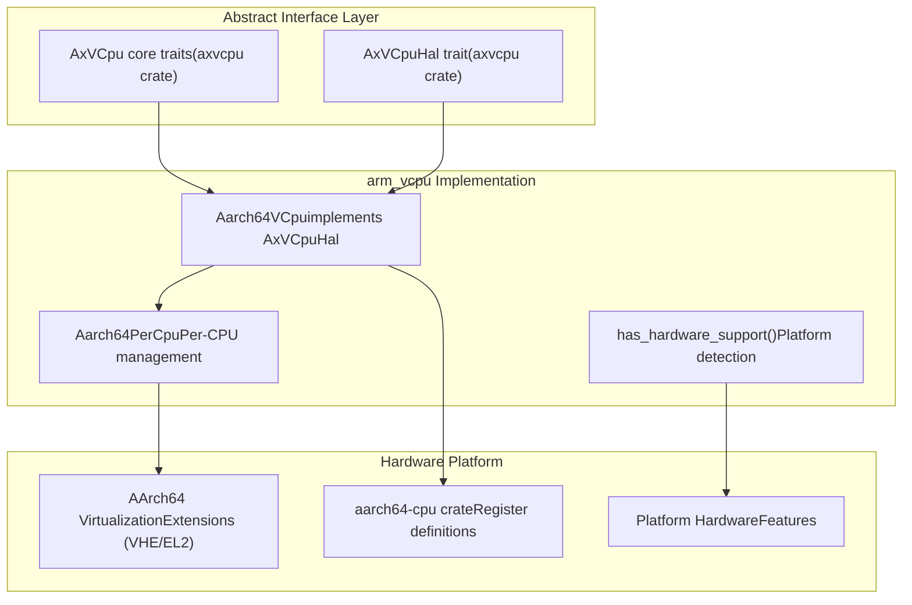
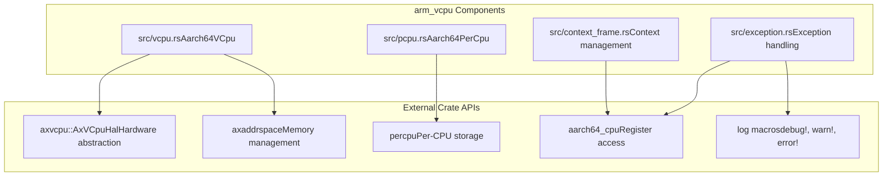
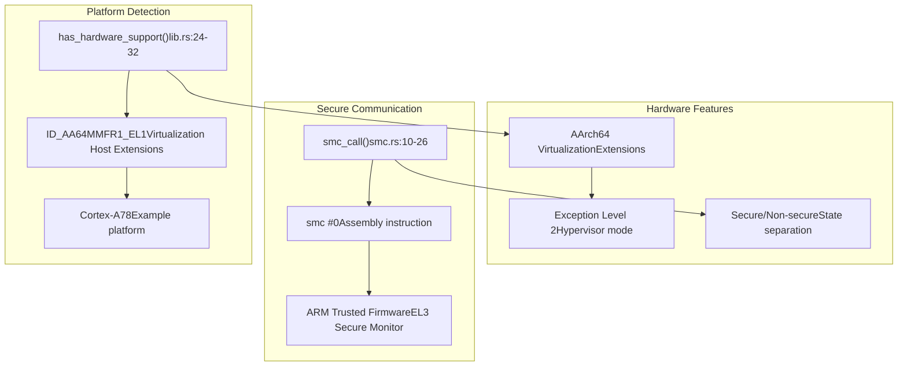

# System Integration

> **Relevant source files**
> * [src/lib.rs](https://github.com/arceos-hypervisor/arm_vcpu/blob/4dd7e5df/src/lib.rs)
> * [src/smc.rs](https://github.com/arceos-hypervisor/arm_vcpu/blob/4dd7e5df/src/smc.rs)

This document covers the integration interfaces and hardware abstraction mechanisms that enable the arm_vcpu hypervisor to work with host systems, hardware platforms, and external components. It focuses on how the core virtualization functionality interfaces with the broader hypervisor ecosystem and underlying hardware.

For detailed information about the Secure Monitor Call interface, see [Secure Monitor Interface](/arceos-hypervisor/arm_vcpu/5.1-secure-monitor-interface). For platform-specific hardware support details, see [Hardware Abstraction and Platform Support](/arceos-hypervisor/arm_vcpu/5.2-hardware-abstraction-and-platform-support).

## Integration Architecture Overview

The arm_vcpu crate serves as a hardware-specific implementation that integrates with higher-level hypervisor frameworks through well-defined interfaces. The integration occurs at multiple layers, from hardware abstraction to external crate dependencies.

**Integration Architecture with Code Entities**

The integration architecture centers around the public interface defined in [src/lib.rs](https://github.com/arceos-hypervisor/arm_vcpu/blob/4dd7e5df/src/lib.rs) which exports the core components that host hypervisors use to manage AArch64 virtual CPUs.

Sources: [src/lib.rs(L17 - L18)&emsp;](https://github.com/arceos-hypervisor/arm_vcpu/blob/4dd7e5df/src/lib.rs#L17-L18) [src/lib.rs(L21)&emsp;](https://github.com/arceos-hypervisor/arm_vcpu/blob/4dd7e5df/src/lib.rs#L21-L21) [src/lib.rs(L24 - L32)&emsp;](https://github.com/arceos-hypervisor/arm_vcpu/blob/4dd7e5df/src/lib.rs#L24-L32)

## Hardware Abstraction Layer Interface

The arm_vcpu crate implements hardware-specific functionality while depending on abstract interfaces for integration with higher-level hypervisor components. The primary abstraction mechanism is the `AxVCpuHal` trait from the axvcpu crate.

**Hardware Abstraction Layer Structure**

The hardware abstraction enables the arm_vcpu implementation to provide AArch64-specific virtualization functionality while remaining compatible with generic hypervisor frameworks that depend on the abstract `AxVCpuHal` interface.

Sources: [src/lib.rs(L17 - L18)&emsp;](https://github.com/arceos-hypervisor/arm_vcpu/blob/4dd7e5df/src/lib.rs#L17-L18) [src/lib.rs(L24 - L32)&emsp;](https://github.com/arceos-hypervisor/arm_vcpu/blob/4dd7e5df/src/lib.rs#L24-L32)

## External Dependency Integration

The arm_vcpu crate integrates with several external crates that provide fundamental hypervisor infrastructure. Each dependency serves a specific role in the overall system architecture.

|Crate|Purpose|Integration Point|
| --- | --- | --- |
|axvcpu|Core VCPU traits and interfaces|Aarch64VCpuimplementsAxVCpuHal|
|axaddrspace|Address space management|Used byAarch64VCpufor memory virtualization|
|percpu|Per-CPU data storage|Used byAarch64PerCpufor CPU-local state|
|aarch64-cpu|AArch64 register definitions|Used throughout for hardware register access|
|log|Logging infrastructure|Used for debug and error reporting|

**External Dependency Flow**

The external dependencies provide the foundational infrastructure that the arm_vcpu implementation builds upon, allowing it to focus on AArch64-specific virtualization concerns.

Sources: [src/lib.rs(L6 - L7)&emsp;](https://github.com/arceos-hypervisor/arm_vcpu/blob/4dd7e5df/src/lib.rs#L6-L7) [src/lib.rs(L17 - L18)&emsp;](https://github.com/arceos-hypervisor/arm_vcpu/blob/4dd7e5df/src/lib.rs#L17-L18)

## Platform Hardware Integration

The arm_vcpu crate provides platform hardware integration through hardware capability detection and secure firmware communication interfaces.

**Hardware Integration Points**

The platform integration provides two key capabilities:

1. **Hardware Capability Detection**: The `has_hardware_support()` function determines if the current platform supports AArch64 virtualization extensions
2. **Secure Firmware Communication**: The `smc_call()` function enables communication with secure firmware components

Sources: [src/lib.rs(L24 - L32)&emsp;](https://github.com/arceos-hypervisor/arm_vcpu/blob/4dd7e5df/src/lib.rs#L24-L32) [src/smc.rs(L3 - L26)&emsp;](https://github.com/arceos-hypervisor/arm_vcpu/blob/4dd7e5df/src/smc.rs#L3-L26)

## Integration Safety and Constraints

The integration interfaces include several safety-critical components that require careful handling by host hypervisor systems.

The `smc_call()` function in [src/smc.rs(L10 - L26)&emsp;](https://github.com/arceos-hypervisor/arm_vcpu/blob/4dd7e5df/src/smc.rs#L10-L26) is marked as unsafe and requires the caller to ensure:

* `x0` contains a valid SMC function number per the SMC Calling Convention
* Arguments `x1`, `x2`, `x3` are valid for the specified SMC function
* The calling context is appropriate for secure monitor calls

The hardware support detection in [src/lib.rs(L24 - L32)&emsp;](https://github.com/arceos-hypervisor/arm_vcpu/blob/4dd7e5df/src/lib.rs#L24-L32) currently returns `true` by default but includes documentation for implementing proper detection using `ID_AA64MMFR1_EL1` register checks on platforms like Cortex-A78.

These safety constraints ensure that the arm_vcpu crate integrates properly with both hardware platforms and secure firmware components while maintaining the security boundaries required for hypervisor operation.

Sources: [src/smc.rs(L5 - L9)&emsp;](https://github.com/arceos-hypervisor/arm_vcpu/blob/4dd7e5df/src/smc.rs#L5-L9) [src/lib.rs(L25 - L30)&emsp;](https://github.com/arceos-hypervisor/arm_vcpu/blob/4dd7e5df/src/lib.rs#L25-L30)