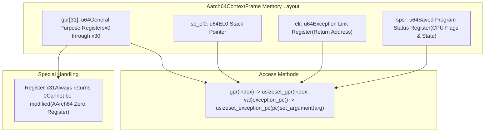
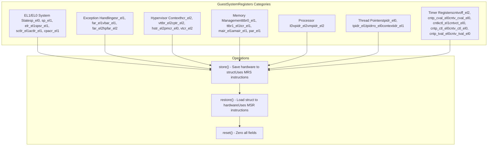
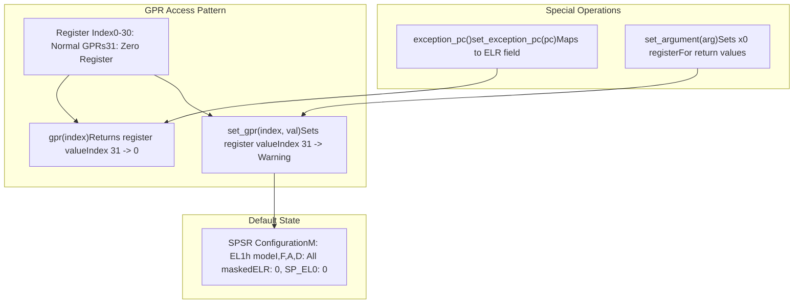
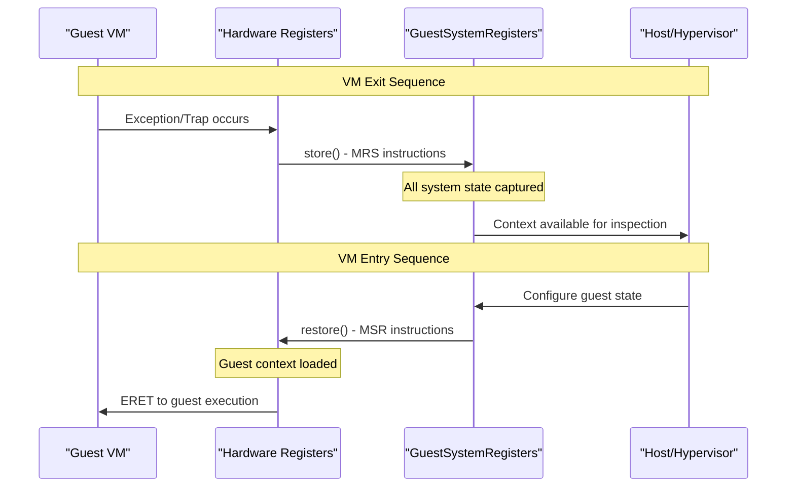
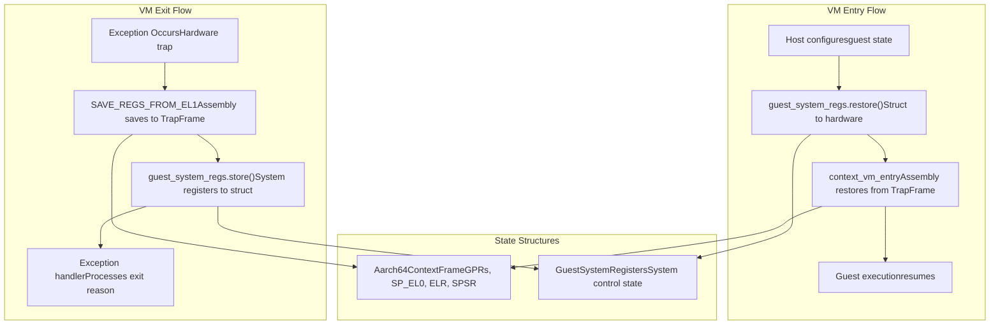

# TrapFrame and System Registers

> **Relevant source files**
> * [src/context_frame.rs](https://github.com/arceos-hypervisor/arm_vcpu/blob/4dd7e5df/src/context_frame.rs)

This document details the core data structures used for preserving CPU state during context switches in the arm_vcpu hypervisor. The system uses two primary structures: `Aarch64ContextFrame` for saving general-purpose registers and basic execution state, and `GuestSystemRegisters` for preserving system control registers and hypervisor-specific state.

For information about the broader context switching mechanism and how these structures are used during VM exits, see [Context Switching and State Management](/arceos-hypervisor/arm_vcpu/3-context-switching-and-state-management). For details on the assembly-level context switching code that manipulates these structures, see [Assembly Exception Vectors](/arceos-hypervisor/arm_vcpu/4.1-assembly-exception-vectors).

## TrapFrame Structure Overview

The `Aarch64ContextFrame` serves as the primary trap frame for saving guest execution context when exceptions occur. This structure captures the minimal set of registers needed to preserve the guest's execution state across VM exits.

The structure uses `#[repr(C)]` layout to ensure predictable memory organization for hardware and assembly code interaction. The default state configures SPSR to mask all exceptions and set EL1h mode for safe guest initialization.

**Sources:** [src/context_frame.rs(L17 - L63)&emsp;](https://github.com/arceos-hypervisor/arm_vcpu/blob/4dd7e5df/src/context_frame.rs#L17-L63)

## System Registers Structure

The `GuestSystemRegisters` structure manages the complete system-level state of a guest VM, including control registers, memory management settings, timer state, and hypervisor configuration.

The structure is aligned to 16 bytes (`#[repr(align(16))]`) for optimal memory access performance during context switches.

**Sources:** [src/context_frame.rs(L138 - L300)&emsp;](https://github.com/arceos-hypervisor/arm_vcpu/blob/4dd7e5df/src/context_frame.rs#L138-L300)

## Register State Preservation

The system employs a two-tier approach to state preservation, with different registers handled by different mechanisms based on their access patterns and importance.

### TrapFrame Register Operations

**Sources:** [src/context_frame.rs(L65 - L136)&emsp;](https://github.com/arceos-hypervisor/arm_vcpu/blob/4dd7e5df/src/context_frame.rs#L65-L136)

### System Register Save/Restore Cycle

The `store()` and `restore()` methods use inline assembly with MRS (Move Register from System) and MSR (Move System Register) instructions to efficiently transfer register state between hardware and memory.

**Sources:** [src/context_frame.rs(L213 - L299)&emsp;](https://github.com/arceos-hypervisor/arm_vcpu/blob/4dd7e5df/src/context_frame.rs#L213-L299)

## Integration with Context Switching

These structures integrate closely with the assembly-level context switching mechanism to provide complete state preservation during VM transitions.

The TrapFrame is manipulated directly by assembly code during the low-level context switch, while the GuestSystemRegisters structure is managed by Rust code using the `store()` and `restore()` methods.

**Sources:** [src/context_frame.rs(L1 - L301)&emsp;](https://github.com/arceos-hypervisor/arm_vcpu/blob/4dd7e5df/src/context_frame.rs#L1-L301)

## Register Categories and Usage

|Category|Registers|Purpose|Access Pattern|
| --- | --- | --- | --- |
|General Purpose|x0-x30, SP_EL0|Function arguments, local variables, stack management|Every VM exit/entry via assembly|
|Execution State|ELR, SPSR|Program counter and processor status|Every VM exit/entry via assembly|
|Memory Management|TTBR0_EL1, TTBR1_EL1, TCR_EL1, MAIR_EL1|Page table configuration, memory attributes|Restored on VM entry|
|System Control|SCTLR_EL1, CPACR_EL1, ACTLR_EL1|Processor features, access control|Restored on VM entry|
|Exception Handling|VBAR_EL1, ESR_EL1, FAR_EL1|Vector table, exception information|Preserved across exits|
|Timer Management|CNTVOFF_EL2, CNTKCTL_EL1, timer control/value registers|Virtual timer state|Managed by hypervisor|
|Hypervisor Control|HCR_EL2, VTTBR_EL2, VTCR_EL2|Virtualization configuration, stage-2 MMU|Set during VCPU setup|

The register categories reflect the layered nature of AArch64 virtualization, with some registers requiring preservation on every context switch while others are configured once during VCPU initialization.

**Sources:** [src/context_frame.rs(L148 - L197)&emsp;](https://github.com/arceos-hypervisor/arm_vcpu/blob/4dd7e5df/src/context_frame.rs#L148-L197)