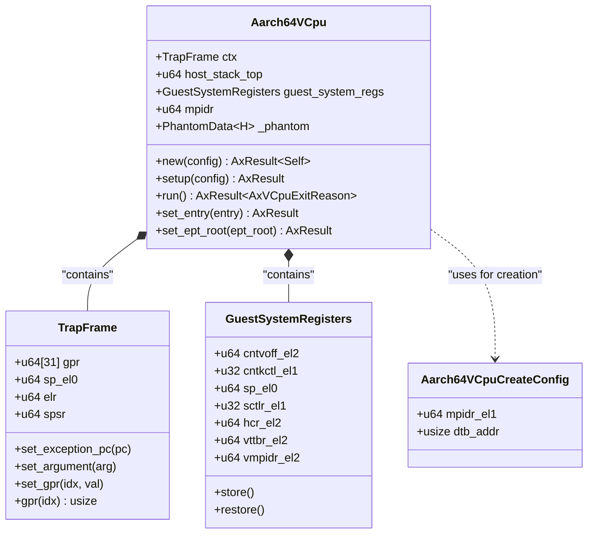
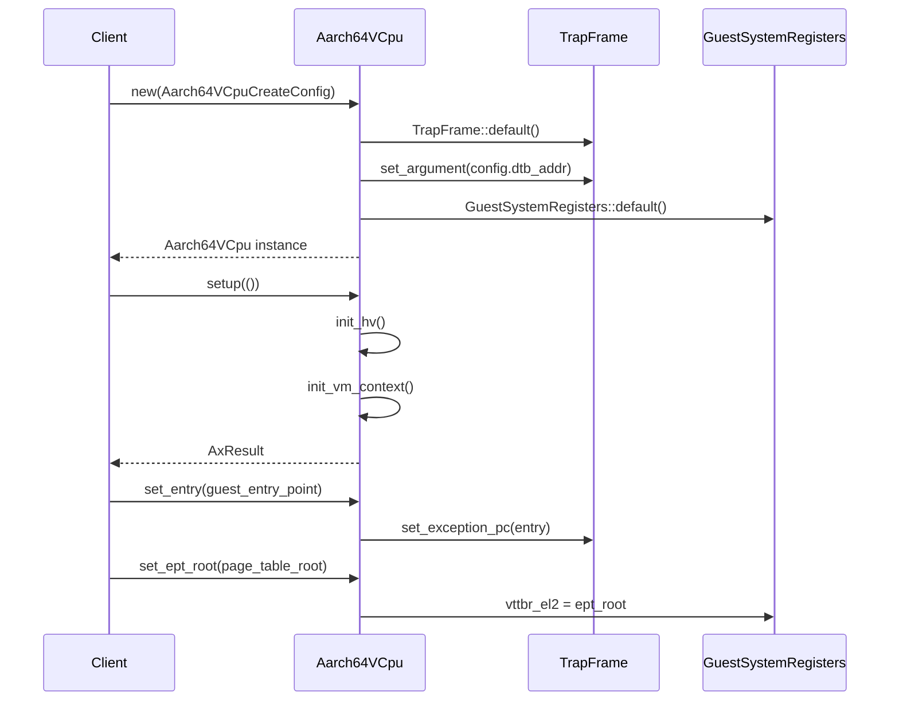
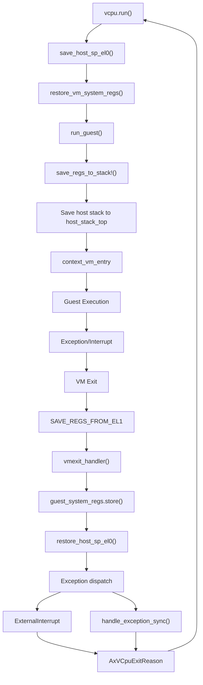
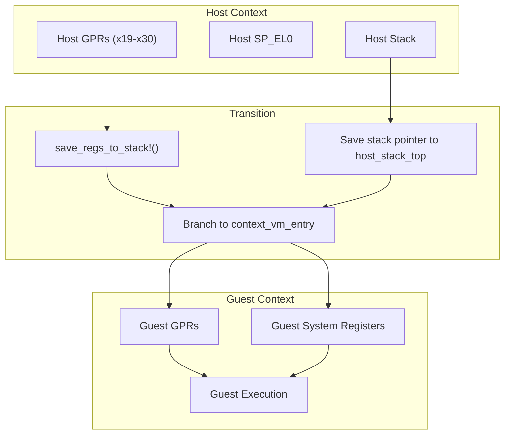
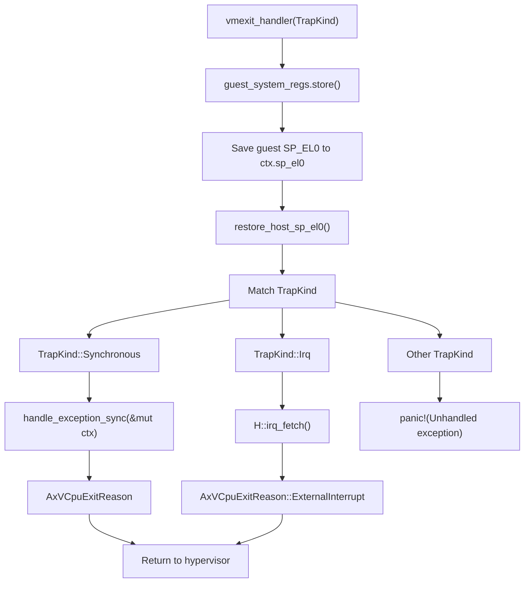
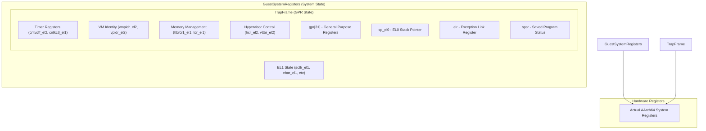
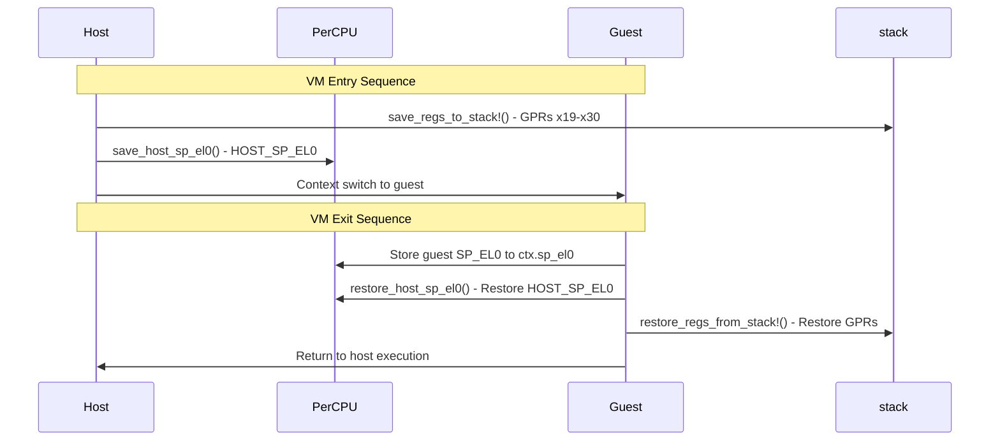

# VCPU Lifecycle and Operations

> **Relevant source files**
> * [src/context_frame.rs](https://github.com/arceos-hypervisor/arm_vcpu/blob/4dd7e5df/src/context_frame.rs)
> * [src/vcpu.rs](https://github.com/arceos-hypervisor/arm_vcpu/blob/4dd7e5df/src/vcpu.rs)

This document details the virtual CPU (VCPU) creation, configuration, execution cycle, and VM exit handling mechanisms within the arm_vcpu hypervisor system. It covers the core `Aarch64VCpu` implementation, context management, and the complete lifecycle from VCPU instantiation to guest execution and exit handling.

For hardware abstraction and platform integration details, see [Hardware Abstraction and Platform Support](/arceos-hypervisor/arm_vcpu/5.2-hardware-abstraction-and-platform-support). For low-level exception vector implementation, see [Assembly Exception Vectors](/arceos-hypervisor/arm_vcpu/4.1-assembly-exception-vectors). For per-CPU state management across multiple VCPUs, see [Per-CPU State Management](/arceos-hypervisor/arm_vcpu/2.2-per-cpu-state-management).

## VCPU Structure and Components

The `Aarch64VCpu` struct serves as the primary virtual CPU implementation, containing all necessary state for guest execution and host-guest context switching.

### Core VCPU Structure

The VCPU structure maintains strict field ordering requirements for assembly code interaction. The `ctx` and `host_stack_top` fields must remain in their current positions and order to support the low-level context switching assembly routines.

**Sources:** [src/vcpu.rs(L40 - L51)&emsp;](https://github.com/arceos-hypervisor/arm_vcpu/blob/4dd7e5df/src/vcpu.rs#L40-L51) [src/context_frame.rs(L17 - L28)&emsp;](https://github.com/arceos-hypervisor/arm_vcpu/blob/4dd7e5df/src/context_frame.rs#L17-L28) [src/context_frame.rs(L145 - L197)&emsp;](https://github.com/arceos-hypervisor/arm_vcpu/blob/4dd7e5df/src/context_frame.rs#L145-L197)

## VCPU Creation and Configuration

### Creation Process

The VCPU creation follows a two-phase initialization pattern through the `AxArchVCpu` trait implementation:

The `new()` method creates a VCPU instance with minimal initialization, setting up the trap context with the device tree address and initializing default system registers. The `setup()` method performs hypervisor-specific initialization including guest execution state configuration.

**Sources:** [src/vcpu.rs(L69 - L80)&emsp;](https://github.com/arceos-hypervisor/arm_vcpu/blob/4dd7e5df/src/vcpu.rs#L69-L80) [src/vcpu.rs(L82 - L85)&emsp;](https://github.com/arceos-hypervisor/arm_vcpu/blob/4dd7e5df/src/vcpu.rs#L82-L85) [src/vcpu.rs(L87 - L97)&emsp;](https://github.com/arceos-hypervisor/arm_vcpu/blob/4dd7e5df/src/vcpu.rs#L87-L97)

### Hypervisor Context Initialization

The `init_hv()` and `init_vm_context()` methods configure the guest execution environment:

|Register/Field|Value|Purpose|
| --- | --- | --- |
|SPSR_EL1|EL1h + All exceptions masked|Guest starts in EL1 with interrupts disabled|
|CNTHCTL_EL2|EL1PCEN + EL1PCTEN|Enable timer access from EL1|
|SCTLR_EL1|0x30C50830|System control register defaults|
|VTCR_EL2|40-bit PA, 4KB granule, stage-2 config|Stage-2 translation control|
|HCR_EL2|VM + RW + TSC|Enable virtualization, 64-bit EL1, trap SMC|
|VMPIDR_EL2|Configured MPIDR|Virtual multiprocessor ID|

**Sources:** [src/vcpu.rs(L128 - L136)&emsp;](https://github.com/arceos-hypervisor/arm_vcpu/blob/4dd7e5df/src/vcpu.rs#L128-L136) [src/vcpu.rs(L139 - L166)&emsp;](https://github.com/arceos-hypervisor/arm_vcpu/blob/4dd7e5df/src/vcpu.rs#L139-L166)

## VCPU Execution Cycle

### VM Entry and Exit Flow

The VCPU execution follows a carefully orchestrated context switching process:

The execution cycle begins with the `run()` method, which saves host state, restores guest system registers, and transitions to guest execution through the `run_guest()` naked function.

**Sources:** [src/vcpu.rs(L99 - L111)&emsp;](https://github.com/arceos-hypervisor/arm_vcpu/blob/4dd7e5df/src/vcpu.rs#L99-L111) [src/vcpu.rs(L186 - L214)&emsp;](https://github.com/arceos-hypervisor/arm_vcpu/blob/4dd7e5df/src/vcpu.rs#L186-L214) [src/vcpu.rs(L255 - L282)&emsp;](https://github.com/arceos-hypervisor/arm_vcpu/blob/4dd7e5df/src/vcpu.rs#L255-L282)

### Context Switching Implementation

The `run_guest()` function implements a naked assembly function that performs the critical host-to-guest transition:

The naked function ensures no compiler-generated prologue/epilogue interferes with the precise register state management required for hypervisor operation.

**Sources:** [src/vcpu.rs(L186 - L214)&emsp;](https://github.com/arceos-hypervisor/arm_vcpu/blob/4dd7e5df/src/vcpu.rs#L186-L214) [src/vcpu.rs(L225 - L244)&emsp;](https://github.com/arceos-hypervisor/arm_vcpu/blob/4dd7e5df/src/vcpu.rs#L225-L244)

## VM Exit Handling

### Exit Reason Processing

The `vmexit_handler()` method processes VM exits and converts low-level trap information into structured exit reasons:

The exit handler ensures proper state preservation by storing guest system registers and restoring host SP_EL0 before processing the specific exit cause.

**Sources:** [src/vcpu.rs(L255 - L282)&emsp;](https://github.com/arceos-hypervisor/arm_vcpu/blob/4dd7e5df/src/vcpu.rs#L255-L282)

### Exit Reason Types

The system generates specific exit reasons that inform the hypervisor about the cause of the VM exit:

|Exit Reason|Trigger|Handler Location|
| --- | --- | --- |
|MmioRead/Write|Data abort to device memory|handle_data_abort|
|SystemRegisterRead/Write|Trapped system register access|handle_system_register|
|Hypercall|HVC instruction|handle_psci_call|
|CpuUp/Down/SystemDown|PSCI power management|handle_psci_call|
|ExternalInterrupt|Physical interrupt|vmexit_handler|

**Sources:** [src/vcpu.rs(L276 - L281)&emsp;](https://github.com/arceos-hypervisor/arm_vcpu/blob/4dd7e5df/src/vcpu.rs#L276-L281)

## Context Management

### Register State Preservation

The VCPU maintains two primary context structures for complete state preservation:

The `TrapFrame` captures the basic CPU execution state, while `GuestSystemRegisters` preserves the complete virtual machine system configuration.

**Sources:** [src/context_frame.rs(L17 - L136)&emsp;](https://github.com/arceos-hypervisor/arm_vcpu/blob/4dd7e5df/src/context_frame.rs#L17-L136) [src/context_frame.rs(L213 - L300)&emsp;](https://github.com/arceos-hypervisor/arm_vcpu/blob/4dd7e5df/src/context_frame.rs#L213-L300)

### Host State Management

Host state preservation uses a combination of stack storage and per-CPU variables:

The per-CPU `HOST_SP_EL0` variable ensures each CPU core maintains independent host state, supporting multi-core hypervisor operation.

**Sources:** [src/vcpu.rs(L15 - L26)&emsp;](https://github.com/arceos-hypervisor/arm_vcpu/blob/4dd7e5df/src/vcpu.rs#L15-L26) [src/vcpu.rs(L262 - L273)&emsp;](https://github.com/arceos-hypervisor/arm_vcpu/blob/4dd7e5df/src/vcpu.rs#L262-L273)