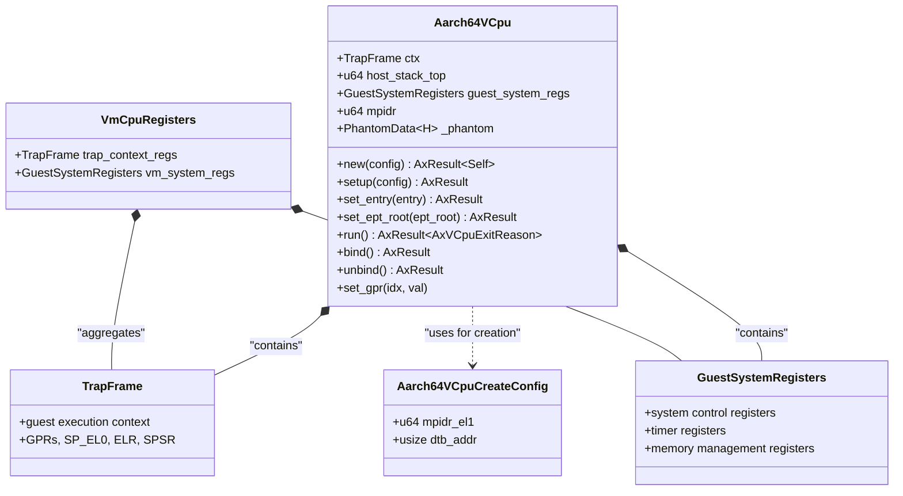
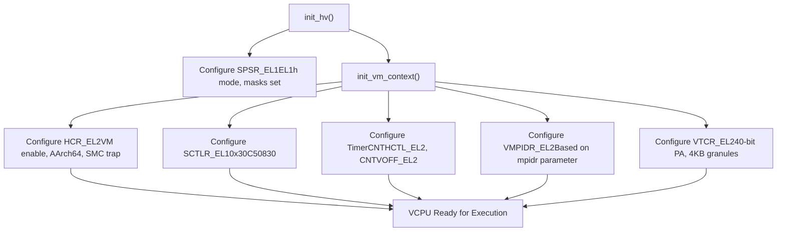
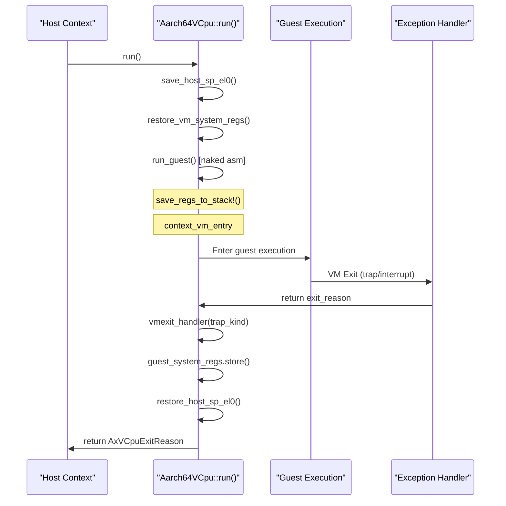
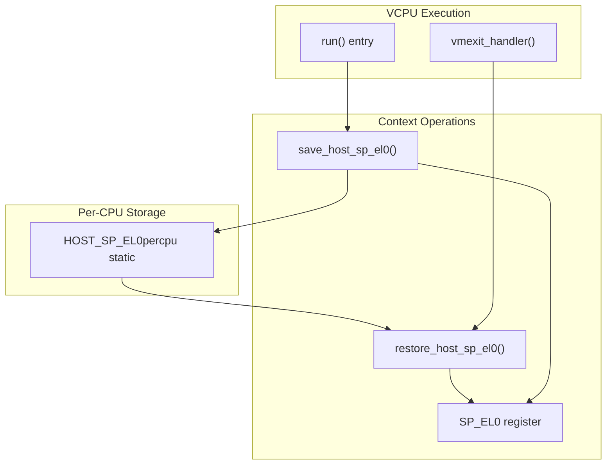
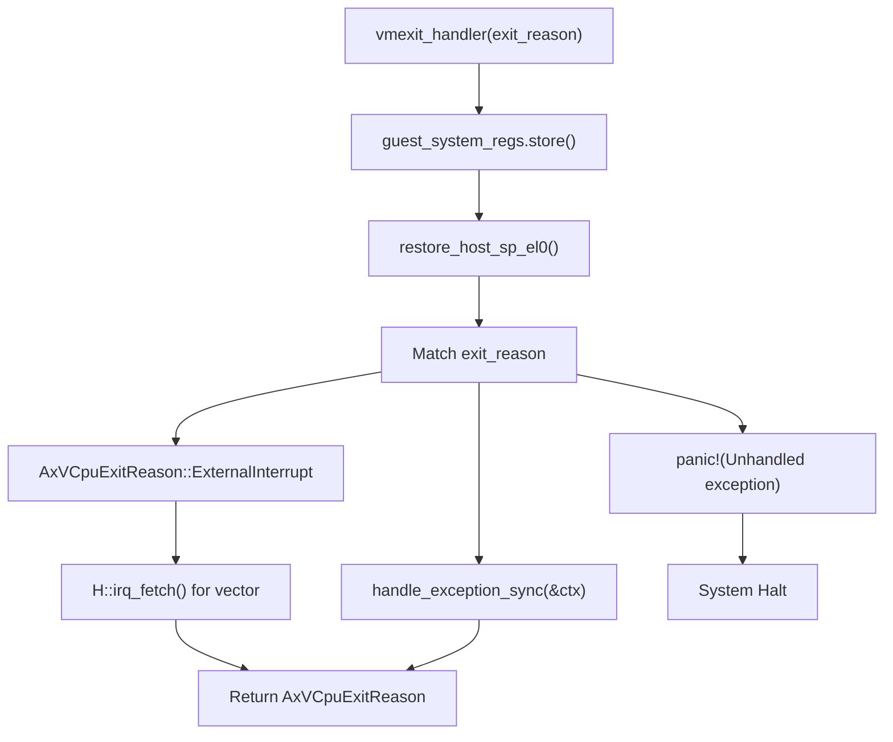

# Virtual CPU Management

> **Relevant source files**
> * [src/vcpu.rs](https://github.com/arceos-hypervisor/arm_vcpu/blob/4dd7e5df/src/vcpu.rs)

This document covers the core virtual CPU implementation in the arm_vcpu hypervisor system. It focuses on the `Aarch64VCpu` struct, its lifecycle management, configuration mechanisms, and the fundamental execution model for running guest virtual machines on AArch64 hardware.

For detailed information about VCPU lifecycle operations and VM exit handling, see [VCPU Lifecycle and Operations](/arceos-hypervisor/arm_vcpu/2.1-vcpu-lifecycle-and-operations). For per-CPU hardware state management and virtualization control, see [Per-CPU State Management](/arceos-hypervisor/arm_vcpu/2.2-per-cpu-state-management). For low-level context switching mechanics, see [Context Switching and State Management](/arceos-hypervisor/arm_vcpu/3-context-switching-and-state-management).

## Core VCPU Implementation

The `Aarch64VCpu<H: AxVCpuHal>` struct is the central component implementing virtual CPU functionality. It maintains both guest execution context and system register state, providing the foundation for running guest operating systems under hypervisor control.

### VCPU Structure and Components



The VCPU structure maintains critical ordering constraints where `ctx` and `host_stack_top` must remain at the beginning of the struct to support assembly code expectations for context switching operations.

**Sources:** [src/vcpu.rs(L40 - L51)&emsp;](https://github.com/arceos-hypervisor/arm_vcpu/blob/4dd7e5df/src/vcpu.rs#L40-L51) [src/vcpu.rs(L30 - L37)&emsp;](https://github.com/arceos-hypervisor/arm_vcpu/blob/4dd7e5df/src/vcpu.rs#L30-L37) [src/vcpu.rs(L54 - L62)&emsp;](https://github.com/arceos-hypervisor/arm_vcpu/blob/4dd7e5df/src/vcpu.rs#L54-L62)

### Hardware Abstraction Integration

```

```

The generic `H: AxVCpuHal` parameter allows the VCPU implementation to work with different hardware abstraction layers while maintaining platform independence.

**Sources:** [src/vcpu.rs(L8)&emsp;](https://github.com/arceos-hypervisor/arm_vcpu/blob/4dd7e5df/src/vcpu.rs#L8-L8) [src/vcpu.rs(L64 - L65)&emsp;](https://github.com/arceos-hypervisor/arm_vcpu/blob/4dd7e5df/src/vcpu.rs#L64-L65) [src/vcpu.rs(L278)&emsp;](https://github.com/arceos-hypervisor/arm_vcpu/blob/4dd7e5df/src/vcpu.rs#L278-L278)

## VCPU Configuration and Initialization

### Creation and Setup Process

The VCPU follows a two-phase initialization pattern: creation with hardware-specific configuration, followed by hypervisor setup.

|Phase|Function|Purpose|Configuration|
| --- | --- | --- | --- |
|Creation|new(config)|Basic structure allocation|Aarch64VCpuCreateConfig|
|Setup|setup(config)|Hypervisor initialization|()(empty)|
|Entry Configuration|set_entry(entry)|Guest entry point|GuestPhysAddr|
|Memory Setup|set_ept_root(ept_root)|Extended page table root|HostPhysAddr|

**Sources:** [src/vcpu.rs(L69 - L84)&emsp;](https://github.com/arceos-hypervisor/arm_vcpu/blob/4dd7e5df/src/vcpu.rs#L69-L84) [src/vcpu.rs(L87 - L96)&emsp;](https://github.com/arceos-hypervisor/arm_vcpu/blob/4dd7e5df/src/vcpu.rs#L87-L96)

### System Register Initialization



The initialization process configures essential system registers to establish the proper hypervisor and guest execution environment, including memory management, exception handling, and CPU identification.

**Sources:** [src/vcpu.rs(L128 - L166)&emsp;](https://github.com/arceos-hypervisor/arm_vcpu/blob/4dd7e5df/src/vcpu.rs#L128-L166)

## Execution Model and Context Management

### Host-Guest Context Switching



The execution model implements a clean separation between host and guest contexts, with careful register state management and stack handling to ensure proper isolation.

**Sources:** [src/vcpu.rs(L99 - L111)&emsp;](https://github.com/arceos-hypervisor/arm_vcpu/blob/4dd7e5df/src/vcpu.rs#L99-L111) [src/vcpu.rs(L182 - L214)&emsp;](https://github.com/arceos-hypervisor/arm_vcpu/blob/4dd7e5df/src/vcpu.rs#L182-L214) [src/vcpu.rs(L255 - L282)&emsp;](https://github.com/arceos-hypervisor/arm_vcpu/blob/4dd7e5df/src/vcpu.rs#L255-L282)

### Per-CPU State Management



The per-CPU state management ensures that host context is properly preserved across guest execution cycles, using percpu storage to maintain thread-local state.

**Sources:** [src/vcpu.rs(L15 - L26)&emsp;](https://github.com/arceos-hypervisor/arm_vcpu/blob/4dd7e5df/src/vcpu.rs#L15-L26) [src/vcpu.rs(L102 - L104)&emsp;](https://github.com/arceos-hypervisor/arm_vcpu/blob/4dd7e5df/src/vcpu.rs#L102-L104) [src/vcpu.rs(L270 - L272)&emsp;](https://github.com/arceos-hypervisor/arm_vcpu/blob/4dd7e5df/src/vcpu.rs#L270-L272)

## VM Exit Processing

### Exit Reason Classification

The VCPU handles different types of VM exits through a structured dispatch mechanism:



The exit processing maintains proper state transitions and delegates complex synchronous exceptions to specialized handlers while handling interrupts directly.

**Sources:** [src/vcpu.rs(L255 - L282)&emsp;](https://github.com/arceos-hypervisor/arm_vcpu/blob/4dd7e5df/src/vcpu.rs#L255-L282)

### Register State Preservation

During VM exits, the system carefully manages register state to maintain proper isolation:

|Register Set|Storage Location|Timing|
| --- | --- | --- |
|Guest GPRs|TrapFrame.ctx|During exception entry (assembly)|
|Guest System Regs|GuestSystemRegisters|Invmexit_handler()|
|Host SP_EL0|HOST_SP_EL0percpu|Before guest execution|
|Guest SP_EL0|ctx.sp_el0|Fromguest_system_regs.sp_el0|

**Sources:** [src/vcpu.rs(L262 - L272)&emsp;](https://github.com/arceos-hypervisor/arm_vcpu/blob/4dd7e5df/src/vcpu.rs#L262-L272)