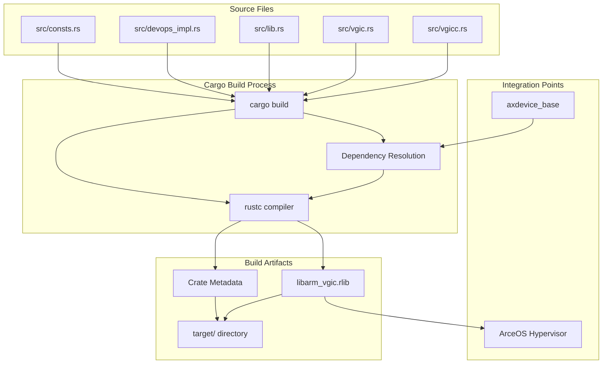
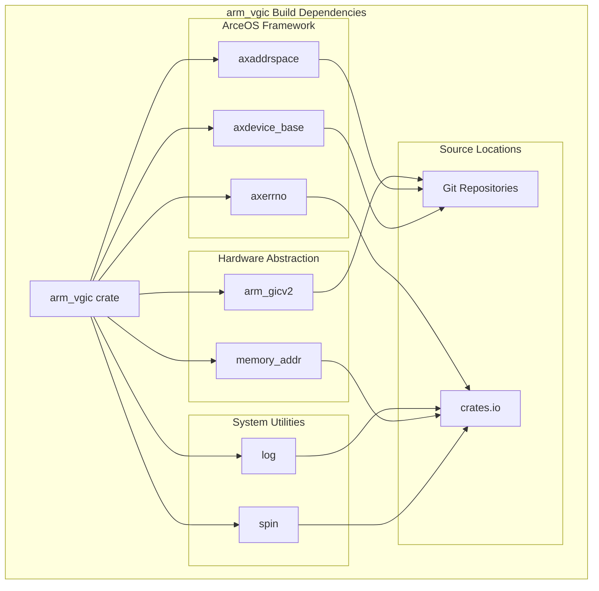
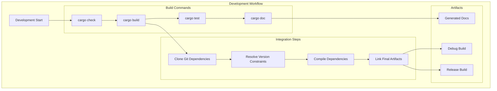

# Build Configuration

> **Relevant source files**
> * [.gitignore](https://github.com/arceos-hypervisor/arm_vgic/blob/2fa3fe56/.gitignore)
> * [Cargo.toml](https://github.com/arceos-hypervisor/arm_vgic/blob/2fa3fe56/Cargo.toml)

This document covers the build system configuration for the `arm_vgic` crate, including package metadata, dependency management, and development workflow. It explains how the crate is compiled and integrated within the ArceOS hypervisor ecosystem.

For information about runtime dependencies and system integration, see [Dependency Analysis](/arceos-hypervisor/arm_vgic/4.1-dependency-analysis). For architectural details about the components themselves, see [Core Components](/arceos-hypervisor/arm_vgic/3-core-components).

## Package Configuration

The `arm_vgic` crate is configured as a standard Rust library package using Cargo. The package metadata defines the basic build parameters and compilation target.

|Configuration|Value|Purpose|
| --- | --- | --- |
|Package Name|arm_vgic|Crate identifier for dependency resolution|
|Rust Edition|2021|Language feature set and compatibility|
|Package Type|Library|Compiled as a library crate for integration|

**Build Targets and Artifacts**



Sources: [Cargo.toml(L1 - L18)&emsp;](https://github.com/arceos-hypervisor/arm_vgic/blob/2fa3fe56/Cargo.toml#L1-L18)

## Dependency Configuration

The crate's dependencies are configured to integrate with the ArceOS ecosystem and provide ARM virtualization capabilities. Dependencies are sourced from both Git repositories and crates.io.

**Git Repository Dependencies**

|Dependency|Source Repository|Purpose|
| --- | --- | --- |
|axdevice_base|github.com/arceos-hypervisor/axdevice_crates.git|Device framework integration|
|axaddrspace|github.com/arceos-hypervisor/axaddrspace.git|Memory management interface|
|arm_gicv2|github.com/luodeb/arm_gicv2.git (rev: 2289063)|Physical GIC hardware driver|

**Crates.io Dependencies**

|Dependency|Version|Purpose|
| --- | --- | --- |
|memory_addr|0.3|Memory address abstractions|
|axerrno|0.1.0|Error handling types|
|log|0.4.21|Logging infrastructure|
|spin|0.9|Synchronization primitives|



Sources: [Cargo.toml(L7 - L17)&emsp;](https://github.com/arceos-hypervisor/arm_vgic/blob/2fa3fe56/Cargo.toml#L7-L17)

## Development Dependencies and Optional Features

The configuration includes commented-out dependencies that indicate potential future integrations or alternative development paths.

**Commented Dependencies**

```
// vcpu_if = { path = "../vcpu_if" }
// crate_interface = "0.1.3"
```

These suggest:

* Local development with a `vcpu_if` crate for CPU virtualization interfaces
* Potential use of `crate_interface` for dynamic plugin systems

The current build configuration prioritizes direct integration with ArceOS framework components rather than abstract interface layers.

Sources: [Cargo.toml(L14 - L15)&emsp;](https://github.com/arceos-hypervisor/arm_vgic/blob/2fa3fe56/Cargo.toml#L14-L15)

## Build Workflow

The standard development workflow follows Cargo conventions with specific considerations for the hypervisor development environment.

**Development Commands**



**Build Environment Requirements**

|Requirement|Purpose|
| --- | --- |
|Rust toolchain|Compilation and dependency management|
|Git access|Fetching Git-based dependencies|
|Network connectivity|Downloading crates.io dependencies|
|ARM target support|Cross-compilation for ARM platforms|

Sources: [Cargo.toml(L1 - L18)&emsp;](https://github.com/arceos-hypervisor/arm_vgic/blob/2fa3fe56/Cargo.toml#L1-L18) [.gitignore(L1)&emsp;](https://github.com/arceos-hypervisor/arm_vgic/blob/2fa3fe56/.gitignore#L1-L1)

## Git Configuration

The project includes basic Git configuration to exclude build artifacts from version control.

**Ignored Paths**

* `/target` - Cargo build output directory containing compiled artifacts

This ensures that only source code and configuration files are tracked, while build outputs are regenerated locally.

Sources: [.gitignore(L1)&emsp;](https://github.com/arceos-hypervisor/arm_vgic/blob/2fa3fe56/.gitignore#L1-L1)