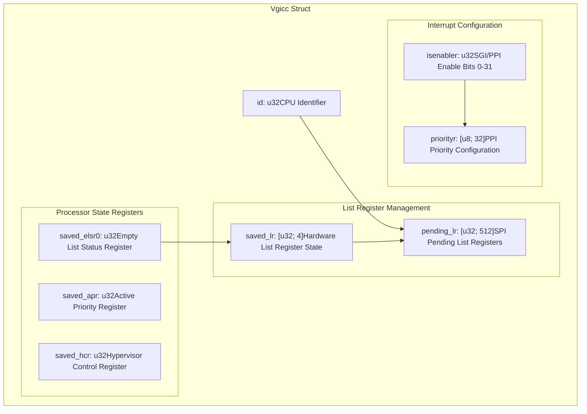
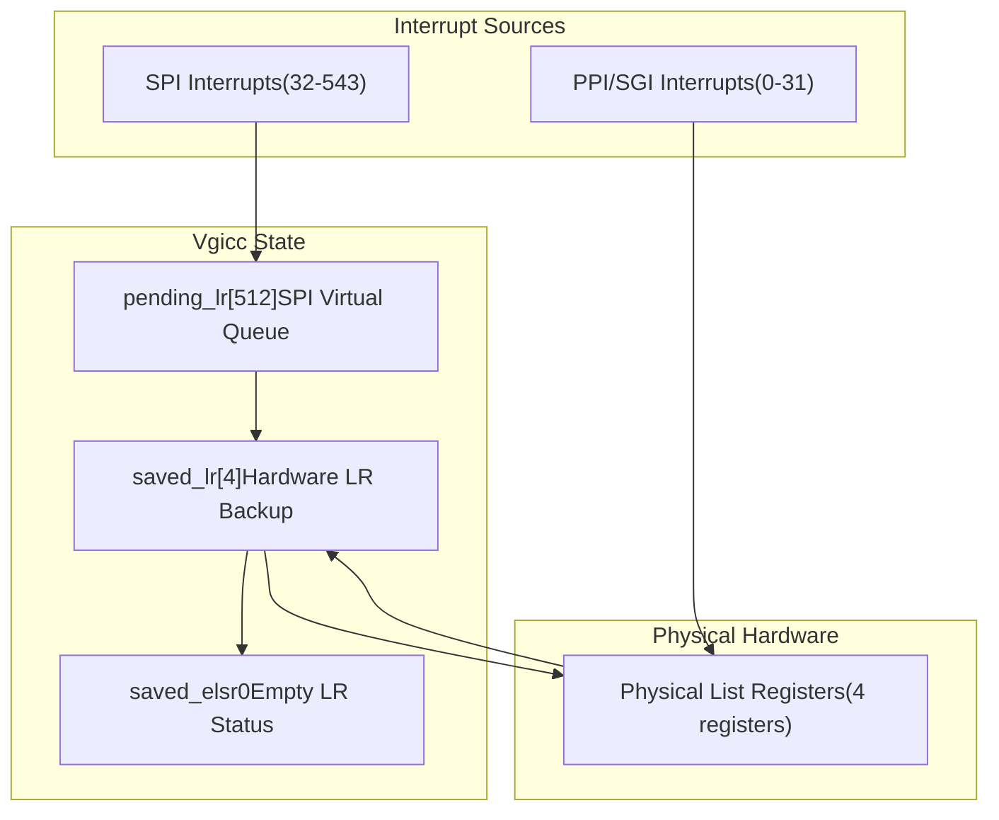
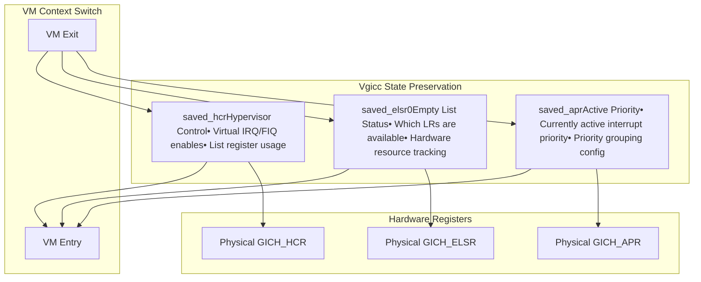
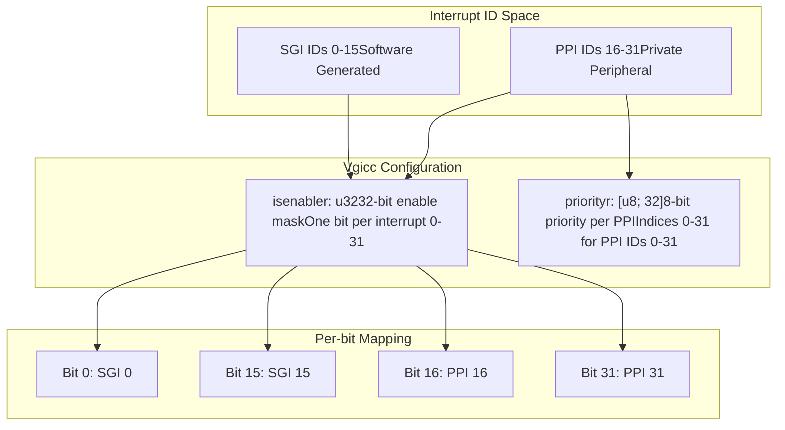
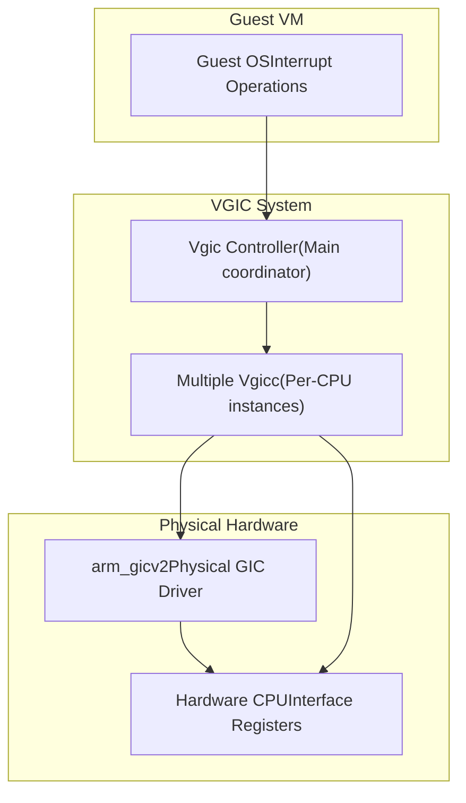

# CPU Interface (Vgicc)

> **Relevant source files**
> * [src/consts.rs](https://github.com/arceos-hypervisor/arm_vgic/blob/2fa3fe56/src/consts.rs)
> * [src/vgicc.rs](https://github.com/arceos-hypervisor/arm_vgic/blob/2fa3fe56/src/vgicc.rs)

This document covers the `Vgicc` struct, which implements the per-CPU interface portion of the virtual Generic Interrupt Controller (GIC). The `Vgicc` manages CPU-specific interrupt state, list registers for interrupt virtualization, and processor state saving/restoration.

For information about the main VGIC controller that coordinates multiple CPU interfaces, see [Virtual GIC Controller (Vgic)](/arceos-hypervisor/arm_vgic/3.1-virtual-gic-controller-(vgic)). For system-wide constants and register layouts, see [Constants and Register Layout](/arceos-hypervisor/arm_vgic/3.4-constants-and-register-layout).

## Structure Overview

The `Vgicc` struct represents a single CPU's interface to the virtual interrupt controller. Each CPU core in the virtualized system has its own `Vgicc` instance that maintains independent interrupt state and configuration.

### Vgicc Struct Layout

Sources: [src/vgicc.rs(L3 - L14)&emsp;](https://github.com/arceos-hypervisor/arm_vgic/blob/2fa3fe56/src/vgicc.rs#L3-L14)

### Field Categories and Responsibilities

|Category|Fields|Purpose|
| --- | --- | --- |
|CPU Identity|id|Uniquely identifies the CPU core this interface serves|
|List Register State|pending_lr,saved_lr|Manages virtual interrupt injection through hardware list registers|
|Processor Context|saved_elsr0,saved_apr,saved_hcr|Preserves CPU-specific GIC state during VM context switches|
|Interrupt Control|isenabler,priorityr|Configures interrupt enables and priorities for SGIs and PPIs|

Sources: [src/vgicc.rs(L4 - L13)&emsp;](https://github.com/arceos-hypervisor/arm_vgic/blob/2fa3fe56/src/vgicc.rs#L4-L13) [src/consts.rs(L1 - L4)&emsp;](https://github.com/arceos-hypervisor/arm_vgic/blob/2fa3fe56/src/consts.rs#L1-L4)

## List Register Management

The `Vgicc` manages two types of list register arrays that are central to ARM GIC virtualization:

### Hardware List Registers vs Pending Arrays

Sources: [src/vgicc.rs(L5 - L6)&emsp;](https://github.com/arceos-hypervisor/arm_vgic/blob/2fa3fe56/src/vgicc.rs#L5-L6) [src/consts.rs(L3 - L4)&emsp;](https://github.com/arceos-hypervisor/arm_vgic/blob/2fa3fe56/src/consts.rs#L3-L4)

The `saved_lr` array holds the contents of the 4 physical hardware list registers, while `pending_lr` provides a much larger virtual queue for SPI interrupts that cannot fit in the limited hardware registers.

## Processor State Management

The `Vgicc` maintains three critical processor state registers that must be preserved across VM context switches:

### State Register Functions

Sources: [src/vgicc.rs(L8 - L10)&emsp;](https://github.com/arceos-hypervisor/arm_vgic/blob/2fa3fe56/src/vgicc.rs#L8-L10)

## Interrupt Configuration State

The `Vgicc` maintains per-CPU interrupt configuration for Software Generated Interrupts (SGIs) and Private Peripheral Interrupts (PPIs):

### SGI and PPI Management

Sources: [src/vgicc.rs(L12 - L13)&emsp;](https://github.com/arceos-hypervisor/arm_vgic/blob/2fa3fe56/src/vgicc.rs#L12-L13) [src/consts.rs(L1 - L2)&emsp;](https://github.com/arceos-hypervisor/arm_vgic/blob/2fa3fe56/src/consts.rs#L1-L2)

The `isenabler` field uses individual bits to track enable/disable state for each of the 32 SGI and PPI interrupts, while `priorityr` stores 8-bit priority values specifically for the 32 PPI interrupts.

## Integration with VGIC System

The `Vgicc` operates as part of the larger VGIC virtualization system:

### System Integration Flow

Sources: [src/vgicc.rs(L1 - L14)&emsp;](https://github.com/arceos-hypervisor/arm_vgic/blob/2fa3fe56/src/vgicc.rs#L1-L14)

Each `Vgicc` instance manages the virtualization state for one CPU core, coordinating with the main `Vgic` controller to provide a complete virtual interrupt controller implementation to guest operating systems.