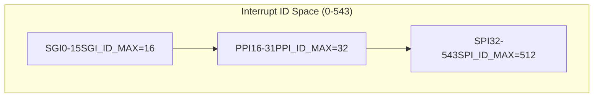
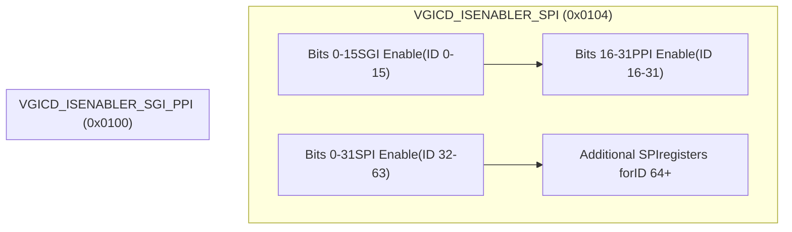

# Constants and Register Layout

> **Relevant source files**
> * [src/consts.rs](https://github.com/arceos-hypervisor/arm_vgic/blob/2fa3fe56/src/consts.rs)

This page documents the system constants, register offsets, and memory layout configuration used by the Virtual Generic Interrupt Controller (VGIC) implementation. These constants define the interrupt ID ranges, register mappings, and hardware configuration limits that govern how the virtual interrupt controller emulates ARM GIC functionality for guest virtual machines.

For information about how these constants are used in the main VGIC implementation, see [Virtual GIC Controller (Vgic)](/arceos-hypervisor/arm_vgic/3.1-virtual-gic-controller-(vgic)). For details on the CPU interface configuration, see [CPU Interface (Vgicc)](/arceos-hypervisor/arm_vgic/3.2-cpu-interface-(vgicc)).

## Interrupt ID Ranges and Classifications

The VGIC implementation supports three categories of interrupts as defined by the ARM GIC specification, each with specific ID ranges and usage patterns.

### Interrupt Type Limits

|Interrupt Type|Constant|Value|ID Range|Description|
| --- | --- | --- | --- | --- |
|Software Generated Interrupts (SGI)|SGI_ID_MAX|16|0-15|Inter-processor interrupts for VM communication|
|Private Peripheral Interrupts (PPI)|PPI_ID_MAX|32|16-31|Per-CPU private interrupts|
|Shared Peripheral Interrupts (SPI)|SPI_ID_MAX|512|32-543|Shared interrupts across multiple CPUs|

### List Register Configuration

The CPU interface supports a fixed number of list registers for interrupt virtualization:

|Configuration|Constant|Value|Purpose|
| --- | --- | --- | --- |
|List Registers|GICD_LR_NUM|4|Maximum number of pending interrupts per CPU|

**Interrupt ID Space Layout**

Sources: [src/consts.rs(L1 - L4)&emsp;](https://github.com/arceos-hypervisor/arm_vgic/blob/2fa3fe56/src/consts.rs#L1-L4)

## VGIC Distributor Register Layout

The Virtual GIC Distributor (VGICD) registers are mapped to specific offsets within the device memory space. These offsets correspond to standard ARM GIC register locations that guest VMs expect to access.

### Control and Status Registers

|Register|Constant|Offset|Access|Purpose|
| --- | --- | --- | --- | --- |
|Control Register|VGICD_CTLR|0x0000|RW|Global interrupt controller enable/disable|

### Interrupt Enable Registers

The interrupt enable registers are split by interrupt type to optimize access patterns:

|Register|Constant|Offset|Access|Purpose|
| --- | --- | --- | --- | --- |
|Set Enable SGI/PPI|VGICD_ISENABLER_SGI_PPI|0x0100|RW|Enable SGI and PPI interrupts (ID 0-31)|
|Set Enable SPI|VGICD_ISENABLER_SPI|0x0104|RW|Enable SPI interrupts (ID 32+)|
|Clear Enable SGI/PPI|VGICD_ICENABLER_SGI_PPI|0x0180|RW|Disable SGI and PPI interrupts (ID 0-31)|
|Clear Enable SPI|VGICD_ICENABLER_SPI|0x0184|RW|Disable SPI interrupts (ID 32+)|

### Interrupt State Registers

|Register|Constant|Offset|Access|Purpose|
| --- | --- | --- | --- | --- |
|Set Pending|VGICD_ISPENDR|0x0200|RW|Set interrupt pending state|
|Clear Pending|VGICD_ICPENDR|0x5|RW|Clear interrupt pending state|
|Set Active|VGICD_ISACTIVER|0x6|RW|Set interrupt active state|
|Clear Active|VGICD_ICACTIVER|0x7|RW|Clear interrupt active state|

### Configuration and Control Registers

|Register|Constant|Offset|Access|Purpose|
| --- | --- | --- | --- | --- |
|Configuration|VGICD_ICFGR|0x18|RW|Interrupt trigger type configuration|
|Software Generated Interrupt|VGICD_SGIR|0x1e|WO|Generate software interrupts|

**VGIC Register Memory Map**

```mermaid
flowchart TD
subgraph subGraph4["VGIC Distributor Register Space"]
    ISACTIVER["VGICD_ISACTIVERSet Active"]
    ICACTIVER["VGICD_ICACTIVERClear Active"]
    ICENABLER_SGIPPI["VGICD_ICENABLER_SGI_PPI0x0180Clear Enable SGI/PPI"]
    subgraph subGraph1["Enable Registers (0x0100-0x01FF)"]
        ICFGR["VGICD_ICFGRConfiguration"]
        SGIR["VGICD_SGIRSoftware Generated IRQ"]
        ISPENDR["VGICD_ISPENDR0x0200Set Pending"]
        ICPENDR["VGICD_ICPENDRClear Pending"]
        ISENABLER_SGIPPI["VGICD_ISENABLER_SGI_PPI0x0100Set Enable SGI/PPI"]
        ISENABLER_SPI["VGICD_ISENABLER_SPI0x0104Set Enable SPI"]
        ICENABLER_SPI["VGICD_ICENABLER_SPI0x0184Clear Enable SPI"]
        CTLR["VGICD_CTLR0x0000Control Register"]
        subgraph subGraph2["Pending/Active Registers (0x0200+)"]
            ISACTIVER["VGICD_ISACTIVERSet Active"]
            ICACTIVER["VGICD_ICACTIVERClear Active"]
            ICENABLER_SGIPPI["VGICD_ICENABLER_SGI_PPI0x0180Clear Enable SGI/PPI"]
            subgraph subGraph3["Configuration (Various Offsets)"]
                ICFGR["VGICD_ICFGRConfiguration"]
                SGIR["VGICD_SGIRSoftware Generated IRQ"]
                ISPENDR["VGICD_ISPENDR0x0200Set Pending"]
                ICPENDR["VGICD_ICPENDRClear Pending"]
                ISENABLER_SGIPPI["VGICD_ISENABLER_SGI_PPI0x0100Set Enable SGI/PPI"]
                ISENABLER_SPI["VGICD_ISENABLER_SPI0x0104Set Enable SPI"]
                CTLR["VGICD_CTLR0x0000Control Register"]
            end
            subgraph subGraph0["Control Block (0x0000-0x00FF)"]
                ICFGR["VGICD_ICFGRConfiguration"]
                ISPENDR["VGICD_ISPENDR0x0200Set Pending"]
                ISENABLER_SGIPPI["VGICD_ISENABLER_SGI_PPI0x0100Set Enable SGI/PPI"]
                CTLR["VGICD_CTLR0x0000Control Register"]
            end
        end
    end
end
```

Sources: [src/consts.rs(L6 - L19)&emsp;](https://github.com/arceos-hypervisor/arm_vgic/blob/2fa3fe56/src/consts.rs#L6-L19)

## Register Access Patterns

The register layout follows ARM GIC specification patterns where related registers are grouped by function and interrupt type. The separation of SGI/PPI and SPI enable registers reflects the different handling requirements for private versus shared interrupts.

### Enable Register Organization

**Enable Register Bit Mapping**

### Register Offset Patterns

The register offsets follow standard ARM GIC conventions:

* **0x0000-0x00FF**: Control and identification registers
* **0x0100-0x017F**: Interrupt Set Enable registers
* **0x0180-0x01FF**: Interrupt Clear Enable registers
* **0x0200-0x027F**: Interrupt Set Pending registers
* **0x0280-0x02FF**: Interrupt Clear Pending registers

This layout ensures compatibility with guest operating systems expecting standard GIC register locations while allowing the hypervisor to intercept and virtualize all interrupt controller access.

Sources: [src/consts.rs(L7 - L19)&emsp;](https://github.com/arceos-hypervisor/arm_vgic/blob/2fa3fe56/src/consts.rs#L7-L19)