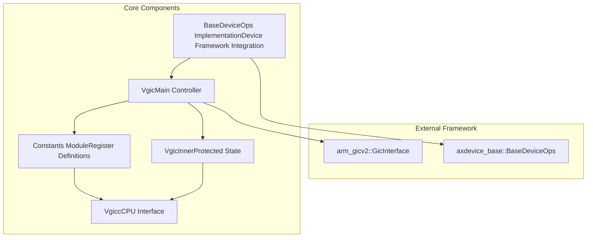
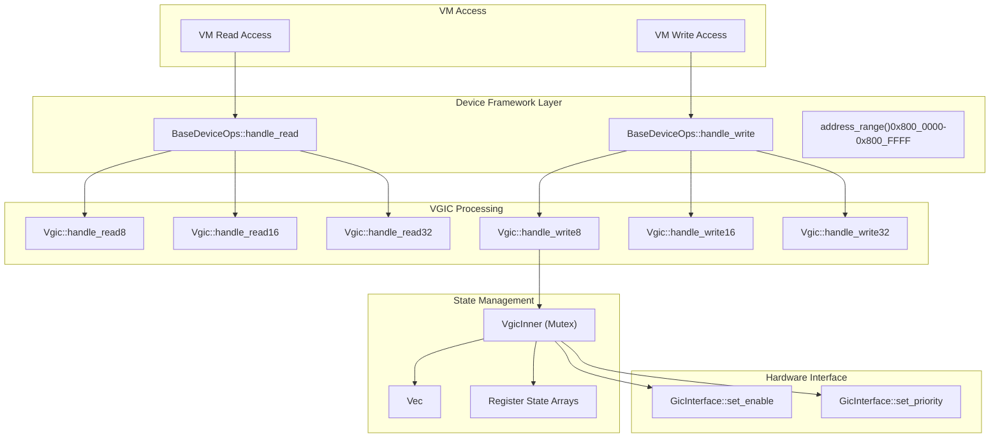
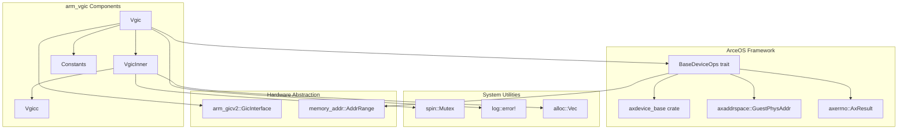

# Core Components

> **Relevant source files**
> * [src/consts.rs](https://github.com/arceos-hypervisor/arm_vgic/blob/2fa3fe56/src/consts.rs)
> * [src/devops_impl.rs](https://github.com/arceos-hypervisor/arm_vgic/blob/2fa3fe56/src/devops_impl.rs)
> * [src/vgic.rs](https://github.com/arceos-hypervisor/arm_vgic/blob/2fa3fe56/src/vgic.rs)
> * [src/vgicc.rs](https://github.com/arceos-hypervisor/arm_vgic/blob/2fa3fe56/src/vgicc.rs)

This document provides an overview of the four primary components that make up the `arm_vgic` virtual interrupt controller system. These components work together to provide complete ARM GIC (Generic Interrupt Controller) virtualization within the ArceOS hypervisor ecosystem.

For detailed information about system architecture and positioning within the broader virtualization stack, see [System Architecture](/arceos-hypervisor/arm_vgic/2-system-architecture). For dependency analysis and integration details, see [Dependencies and Integration](/arceos-hypervisor/arm_vgic/4-dependencies-and-integration).

## Component Architecture Overview

The `arm_vgic` crate is structured around four core components that provide different aspects of interrupt controller virtualization:

**Component Architecture**

Sources: [src/vgic.rs(L32 - L34)&emsp;](https://github.com/arceos-hypervisor/arm_vgic/blob/2fa3fe56/src/vgic.rs#L32-L34) [src/vgicc.rs(L3 - L14)&emsp;](https://github.com/arceos-hypervisor/arm_vgic/blob/2fa3fe56/src/vgicc.rs#L3-L14) [src/devops_impl.rs(L10)&emsp;](https://github.com/arceos-hypervisor/arm_vgic/blob/2fa3fe56/src/devops_impl.rs#L10-L10) [src/consts.rs(L1 - L19)&emsp;](https://github.com/arceos-hypervisor/arm_vgic/blob/2fa3fe56/src/consts.rs#L1-L19)

## Data Flow and Component Interaction

The components interact through a well-defined data flow that handles virtual machine memory accesses and translates them to physical interrupt controller operations:

**Data Flow Between Components**

Sources: [src/devops_impl.rs(L45 - L66)&emsp;](https://github.com/arceos-hypervisor/arm_vgic/blob/2fa3fe56/src/devops_impl.rs#L45-L66) [src/devops_impl.rs(L77 - L98)&emsp;](https://github.com/arceos-hypervisor/arm_vgic/blob/2fa3fe56/src/devops_impl.rs#L77-L98) [src/vgic.rs(L56 - L66)&emsp;](https://github.com/arceos-hypervisor/arm_vgic/blob/2fa3fe56/src/vgic.rs#L56-L66) [src/vgic.rs(L68 - L106)&emsp;](https://github.com/arceos-hypervisor/arm_vgic/blob/2fa3fe56/src/vgic.rs#L68-L106) [src/vgic.rs(L15 - L30)&emsp;](https://github.com/arceos-hypervisor/arm_vgic/blob/2fa3fe56/src/vgic.rs#L15-L30)

## Component Responsibilities

### Virtual GIC Controller (Vgic)

The `Vgic` struct serves as the main controller that orchestrates interrupt virtualization. It maintains thread-safe access to the internal state through a `Mutex<VgicInner>` and provides the primary interface for handling virtual machine memory accesses to interrupt controller registers.

Key responsibilities:

* Memory-mapped register access handling via `handle_read8/16/32` and `handle_write8/16/32` methods
* Thread-safe state management through `VgicInner` mutex protection
* Physical interrupt controller coordination via `arm_gicv2::GicInterface`
* Interrupt enable/disable control and priority management

For comprehensive details, see [Virtual GIC Controller (Vgic)](/arceos-hypervisor/arm_vgic/3.1-virtual-gic-controller-(vgic)).

Sources: [src/vgic.rs(L32 - L34)&emsp;](https://github.com/arceos-hypervisor/arm_vgic/blob/2fa3fe56/src/vgic.rs#L32-L34) [src/vgic.rs(L36 - L54)&emsp;](https://github.com/arceos-hypervisor/arm_vgic/blob/2fa3fe56/src/vgic.rs#L36-L54)

### CPU Interface (Vgicc)

The `Vgicc` struct manages per-CPU interrupt controller state, including link registers for interrupt delivery and saved processor state for context switching operations.

Key responsibilities:

* Per-CPU interrupt state management with unique `id` field
* Link register arrays for interrupt queuing (`pending_lr`, `saved_lr`)
* Processor state preservation (`saved_elsr0`, `saved_apr`, `saved_hcr`)
* Local interrupt enable/priority configuration (`isenabler`, `priorityr`)

For detailed analysis, see [CPU Interface (Vgicc)](/arceos-hypervisor/arm_vgic/3.2-cpu-interface-(vgicc)).

Sources: [src/vgicc.rs(L3 - L14)&emsp;](https://github.com/arceos-hypervisor/arm_vgic/blob/2fa3fe56/src/vgicc.rs#L3-L14)

### Device Operations Interface

The `BaseDeviceOps` trait implementation bridges the `Vgic` controller with the ArceOS device framework, providing standardized device emulation capabilities.

Key responsibilities:

* Device type identification via `emu_type()` returning `EmuDeviceTGicdV2`
* Address space definition through `address_range()` covering `0x800_0000` to `0x800_FFFF`
* Width-based memory access dispatch (8/16/32-bit operations)
* Address masking and alignment handling

For implementation details, see [Device Operations Interface](/arceos-hypervisor/arm_vgic/3.3-device-operations-interface).

Sources: [src/devops_impl.rs(L10)&emsp;](https://github.com/arceos-hypervisor/arm_vgic/blob/2fa3fe56/src/devops_impl.rs#L10-L10) [src/devops_impl.rs(L18 - L31)&emsp;](https://github.com/arceos-hypervisor/arm_vgic/blob/2fa3fe56/src/devops_impl.rs#L18-L31)

### Constants and Register Layout

The constants module defines critical system parameters, interrupt ID limits, and register offset mappings that govern the virtual interrupt controller behavior.

Key definitions:

* Interrupt ID boundaries: `SGI_ID_MAX`, `PPI_ID_MAX`, `SPI_ID_MAX`
* Link register configuration: `GICD_LR_NUM`
* VGICD register offsets: `VGICD_CTLR`, `VGICD_ISENABLER_*`, `VGICD_ICENABLER_*`
* Control and configuration register addresses

For complete reference, see [Constants and Register Layout](/arceos-hypervisor/arm_vgic/3.4-constants-and-register-layout).

Sources: [src/consts.rs(L1 - L19)&emsp;](https://github.com/arceos-hypervisor/arm_vgic/blob/2fa3fe56/src/consts.rs#L1-L19)

## Integration Architecture

**Component Integration with External Systems**

Sources: [src/vgic.rs(L1 - L11)&emsp;](https://github.com/arceos-hypervisor/arm_vgic/blob/2fa3fe56/src/vgic.rs#L1-L11) [src/devops_impl.rs(L1 - L8)&emsp;](https://github.com/arceos-hypervisor/arm_vgic/blob/2fa3fe56/src/devops_impl.rs#L1-L8) [src/vgicc.rs(L2)&emsp;](https://github.com/arceos-hypervisor/arm_vgic/blob/2fa3fe56/src/vgicc.rs#L2-L2)

The four core components work together to provide a complete virtual interrupt controller implementation that integrates seamlessly with the ArceOS hypervisor framework while maintaining efficient virtualization of ARM GIC functionality.