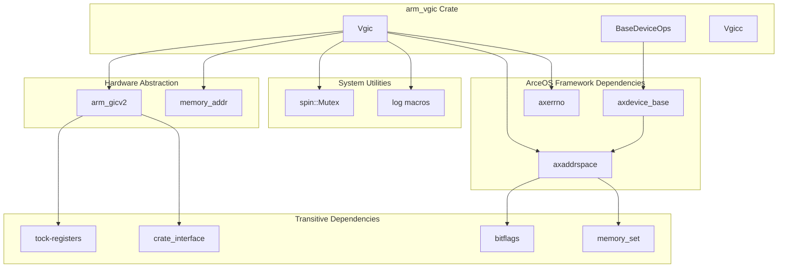
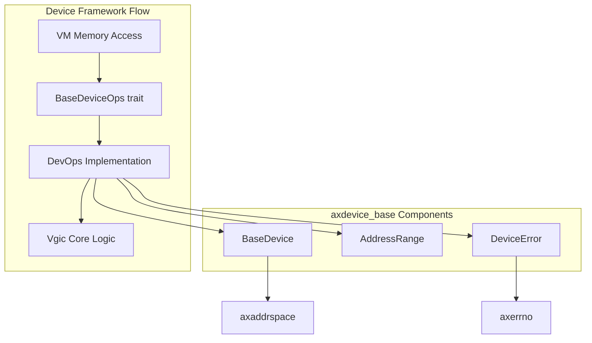
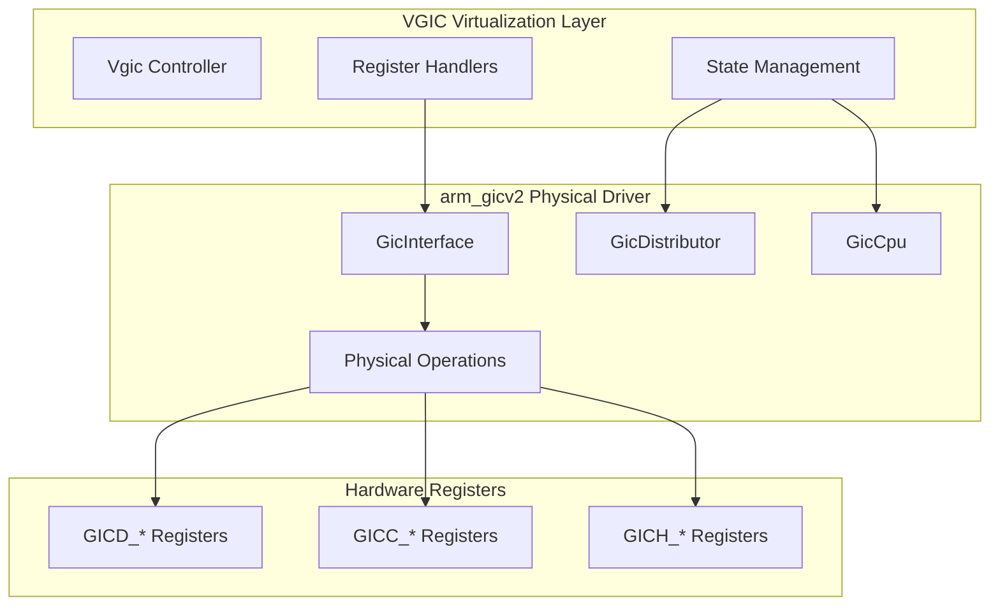
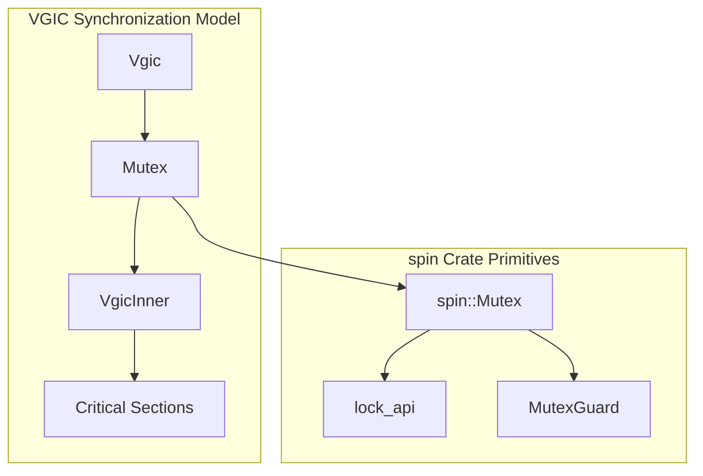
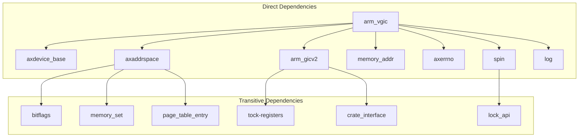

# Dependencies and Integration

> **Relevant source files**
> * [Cargo.lock](https://github.com/arceos-hypervisor/arm_vgic/blob/2fa3fe56/Cargo.lock)
> * [Cargo.toml](https://github.com/arceos-hypervisor/arm_vgic/blob/2fa3fe56/Cargo.toml)

This document analyzes the external dependencies of the `arm_vgic` crate and explains how it integrates with the broader ArceOS hypervisor ecosystem. It covers dependency categorization, version management, integration patterns, and build system configuration.

For detailed information about the internal system architecture, see [System Architecture](/arceos-hypervisor/arm_vgic/2-system-architecture). For documentation of specific component implementations, see [Core Components](/arceos-hypervisor/arm_vgic/3-core-components).

## Dependency Overview

The `arm_vgic` crate integrates with the ArceOS hypervisor ecosystem through a carefully structured set of dependencies that provide device framework support, memory management, hardware abstraction, and system utilities.

### Dependency Categories

The dependencies can be categorized into four main groups based on their role in the system:

|Category|Dependencies|Purpose|
| --- | --- | --- |
|ArceOS Framework|axdevice_base,axaddrspace,axerrno|Core hypervisor framework integration|
|Hardware Abstraction|arm_gicv2,memory_addr|Physical hardware interface and memory primitives|
|System Utilities|spin,log|Thread synchronization and logging|
|Development Tools|(Cargo build system)|Build configuration and dependency resolution|

### Dependency Resolution Architecture

*Sources: [Cargo.toml(L7 - L17)&emsp;](https://github.com/arceos-hypervisor/arm_vgic/blob/2fa3fe56/Cargo.toml#L7-L17) [Cargo.lock(L24 - L34)&emsp;](https://github.com/arceos-hypervisor/arm_vgic/blob/2fa3fe56/Cargo.lock#L24-L34)*

## ArceOS Framework Integration

### Device Framework Integration

The `arm_vgic` crate integrates with the ArceOS device framework through the `axdevice_base` dependency, which provides the foundational device abstraction layer.

*Sources: [Cargo.toml(L8)&emsp;](https://github.com/arceos-hypervisor/arm_vgic/blob/2fa3fe56/Cargo.toml#L8-L8) [Cargo.lock(L60 - L69)&emsp;](https://github.com/arceos-hypervisor/arm_vgic/blob/2fa3fe56/Cargo.lock#L60-L69)*

### Memory Management Integration

The `axaddrspace` dependency provides memory management capabilities including address space abstraction and page table management.

**Key Integration Points:**

* **Address Translation**: Converting guest virtual addresses to host physical addresses
* **Memory Protection**: Enforcing access permissions for virtualized GIC registers
* **Address Range Validation**: Ensuring memory accesses fall within valid GIC register ranges

### Error Handling Integration

The `axerrno` dependency provides standardized error handling across the ArceOS ecosystem.

**Error Integration Pattern:**

* Device operation errors propagate through `axerrno::AxResult<T>`
* Error codes maintain consistency with the broader hypervisor framework
* Logging integration provides structured error reporting

*Sources: [Cargo.toml(L9 - L11)&emsp;](https://github.com/arceos-hypervisor/arm_vgic/blob/2fa3fe56/Cargo.toml#L9-L11) [Cargo.lock(L43 - L57)&emsp;](https://github.com/arceos-hypervisor/arm_vgic/blob/2fa3fe56/Cargo.lock#L43-L57) [Cargo.lock(L72 - L78)&emsp;](https://github.com/arceos-hypervisor/arm_vgic/blob/2fa3fe56/Cargo.lock#L72-L78)*

## Hardware Abstraction Layer

### Physical GIC Driver Integration

The `arm_gicv2` dependency provides the interface to physical ARM Generic Interrupt Controller hardware.

**Integration Characteristics:**

* **Version Pinning**: Uses specific git revision `2289063` for stability
* **Hardware Abstraction**: Provides register-level access through `tock-registers`
* **Interface Consistency**: Maintains consistent API with virtual GIC operations

*Sources: [Cargo.toml(L12)&emsp;](https://github.com/arceos-hypervisor/arm_vgic/blob/2fa3fe56/Cargo.toml#L12-L12) [Cargo.lock(L15 - L21)&emsp;](https://github.com/arceos-hypervisor/arm_vgic/blob/2fa3fe56/Cargo.lock#L15-L21)*

### Memory Address Primitives

The `memory_addr` dependency provides type-safe memory address handling.

**Memory Address Types Used:**

* `PhysAddr`: Physical memory addresses for hardware register access
* `VirtAddr`: Virtual addresses for guest memory mapping
* `HostVirtAddr`: Host virtual addresses for hypervisor operations

*Sources: [Cargo.toml(L10)&emsp;](https://github.com/arceos-hypervisor/arm_vgic/blob/2fa3fe56/Cargo.toml#L10-L10) [Cargo.lock(L150 - L159)&emsp;](https://github.com/arceos-hypervisor/arm_vgic/blob/2fa3fe56/Cargo.lock#L150-L159)*

## System Utilities and Threading

### Synchronization Primitives

The `spin` dependency provides lock-free synchronization primitives essential for hypervisor operation.

**Synchronization Strategy:**

* **Lock-Free Design**: Uses spinlocks suitable for hypervisor context
* **Fine-Grained Locking**: Protects internal VGIC state without blocking interrupt handling
* **Deadlock Prevention**: Consistent lock ordering across operations

*Sources: [Cargo.toml(L17)&emsp;](https://github.com/arceos-hypervisor/arm_vgic/blob/2fa3fe56/Cargo.toml#L17-L17) [Cargo.lock(L271 - L277)&emsp;](https://github.com/arceos-hypervisor/arm_vgic/blob/2fa3fe56/Cargo.lock#L271-L277)*

### Logging Infrastructure

The `log` dependency provides structured logging capabilities integrated with the ArceOS logging framework.

**Logging Integration:**

* **Debug Information**: Register access patterns and state transitions
* **Error Reporting**: Failed operations and validation errors
* **Performance Monitoring**: Operation timing and frequency analysis

*Sources: [Cargo.toml(L13)&emsp;](https://github.com/arceos-hypervisor/arm_vgic/blob/2fa3fe56/Cargo.toml#L13-L13) [Cargo.lock(L144 - L147)&emsp;](https://github.com/arceos-hypervisor/arm_vgic/blob/2fa3fe56/Cargo.lock#L144-L147)*

## Build System Integration

### Version Management Strategy

The build system uses a mixed approach to dependency version management:

|Dependency Type|Version Strategy|Rationale|
| --- | --- | --- |
|ArceOS Framework|Git repositories with latest|Active development coordination|
|Hardware Drivers|Git with pinned revision|Stability and compatibility|
|System Utilities|Semantic versioning|Mature, stable APIs|

### Dependency Resolution Chain

**Build Configuration Characteristics:**

* **Edition 2021**: Uses latest Rust edition features
* **No Default Features**: Minimal dependency surface
* **Git Source Priority**: Framework dependencies use git sources for latest features

*Sources: [Cargo.toml(L1 - L18)&emsp;](https://github.com/arceos-hypervisor/arm_vgic/blob/2fa3fe56/Cargo.toml#L1-L18) [Cargo.lock(L1 - L330)&emsp;](https://github.com/arceos-hypervisor/arm_vgic/blob/2fa3fe56/Cargo.lock#L1-L330)*

## Integration Patterns and Architectural Considerations

### Layered Integration Model

The `arm_vgic` crate follows a layered integration pattern that maintains clear separation of concerns:

1. **Framework Layer**: Integrates with ArceOS device and memory management
2. **Abstraction Layer**: Uses hardware abstraction for physical GIC access
3. **Utility Layer**: Leverages system utilities for synchronization and logging
4. **Application Layer**: Exposes virtualization capabilities to hypervisor

### Dependency Injection and Inversion of Control

The crate uses dependency inversion principles where high-level virtualization logic depends on abstractions rather than concrete implementations, enabling:

* **Testability**: Mock implementations for unit testing
* **Portability**: Different hardware backends through common interfaces
* **Maintainability**: Clear separation between virtualization logic and platform specifics

*Sources: [Cargo.toml(L7 - L17)&emsp;](https://github.com/arceos-hypervisor/arm_vgic/blob/2fa3fe56/Cargo.toml#L7-L17) [Cargo.lock(L24 - L34)&emsp;](https://github.com/arceos-hypervisor/arm_vgic/blob/2fa3fe56/Cargo.lock#L24-L34)*