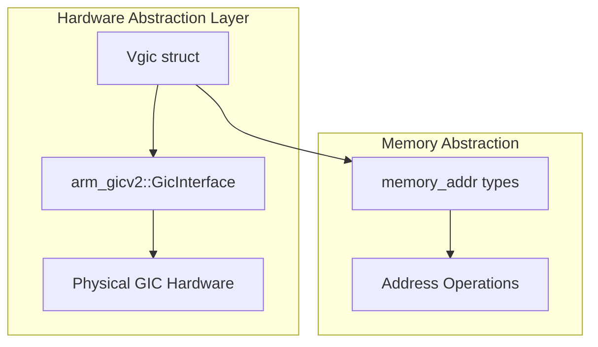
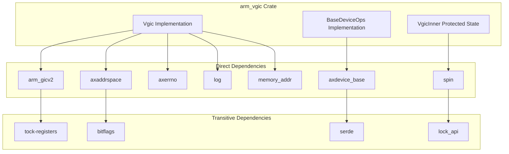
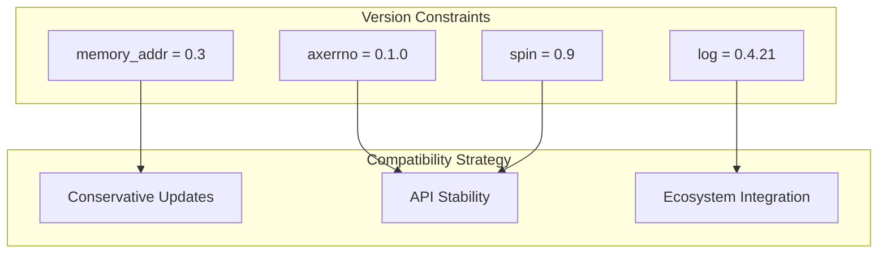
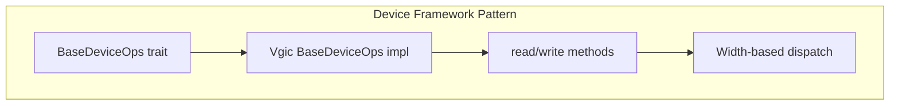
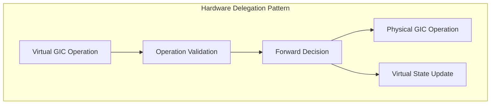
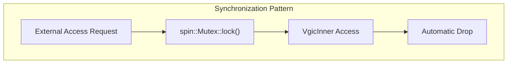

# Dependency Analysis

> **Relevant source files**
> * [Cargo.lock](https://github.com/arceos-hypervisor/arm_vgic/blob/2fa3fe56/Cargo.lock)
> * [Cargo.toml](https://github.com/arceos-hypervisor/arm_vgic/blob/2fa3fe56/Cargo.toml)

This document provides a comprehensive analysis of the external dependencies used by the `arm_vgic` crate and how they integrate to enable virtual interrupt controller functionality within the ArceOS hypervisor ecosystem. The analysis covers direct dependencies, their roles in the system architecture, version constraints, and integration patterns.

For information about the overall system architecture and component interactions, see [System Architecture](/arceos-hypervisor/arm_vgic/2-system-architecture). For details about how dependencies are configured in the build system, see [Build Configuration](/arceos-hypervisor/arm_vgic/4.2-build-configuration).

## Direct Dependencies Overview

The `arm_vgic` crate relies on seven direct dependencies that provide foundational capabilities for device emulation, memory management, hardware abstraction, and system utilities. Each dependency serves a specific architectural role in implementing the virtual GIC functionality.

### ArceOS Framework Dependencies

The core ArceOS framework dependencies provide the foundational abstractions for device emulation and memory management within the hypervisor environment.

|Dependency|Version/Source|Primary Role|
| --- | --- | --- |
|axdevice_base|Git repository|Device framework integration and trait definitions|
|axaddrspace|Git repository|Virtual memory management and address space operations|
|axerrno|0.1.0|Standardized error handling across ArceOS components|

**Device Framework Integration**

The `axdevice_base` dependency provides the `BaseDeviceOps` trait that enables the VGIC to integrate with the ArceOS device management framework. This integration is implemented in [devops_impl.rs(L1 - L87)&emsp;](https://github.com/arceos-hypervisor/arm_vgic/blob/2fa3fe56/devops_impl.rs#L1-L87) where the `Vgic` struct implements device operations for memory-mapped I/O handling.

**Memory Management Abstraction**

The `axaddrspace` dependency supplies memory management primitives used throughout the VGIC implementation for address translation, memory region management, and virtual memory operations. The integration occurs primarily in the device operations where guest physical addresses are translated and validated.

Sources: [Cargo.toml(L7 - L11)&emsp;](https://github.com/arceos-hypervisor/arm_vgic/blob/2fa3fe56/Cargo.toml#L7-L11) [Cargo.lock(L43 - L78)&emsp;](https://github.com/arceos-hypervisor/arm_vgic/blob/2fa3fe56/Cargo.lock#L43-L78)

### Hardware Abstraction Dependencies

These dependencies provide low-level hardware abstractions and type definitions for ARM GIC hardware and memory address handling.

|Dependency|Version/Source|Hardware Component|
| --- | --- | --- |
|arm_gicv2|Git commit 2289063|Physical ARM GICv2 hardware interface|
|memory_addr|0.3|Memory address types and operations|

**Physical GIC Interface**

The `arm_gicv2` dependency provides the hardware abstraction layer for interfacing with physical ARM Generic Interrupt Controller version 2 hardware. The VGIC uses this interface to forward virtual interrupt operations to the underlying physical hardware when necessary.

Sources: [Cargo.toml(L10 - L12)&emsp;](https://github.com/arceos-hypervisor/arm_vgic/blob/2fa3fe56/Cargo.toml#L10-L12) [Cargo.lock(L15 - L159)&emsp;](https://github.com/arceos-hypervisor/arm_vgic/blob/2fa3fe56/Cargo.lock#L15-L159)

### System Utility Dependencies

These dependencies provide essential system-level utilities for logging, synchronization, and concurrent access control.

|Dependency|Version|Functionality|
| --- | --- | --- |
|spin|0.9|Spinlock-based synchronization primitives|
|log|0.4.21|Structured logging and debug output|

**Synchronization Infrastructure**

The `spin` crate provides the `Mutex` type used to protect the `VgicInner` state from concurrent access. This is critical for thread-safe operation of the virtual interrupt controller across multiple CPU cores.

**Logging Framework**

The `log` crate enables structured logging throughout the VGIC implementation for debugging, monitoring, and system analysis. Log statements are used extensively in interrupt handling paths for troubleshooting virtualization behavior.

Sources: [Cargo.toml(L13 - L17)&emsp;](https://github.com/arceos-hypervisor/arm_vgic/blob/2fa3fe56/Cargo.toml#L13-L17) [Cargo.lock(L144 - L277)&emsp;](https://github.com/arceos-hypervisor/arm_vgic/blob/2fa3fe56/Cargo.lock#L144-L277)

## Dependency Relationship Analysis

The following diagram illustrates how dependencies interact and form the foundation for VGIC functionality:

Sources: [Cargo.toml(L7 - L17)&emsp;](https://github.com/arceos-hypervisor/arm_vgic/blob/2fa3fe56/Cargo.toml#L7-L17) [Cargo.lock(L24 - L34)&emsp;](https://github.com/arceos-hypervisor/arm_vgic/blob/2fa3fe56/Cargo.lock#L24-L34)

## Version Constraints and Compatibility

The dependency version strategy reflects the development status and integration requirements within the ArceOS ecosystem.

### Git-based Dependencies

Four dependencies are sourced directly from Git repositories, indicating active development and tight integration with the ArceOS ecosystem:

|Repository|Commit/Branch|Integration Level|
| --- | --- | --- |
|axdevice_crates.git|Latest|Core device framework|
|axaddrspace.git|Latest|Memory management|
|arm_gicv2.git|Commit 2289063|Hardware abstraction|

The use of specific commit hashes for `arm_gicv2` ensures reproducible builds while allowing controlled updates to the hardware abstraction layer.

### Crates.io Dependencies

Standard dependencies from crates.io follow semantic versioning with conservative version constraints:

Sources: [Cargo.toml(L10 - L17)&emsp;](https://github.com/arceos-hypervisor/arm_vgic/blob/2fa3fe56/Cargo.toml#L10-L17)

## Integration Patterns

The dependencies are integrated into the VGIC implementation through several distinct patterns that reflect their architectural roles.

### Device Framework Integration Pattern

The `axdevice_base` integration follows the trait-based device abstraction pattern:

This pattern enables the VGIC to participate in the broader ArceOS device management ecosystem while maintaining type safety and performance.

### Hardware Abstraction Pattern

The `arm_gicv2` dependency is used through a delegation pattern where virtual operations are selectively forwarded to physical hardware:

### Synchronization Pattern

The `spin` dependency provides thread-safe access to shared VGIC state through a mutex-protected inner structure:

Sources: [devops_impl.rs(L1 - L87)&emsp;](https://github.com/arceos-hypervisor/arm_vgic/blob/2fa3fe56/devops_impl.rs#L1-L87) [vgic.rs(L1 - L200)&emsp;](https://github.com/arceos-hypervisor/arm_vgic/blob/2fa3fe56/vgic.rs#L1-L200)

## Transitive Dependency Analysis

The transitive dependencies reveal the underlying infrastructure that supports the direct dependencies:

|Transitive Dependency|Used By|Purpose|
| --- | --- | --- |
|tock-registers|arm_gicv2|Register-level hardware access|
|bitflags|axaddrspace|Bit field manipulation|
|lock_api|spin|Lock trait abstractions|
|serde|axdevice_base|Serialization support|
|memory_addr(0.2.1)|axaddrspace|Address type compatibility|

The presence of two versions of `memory_addr` (0.2.1 and 0.3.0) indicates a transitional period in the ecosystem where different components are migrating to newer versions at different rates.

Sources: [Cargo.lock(L150 - L168)&emsp;](https://github.com/arceos-hypervisor/arm_vgic/blob/2fa3fe56/Cargo.lock#L150-L168)

## Dependency Security and Maintenance

All dependencies follow established Rust ecosystem patterns for security and maintenance:

* **Crates.io dependencies** benefit from the Rust Security Advisory database monitoring
* **Git dependencies** require manual monitoring but provide direct control over updates
* **Version pinning** for `arm_gicv2` ensures consistent hardware behavior across builds
* **Semantic versioning** for utility crates allows safe automatic updates within major version boundaries

The dependency structure supports both stability (through version constraints) and flexibility (through Git-sourced framework components) required for hypervisor development.

Sources: [Cargo.toml(L1 - L18)&emsp;](https://github.com/arceos-hypervisor/arm_vgic/blob/2fa3fe56/Cargo.toml#L1-L18) [Cargo.lock(L1 - L330)&emsp;](https://github.com/arceos-hypervisor/arm_vgic/blob/2fa3fe56/Cargo.lock#L1-L330)