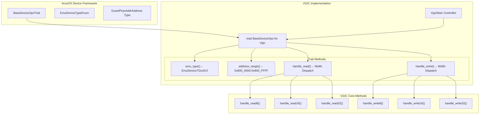
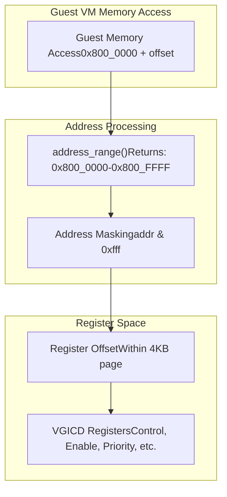
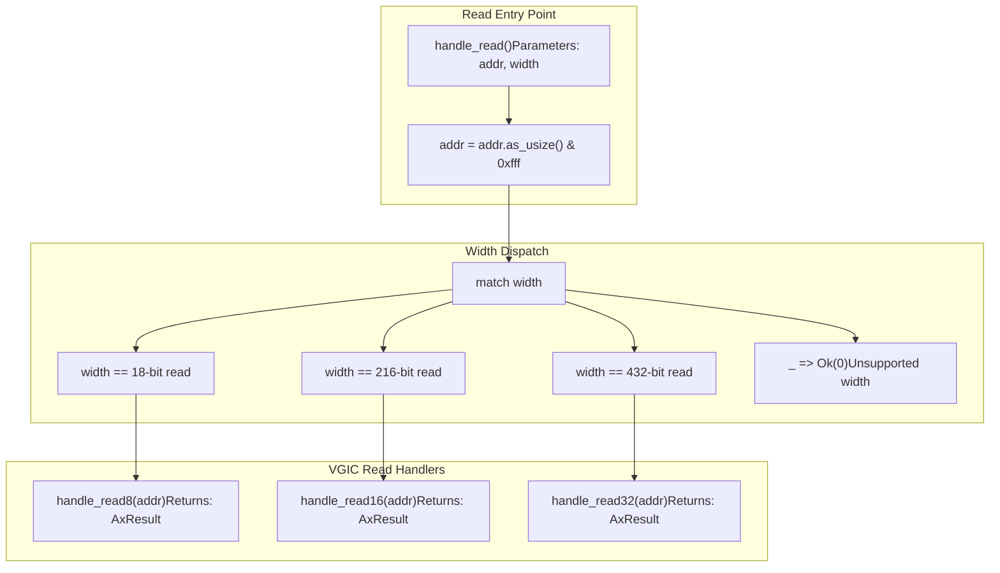
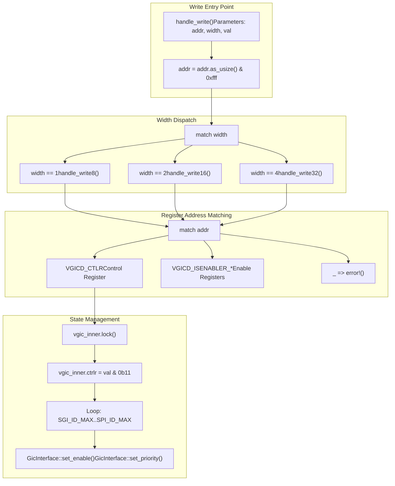
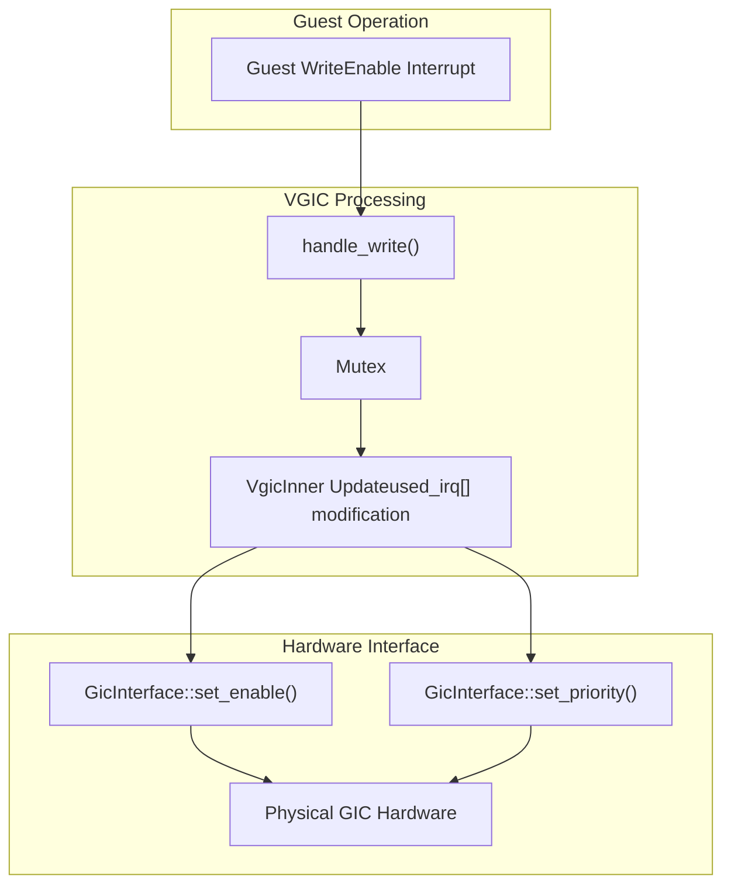

# Device Operations Interface

> **Relevant source files**
> * [src/devops_impl.rs](https://github.com/arceos-hypervisor/arm_vgic/blob/2fa3fe56/src/devops_impl.rs)
> * [src/vgic.rs](https://github.com/arceos-hypervisor/arm_vgic/blob/2fa3fe56/src/vgic.rs)

## Purpose and Scope

This document covers the Device Operations Interface implementation in the arm_vgic crate, which provides the integration layer between the Virtual Generic Interrupt Controller (VGIC) and the ArceOS device framework. The interface enables the hypervisor to expose the virtual GIC as a memory-mapped device to guest virtual machines.

For details about the core VGIC controller functionality, see [Virtual GIC Controller (Vgic)](/arceos-hypervisor/arm_vgic/3.1-virtual-gic-controller-(vgic)). For information about the CPU interface components, see [CPU Interface (Vgicc)](/arceos-hypervisor/arm_vgic/3.2-cpu-interface-(vgicc)).

## BaseDeviceOps Trait Implementation

The VGIC integrates with the ArceOS device framework through the `BaseDeviceOps` trait implementation. This trait provides the standard interface for emulated devices within the hypervisor ecosystem.

### Device Operations Structure

**Sources:** [src/devops_impl.rs(L1 - L99)&emsp;](https://github.com/arceos-hypervisor/arm_vgic/blob/2fa3fe56/src/devops_impl.rs#L1-L99) [src/vgic.rs(L32 - L34)&emsp;](https://github.com/arceos-hypervisor/arm_vgic/blob/2fa3fe56/src/vgic.rs#L32-L34)

## Device Type and Address Mapping

The VGIC device is identified as `EmuDeviceTGicdV2`, indicating it emulates a Generic Interrupt Controller Distributor version 2. The device occupies a 64KB memory region in the guest physical address space.

|Property|Value|Description|
| --- | --- | --- |
|Device Type|EmuDeviceTGicdV2|GICv2 Distributor Emulation|
|Base Address|0x800_0000|Guest physical start address|
|Size|0x10000(64KB)|Total address space|
|Address Mask|0xfff|4KB page alignment|

### Address Range Implementation

**Sources:** [src/devops_impl.rs(L29 - L31)&emsp;](https://github.com/arceos-hypervisor/arm_vgic/blob/2fa3fe56/src/devops_impl.rs#L29-L31) [src/devops_impl.rs(L47)&emsp;](https://github.com/arceos-hypervisor/arm_vgic/blob/2fa3fe56/src/devops_impl.rs#L47-L47) [src/devops_impl.rs(L79)&emsp;](https://github.com/arceos-hypervisor/arm_vgic/blob/2fa3fe56/src/devops_impl.rs#L79-L79)

## Read Operation Handling

The `handle_read` method provides width-based dispatching for memory read operations. The implementation supports 8-bit, 16-bit, and 32-bit read operations.

### Read Operation Flow

**Sources:** [src/devops_impl.rs(L45 - L66)&emsp;](https://github.com/arceos-hypervisor/arm_vgic/blob/2fa3fe56/src/devops_impl.rs#L45-L66) [src/vgic.rs(L56 - L66)&emsp;](https://github.com/arceos-hypervisor/arm_vgic/blob/2fa3fe56/src/vgic.rs#L56-L66)

## Write Operation Handling

The `handle_write` method manages memory write operations with similar width-based dispatching. Write operations modify the virtual GIC state and may trigger hardware GIC operations.

### Write Operation Dispatch and Register Handling

**Sources:** [src/devops_impl.rs(L77 - L98)&emsp;](https://github.com/arceos-hypervisor/arm_vgic/blob/2fa3fe56/src/devops_impl.rs#L77-L98) [src/vgic.rs(L68 - L133)&emsp;](https://github.com/arceos-hypervisor/arm_vgic/blob/2fa3fe56/src/vgic.rs#L68-L133)

## Integration with VGIC Core

The device operations interface serves as the bridge between guest VM memory accesses and the internal VGIC state management. Key integration points include:

### Core Integration Components

|Component|Purpose|Implementation|
| --- | --- | --- |
|VgicInner|Protected state storage|Mutex-wrapped internal state|
|Register handlers|Address-specific logic|Match-based dispatch in write methods|
|Hardware interface|Physical GIC operations|arm_gicv2::GicInterfacecalls|
|Error handling|Operation validation|AxResult<usize>return types|

### State Synchronization

The interface ensures thread-safe access to the VGIC state through mutex protection. Write operations that modify interrupt enable states trigger corresponding operations on the physical GIC hardware.

**Sources:** [src/vgic.rs(L15 - L30)&emsp;](https://github.com/arceos-hypervisor/arm_vgic/blob/2fa3fe56/src/vgic.rs#L15-L30) [src/vgic.rs(L76 - L93)&emsp;](https://github.com/arceos-hypervisor/arm_vgic/blob/2fa3fe56/src/vgic.rs#L76-L93)