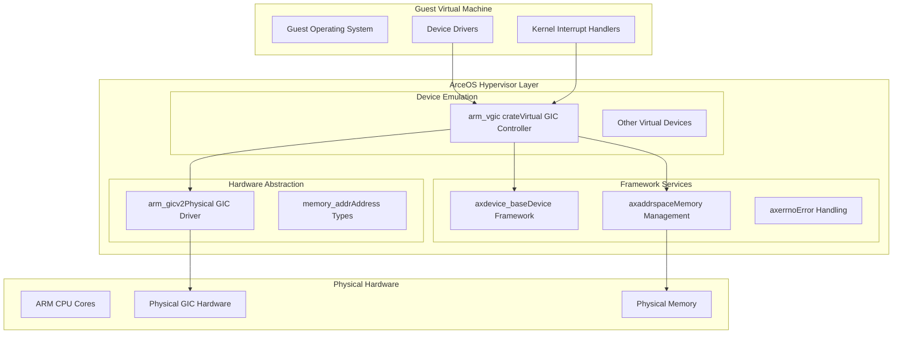
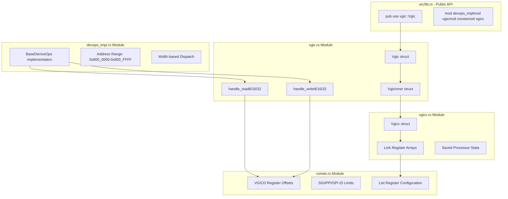
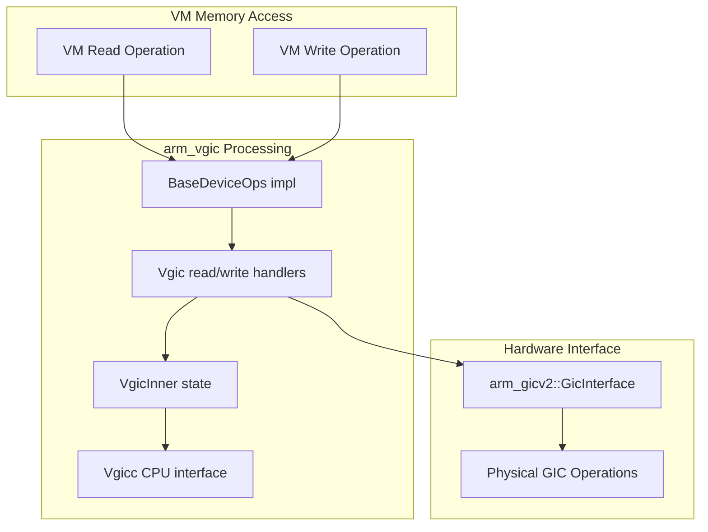

# Overview

> **Relevant source files**
> * [Cargo.toml](https://github.com/arceos-hypervisor/arm_vgic/blob/2fa3fe56/Cargo.toml)
> * [src/lib.rs](https://github.com/arceos-hypervisor/arm_vgic/blob/2fa3fe56/src/lib.rs)

## Purpose and Scope

This document provides an overview of the `arm_vgic` crate, which implements a Virtual Generic Interrupt Controller (VGIC) for ARM-based virtualized systems within the ArceOS hypervisor ecosystem. The crate enables guest virtual machines to interact with a virtualized ARM Generic Interrupt Controller (GIC) interface, providing essential interrupt management capabilities for ARM virtualization scenarios.

This overview covers the crate's architecture, main components, and integration points with the broader ArceOS framework. For detailed implementation specifics of individual components, see [Core Components](/arceos-hypervisor/arm_vgic/3-core-components). For dependency analysis and build configuration details, see [Dependencies and Integration](/arceos-hypervisor/arm_vgic/4-dependencies-and-integration).

## System Purpose and Role

The `arm_vgic` crate serves as a critical virtualization component that bridges guest operating systems and the physical ARM GIC hardware. It provides:

* **Virtual interrupt controller emulation** for ARM guest VMs
* **Memory-mapped register interface** compatible with ARM GIC specifications
* **Integration with ArceOS device framework** through standardized interfaces
* **Thread-safe state management** for multi-core virtualization scenarios

The crate operates as an intermediary layer that intercepts guest VM accesses to GIC registers and translates them into appropriate operations on the underlying physical hardware or virtualized state.

Sources: [Cargo.toml(L1 - L18)&emsp;](https://github.com/arceos-hypervisor/arm_vgic/blob/2fa3fe56/Cargo.toml#L1-L18) [src/lib.rs(L1 - L10)&emsp;](https://github.com/arceos-hypervisor/arm_vgic/blob/2fa3fe56/src/lib.rs#L1-L10)

## ArceOS Ecosystem Integration

### Hypervisor Stack Positioning

Sources: [Cargo.toml(L7 - L17)&emsp;](https://github.com/arceos-hypervisor/arm_vgic/blob/2fa3fe56/Cargo.toml#L7-L17)

## Core Architecture Components

### Main Code Entity Structure

Sources: [src/lib.rs(L1 - L10)&emsp;](https://github.com/arceos-hypervisor/arm_vgic/blob/2fa3fe56/src/lib.rs#L1-L10)

## Key Dependencies and Integration Points

The crate integrates with several ArceOS framework components and external libraries:

|Dependency|Purpose|Integration Point|
| --- | --- | --- |
|axdevice_base|Device framework foundation|BaseDeviceOpstrait implementation|
|axaddrspace|Memory management abstractions|Address space operations|
|arm_gicv2|Physical GIC hardware driver|Hardware interrupt management|
|memory_addr|Memory address type definitions|Address handling and validation|
|axerrno|Standardized error handling|Error propagation across components|
|spin|Synchronization primitives|Thread-safe state protection|
|log|Logging infrastructure|Debug and operational logging|

### Component Communication Flow

Sources: [Cargo.toml(L7 - L17)&emsp;](https://github.com/arceos-hypervisor/arm_vgic/blob/2fa3fe56/Cargo.toml#L7-L17) [src/lib.rs(L3 - L10)&emsp;](https://github.com/arceos-hypervisor/arm_vgic/blob/2fa3fe56/src/lib.rs#L3-L10)

## Functional Scope

The `arm_vgic` crate provides virtualization for ARM Generic Interrupt Controller functionality, specifically focusing on:

* **Distributor interface emulation** - Handles guest accesses to GIC distributor registers
* **CPU interface abstraction** - Manages per-CPU interrupt controller state
* **Interrupt routing and prioritization** - Implements ARM GIC interrupt handling semantics
* **State persistence** - Maintains interrupt controller state across VM operations
* **Hardware integration** - Coordinates with physical GIC hardware through `arm_gicv2`

The crate operates within the memory address range `0x800_0000` to `0x800_FFFF`, providing a standardized MMIO interface that guest VMs can interact with as if accessing a physical ARM GIC controller.

Sources: [Cargo.toml(L1 - L18)&emsp;](https://github.com/arceos-hypervisor/arm_vgic/blob/2fa3fe56/Cargo.toml#L1-L18) [src/lib.rs(L1 - L10)&emsp;](https://github.com/arceos-hypervisor/arm_vgic/blob/2fa3fe56/src/lib.rs#L1-L10)