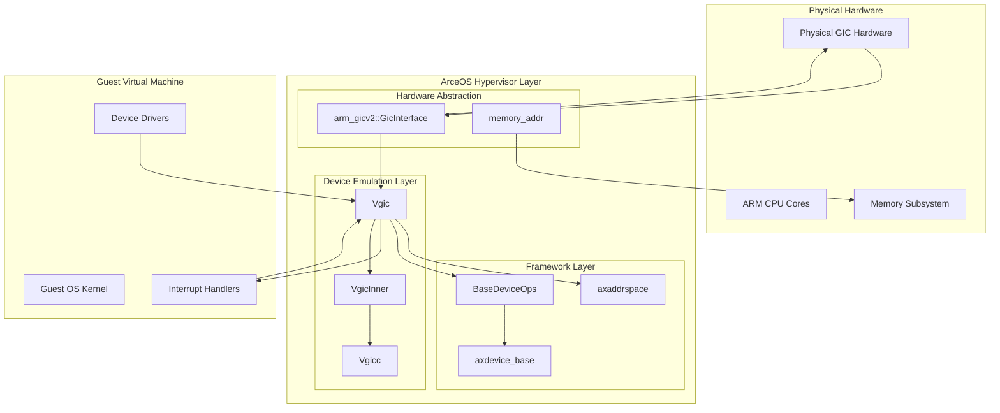
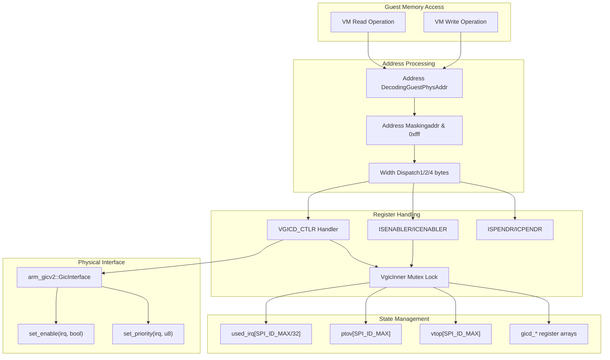

# System Architecture

> **Relevant source files**
> * [src/consts.rs](https://github.com/arceos-hypervisor/arm_vgic/blob/2fa3fe56/src/consts.rs)
> * [src/devops_impl.rs](https://github.com/arceos-hypervisor/arm_vgic/blob/2fa3fe56/src/devops_impl.rs)
> * [src/vgic.rs](https://github.com/arceos-hypervisor/arm_vgic/blob/2fa3fe56/src/vgic.rs)
> * [src/vgicc.rs](https://github.com/arceos-hypervisor/arm_vgic/blob/2fa3fe56/src/vgicc.rs)

## Purpose and Scope

This document provides a comprehensive overview of the `arm_vgic` crate's system architecture, detailing how it implements a Virtual Generic Interrupt Controller (VGIC) for ARM systems within the ArceOS hypervisor ecosystem. The architecture encompasses the virtualization of ARM GICv2 hardware, memory-mapped register emulation, and integration with the hypervisor's device framework.

For detailed information about individual components and their APIs, see [Core Components](/arceos-hypervisor/arm_vgic/3-core-components). For dependency analysis and integration patterns, see [Dependencies and Integration](/arceos-hypervisor/arm_vgic/4-dependencies-and-integration).

## Virtualization Stack Positioning

The `arm_vgic` crate operates as a critical virtualization layer between guest operating systems and physical ARM GIC hardware. The architecture follows a clean separation of concerns across multiple abstraction levels.

**Hypervisor Stack Architecture**

Sources: [src/vgic.rs(L32 - L34)&emsp;](https://github.com/arceos-hypervisor/arm_vgic/blob/2fa3fe56/src/vgic.rs#L32-L34) [src/devops_impl.rs(L10)&emsp;](https://github.com/arceos-hypervisor/arm_vgic/blob/2fa3fe56/src/devops_impl.rs#L10-L10) [src/vgicc.rs(L3)&emsp;](https://github.com/arceos-hypervisor/arm_vgic/blob/2fa3fe56/src/vgicc.rs#L3-L3)

The `Vgic` struct serves as the primary interface between guest VMs and the physical interrupt controller, implementing memory-mapped register emulation at the standardized ARM GIC address space of `0x800_0000` to `0x800_FFFF`.

## Core Architecture Components

The system architecture is built around four primary components that work together to provide complete interrupt controller virtualization.

**Component Relationship Architecture**

```mermaid
flowchart TD
subgraph ExternalDeps["External Dependencies"]
    SpinMutex["spin::Mutex"]
    ArmGicV2Interface["arm_gicv2::GicInterface"]
    AxDeviceBase["axdevice_base"]
end
subgraph CoreImplementation["Core Implementation"]
    subgraph DevOpsModule["devops_impl.rs"]
        BaseDeviceOpsImpl["BaseDeviceOps impl"]
        EmuType["emu_type()"]
        AddressRange["address_range()"]
        HandleRead["handle_read()"]
        HandleWrite["handle_write()"]
    end
    subgraph ConstsModule["consts.rs"]
        SGI_ID_MAX["SGI_ID_MAX"]
        PPI_ID_MAX["PPI_ID_MAX"]
        SPI_ID_MAX["SPI_ID_MAX"]
        VGICD_CTLR["VGICD_CTLR"]
        VGICD_ISENABLER_SGI_PPI["VGICD_ISENABLER_SGI_PPI"]
        VGICD_ISENABLER_SPI["VGICD_ISENABLER_SPI"]
    end
    subgraph VgiccModule["vgicc.rs"]
        VgiccStruct["Vgicc"]
        PendingLR["pending_lr[SPI_ID_MAX]"]
        SavedLR["saved_lr[GICD_LR_NUM]"]
        SavedRegs["saved_elsr0, saved_apr, saved_hcr"]
    end
    subgraph VgicModule["vgic.rs"]
        VgicStruct["Vgic"]
        VgicInnerStruct["VgicInner"]
        HandleRead8["handle_read8"]
        HandleRead16["handle_read16"]
        HandleRead32["handle_read32"]
        HandleWrite8["handle_write8"]
        HandleWrite16["handle_write16"]
        HandleWrite32["handle_write32"]
    end
end
subgraph PublicAPI["Public API Layer"]
    LibRS["lib.rs"]
    VgicExport["pub use vgic::Vgic"]
end

BaseDeviceOpsImpl --> AxDeviceBase
BaseDeviceOpsImpl --> HandleRead
BaseDeviceOpsImpl --> HandleWrite
HandleRead --> HandleRead16
HandleRead --> HandleRead32
HandleRead --> HandleRead8
HandleRead8 --> VGICD_CTLR
HandleWrite --> HandleWrite16
HandleWrite --> HandleWrite32
HandleWrite --> HandleWrite8
HandleWrite8 --> ArmGicV2Interface
HandleWrite8 --> SGI_ID_MAX
HandleWrite8 --> SPI_ID_MAX
HandleWrite8 --> VGICD_CTLR
HandleWrite8 --> VGICD_ISENABLER_SGI_PPI
LibRS --> VgicExport
VgicExport --> VgicStruct
VgicInnerStruct --> VgiccStruct
VgicStruct --> SpinMutex
VgicStruct --> VgicInnerStruct
VgiccStruct --> PendingLR
VgiccStruct --> SavedLR
VgiccStruct --> SavedRegs
```

Sources: [src/vgic.rs(L15 - L30)&emsp;](https://github.com/arceos-hypervisor/arm_vgic/blob/2fa3fe56/src/vgic.rs#L15-L30) [src/vgicc.rs(L3 - L14)&emsp;](https://github.com/arceos-hypervisor/arm_vgic/blob/2fa3fe56/src/vgicc.rs#L3-L14) [src/consts.rs(L1 - L19)&emsp;](https://github.com/arceos-hypervisor/arm_vgic/blob/2fa3fe56/src/consts.rs#L1-L19) [src/devops_impl.rs(L10 - L99)&emsp;](https://github.com/arceos-hypervisor/arm_vgic/blob/2fa3fe56/src/devops_impl.rs#L10-L99)

## Memory Layout and Address Handling

The VGIC implements a memory-mapped interface that emulates the standard ARM GICv2 distributor registers. The address decoding and dispatch mechanism ensures proper isolation and functionality.

**Address Space and Register Layout**

|Address Range|Register Category|Handler Functions|
| --- | --- | --- |
|0x800_0000 + 0x000|Control Register (VGICD_CTLR)|handle_write8/16/32|
|0x800_0000 + 0x100-0x104|Interrupt Set Enable (VGICD_ISENABLER)|handle_write8/16/32|
|0x800_0000 + 0x180-0x184|Interrupt Clear Enable (VGICD_ICENABLER)|handle_write8/16/32|
|0x800_0000 + 0x200|Interrupt Set Pending (VGICD_ISPENDR)|handle_write8/16/32|

Sources: [src/consts.rs(L7 - L18)&emsp;](https://github.com/arceos-hypervisor/arm_vgic/blob/2fa3fe56/src/consts.rs#L7-L18) [src/devops_impl.rs(L29 - L31)&emsp;](https://github.com/arceos-hypervisor/arm_vgic/blob/2fa3fe56/src/devops_impl.rs#L29-L31) [src/devops_impl.rs(L47)&emsp;](https://github.com/arceos-hypervisor/arm_vgic/blob/2fa3fe56/src/devops_impl.rs#L47-L47)

The address range spans 64KB (`0x10000` bytes) starting at `0x800_0000`, with address masking applied using `addr & 0xfff` to ensure proper alignment within the 4KB register space.

## Data Flow Architecture

The system processes guest memory accesses through a well-defined pipeline that maintains virtualization transparency while interfacing with physical hardware.

**Memory Access Processing Pipeline**

Sources: [src/devops_impl.rs(L45 - L66)&emsp;](https://github.com/arceos-hypervisor/arm_vgic/blob/2fa3fe56/src/devops_impl.rs#L45-L66) [src/devops_impl.rs(L77 - L98)&emsp;](https://github.com/arceos-hypervisor/arm_vgic/blob/2fa3fe56/src/devops_impl.rs#L77-L98) [src/vgic.rs(L68 - L133)&emsp;](https://github.com/arceos-hypervisor/arm_vgic/blob/2fa3fe56/src/vgic.rs#L68-L133) [src/vgic.rs(L15 - L30)&emsp;](https://github.com/arceos-hypervisor/arm_vgic/blob/2fa3fe56/src/vgic.rs#L15-L30)

The data flow ensures thread-safe access through mutex protection of the `VgicInner` state, while maintaining efficient dispatch based on access width and register offset. Physical GIC operations are performed only when necessary, such as during control register updates that enable or disable interrupt groups.

## Thread Safety and Concurrency

The architecture employs a mutex-protected inner state design to ensure thread-safe operation across multiple CPU cores accessing the virtual interrupt controller simultaneously.

The `VgicInner` struct [src/vgic.rs(L15 - L30)&emsp;](https://github.com/arceos-hypervisor/arm_vgic/blob/2fa3fe56/src/vgic.rs#L15-L30) contains all mutable state protected by a `spin::Mutex` [src/vgic.rs(L33)&emsp;](https://github.com/arceos-hypervisor/arm_vgic/blob/2fa3fe56/src/vgic.rs#L33-L33) including interrupt tracking arrays, virtual-to-physical mapping tables, and register state. This design allows multiple guest CPUs to safely access the VGIC while maintaining consistency of the virtualized interrupt controller state.

Sources: [src/vgic.rs(L32 - L53)&emsp;](https://github.com/arceos-hypervisor/arm_vgic/blob/2fa3fe56/src/vgic.rs#L32-L53) [src/vgic.rs(L76)&emsp;](https://github.com/arceos-hypervisor/arm_vgic/blob/2fa3fe56/src/vgic.rs#L76-L76) [src/devops_impl.rs(L1 - L8)&emsp;](https://github.com/arceos-hypervisor/arm_vgic/blob/2fa3fe56/src/devops_impl.rs#L1-L8)