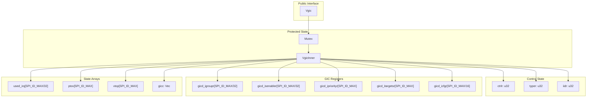
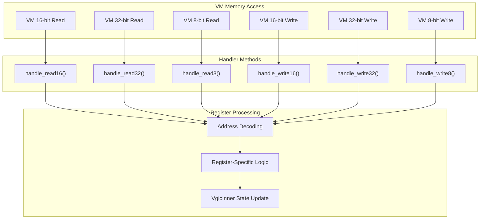
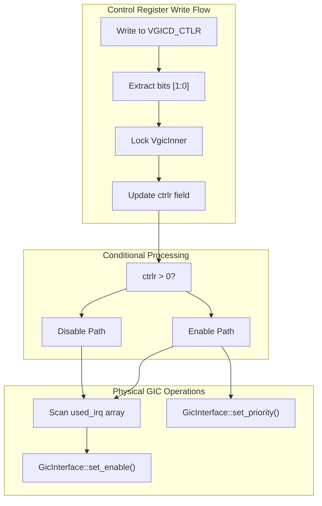
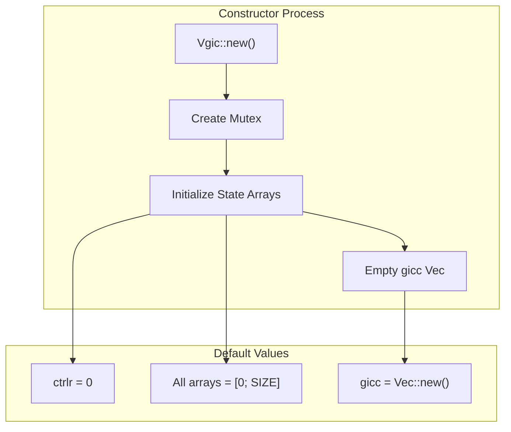

# Virtual GIC Controller (Vgic)

> **Relevant source files**
> * [src/consts.rs](https://github.com/arceos-hypervisor/arm_vgic/blob/2fa3fe56/src/consts.rs)
> * [src/vgic.rs](https://github.com/arceos-hypervisor/arm_vgic/blob/2fa3fe56/src/vgic.rs)

This document covers the `Vgic` struct and its associated components, which form the core of the virtual interrupt controller implementation in the arm_vgic crate. The `Vgic` provides virtualized access to ARM Generic Interrupt Controller (GIC) functionality for guest virtual machines within the ArceOS hypervisor ecosystem.

For information about the CPU-specific interface components, see [CPU Interface (Vgicc)](/arceos-hypervisor/arm_vgic/3.2-cpu-interface-(vgicc)). For details about the device framework integration, see [Device Operations Interface](/arceos-hypervisor/arm_vgic/3.3-device-operations-interface).

## Core Structure and Components

The Virtual GIC Controller is implemented through two primary structures that work together to manage interrupt virtualization state and provide thread-safe access to interrupt controller resources.

### Primary Data Structures

The `Vgic` implementation follows a layered approach with an outer wrapper providing thread-safe access to the internal state:

Sources: [src/vgic.rs(L15 - L34)&emsp;](https://github.com/arceos-hypervisor/arm_vgic/blob/2fa3fe56/src/vgic.rs#L15-L34)

### State Management Arrays

The `VgicInner` struct maintains several key data structures for interrupt management:

|Array|Type|Size|Purpose|
| --- | --- | --- | --- |
|used_irq|[u32; SPI_ID_MAX/32]|16 words|Tracks which interrupt IDs are allocated|
|ptov|[u32; SPI_ID_MAX]|512 entries|Physical-to-virtual interrupt ID mapping|
|vtop|[u32; SPI_ID_MAX]|512 entries|Virtual-to-physical interrupt ID mapping|
|gicd_igroupr|[u32; SPI_ID_MAX/32]|16 words|Interrupt group register state|
|gicd_isenabler|[u32; SPI_ID_MAX/32]|16 words|Interrupt enable register state|
|gicd_ipriorityr|[u8; SPI_ID_MAX]|512 bytes|Interrupt priority values|
|gicd_itargetsr|[u8; SPI_ID_MAX]|512 bytes|Interrupt target CPU mapping|
|gicd_icfgr|[u32; SPI_ID_MAX/16]|32 words|Interrupt configuration register state|

Sources: [src/vgic.rs(L15 - L30)&emsp;](https://github.com/arceos-hypervisor/arm_vgic/blob/2fa3fe56/src/vgic.rs#L15-L30) [src/consts.rs(L1 - L4)&emsp;](https://github.com/arceos-hypervisor/arm_vgic/blob/2fa3fe56/src/consts.rs#L1-L4)

## Memory Access Handling

The `Vgic` provides width-specific handlers for processing virtual machine memory accesses to the interrupt controller's memory-mapped registers. These handlers implement the virtualization layer between guest VM register accesses and the underlying interrupt controller state.

### Handler Method Dispatch

Sources: [src/vgic.rs(L56 - L133)&emsp;](https://github.com/arceos-hypervisor/arm_vgic/blob/2fa3fe56/src/vgic.rs#L56-L133)

### Read Handler Implementation

The read handlers currently provide basic functionality with placeholder implementations:

* `handle_read8()`: Returns 0 for all 8-bit register reads
* `handle_read16()`: Returns 0 for all 16-bit register reads
* `handle_read32()`: Returns 0 for all 32-bit register reads

These methods use the signature `fn handle_readX(&self, addr: usize) -> AxResult<usize>` and are marked as `pub(crate)` for internal crate access.

Sources: [src/vgic.rs(L56 - L66)&emsp;](https://github.com/arceos-hypervisor/arm_vgic/blob/2fa3fe56/src/vgic.rs#L56-L66)

## Register Handling and Interrupt Control

The write handlers implement the core interrupt virtualization logic by processing writes to specific GIC distributor registers and coordinating with the physical interrupt controller.

### Control Register Handling

The `VGICD_CTLR` register controls the overall enable/disable state of the interrupt distributor:

Sources: [src/vgic.rs(L70 - L95)&emsp;](https://github.com/arceos-hypervisor/arm_vgic/blob/2fa3fe56/src/vgic.rs#L70-L95)

### Enable Register Handling

The interrupt enable registers (`VGICD_ISENABLER_SGI_PPI` and `VGICD_ISENABLER_SPI`) are handled through delegation to wider access methods:

* 8-bit writes to enable registers delegate to `handle_write32()`
* 16-bit writes to enable registers delegate to `handle_write32()`
* 32-bit writes to enable registers are handled directly but currently contain placeholder logic

Sources: [src/vgic.rs(L96 - L132)&emsp;](https://github.com/arceos-hypervisor/arm_vgic/blob/2fa3fe56/src/vgic.rs#L96-L132)

## Physical Hardware Integration

The `Vgic` coordinates with the physical ARM GIC hardware through the `arm_gicv2::GicInterface` to ensure that virtual interrupt state changes are reflected in the underlying hardware configuration.

### Hardware Interface Operations

|Operation|Method|Purpose|
| --- | --- | --- |
|Enable/Disable|GicInterface::set_enable(irq_id, enabled)|Control interrupt enable state|
|Priority Setting|GicInterface::set_priority(irq_id, priority)|Set interrupt priority level|

The integration logic scans the `used_irq` bitmap to identify allocated interrupts and applies configuration changes only to interrupts that are actively managed by the virtual controller.

Sources: [src/vgic.rs(L5)&emsp;](https://github.com/arceos-hypervisor/arm_vgic/blob/2fa3fe56/src/vgic.rs#L5-L5) [src/vgic.rs(L82 - L92)&emsp;](https://github.com/arceos-hypervisor/arm_vgic/blob/2fa3fe56/src/vgic.rs#L82-L92)

## Initialization and Construction

The `Vgic::new()` constructor initializes all internal state arrays to zero values and creates an empty vector for CPU interface objects:

The constructor ensures that the virtual interrupt controller starts in a clean, disabled state with no allocated interrupts or configured CPU interfaces.

Sources: [src/vgic.rs(L37 - L54)&emsp;](https://github.com/arceos-hypervisor/arm_vgic/blob/2fa3fe56/src/vgic.rs#L37-L54)