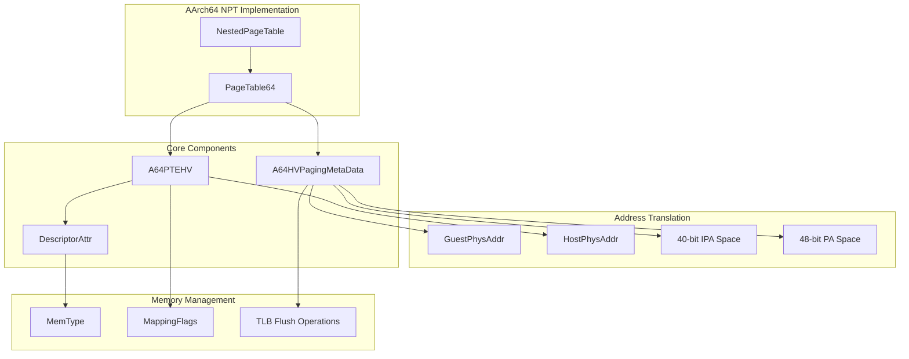
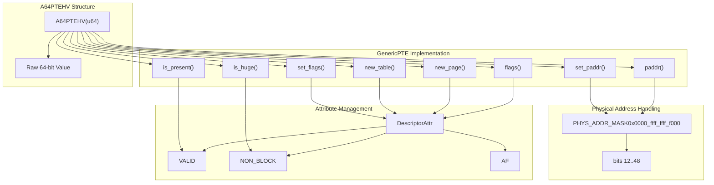
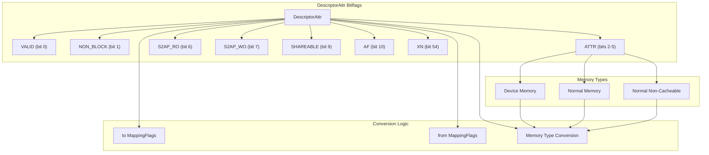
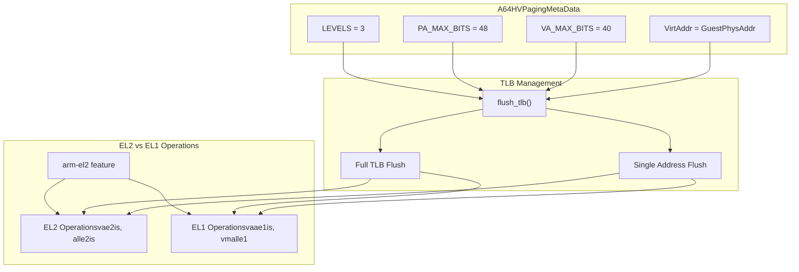

# AArch64 Implementation

> **Relevant source files**
> * [src/npt/arch/aarch64.rs](https://github.com/arceos-hypervisor/axaddrspace/blob/2ed4d076/src/npt/arch/aarch64.rs)

This document covers the AArch64-specific implementation of nested page tables within the axaddrspace crate. The AArch64 implementation provides VMSAv8-64 Stage 2 translation support for hypervisor environments, enabling guest physical address to host physical address translation on ARM 64-bit architectures.

This implementation specifically handles ARM's hypervisor-mode address translation. For information about other architecture implementations, see [x86_64 Implementation](/arceos-hypervisor/axaddrspace/3.3-x86_64-implementation) and [RISC-V Implementation](/arceos-hypervisor/axaddrspace/3.4-risc-v-implementation). For the generic nested page table interface, see [Architecture Selection](/arceos-hypervisor/axaddrspace/3.1-architecture-selection).

## Architecture Overview

The AArch64 implementation follows ARM's VMSAv8-64 specification for Stage 2 translation, which is used in hypervisor environments to translate Intermediate Physical Addresses (IPA) from guest virtual machines to Host Physical Addresses (HPA).

Sources: [src/npt/arch/aarch64.rs(L1 - L253)&emsp;](https://github.com/arceos-hypervisor/axaddrspace/blob/2ed4d076/src/npt/arch/aarch64.rs#L1-L253)

The implementation provides a 3-level page table structure with:

* 40-bit Intermediate Physical Address (IPA) space for guest addresses
* 48-bit Physical Address (PA) space for host addresses
* VMSAv8-64 Stage 2 translation table format

## Page Table Entry Implementation

The `A64PTEHV` struct represents a single VMSAv8-64 translation table descriptor, implementing the `GenericPTE` trait to integrate with the generic page table framework.

Sources: [src/npt/arch/aarch64.rs(L144 - L211)&emsp;](https://github.com/arceos-hypervisor/axaddrspace/blob/2ed4d076/src/npt/arch/aarch64.rs#L144-L211)

### Key Features

|Feature|Implementation|Purpose|
| --- | --- | --- |
|Physical Address Mask|0x0000_ffff_ffff_f000|Extracts bits 12-48 for physical addressing|
|Page vs Block|NON_BLOCKbit|Distinguishes between 4KB pages and large blocks|
|Access Flag|AFbit|Required for all valid entries in ARM architecture|
|Valid Bit|VALIDbit|Indicates if the descriptor is valid for translation|

## Memory Attribute Management

The AArch64 implementation uses the `DescriptorAttr` bitflags structure to manage VMSAv8-64 memory attributes and access permissions.

Sources: [src/npt/arch/aarch64.rs(L8 - L137)&emsp;](https://github.com/arceos-hypervisor/axaddrspace/blob/2ed4d076/src/npt/arch/aarch64.rs#L8-L137)

### Memory Type Encoding

The implementation supports three memory types with specific attribute encodings:

|Memory Type|Encoding|Characteristics|
| --- | --- | --- |
|Device|0b0000|Device memory with shareability|
|Normal|0b1111|Write-back cacheable with shareability|
|NormalNonCache|0b0111|Inner cacheable, outer non-cacheable|

### Permission Mapping

The AArch64 Stage 2 access permissions are mapped to generic `MappingFlags`:

* **Read**: Controlled by `VALID` bit
* **Write**: Controlled by absence of `S2AP_WO` bit
* **Execute**: Controlled by absence of `XN` bit
* **Device**: Determined by memory attribute index

## Paging Metadata Configuration

The `A64HVPagingMetaData` struct provides architecture-specific configuration for the AArch64 hypervisor page tables.

Sources: [src/npt/arch/aarch64.rs(L213 - L253)&emsp;](https://github.com/arceos-hypervisor/axaddrspace/blob/2ed4d076/src/npt/arch/aarch64.rs#L213-L253)

### TLB Flush Implementation

The TLB flush implementation supports both Exception Level 1 (EL1) and Exception Level 2 (EL2) operations:

**EL2 Mode** (with `arm-el2` feature):

* Single address: `tlbi vae2is` - Invalidate by VA in EL2
* Full flush: `tlbi alle2is` - Invalidate all EL2 TLB entries

**EL1 Mode** (default):

* Single address: `tlbi vaae1is` - Invalidate by VA, all ASID in EL1
* Full flush: `tlbi vmalle1` - Invalidate all EL1 TLB entries

All TLB operations include data synchronization barriers (`dsb sy`) and instruction synchronization barriers (`isb`) to ensure proper ordering.

## Integration with Generic Framework

The AArch64 implementation integrates with the generic page table framework through type aliases and trait implementations.

|Component|Type Definition|Purpose|
| --- | --- | --- |
|NestedPageTable<H>|PageTable64<A64HVPagingMetaData, A64PTEHV, H>|Main page table type for AArch64|
|Page Table Entry|A64PTEHV|VMSAv8-64 descriptor implementation|
|Metadata|A64HVPagingMetaData|Architecture-specific configuration|
|Virtual Address|GuestPhysAddr|Guest physical address type|

Sources: [src/npt/arch/aarch64.rs(L252 - L253)&emsp;](https://github.com/arceos-hypervisor/axaddrspace/blob/2ed4d076/src/npt/arch/aarch64.rs#L252-L253)

The implementation ensures compatibility with the generic nested page table interface while providing ARM-specific optimizations for hypervisor workloads, including proper Stage 2 translation semantics and efficient TLB management for virtualized environments.