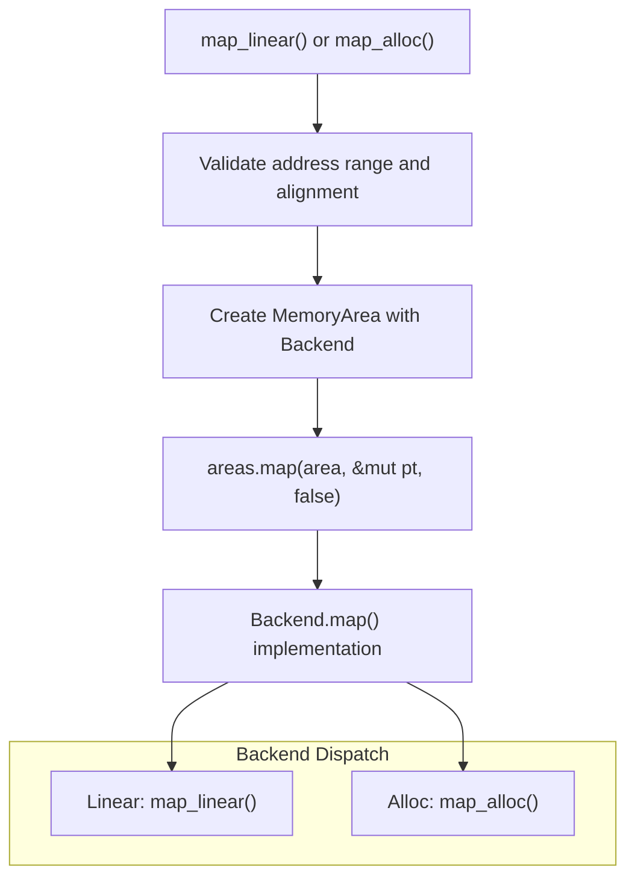
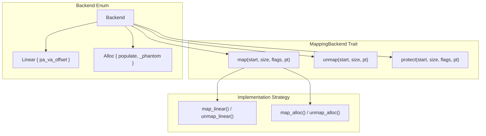
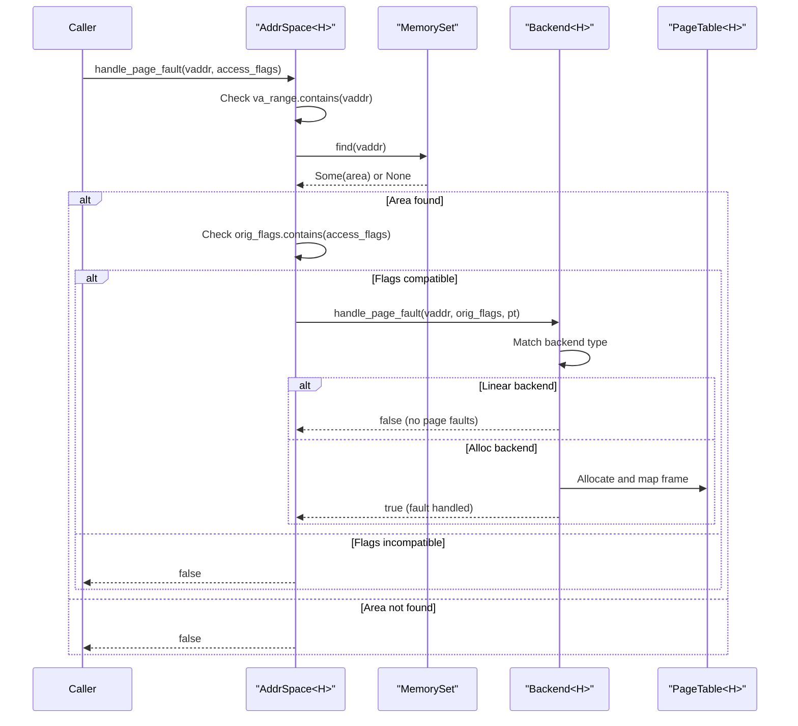
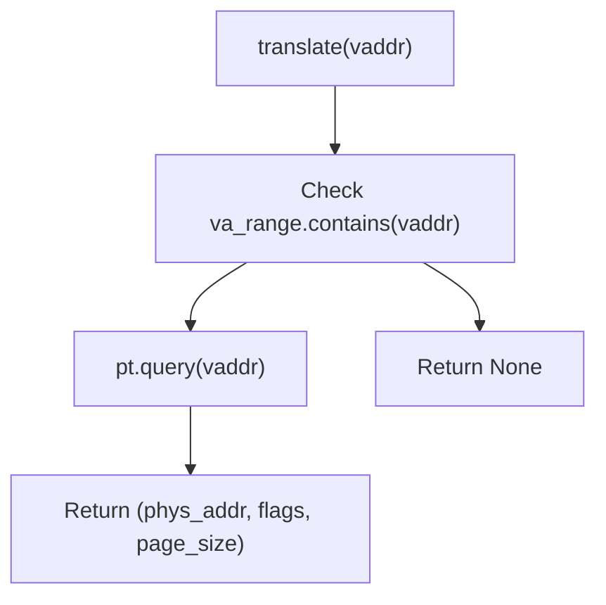

# Address Space Management

> **Relevant source files**
> * [src/address_space/backend/mod.rs](https://github.com/arceos-hypervisor/axaddrspace/blob/2ed4d076/src/address_space/backend/mod.rs)
> * [src/address_space/mod.rs](https://github.com/arceos-hypervisor/axaddrspace/blob/2ed4d076/src/address_space/mod.rs)

This document covers the `AddrSpace<H>` system that manages guest virtual memory spaces in the axaddrspace crate. The address space manager coordinates memory regions, page tables, and mapping backends to provide virtualized memory management for guest systems.

For information about the underlying nested page table implementations, see [Nested Page Tables](/arceos-hypervisor/axaddrspace/3-nested-page-tables). For details about the hardware abstraction layer, see [Hardware Abstraction Layer](/arceos-hypervisor/axaddrspace/2.3-hardware-abstraction-layer). For specific backend implementations, see [Memory Mapping Backends](/arceos-hypervisor/axaddrspace/4-memory-mapping-backends).

## Purpose and Core Structure

The `AddrSpace<H>` struct serves as the central coordinator for guest virtual memory management. It maintains a collection of memory areas with different mapping strategies and uses nested page tables for address translation.

### AddrSpace Components

The following diagram shows the core components of the address space management system:

```mermaid
flowchart TD
subgraph subGraph2["Backend Types"]
    Linear["Linear { pa_va_offset: usize }"]
    Alloc["Alloc { populate: bool }"]
end
subgraph subGraph1["MemorySet Structure"]
    MS["MemorySet>"]
    MA["MemoryArea"]
    BE["Backend"]
end
subgraph AddrSpace<H>["AddrSpace"]
    AS["AddrSpace"]
    VARange["va_range: GuestPhysAddrRange"]
    Areas["areas: MemorySet>"]
    PT["pt: PageTable"]
end

AS --> Areas
AS --> PT
AS --> VARange
Areas --> MS
BE --> Alloc
BE --> Linear
MA --> BE
MS --> MA
```

Sources: [src/address_space/mod.rs(L17 - L22)&emsp;](https://github.com/arceos-hypervisor/axaddrspace/blob/2ed4d076/src/address_space/mod.rs#L17-L22) [src/address_space/backend/mod.rs(L19 - L41)&emsp;](https://github.com/arceos-hypervisor/axaddrspace/blob/2ed4d076/src/address_space/backend/mod.rs#L19-L41)

## Memory Mapping Workflow

The address space manager supports two primary mapping operations through different backends:

### Mapping Operations Flow



Sources: [src/address_space/mod.rs(L70 - L89)&emsp;](https://github.com/arceos-hypervisor/axaddrspace/blob/2ed4d076/src/address_space/mod.rs#L70-L89) [src/address_space/mod.rs(L97 - L119)&emsp;](https://github.com/arceos-hypervisor/axaddrspace/blob/2ed4d076/src/address_space/mod.rs#L97-L119) [src/address_space/backend/mod.rs(L60 - L79)&emsp;](https://github.com/arceos-hypervisor/axaddrspace/blob/2ed4d076/src/address_space/backend/mod.rs#L60-L79)

### Address Space Operations

The `AddrSpace<H>` provides the following key operations:

|Operation|Method|Purpose|
| --- | --- | --- |
|Linear Mapping|map_linear()|Creates fixed-offset mappings between guest and host addresses|
|Dynamic Mapping|map_alloc()|Creates dynamically allocated mappings with optional population|
|Unmapping|unmap()|Removes existing mappings from specified ranges|
|Translation|translate()|Converts guest virtual addresses to host physical addresses|
|Page Fault Handling|handle_page_fault()|Processes page faults for lazy allocation scenarios|

Sources: [src/address_space/mod.rs(L70 - L161)&emsp;](https://github.com/arceos-hypervisor/axaddrspace/blob/2ed4d076/src/address_space/mod.rs#L70-L161)

## Backend Strategy Selection

The `Backend<H>` enum implements the `MappingBackend` trait to provide different memory mapping strategies:

### Backend Implementation Details



Sources: [src/address_space/backend/mod.rs(L55 - L90)&emsp;](https://github.com/arceos-hypervisor/axaddrspace/blob/2ed4d076/src/address_space/backend/mod.rs#L55-L90)

### Backend Characteristics

|Backend Type|Address Translation|Memory Allocation|Use Case|
| --- | --- | --- | --- |
|Linear|Fixed offset (vaddr - pa_va_offset)|Pre-allocated contiguous frames|Device memory, kernel mappings|
|Alloc|Dynamic allocation|Global allocator (eager/lazy)|General purpose, user memory|

Sources: [src/address_space/backend/mod.rs(L19 - L41)&emsp;](https://github.com/arceos-hypervisor/axaddrspace/blob/2ed4d076/src/address_space/backend/mod.rs#L19-L41)

## Page Fault Management

The address space manager handles page faults through a coordinated approach between the memory areas and their backends:

### Page Fault Handling Flow



Sources: [src/address_space/mod.rs(L147 - L161)&emsp;](https://github.com/arceos-hypervisor/axaddrspace/blob/2ed4d076/src/address_space/mod.rs#L147-L161) [src/address_space/backend/mod.rs(L93 - L106)&emsp;](https://github.com/arceos-hypervisor/axaddrspace/blob/2ed4d076/src/address_space/backend/mod.rs#L93-L106)

## Address Translation Services

The address space provides multiple translation interfaces for different use cases:

### Translation Methods

|Method|Return Type|Use Case|
| --- | --- | --- |
|translate()|Option<PhysAddr>|Simple address translation|
|translate_and_get_limit()|Option<(PhysAddr, usize)>|Translation with area size information|
|translated_byte_buffer()|Option<Vec<&'static mut [u8]>>|Direct memory access through page table|

### Translation Implementation



Sources: [src/address_space/mod.rs(L166 - L177)&emsp;](https://github.com/arceos-hypervisor/axaddrspace/blob/2ed4d076/src/address_space/mod.rs#L166-L177) [src/address_space/mod.rs(L234 - L246)&emsp;](https://github.com/arceos-hypervisor/axaddrspace/blob/2ed4d076/src/address_space/mod.rs#L234-L246)

## Lifecycle Management

The `AddrSpace<H>` implements proper resource cleanup through the `Drop` trait:

* **Automatic cleanup**: The `drop()` implementation calls `clear()` to remove all mappings
* **Explicit cleanup**: The `clear()` method removes all memory areas and their page table entries
* **Memory safety**: Physical frames are automatically deallocated through the backend implementations

Sources: [src/address_space/mod.rs(L259 - L263)&emsp;](https://github.com/arceos-hypervisor/axaddrspace/blob/2ed4d076/src/address_space/mod.rs#L259-L263) [src/address_space/mod.rs(L137 - L139)&emsp;](https://github.com/arceos-hypervisor/axaddrspace/blob/2ed4d076/src/address_space/mod.rs#L137-L139)