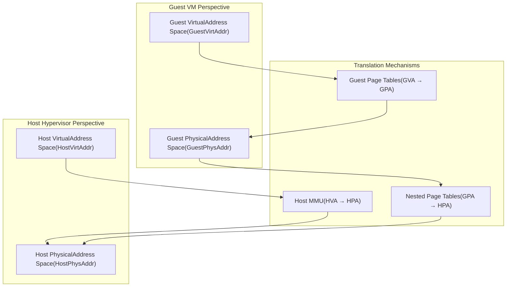
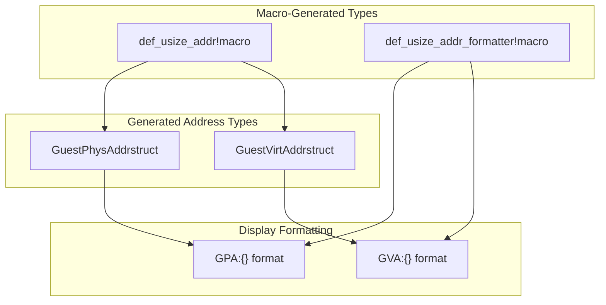
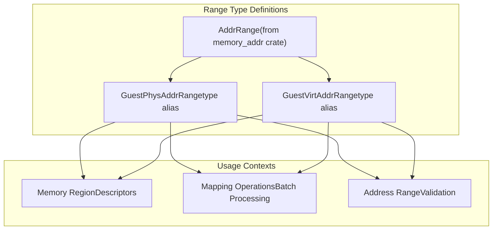
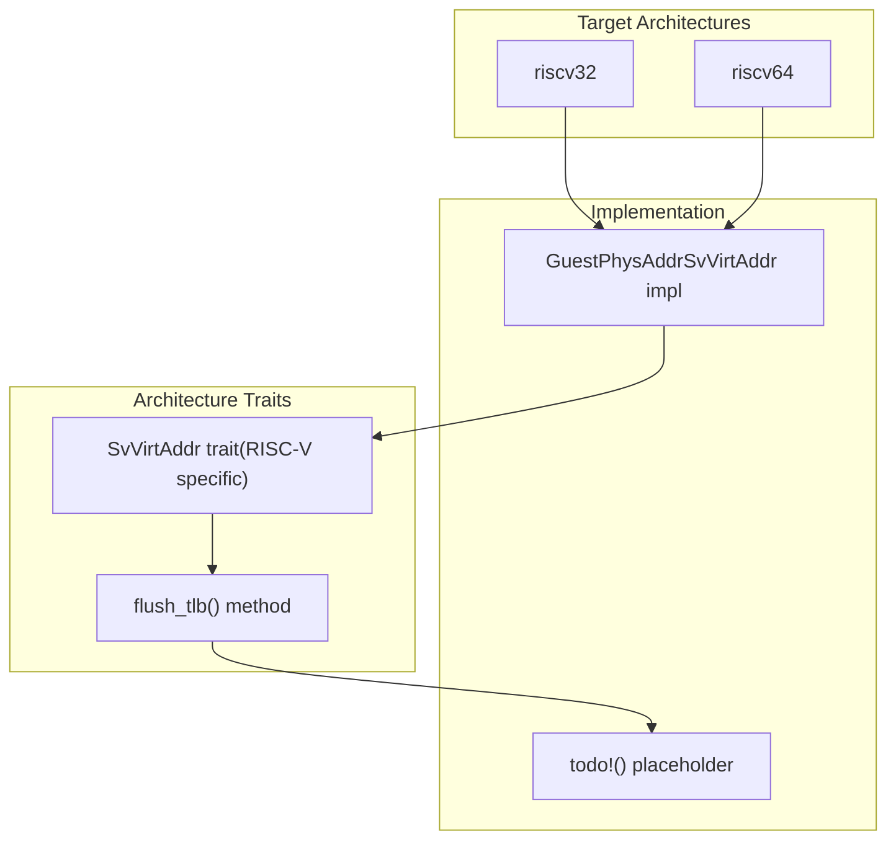

# Address Types and Spaces

> **Relevant source files**
> * [src/addr.rs](https://github.com/arceos-hypervisor/axaddrspace/blob/2ed4d076/src/addr.rs)

This document explains the fundamental address types and memory spaces used throughout the axaddrspace crate. These types form the foundation for all virtual memory management and address translation operations in the ArceOS-Hypervisor system.

The address type system distinguishes between guest and host address spaces, and between virtual and physical addressing within each space. For information about how these addresses are used in page table implementations, see [Architecture-Specific Implementations](/arceos-hypervisor/axaddrspace/3-nested-page-tables). For details on how address spaces are managed at the system level, see [Address Space Management](/arceos-hypervisor/axaddrspace/2.2-address-space-management).

## Address Type Hierarchy

The codebase defines four primary address types that represent different addressing contexts within the hypervisor environment:

```

```

**Address Type Definitions**

|Type|Definition|Purpose|Source|
| --- | --- | --- | --- |
|HostVirtAddr|VirtAddralias|Host kernel virtual addresses|src/addr.rs4|
|HostPhysAddr|PhysAddralias|Host machine physical addresses|src/addr.rs6|
|GuestVirtAddr|Customusizetype|Guest virtual addresses (GVA)|src/addr.rs10|
|GuestPhysAddr|Customusizetype|Guest physical addresses (GPA)|src/addr.rs12|

Sources: [src/addr.rs(L1 - L31)&emsp;](https://github.com/arceos-hypervisor/axaddrspace/blob/2ed4d076/src/addr.rs#L1-L31)

## Guest vs Host Address Spaces

The hypervisor operates with two distinct address spaces, each serving different roles in the virtualization stack:



**Address Space Characteristics**

* **Guest Address Space**: Managed by the guest operating system, providing the illusion of direct hardware access
* **Host Address Space**: Managed by the hypervisor, representing actual physical hardware resources
* **Translation Chain**: Guest virtual → Guest physical → Host physical addresses

Sources: [src/addr.rs(L8 - L13)&emsp;](https://github.com/arceos-hypervisor/axaddrspace/blob/2ed4d076/src/addr.rs#L8-L13)

## Address Type Implementation Details

The guest address types are implemented using specialized macros that provide type safety and debugging support:



**Type Generation and Formatting**

The `def_usize_addr!` macro creates strongly-typed wrappers around `usize` values, while `def_usize_addr_formatter!` provides custom debug formatting:

* `GuestVirtAddr` displays as `"GVA:{address}"`
* `GuestPhysAddr` displays as `"GPA:{address}"`

This approach ensures type safety while maintaining efficient runtime representation as raw pointer-sized integers.

Sources: [src/addr.rs(L8 - L18)&emsp;](https://github.com/arceos-hypervisor/axaddrspace/blob/2ed4d076/src/addr.rs#L8-L18)

## Address Range Abstractions

The system provides range types for representing contiguous memory regions within guest address spaces:



**Range Operations**

Address ranges support standard operations for memory region management:

* Start and end address access
* Size calculation
* Overlap detection
* Alignment validation

Sources: [src/addr.rs(L20 - L23)&emsp;](https://github.com/arceos-hypervisor/axaddrspace/blob/2ed4d076/src/addr.rs#L20-L23)

## Architecture-Specific Integration

The address types integrate with architecture-specific page table implementations through trait implementations:



**RISC-V Integration**

For RISC-V architectures, `GuestPhysAddr` implements the `SvVirtAddr` trait required by the page table implementation. The `flush_tlb()` method is currently unimplemented, indicating this functionality is still under development.

Sources: [src/addr.rs(L25 - L30)&emsp;](https://github.com/arceos-hypervisor/axaddrspace/blob/2ed4d076/src/addr.rs#L25-L30)