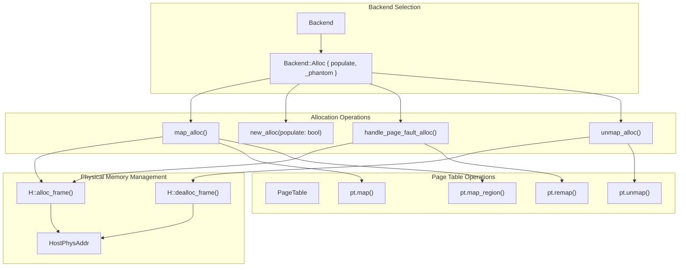
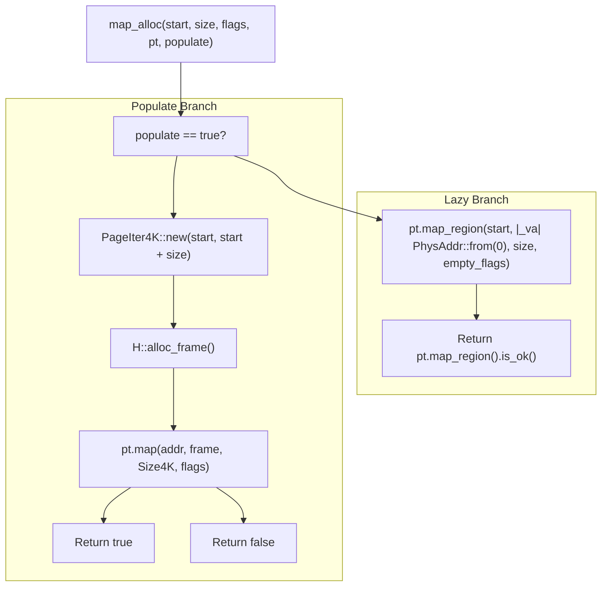
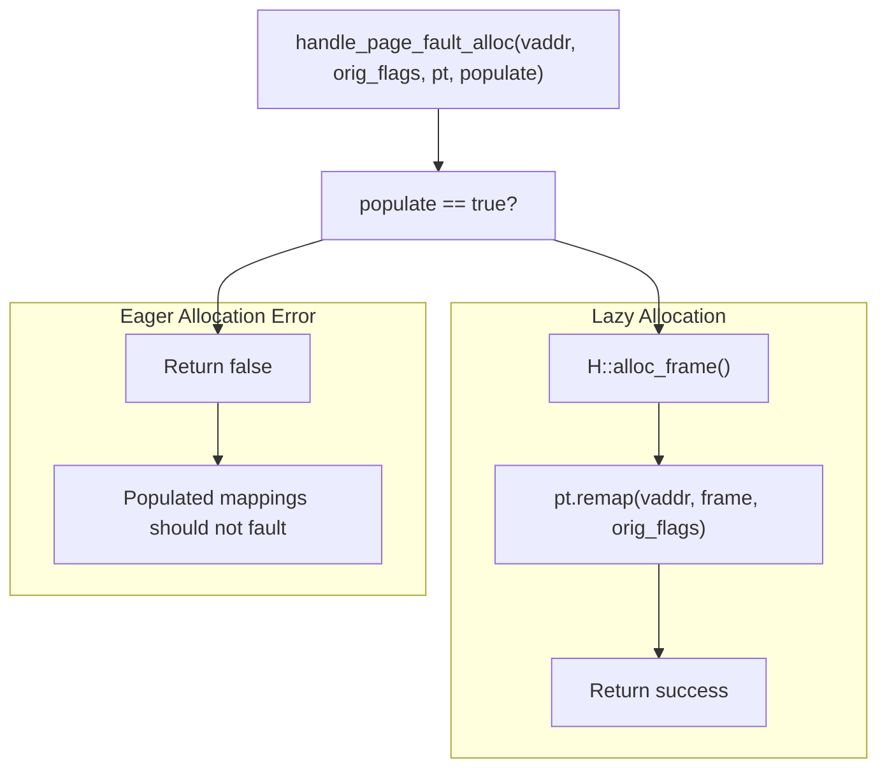

# Allocation Backend

> **Relevant source files**
> * [src/address_space/backend/alloc.rs](https://github.com/arceos-hypervisor/axaddrspace/blob/2ed4d076/src/address_space/backend/alloc.rs)

This document covers the dynamic allocation backend implementation for guest memory management in axaddrspace. The allocation backend provides flexible memory allocation strategies with support for both eager and lazy allocation patterns. For information about the alternative linear mapping strategy, see [Linear Backend](/arceos-hypervisor/axaddrspace/4.1-linear-backend). For broader context on how backends fit into the address space management system, see [Memory Mapping Backends](/arceos-hypervisor/axaddrspace/4-memory-mapping-backends) and [Address Space Management](/arceos-hypervisor/axaddrspace/2.2-address-space-management).

## Overview

The allocation backend implements dynamic memory management for guest physical memory regions, where physical frames are allocated from the host system either eagerly at mapping time or lazily on first access. This backend is implemented as part of the `Backend<H>` enum and provides three core operations: mapping, unmapping, and page fault handling.

**Allocation Backend Architecture**



Sources: [src/address_space/backend/alloc.rs(L7 - L14)&emsp;](https://github.com/arceos-hypervisor/axaddrspace/blob/2ed4d076/src/address_space/backend/alloc.rs#L7-L14)

## Allocation Strategies

The allocation backend supports two distinct allocation strategies controlled by the `populate` boolean parameter:

|Strategy|Description|Physical Frame Allocation|Page Fault Behavior|
| --- | --- | --- | --- |
|Eager (populate=true)|Physical frames allocated at mapping time|Immediate allocation duringmap_alloc()|Should not occur|
|Lazy (populate=false)|Physical frames allocated on first access|Deferred until page fault|Allocates frame on demand|

### Eager Allocation Strategy

When `populate` is true, the backend performs immediate physical frame allocation for all pages in the requested range:

**Eager Allocation Flow**

```

```

Sources: [src/address_space/backend/alloc.rs(L31 - L41)&emsp;](https://github.com/arceos-hypervisor/axaddrspace/blob/2ed4d076/src/address_space/backend/alloc.rs#L31-L41)

### Lazy Allocation Strategy

When `populate` is false, the backend creates empty page table entries that will trigger page faults on first access:

**Lazy Allocation Flow**

```

```

Sources: [src/address_space/backend/alloc.rs(L42 - L54)&emsp;](https://github.com/arceos-hypervisor/axaddrspace/blob/2ed4d076/src/address_space/backend/alloc.rs#L42-L54) [src/address_space/backend/alloc.rs(L79 - L96)&emsp;](https://github.com/arceos-hypervisor/axaddrspace/blob/2ed4d076/src/address_space/backend/alloc.rs#L79-L96)

## Implementation Details

### Backend Creation

The allocation backend is created through the `new_alloc()` constructor method:

```javascript
pub const fn new_alloc(populate: bool) -> Self {
    Self::Alloc {
        populate,
        _phantom: core::marker::PhantomData,
    }
}
```

The `populate` parameter determines the allocation strategy for the lifetime of this backend instance.

Sources: [src/address_space/backend/alloc.rs(L8 - L14)&emsp;](https://github.com/arceos-hypervisor/axaddrspace/blob/2ed4d076/src/address_space/backend/alloc.rs#L8-L14)

### Memory Mapping Process

The `map_alloc()` method handles the mapping process differently based on the `populate` flag:

**Mapping Implementation Structure**



Sources: [src/address_space/backend/alloc.rs(L16 - L54)&emsp;](https://github.com/arceos-hypervisor/axaddrspace/blob/2ed4d076/src/address_space/backend/alloc.rs#L16-L54)

### Memory Unmapping Process

The `unmap_alloc()` method handles cleanup by iterating through all pages and deallocating physical frames:

* Uses `PageIter4K` to iterate through all 4KB pages in the range
* Calls `pt.unmap()` to remove page table entries
* Deallocates physical frames via `H::dealloc_frame()` when mappings exist
* Gracefully handles pages that are not mapped
* Rejects huge page mappings for safety

Sources: [src/address_space/backend/alloc.rs(L56 - L77)&emsp;](https://github.com/arceos-hypervisor/axaddrspace/blob/2ed4d076/src/address_space/backend/alloc.rs#L56-L77)

## Page Fault Handling

The allocation backend implements lazy allocation through page fault handling in `handle_page_fault_alloc()`:

**Page Fault Resolution Logic**



Key characteristics:

* **Eager allocation faults**: Return false since populated mappings should never fault
* **Lazy allocation faults**: Allocate physical frame and remap the faulting virtual address
* **Address alignment**: The `pt.remap()` method automatically handles address alignment

Sources: [src/address_space/backend/alloc.rs(L79 - L96)&emsp;](https://github.com/arceos-hypervisor/axaddrspace/blob/2ed4d076/src/address_space/backend/alloc.rs#L79-L96)

## Memory Management Lifecycle

The allocation backend integrates with the hardware abstraction layer for physical memory management:

1. **Frame Allocation**: Uses `H::alloc_frame()` to obtain `HostPhysAddr` values
2. **Page Table Integration**: Works with `PageTable<H>` for virtual-to-physical mappings
3. **Frame Deallocation**: Uses `H::dealloc_frame()` during unmapping operations
4. **Size Constraints**: Currently supports only 4KB pages, rejecting huge page operations

The backend ensures proper resource management through RAII principles and explicit deallocation during unmapping operations.

Sources: [src/address_space/backend/alloc.rs(L1 - L98)&emsp;](https://github.com/arceos-hypervisor/axaddrspace/blob/2ed4d076/src/address_space/backend/alloc.rs#L1-L98)