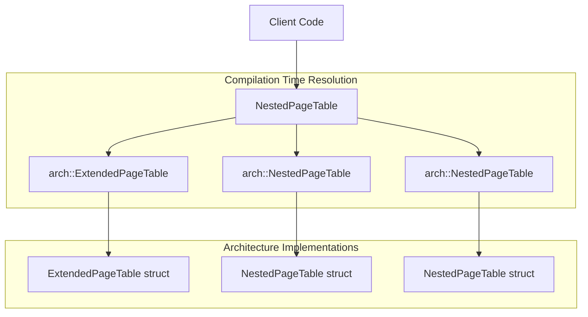

# Architecture Selection

> **Relevant source files**
> * [src/npt/arch/mod.rs](https://github.com/arceos-hypervisor/axaddrspace/blob/2ed4d076/src/npt/arch/mod.rs)
> * [src/npt/mod.rs](https://github.com/arceos-hypervisor/axaddrspace/blob/2ed4d076/src/npt/mod.rs)

## Purpose and Scope

This page documents the architecture selection mechanism within the nested page table (NPT) system. It explains how `axaddrspace` uses conditional compilation to select appropriate page table implementations based on the target CPU architecture during build time.

The architecture selection system provides a unified interface while delegating to architecture-specific implementations. For detailed information about individual architecture implementations, see [AArch64 Implementation](/arceos-hypervisor/axaddrspace/3.2-aarch64-implementation), [x86_64 Implementation](/arceos-hypervisor/axaddrspace/3.3-x86_64-implementation), and [RISC-V Implementation](/arceos-hypervisor/axaddrspace/3.4-risc-v-implementation).

## Conditional Compilation Strategy

The architecture selection system uses the `cfg_if` crate to perform conditional compilation based on the target architecture. This approach allows the codebase to include only the relevant architecture-specific code during compilation, reducing binary size and eliminating unused code paths.

### Architecture Module Selection

The primary selection mechanism is implemented in [src/npt/arch/mod.rs(L3 - L14)&emsp;](https://github.com/arceos-hypervisor/axaddrspace/blob/2ed4d076/src/npt/arch/mod.rs#L3-L14) which uses `cfg_if` to conditionally include and re-export architecture-specific modules:

```

```

**Diagram: Architecture Module Selection Flow**

Sources: [src/npt/arch/mod.rs(L3 - L14)&emsp;](https://github.com/arceos-hypervisor/axaddrspace/blob/2ed4d076/src/npt/arch/mod.rs#L3-L14)

## Type Alias System

The type alias system in [src/npt/mod.rs(L1 - L12)&emsp;](https://github.com/arceos-hypervisor/axaddrspace/blob/2ed4d076/src/npt/mod.rs#L1-L12) provides a uniform `NestedPageTable<H>` interface that resolves to different concrete types depending on the target architecture:

|Target Architecture|Type Alias Resolves To|Implementation File|
| --- | --- | --- |
|x86_64|arch::ExtendedPageTable<H>|arch/x86_64.rs|
|aarch64|arch::NestedPageTable<H>|arch/aarch64.rs|
|riscv32,riscv64|arch::NestedPageTable<H>|arch/riscv.rs|

### Type Resolution Flow



**Diagram: Type Alias Resolution at Compile Time**

Sources: [src/npt/mod.rs(L1 - L12)&emsp;](https://github.com/arceos-hypervisor/axaddrspace/blob/2ed4d076/src/npt/mod.rs#L1-L12)

## Architecture Support Matrix

The system currently supports three major CPU architectures with their respective virtualization technologies:

|Architecture|Conditional Compilation Target|Virtualization Technology|Type Name|
| --- | --- | --- | --- |
|Intel/AMD x86_64|target_arch = "x86_64"|Extended Page Tables (EPT)|ExtendedPageTable|
|ARM AArch64|target_arch = "aarch64"|Stage 2 Translation|NestedPageTable|
|RISC-V 32/64-bit|target_arch = "riscv32"ortarget_arch = "riscv64"|H-extension|NestedPageTable|

## Module Structure and Dependencies

The architecture selection system creates a clear separation between the generic interface and platform-specific implementations:

```

```

**Diagram: Architecture Selection Module Structure**

Sources: [src/npt/mod.rs(L1 - L15)&emsp;](https://github.com/arceos-hypervisor/axaddrspace/blob/2ed4d076/src/npt/mod.rs#L1-L15) [src/npt/arch/mod.rs(L1 - L15)&emsp;](https://github.com/arceos-hypervisor/axaddrspace/blob/2ed4d076/src/npt/arch/mod.rs#L1-L15)

## Build-Time Behavior

The architecture selection occurs entirely at compile time through Rust's conditional compilation features. When building for a specific target:

1. The `cfg_if` macro in `arch/mod.rs` evaluates the target architecture
2. Only the matching module is included in compilation
3. The appropriate symbols are re-exported via `pub use`
4. The type alias in `mod.rs` resolves to the selected implementation
5. Dead code elimination removes unused architecture implementations

This approach ensures that the final binary contains only the code necessary for the target platform, avoiding runtime overhead and reducing memory footprint.

Sources: [src/npt/arch/mod.rs(L3 - L14)&emsp;](https://github.com/arceos-hypervisor/axaddrspace/blob/2ed4d076/src/npt/arch/mod.rs#L3-L14) [src/npt/mod.rs(L1 - L12)&emsp;](https://github.com/arceos-hypervisor/axaddrspace/blob/2ed4d076/src/npt/mod.rs#L1-L12)