# Core Architecture

> **Relevant source files**
> * [src/addr.rs](https://github.com/arceos-hypervisor/axaddrspace/blob/2ed4d076/src/addr.rs)
> * [src/lib.rs](https://github.com/arceos-hypervisor/axaddrspace/blob/2ed4d076/src/lib.rs)

This document explains the fundamental architectural components of the axaddrspace crate and how they work together to provide address space management for guest VMs in ArceOS-Hypervisor. The core architecture handles the translation between guest and host address spaces, manages memory mappings with different backend strategies, and provides hardware-abstracted nested page table support.

For detailed information about specific address types and their usage, see [Address Types and Spaces](/arceos-hypervisor/axaddrspace/2.1-address-types-and-spaces). For implementation details of nested page tables, see [Nested Page Tables](/arceos-hypervisor/axaddrspace/3-nested-page-tables). For memory mapping strategies, see [Memory Mapping Backends](/arceos-hypervisor/axaddrspace/4-memory-mapping-backends).

## System Overview

The axaddrspace crate is organized around several key architectural components that work together to provide comprehensive guest address space management:

**Core System Architecture**


Sources: [src/lib.rs(L1 - L43)&emsp;](https://github.com/arceos-hypervisor/axaddrspace/blob/2ed4d076/src/lib.rs#L1-L43)

## Core Components

### Address Type System

The foundation of the architecture is a comprehensive address type system that distinguishes between different address spaces and contexts:

|Address Type|Purpose|Definition|
| --- | --- | --- |
|HostVirtAddr|Host virtual addresses|Type alias toVirtAddr|
|HostPhysAddr|Host physical addresses|Type alias toPhysAddr|
|GuestVirtAddr|Guest virtual addresses|Custom usize-based type|
|GuestPhysAddr|Guest physical addresses|Custom usize-based type|

**Address Type Relationships**


Sources: [src/addr.rs(L1 - L31)&emsp;](https://github.com/arceos-hypervisor/axaddrspace/blob/2ed4d076/src/addr.rs#L1-L31)

### Hardware Abstraction Layer

The `AxMmHal` trait provides a hardware-abstracted interface for memory management operations, enabling platform-independent code while supporting architecture-specific optimizations.

**HAL and Frame Management Integration**


Sources: [src/lib.rs(L20 - L21)&emsp;](https://github.com/arceos-hypervisor/axaddrspace/blob/2ed4d076/src/lib.rs#L20-L21) [src/hal.rs](https://github.com/arceos-hypervisor/axaddrspace/blob/2ed4d076/src/hal.rs) [src/frame.rs](https://github.com/arceos-hypervisor/axaddrspace/blob/2ed4d076/src/frame.rs)

### Nested Page Fault Handling

The architecture includes a structured approach to handling nested page faults that occur during guest memory access:

```css
pub struct NestedPageFaultInfo {
    pub access_flags: MappingFlags,
    pub fault_guest_paddr: GuestPhysAddr,
}
```

This structure captures the essential information needed to resolve page faults, including the type of memory access that caused the fault and the guest physical address that was being accessed.

Sources: [src/lib.rs(L26 - L33)&emsp;](https://github.com/arceos-hypervisor/axaddrspace/blob/2ed4d076/src/lib.rs#L26-L33)

## Component Interaction Flow

The core architecture supports a layered interaction model where each component has clearly defined responsibilities:

**Memory Management Flow**

```mermaid
flowchart TD
subgraph subGraph4["Fault Handling"]
    PageFault["NestedPageFaultInfo"]
    FaultHandler["Backend-specific Handler"]
end
subgraph subGraph3["Hardware Layer"]
    HAL["AxMmHal<H>"]
    Frame["PhysFrame<H>"]
    HPA["HostPhysAddr"]
end
subgraph subGraph2["Page Table Layer"]
    NPT["NestedPageTable"]
    Translation["GPA → HPA Translation"]
end
subgraph subGraph1["Address Space Layer"]
    AddrSpace["AddrSpace<H>"]
    Backend["Backend Strategy"]
end
subgraph subGraph0["Guest VM Access"]
    GuestAccess["Guest Memory Access"]
    GPA["GuestPhysAddr"]
end

AddrSpace --> Backend
AddrSpace --> NPT
Backend --> Frame
Backend --> HAL
FaultHandler --> Backend
GPA --> AddrSpace
GuestAccess --> GPA
GuestAccess --> PageFault
HAL --> HPA
NPT --> Translation
PageFault --> FaultHandler
Translation --> HPA
```



Sources: [src/lib.rs(L26 - L33)&emsp;](https://github.com/arceos-hypervisor/axaddrspace/blob/2ed4d076/src/lib.rs#L26-L33) [src/address_space/](https://github.com/arceos-hypervisor/axaddrspace/blob/2ed4d076/src/address_space/) [src/npt/](https://github.com/arceos-hypervisor/axaddrspace/blob/2ed4d076/src/npt/)

## Error Handling Architecture

The system includes a centralized error mapping mechanism that converts internal mapping errors to standardized AxError types:

```rust
fn mapping_err_to_ax_err(err: MappingError) -> AxError {
    match err {
        MappingError::InvalidParam => AxError::InvalidInput,
        MappingError::AlreadyExists => AxError::AlreadyExists,
        MappingError::BadState => AxError::BadState,
    }
}
```

This provides consistent error handling across all address space operations while maintaining compatibility with the broader ArceOS error handling framework.

Sources: [src/lib.rs(L35 - L42)&emsp;](https://github.com/arceos-hypervisor/axaddrspace/blob/2ed4d076/src/lib.rs#L35-L42)

## Module Organization

The crate is organized into focused modules that each handle specific aspects of address space management:

|Module|Primary Responsibility|Key Types|
| --- | --- | --- |
|addr|Address type definitions|GuestPhysAddr,HostPhysAddr, address ranges|
|address_space|Virtual memory management|AddrSpace, memory mapping strategies|
|hal|Hardware abstraction|AxMmHaltrait|
|frame|Physical frame management|PhysFrameRAII wrapper|
|npt|Nested page tables|Architecture-specific page table implementations|
|device|Device support|Device address abstractions|

Sources: [src/lib.rs(L10 - L22)&emsp;](https://github.com/arceos-hypervisor/axaddrspace/blob/2ed4d076/src/lib.rs#L10-L22)

The architecture provides a clean separation of concerns while enabling efficient guest-to-host address translation and memory management for hypervisor use cases.