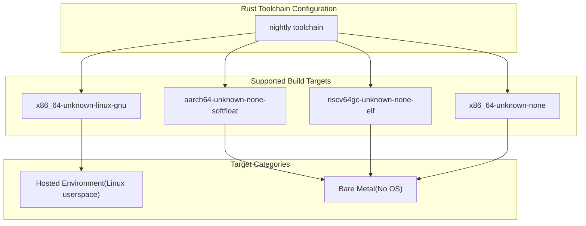
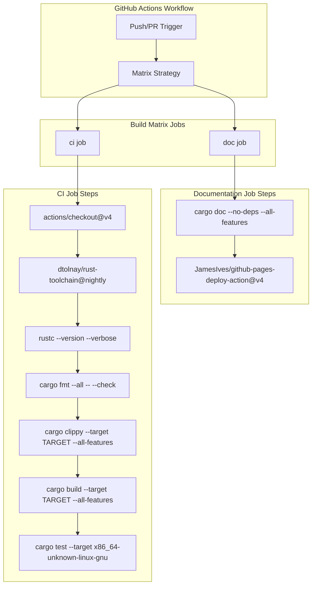
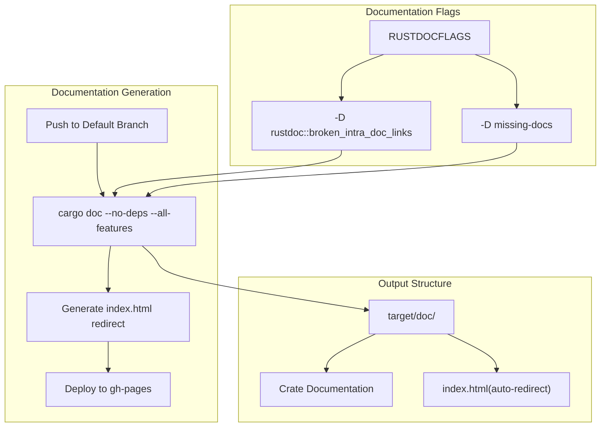

# Development Guide

> **Relevant source files**
> * [.github/workflows/ci.yml](https://github.com/arceos-hypervisor/axaddrspace/blob/2ed4d076/.github/workflows/ci.yml)
> * [.gitignore](https://github.com/arceos-hypervisor/axaddrspace/blob/2ed4d076/.gitignore)

This document provides essential information for developers working on the axaddrspace crate, including environment setup, build procedures, testing, and contribution guidelines. For information about the codebase architecture and components, see [Core Architecture](/arceos-hypervisor/axaddrspace/2-core-architecture). For usage examples and API documentation, see [Overview](/arceos-hypervisor/axaddrspace/1-overview).

## Development Environment Setup

The axaddrspace crate requires a Rust nightly toolchain with specific components and target platforms for cross-architecture development.

### Required Toolchain Components

The project requires the following Rust toolchain components as configured in the CI pipeline:

|Component|Purpose|
| --- | --- |
|rust-src|Source code for standard library cross-compilation|
|clippy|Linting and static analysis|
|rustfmt|Code formatting|

### Supported Target Platforms

The codebase supports multiple target architectures for hypervisor deployment:



**Target Platform Configuration**
Sources: [.github/workflows/ci.yml(L12)&emsp;](https://github.com/arceos-hypervisor/axaddrspace/blob/2ed4d076/.github/workflows/ci.yml#L12-L12)

## Build System and CI Pipeline

The project uses GitHub Actions for continuous integration with a matrix build strategy covering all supported architectures.

### CI Pipeline Architecture



**CI Workflow Configuration**
Sources: [.github/workflows/ci.yml(L1 - L31)&emsp;](https://github.com/arceos-hypervisor/axaddrspace/blob/2ed4d076/.github/workflows/ci.yml#L1-L31)

### Build Commands

The CI pipeline executes the following build and verification commands:

|Command|Purpose|Target Scope|
| --- | --- | --- |
|cargo fmt --all -- --check|Code formatting verification|All files|
|cargo clippy --target $TARGET --all-features|Static analysis|Per target|
|cargo build --target $TARGET --all-features|Compilation|Per target|
|cargo test --target x86_64-unknown-linux-gnu|Unit testing|Hosted target only|

Sources: [.github/workflows/ci.yml(L23 - L30)&emsp;](https://github.com/arceos-hypervisor/axaddrspace/blob/2ed4d076/.github/workflows/ci.yml#L23-L30)

## Testing Procedures

### Unit Testing

Unit tests are executed only on the `x86_64-unknown-linux-gnu` target, which provides a hosted environment with full standard library support. Tests run with the `--nocapture` flag to display all output.

The testing is configured to run conditionally:

```css
if: ${{ matrix.targets == 'x86_64-unknown-linux-gnu' }}
```

This approach ensures tests have access to necessary host OS features while maintaining cross-platform build verification.

Sources: [.github/workflows/ci.yml(L28 - L30)&emsp;](https://github.com/arceos-hypervisor/axaddrspace/blob/2ed4d076/.github/workflows/ci.yml#L28-L30)

### Code Quality Checks

The CI pipeline enforces code quality through automated checks:

1. **Format Verification**: Ensures consistent code formatting using `rustfmt`
2. **Linting**: Uses `clippy` with custom configuration allowing `new_without_default` warnings
3. **Build Verification**: Compiles all targets with full feature sets enabled

Sources: [.github/workflows/ci.yml(L22 - L27)&emsp;](https://github.com/arceos-hypervisor/axaddrspace/blob/2ed4d076/.github/workflows/ci.yml#L22-L27)

## Documentation Generation

The project maintains automated documentation generation and deployment through GitHub Pages.

### Documentation Build Process



**Documentation Configuration**
Sources: [.github/workflows/ci.yml(L32 - L55)&emsp;](https://github.com/arceos-hypervisor/axaddrspace/blob/2ed4d076/.github/workflows/ci.yml#L32-L55)

### Documentation Standards

The documentation build process enforces strict standards:

* **Broken Link Detection**: Fails on broken intra-doc links using `-D rustdoc::broken_intra_doc_links`
* **Missing Documentation**: Requires documentation for all public items using `-D missing-docs`
* **Auto-deployment**: Automatically deploys to GitHub Pages on pushes to the default branch

The documentation includes an auto-generated index redirect that points to the main crate documentation.

Sources: [.github/workflows/ci.yml(L40 - L48)&emsp;](https://github.com/arceos-hypervisor/axaddrspace/blob/2ed4d076/.github/workflows/ci.yml#L40-L48)

## Code Quality Standards

### Linting Configuration

The project uses `clippy` for static analysis with the following configuration:

* Allows `clippy::new_without_default` warnings using `-A clippy::new_without_default`
* Runs with `--all-features` to check all conditional compilation paths
* Executes on all supported target platforms

### Format Standards

Code formatting is enforced using `rustfmt` with the `--check` flag to ensure consistent style across the codebase. All files must pass formatting checks before merge.

Sources: [.github/workflows/ci.yml(L23 - L25)&emsp;](https://github.com/arceos-hypervisor/axaddrspace/blob/2ed4d076/.github/workflows/ci.yml#L23-L25)

## Development Workflow

1. **Environment Setup**: Install Rust nightly with required components and targets
2. **Local Development**: Use standard `cargo` commands for building and testing
3. **Pre-commit Checks**: Run `cargo fmt`, `cargo clippy`, and `cargo test` locally
4. **CI Validation**: All checks must pass in the automated CI pipeline
5. **Documentation**: Ensure all public APIs are documented to meet `-D missing-docs` requirements

The automated CI pipeline provides comprehensive validation across all supported architectures, ensuring code quality and cross-platform compatibility.

Sources: [.github/workflows/ci.yml(L1 - L55)&emsp;](https://github.com/arceos-hypervisor/axaddrspace/blob/2ed4d076/.github/workflows/ci.yml#L1-L55) [.gitignore(L1 - L5)&emsp;](https://github.com/arceos-hypervisor/axaddrspace/blob/2ed4d076/.gitignore#L1-L5)