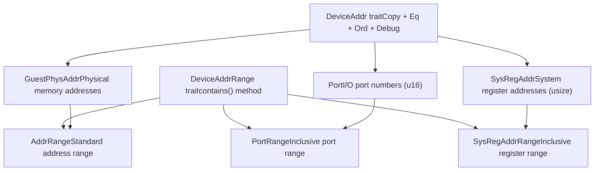
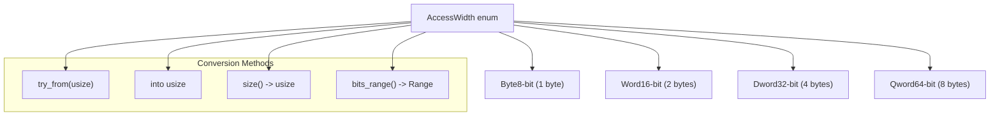
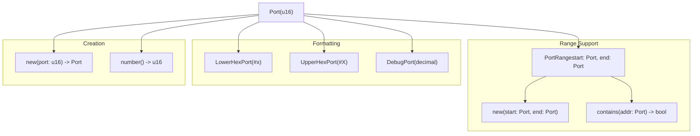
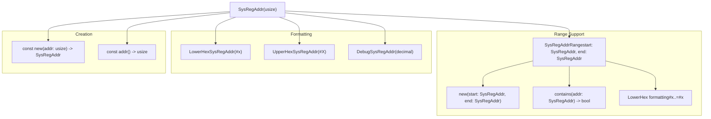

# Device Support

> **Relevant source files**
> * [src/device/device_addr.rs](https://github.com/arceos-hypervisor/axaddrspace/blob/2ed4d076/src/device/device_addr.rs)
> * [src/device/mod.rs](https://github.com/arceos-hypervisor/axaddrspace/blob/2ed4d076/src/device/mod.rs)

## Purpose and Scope

The device support module provides abstractions for hardware device interaction within the axaddrspace crate. This system defines standardized address types and access patterns for different classes of devices, including memory-mapped devices, I/O ports, and system registers. The module establishes a trait-based architecture that allows uniform handling of diverse device addressing schemes while maintaining type safety.

For information about memory mapping strategies used with devices, see [Memory Mapping Backends](/arceos-hypervisor/axaddrspace/4-memory-mapping-backends). For details about the underlying address space management, see [Address Space Management](/arceos-hypervisor/axaddrspace/2.2-address-space-management).

## Device Address Architecture

The device support system is built around two core traits that provide a foundation for device addressing abstractions.

### Device Address Trait Hierarchy

**Sources:** [src/device/device_addr.rs(L9 - L10)&emsp;](https://github.com/arceos-hypervisor/axaddrspace/blob/2ed4d076/src/device/device_addr.rs#L9-L10) [src/device/device_addr.rs(L12 - L19)&emsp;](https://github.com/arceos-hypervisor/axaddrspace/blob/2ed4d076/src/device/device_addr.rs#L12-L19) [src/device/mod.rs(L66 - L132)&emsp;](https://github.com/arceos-hypervisor/axaddrspace/blob/2ed4d076/src/device/mod.rs#L66-L132)

The `DeviceAddr` trait defines the minimal requirements for types that can represent device addresses. All implementing types must be copyable, comparable, orderable, and debuggable. The `DeviceAddrRange` trait provides address containment checking for ranges of device addresses.

### Device Address Implementations

|Address Type|Underlying Type|Purpose|Range Support|
| --- | --- | --- | --- |
|GuestPhysAddr|Guest physical address|Memory-mapped devices|AddrRange<GuestPhysAddr>|
|Port|u16|I/O port operations|PortRange|
|SysRegAddr|usize|System register access|SysRegAddrRange|

**Sources:** [src/device/device_addr.rs(L21)&emsp;](https://github.com/arceos-hypervisor/axaddrspace/blob/2ed4d076/src/device/device_addr.rs#L21-L21) [src/device/device_addr.rs(L31)&emsp;](https://github.com/arceos-hypervisor/axaddrspace/blob/2ed4d076/src/device/device_addr.rs#L31-L31) [src/device/device_addr.rs(L65)&emsp;](https://github.com/arceos-hypervisor/axaddrspace/blob/2ed4d076/src/device/device_addr.rs#L65-L65)

## Access Width Specifications

The system defines standardized access widths that correspond to different data transfer sizes during device operations.

### AccessWidth Enumeration

**Sources:** [src/device/mod.rs(L9 - L64)&emsp;](https://github.com/arceos-hypervisor/axaddrspace/blob/2ed4d076/src/device/mod.rs#L9-L64)

The `AccessWidth` enum provides bidirectional conversion between access sizes and byte counts, along with utility methods for determining bit ranges covered by each access type.

## I/O Port Addressing

The `Port` type encapsulates 16-bit I/O port numbers used in x86-style port-mapped I/O operations.

### Port Type Structure

The `Port` struct wraps a `u16` value and provides formatting implementations for debugging and display purposes. Port numbers are used to identify specific I/O devices in architectures that support port-mapped I/O.

**Sources:** [src/device/mod.rs(L66 - L98)&emsp;](https://github.com/arceos-hypervisor/axaddrspace/blob/2ed4d076/src/device/mod.rs#L66-L98) [src/device/device_addr.rs(L67 - L97)&emsp;](https://github.com/arceos-hypervisor/axaddrspace/blob/2ed4d076/src/device/device_addr.rs#L67-L97)

The `PortRange` struct provides inclusive range checking for port numbers, supporting both formatted output and containment testing.

## System Register Addressing

The `SysRegAddr` type represents addresses used to access architecture-specific system registers.

### System Register Type Structure

System register addresses use `usize` to accommodate different architecture requirements while maintaining generality across platforms. The inclusive range type supports efficient range checking for register banks.

**Sources:** [src/device/mod.rs(L100 - L132)&emsp;](https://github.com/arceos-hypervisor/axaddrspace/blob/2ed4d076/src/device/mod.rs#L100-L132) [src/device/device_addr.rs(L31 - L63)&emsp;](https://github.com/arceos-hypervisor/axaddrspace/blob/2ed4d076/src/device/device_addr.rs#L31-L63)

The `SysRegAddrRange` struct uses inclusive bounds on both ends, unlike standard Rust ranges, and provides specialized formatting for register address ranges.

## Guest Physical Address Device Support

Guest physical addresses serve as device addresses for memory-mapped I/O operations within the guest address space.

### GuestPhysAddr Integration

The integration leverages the existing `memory_addr::AddrRange` type to provide standard range operations while maintaining compatibility with the device address abstraction framework.

**Sources:** [src/device/device_addr.rs(L21 - L29)&emsp;](https://github.com/arceos-hypervisor/axaddrspace/blob/2ed4d076/src/device/device_addr.rs#L21-L29)

The `GuestPhysAddr` implementation uses the standard `AddrRange<GuestPhysAddr>` for range operations, providing consistency with other address management components in the system.