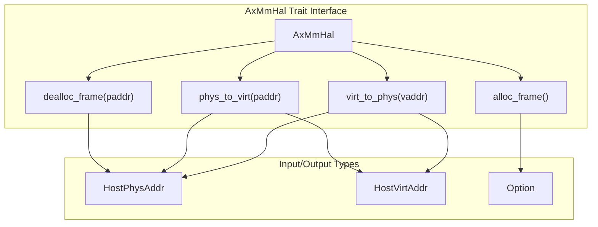
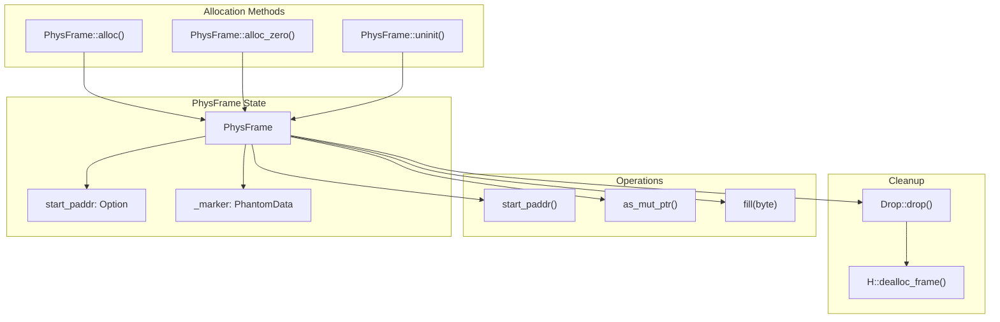
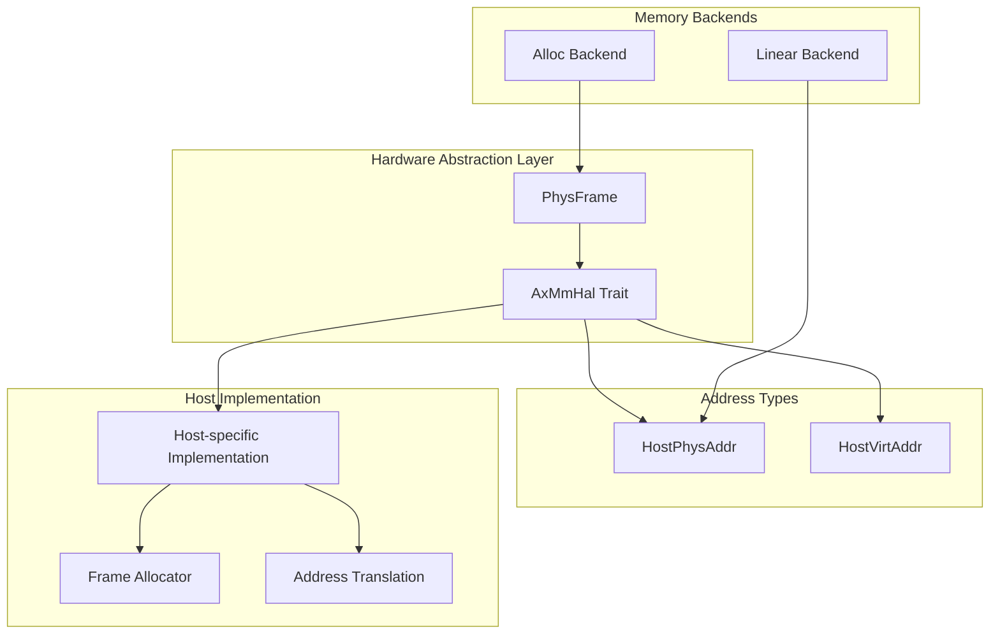

# Hardware Abstraction Layer

> **Relevant source files**
> * [src/frame.rs](https://github.com/arceos-hypervisor/axaddrspace/blob/2ed4d076/src/frame.rs)
> * [src/hal.rs](https://github.com/arceos-hypervisor/axaddrspace/blob/2ed4d076/src/hal.rs)

## Purpose and Scope

The Hardware Abstraction Layer (HAL) provides a platform-independent interface for memory management operations within the axaddrspace crate. It abstracts low-level memory allocation, deallocation, and address translation functions that are specific to the underlying hypervisor or operating system implementation.

The HAL consists of two primary components: the `AxMmHal` trait that defines the interface for hardware-specific operations, and the `PhysFrame` struct that provides RAII-based physical memory frame management. For information about how address types are defined and used throughout the system, see [Address Types and Spaces](/arceos-hypervisor/axaddrspace/2.1-address-types-and-spaces). For details on how the HAL integrates with memory mapping strategies, see [Linear Backend](/arceos-hypervisor/axaddrspace/4.1-linear-backend) and [Allocation Backend](/arceos-hypervisor/axaddrspace/4.2-allocation-backend).

## AxMmHal Trait Interface

The `AxMmHal` trait defines the core hardware abstraction interface for memory management operations. This trait must be implemented by the host system to provide concrete implementations of memory allocation and address translation.

### AxMmHal Trait Methods

The trait provides four essential operations:

|Method|Purpose|Parameters|Return Type|
| --- | --- | --- | --- |
|alloc_frame()|Allocates a physical memory frame|None|Option<HostPhysAddr>|
|dealloc_frame()|Deallocates a physical memory frame|paddr: HostPhysAddr|()|
|phys_to_virt()|Converts physical to virtual address|paddr: HostPhysAddr|HostVirtAddr|
|virt_to_phys()|Converts virtual to physical address|vaddr: HostVirtAddr|HostPhysAddr|

**Sources:** [src/hal.rs(L4 - L40)&emsp;](https://github.com/arceos-hypervisor/axaddrspace/blob/2ed4d076/src/hal.rs#L4-L40)

## PhysFrame RAII Management

The `PhysFrame<H: AxMmHal>` struct provides automatic memory management for physical memory frames using the RAII (Resource Acquisition Is Initialization) pattern. It ensures that allocated frames are automatically deallocated when the frame goes out of scope.

### PhysFrame Lifecycle

### Frame Allocation and Management

The `PhysFrame` struct provides several allocation methods:

* **`alloc()`**: Allocates a new frame using `H::alloc_frame()` and validates the returned address is non-zero
* **`alloc_zero()`**: Allocates a frame and fills it with zeros using the `fill()` method
* **`uninit()`**: Creates an uninitialized frame for placeholder use (unsafe)

Frame operations include:

* **`start_paddr()`**: Returns the starting physical address of the frame
* **`as_mut_ptr()`**: Provides a mutable pointer to the frame content via `H::phys_to_virt()`
* **`fill(byte)`**: Fills the entire frame with a specified byte value (assumes 4KiB frame size)

The automatic cleanup is handled by the `Drop` implementation, which calls `H::dealloc_frame()` when the frame is dropped.

**Sources:** [src/frame.rs(L14 - L74)&emsp;](https://github.com/arceos-hypervisor/axaddrspace/blob/2ed4d076/src/frame.rs#L14-L74)

## Integration with System Components

The HAL serves as the foundation for memory management throughout the axaddrspace system, providing the interface between high-level address space management and low-level hardware operations.

### HAL Integration Architecture

### Key Integration Points

1. **Allocation Backend**: The allocation backend ([see Allocation Backend](/arceos-hypervisor/axaddrspace/4.2-allocation-backend)) uses `PhysFrame` for dynamic memory allocation with lazy population strategies.
2. **Address Translation**: Both physical-to-virtual and virtual-to-physical address translation operations are abstracted through the HAL, enabling consistent address handling across different host environments.
3. **Frame Size Abstraction**: The HAL abstracts frame size details, though the current implementation assumes 4KiB frames as defined by `PAGE_SIZE_4K` from the `memory_addr` crate.
4. **Error Handling**: Frame allocation failures are handled gracefully through the `Option<HostPhysAddr>` return type, with higher-level components responsible for error propagation.

**Sources:** [src/frame.rs(L1 - L7)&emsp;](https://github.com/arceos-hypervisor/axaddrspace/blob/2ed4d076/src/frame.rs#L1-L7) [src/hal.rs(L1 - L2)&emsp;](https://github.com/arceos-hypervisor/axaddrspace/blob/2ed4d076/src/hal.rs#L1-L2)

The Hardware Abstraction Layer ensures that the axaddrspace crate can operate independently of specific hypervisor implementations while maintaining efficient memory management through RAII patterns and clear separation of concerns between platform-specific and platform-independent code.