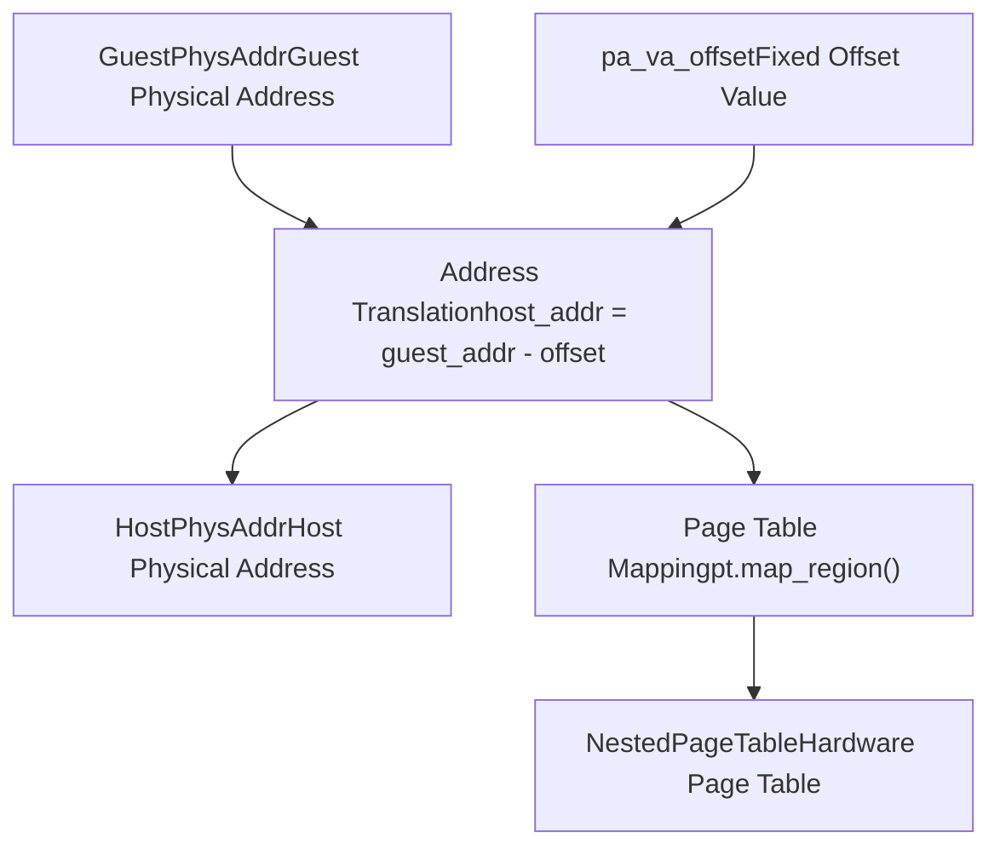
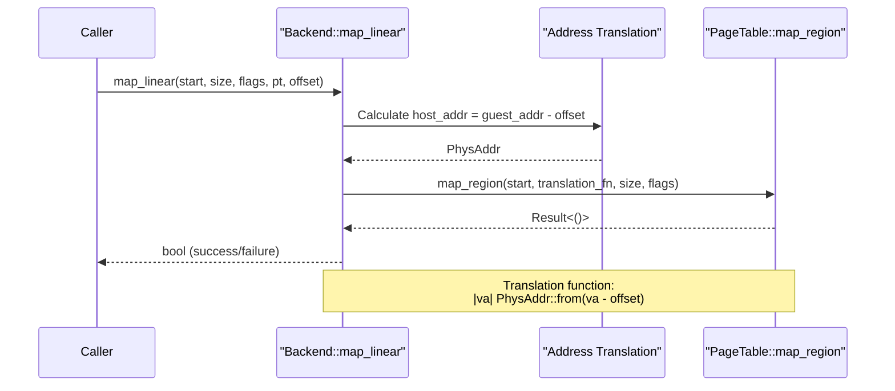
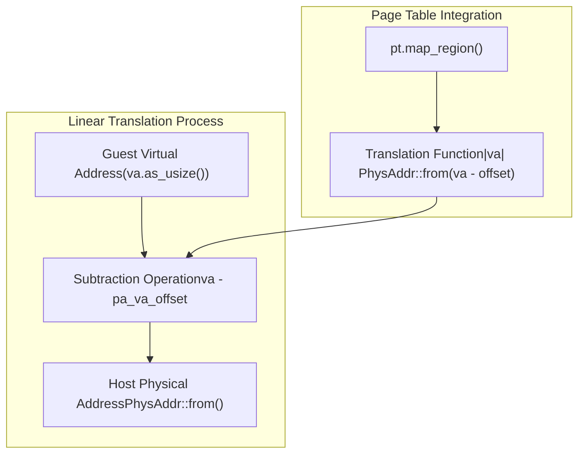

# Linear Backend

> **Relevant source files**
> * [src/address_space/backend/linear.rs](https://github.com/arceos-hypervisor/axaddrspace/blob/2ed4d076/src/address_space/backend/linear.rs)

## Purpose and Scope

The Linear Backend implements a fixed-offset memory mapping strategy for guest address spaces in the ArceOS-Hypervisor. This backend provides a simple, predictable translation mechanism between guest physical addresses and host physical addresses using a constant offset value.

For information about dynamic allocation strategies, see [Allocation Backend](/arceos-hypervisor/axaddrspace/4.2-allocation-backend). For the broader memory mapping system architecture, see [Memory Mapping Backends](/arceos-hypervisor/axaddrspace/4-memory-mapping-backends).

## Overview

The Linear Backend uses a straightforward address translation model where guest physical addresses are mapped to host physical addresses by subtracting a fixed offset (`pa_va_offset`). This creates a linear, one-to-one mapping relationship that is efficient for scenarios where the guest memory layout can be predetermined and doesn't require dynamic allocation.

### Linear Mapping Address Translation



**Sources:** [src/address_space/backend/linear.rs(L21 - L32)&emsp;](https://github.com/arceos-hypervisor/axaddrspace/blob/2ed4d076/src/address_space/backend/linear.rs#L21-L32)

## Implementation Structure

The Linear Backend is implemented as a variant within the `Backend<H>` enum and provides three core operations through associated methods.

### Backend Construction and Core Methods

```

```

**Sources:** [src/address_space/backend/linear.rs(L7 - L11)&emsp;](https://github.com/arceos-hypervisor/axaddrspace/blob/2ed4d076/src/address_space/backend/linear.rs#L7-L11) [src/address_space/backend/linear.rs(L13 - L51)&emsp;](https://github.com/arceos-hypervisor/axaddrspace/blob/2ed4d076/src/address_space/backend/linear.rs#L13-L51)

## Core Operations

### Backend Creation

The `new_linear` method creates a Linear Backend instance with a specified physical-to-virtual address offset:

|Method|Parameters|Return Type|Purpose|
| --- | --- | --- | --- |
|new_linear|pa_va_offset: usize|Backend<H>|Creates Linear variant with fixed offset|

The method is marked as `const`, allowing compile-time initialization of linear mapping configurations.

**Sources:** [src/address_space/backend/linear.rs(L8 - L11)&emsp;](https://github.com/arceos-hypervisor/axaddrspace/blob/2ed4d076/src/address_space/backend/linear.rs#L8-L11)

### Memory Mapping Operations

The Linear Backend provides two primary mapping operations that work with the nested page table system:

#### Map Operation

The `map_linear` method establishes mappings in the page table using the linear translation strategy:



**Sources:** [src/address_space/backend/linear.rs(L13 - L39)&emsp;](https://github.com/arceos-hypervisor/axaddrspace/blob/2ed4d076/src/address_space/backend/linear.rs#L13-L39)

#### Unmap Operation

The `unmap_linear` method removes existing mappings from the page table:

|Parameter|Type|Description|
| --- | --- | --- |
|start|GuestPhysAddr|Starting guest physical address|
|size|usize|Size of region to unmap|
|pt|&mut PageTable<H>|Mutable reference to page table|
|_pa_va_offset|usize|Unused in unmap operation|

**Sources:** [src/address_space/backend/linear.rs(L41 - L50)&emsp;](https://github.com/arceos-hypervisor/axaddrspace/blob/2ed4d076/src/address_space/backend/linear.rs#L41-L50)

## Address Translation Mechanism

The Linear Backend implements address translation through a closure passed to the page table's `map_region` method. This translation function converts guest virtual addresses to host physical addresses by subtracting the configured offset:



The translation occurs at [src/address_space/backend/linear.rs(L32)&emsp;](https://github.com/arceos-hypervisor/axaddrspace/blob/2ed4d076/src/address_space/backend/linear.rs#L32-L32) where the closure `|va| PhysAddr::from(va.as_usize() - pa_va_offset)` is passed to the page table mapping function.

**Sources:** [src/address_space/backend/linear.rs(L30 - L37)&emsp;](https://github.com/arceos-hypervisor/axaddrspace/blob/2ed4d076/src/address_space/backend/linear.rs#L30-L37)

## Integration with Nested Page Tables

The Linear Backend operates through the `NestedPageTable<H>` type (aliased as `PageTable<H>`), which provides hardware-abstracted page table operations. The backend leverages the page table's `map_region` and `unmap_region` methods to establish the actual memory mappings.

### Page Table Method Parameters

|Method|Key Parameters|Linear Backend Usage|
| --- | --- | --- |
|map_region|start,translate_fn,size,flags|Provides linear translation function|
|unmap_region|start,size,flush|Always flushes TLB (true)|

The Linear Backend sets specific parameters for page table operations:

* Always uses `false` for both huge page flags in `map_region`
* Always flushes the TLB during `unmap_region` operations
* Provides a simple subtraction-based translation function

**Sources:** [src/address_space/backend/linear.rs(L30 - L37)&emsp;](https://github.com/arceos-hypervisor/axaddrspace/blob/2ed4d076/src/address_space/backend/linear.rs#L30-L37) [src/address_space/backend/linear.rs(L49)&emsp;](https://github.com/arceos-hypervisor/axaddrspace/blob/2ed4d076/src/address_space/backend/linear.rs#L49-L49)