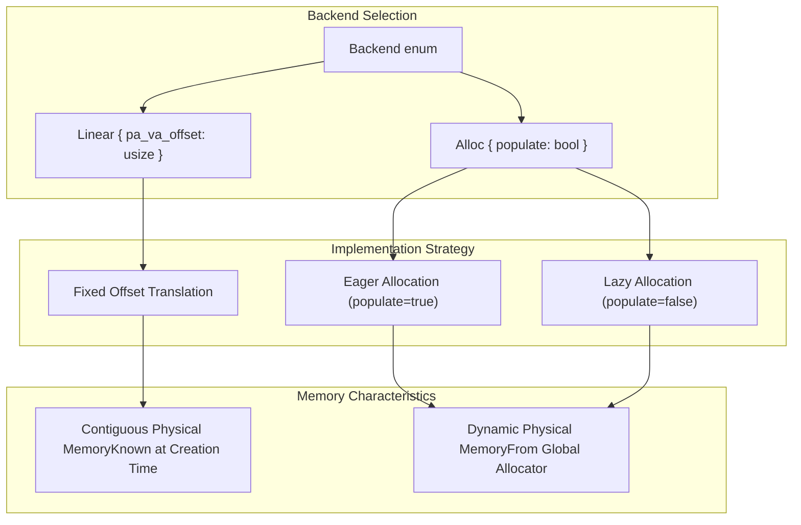
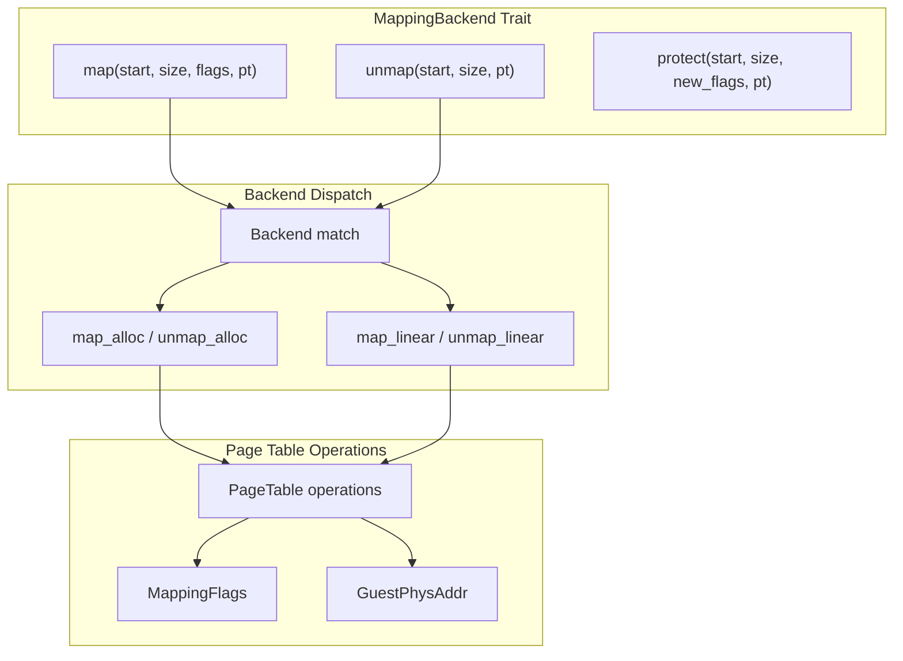
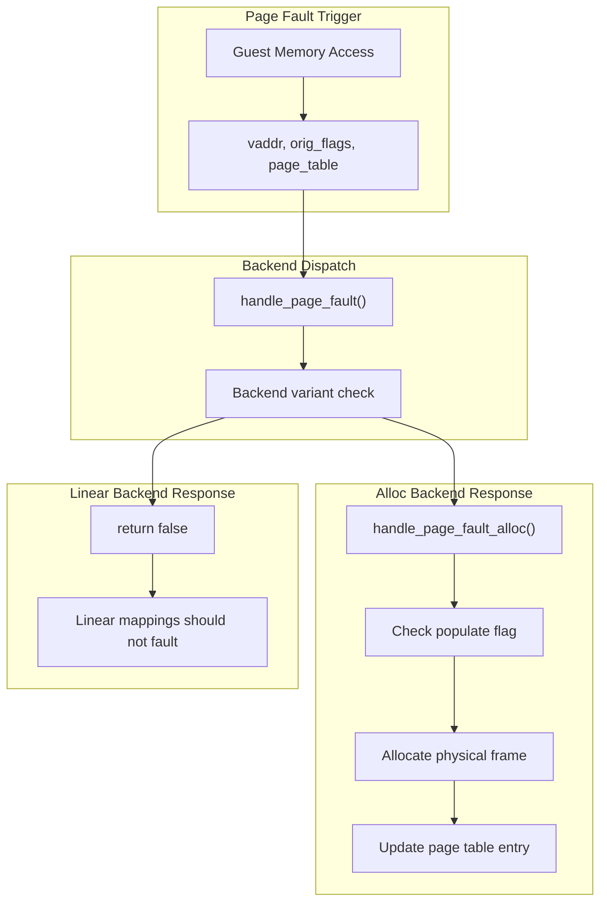
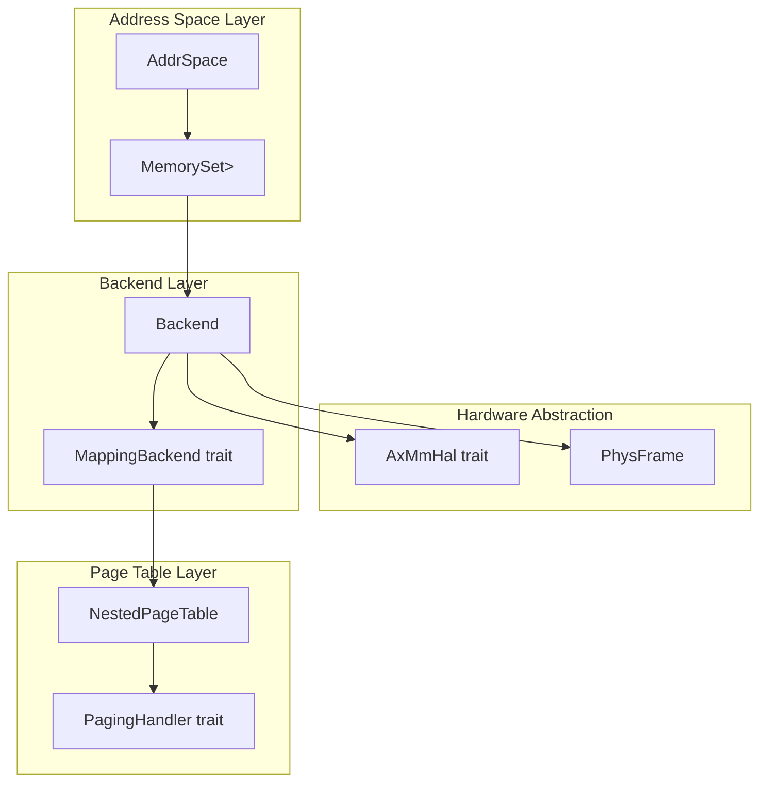

# Memory Mapping Backends

> **Relevant source files**
> * [src/address_space/backend/mod.rs](https://github.com/arceos-hypervisor/axaddrspace/blob/2ed4d076/src/address_space/backend/mod.rs)

This document explains the different strategies for mapping guest physical memory to host physical memory in the axaddrspace crate. Memory mapping backends provide the core abstraction for how virtual memory regions are translated to physical memory, supporting both static linear mappings and dynamic allocation-based mappings.

For detailed implementation of individual backends, see [Linear Backend](/arceos-hypervisor/axaddrspace/4.1-linear-backend) and [Allocation Backend](/arceos-hypervisor/axaddrspace/4.2-allocation-backend). For information about how backends integrate with address space management, see [Address Space Management](/arceos-hypervisor/axaddrspace/2.2-address-space-management).

## Backend Architecture Overview

The memory mapping backend system is built around a unified `Backend<H>` enum that provides different strategies for memory mapping. Each backend implements the `MappingBackend` trait to provide consistent interfaces for memory operations while allowing different underlying implementation strategies.

**Backend Strategy Selection**

Sources: [src/address_space/backend/mod.rs(L11 - L41)&emsp;](https://github.com/arceos-hypervisor/axaddrspace/blob/2ed4d076/src/address_space/backend/mod.rs#L11-L41)

## Backend Trait Implementation

Each backend variant implements the `MappingBackend` trait, which defines the core memory management operations. The trait provides a uniform interface while allowing backend-specific implementations for mapping, unmapping, and protection operations.

**MappingBackend Trait Implementation**

Sources: [src/address_space/backend/mod.rs(L55 - L90)&emsp;](https://github.com/arceos-hypervisor/axaddrspace/blob/2ed4d076/src/address_space/backend/mod.rs#L55-L90)

## Memory Mapping Strategies

The system supports two fundamental mapping strategies that serve different use cases in virtualization scenarios:

|Backend Type|Strategy|Physical Memory|Page Faults|Use Case|
| --- | --- | --- | --- | --- |
|Linear|Fixed offset translation|Contiguous, pre-allocated|Not supported|Device memory, firmware regions|
|Alloc(populate=true)|Eager allocation|Dynamic, immediate|Not triggered|High-performance guest RAM|
|Alloc(populate=false)|Lazy allocation|Dynamic, on-demand|Handled on access|Large sparse memory regions|

The `Linear` backend uses a simple arithmetic translation where guest physical address `gpa` maps to host physical address `gpa - pa_va_offset`. This provides zero-overhead translation for contiguous memory regions.

The `Alloc` backend obtains physical frames from the global allocator through the hardware abstraction layer. When `populate` is true, all frames are allocated during mapping creation. When false, frames are allocated on-demand through page fault handling.

Sources: [src/address_space/backend/mod.rs(L13 - L40)&emsp;](https://github.com/arceos-hypervisor/axaddrspace/blob/2ed4d076/src/address_space/backend/mod.rs#L13-L40)

## Page Fault Handling

Page fault handling behavior differs significantly between backend types. The `handle_page_fault` method provides backend-specific fault resolution:

**Page Fault Resolution Flow**

Linear backends return `false` from `handle_page_fault` because all mappings should be established at creation time. Page faults on linear mappings indicate configuration errors or hardware issues.

Allocation backends with `populate=false` use page fault handling to implement lazy allocation. When a page fault occurs, the handler allocates a new physical frame and updates the page table entry to resolve the fault.

Sources: [src/address_space/backend/mod.rs(L92 - L106)&emsp;](https://github.com/arceos-hypervisor/axaddrspace/blob/2ed4d076/src/address_space/backend/mod.rs#L92-L106)

## Backend Integration

The `Backend<H>` enum integrates with the broader address space management system through generic type parameter `H`, which must implement `PagingHandler`. This allows backends to work with different nested page table implementations across architectures.

**System Integration Points**

The type system ensures that backends, page tables, and hardware abstraction layers are all compatible through the shared `H: PagingHandler` constraint. This enables compile-time verification of architectural compatibility while maintaining runtime flexibility in backend selection.

Sources: [src/address_space/backend/mod.rs(L3 - L6)&emsp;](https://github.com/arceos-hypervisor/axaddrspace/blob/2ed4d076/src/address_space/backend/mod.rs#L3-L6) [src/address_space/backend/mod.rs(L55 - L59)&emsp;](https://github.com/arceos-hypervisor/axaddrspace/blob/2ed4d076/src/address_space/backend/mod.rs#L55-L59)